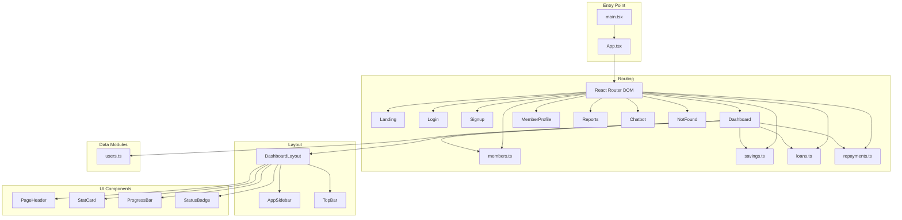
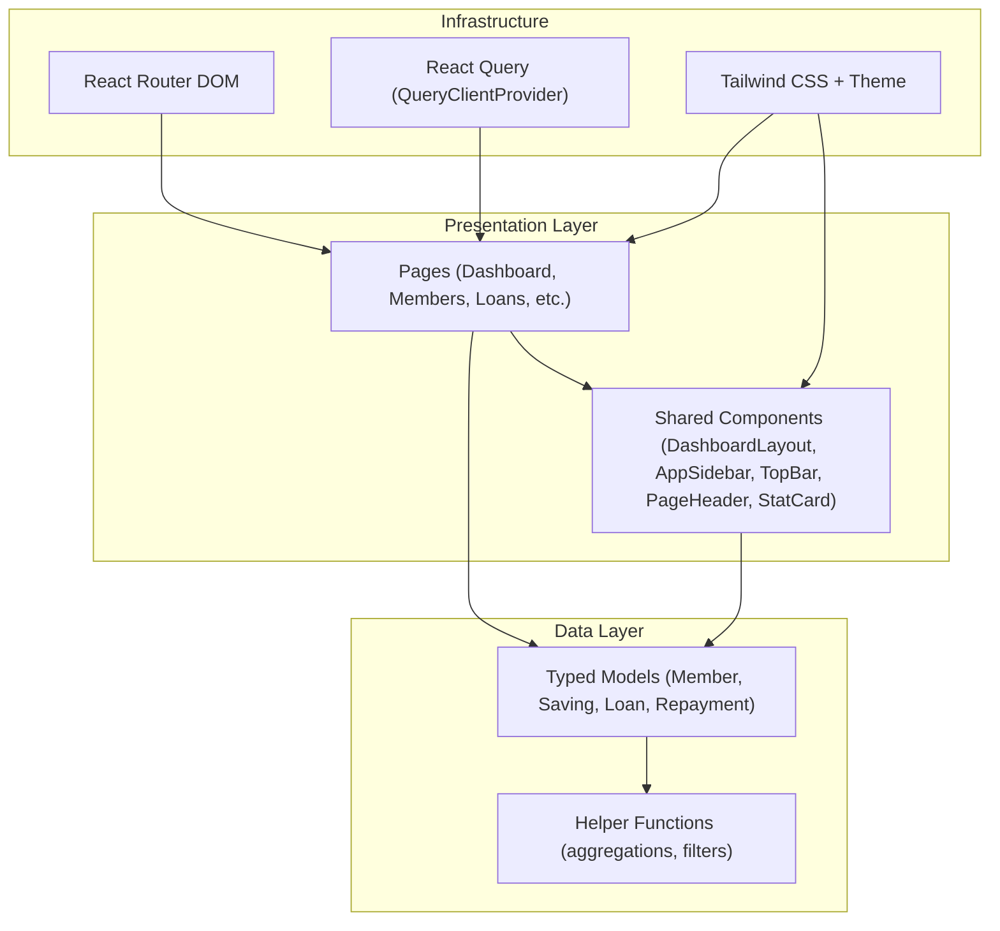
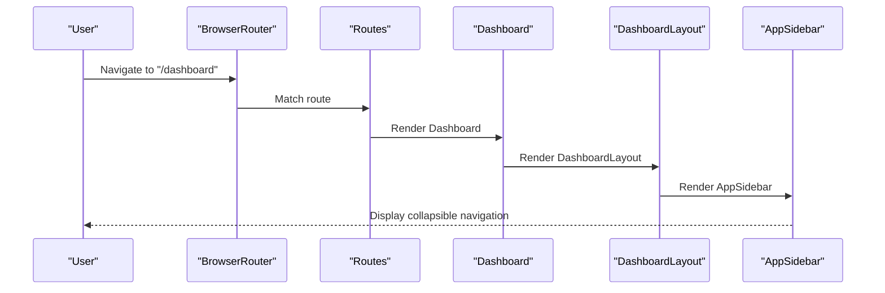
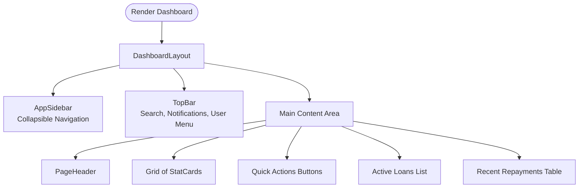
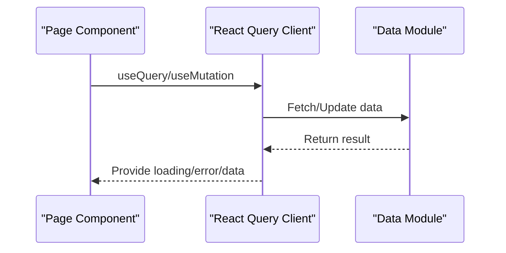
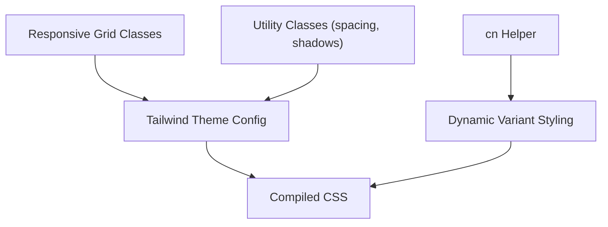
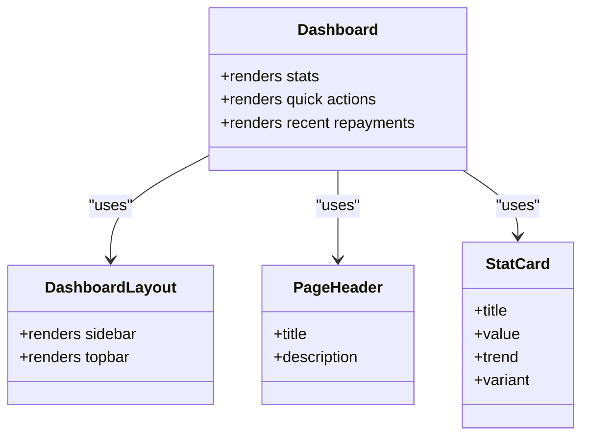
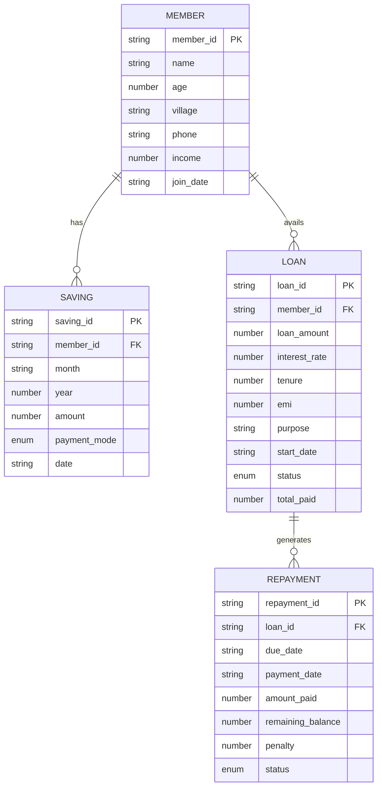
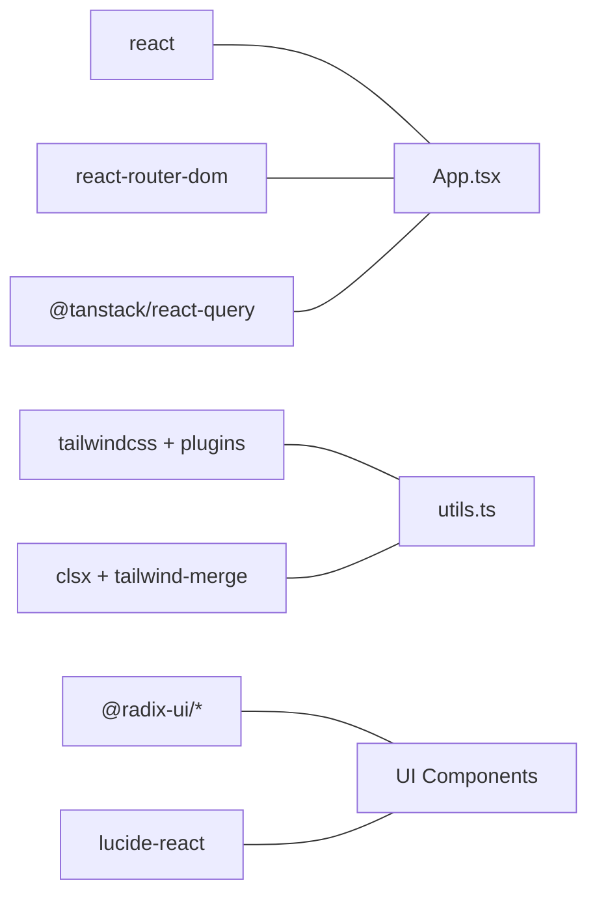

# Architecture Overview

<cite>
**Referenced Files in This Document**
- [App.tsx](file://src/App.tsx)
- [main.tsx](file://src/main.tsx)
- [Dashboard.tsx](file://src/pages/Dashboard.tsx)
- [DashboardLayout.tsx](file://src/components/DashboardLayout.tsx)
- [AppSidebar.tsx](file://src/components/AppSidebar.tsx)
- [TopBar.tsx](file://src/components/TopBar.tsx)
- [PageHeader.tsx](file://src/components/PageHeader.tsx)
- [StatCard.tsx](file://src/components/StatCard.tsx)
- [ProgressBar.tsx](file://src/components/ProgressBar.tsx)
- [StatusBadge.tsx](file://src/components/StatusBadge.tsx)
- [members.ts](file://src/data/members.ts)
- [savings.ts](file://src/data/savings.ts)
- [loans.ts](file://src/data/loans.ts)
- [repayments.ts](file://src/data/repayments.ts)
- [users.ts](file://src/data/users.ts)
- [utils.ts](file://src/lib/utils.ts)
- [package.json](file://package.json)
- [tailwind.config.ts](file://tailwind.config.ts)
</cite>

## Table of Contents
1. [Introduction](#introduction)
2. [Project Structure](#project-structure)
3. [Core Components](#core-components)
4. [Architecture Overview](#architecture-overview)
5. [Detailed Component Analysis](#detailed-component-analysis)
6. [Dependency Analysis](#dependency-analysis)
7. [Performance Considerations](#performance-considerations)
8. [Troubleshooting Guide](#troubleshooting-guide)
9. [Conclusion](#conclusion)
10. [Appendices](#appendices)

## Introduction
This document describes the frontend architecture of the SHG Management System. It focuses on the React-based component hierarchy, routing with React Router DOM, state management via React Query, and the dashboard layout pattern featuring a collapsible sidebar navigation. It also documents the responsive design approach using Tailwind CSS, component composition strategy, and the separation of concerns between pages, components, and data modules. System boundaries are clarified with respect to local data persistence, planned user authentication, and external integrations. Technology stack decisions, architectural patterns, and scalability considerations for future enhancements are included.

## Project Structure
The project follows a feature-based organization with clear separation of concerns:
- Pages under src/pages define routeable views.
- Shared UI components live under src/components, including reusable building blocks and layout primitives.
- Data modules under src/data encapsulate domain models and helper functions for local datasets.
- Utilities and styling are centralized in src/lib and configured via Tailwind CSS.
- Application bootstrap occurs in src/main.tsx, which renders the root App.tsx.

**Diagram sources**
- [main.tsx](file://src/main.tsx#L1-L5)
- [App.tsx](file://src/App.tsx#L1-L48)
- [Dashboard.tsx](file://src/pages/Dashboard.tsx#L1-L190)
- [DashboardLayout.tsx](file://src/components/DashboardLayout.tsx#L1-L20)
- [AppSidebar.tsx](file://src/components/AppSidebar.tsx#L1-L101)
- [TopBar.tsx](file://src/components/TopBar.tsx#L1-L65)
- [PageHeader.tsx](file://src/components/PageHeader.tsx#L1-L24)
- [StatCard.tsx](file://src/components/StatCard.tsx#L1-L73)
- [ProgressBar.tsx](file://src/components/ProgressBar.tsx)
- [StatusBadge.tsx](file://src/components/StatusBadge.tsx)
- [members.ts](file://src/data/members.ts#L1-L122)
- [savings.ts](file://src/data/savings.ts#L1-L73)
- [loans.ts](file://src/data/loans.ts#L1-L140)
- [repayments.ts](file://src/data/repayments.ts#L1-L71)
- [users.ts](file://src/data/users.ts)

**Section sources**
- [main.tsx](file://src/main.tsx#L1-L5)
- [App.tsx](file://src/App.tsx#L1-L48)

## Core Components
- Application shell and routing: The root App.tsx configures React Router DOM routes and wraps the app with React Query’s QueryClientProvider and UI providers (toasts, tooltips).
- Dashboard layout: DashboardLayout composes AppSidebar and TopBar with page content, establishing a consistent dashboard frame.
- Sidebar navigation: AppSidebar provides collapsible navigation with active-state highlighting and a logout action.
- Top bar: TopBar hosts search, notifications, and user account dropdown.
- Page header: PageHeader standardizes page titles and optional actions.
- Statistic cards: StatCard renders KPIs with icons, trends, and variant styling.
- Data modules: Local datasets and helpers for members, savings, loans, and repayments power dashboard analytics.

**Section sources**
- [App.tsx](file://src/App.tsx#L1-L48)
- [DashboardLayout.tsx](file://src/components/DashboardLayout.tsx#L1-L20)
- [AppSidebar.tsx](file://src/components/AppSidebar.tsx#L1-L101)
- [TopBar.tsx](file://src/components/TopBar.tsx#L1-L65)
- [PageHeader.tsx](file://src/components/PageHeader.tsx#L1-L24)
- [StatCard.tsx](file://src/components/StatCard.tsx#L1-L73)
- [members.ts](file://src/data/members.ts#L1-L122)
- [savings.ts](file://src/data/savings.ts#L1-L73)
- [loans.ts](file://src/data/loans.ts#L1-L140)
- [repayments.ts](file://src/data/repayments.ts#L1-L71)

## Architecture Overview
The frontend uses a layered architecture:
- Presentation layer: Pages and shared components render UI and orchestrate data display.
- Data layer: Local TypeScript modules expose typed models and helper functions.
- Routing and state: React Router DOM manages navigation; React Query provides caching and optimistic updates.
- Styling: Tailwind CSS with a custom theme defines responsive design and component variants.

**Diagram sources**
- [App.tsx](file://src/App.tsx#L1-L48)
- [Dashboard.tsx](file://src/pages/Dashboard.tsx#L1-L190)
- [DashboardLayout.tsx](file://src/components/DashboardLayout.tsx#L1-L20)
- [AppSidebar.tsx](file://src/components/AppSidebar.tsx#L1-L101)
- [TopBar.tsx](file://src/components/TopBar.tsx#L1-L65)
- [PageHeader.tsx](file://src/components/PageHeader.tsx#L1-L24)
- [StatCard.tsx](file://src/components/StatCard.tsx#L1-L73)
- [members.ts](file://src/data/members.ts#L1-L122)
- [savings.ts](file://src/data/savings.ts#L1-L73)
- [loans.ts](file://src/data/loans.ts#L1-L140)
- [repayments.ts](file://src/data/repayments.ts#L1-L71)
- [tailwind.config.ts](file://tailwind.config.ts#L1-L129)

## Detailed Component Analysis

### Routing and Navigation
- Routes are declared centrally in App.tsx with nested rendering inside a BrowserRouter.
- The dashboard page composes DashboardLayout, which embeds AppSidebar and TopBar.
- Navigation items in AppSidebar link to routes and reflect active state based on current location.
- Collapsible behavior toggles width and text visibility with smooth transitions.

**Diagram sources**
- [App.tsx](file://src/App.tsx#L26-L41)
- [Dashboard.tsx](file://src/pages/Dashboard.tsx#L30-L38)
- [DashboardLayout.tsx](file://src/components/DashboardLayout.tsx#L9-L19)
- [AppSidebar.tsx](file://src/components/AppSidebar.tsx#L28-L98)

**Section sources**
- [App.tsx](file://src/App.tsx#L1-L48)
- [Dashboard.tsx](file://src/pages/Dashboard.tsx#L1-L190)
- [DashboardLayout.tsx](file://src/components/DashboardLayout.tsx#L1-L20)
- [AppSidebar.tsx](file://src/components/AppSidebar.tsx#L1-L101)

### Dashboard Layout Pattern
- DashboardLayout establishes a two-column layout: fixed-width sidebar and a scrollable main area.
- TopBar sits at the top with search, notifications, and user menu.
- The main content area receives page-specific components.

**Diagram sources**
- [DashboardLayout.tsx](file://src/components/DashboardLayout.tsx#L9-L19)
- [TopBar.tsx](file://src/components/TopBar.tsx#L15-L62)
- [Dashboard.tsx](file://src/pages/Dashboard.tsx#L30-L187)

**Section sources**
- [DashboardLayout.tsx](file://src/components/DashboardLayout.tsx#L1-L20)
- [TopBar.tsx](file://src/components/TopBar.tsx#L1-L65)
- [Dashboard.tsx](file://src/pages/Dashboard.tsx#L1-L190)

### State Management with React Query
- React Query is initialized in App.tsx with a QueryClientProvider wrapping the entire app.
- Current implementation uses local data modules; React Query is available for future remote data integration and caching.
- Recommended usage: Wrap data-fetching hooks with React Query queries and mutations to centralize caching, invalidation, and optimistic updates.

**Diagram sources**
- [App.tsx](file://src/App.tsx#L19-L25)
- [Dashboard.tsx](file://src/pages/Dashboard.tsx#L14-L18)

**Section sources**
- [App.tsx](file://src/App.tsx#L1-L48)

### Responsive Design with Tailwind CSS
- Tailwind CSS is configured with custom color tokens for backgrounds, borders, sidebar, and semantic variants (success, warning, info).
- Utility classes drive responsive grids, spacing, and typography across components.
- The cn helper merges conditional classes safely, enabling dynamic variants for components like StatCard.

**Diagram sources**
- [tailwind.config.ts](file://tailwind.config.ts#L1-L129)
- [utils.ts](file://src/lib/utils.ts#L1-L7)
- [StatCard.tsx](file://src/components/StatCard.tsx#L16-L30)

**Section sources**
- [tailwind.config.ts](file://tailwind.config.ts#L1-L129)
- [utils.ts](file://src/lib/utils.ts#L1-L7)

### Component Composition Strategy
- Pages compose layout components and shared UI primitives.
- Dashboard composes PageHeader, StatCard, ProgressBar, StatusBadge, and tables.
- Data modules are imported directly by pages for local computations; this keeps composition explicit and testable.

**Diagram sources**
- [Dashboard.tsx](file://src/pages/Dashboard.tsx#L30-L187)
- [DashboardLayout.tsx](file://src/components/DashboardLayout.tsx#L9-L19)
- [PageHeader.tsx](file://src/components/PageHeader.tsx#L11-L23)
- [StatCard.tsx](file://src/components/StatCard.tsx#L32-L72)

**Section sources**
- [Dashboard.tsx](file://src/pages/Dashboard.tsx#L1-L190)
- [PageHeader.tsx](file://src/components/PageHeader.tsx#L1-L24)
- [StatCard.tsx](file://src/components/StatCard.tsx#L1-L73)

### Data Modules and Separation of Concerns
- Domain models are defined per module (Member, Saving, Loan, Repayment) with helper functions for filtering and aggregation.
- Pages import these helpers to compute metrics and lists for display.
- This separation allows unit testing of calculations and easy replacement with remote APIs.

**Diagram sources**
- [members.ts](file://src/data/members.ts#L1-L122)
- [savings.ts](file://src/data/savings.ts#L1-L73)
- [loans.ts](file://src/data/loans.ts#L1-L140)
- [repayments.ts](file://src/data/repayments.ts#L1-L71)

**Section sources**
- [members.ts](file://src/data/members.ts#L1-L122)
- [savings.ts](file://src/data/savings.ts#L1-L73)
- [loans.ts](file://src/data/loans.ts#L1-L140)
- [repayments.ts](file://src/data/repayments.ts#L1-L71)

## Dependency Analysis
- Runtime dependencies include React, React Router DOM, React Query, Tailwind CSS ecosystem, and UI primitives from Radix UI and Lucide React.
- Build-time dependencies include Vite, TypeScript, Tailwind plugins, and testing libraries.
- The app initializes React Query globally and uses it for caching; pages currently rely on local data but can adopt React Query for server-side data.

**Diagram sources**
- [package.json](file://package.json#L15-L64)
- [App.tsx](file://src/App.tsx#L1-L48)
- [utils.ts](file://src/lib/utils.ts#L1-L7)

**Section sources**
- [package.json](file://package.json#L1-L90)

## Performance Considerations
- Prefer React Query for caching and background refetching when integrating with remote APIs.
- Memoize expensive computations in pages using helper functions from data modules to avoid re-renders.
- Use lazy loading for heavy components and defer non-critical resources.
- Keep Tailwind utility classes scoped to minimize CSS bundle size; leverage the theme tokens consistently.

## Troubleshooting Guide
- Routing issues: Verify route paths and order in App.tsx; ensure catch-all route is last.
- Layout problems: Confirm DashboardLayout wraps page content and that sidebar widths adapt to collapse state.
- Styling inconsistencies: Check Tailwind theme configuration and ensure the cn helper merges classes correctly.
- Data discrepancies: Validate helper functions in data modules and confirm correct imports in pages.

**Section sources**
- [App.tsx](file://src/App.tsx#L39-L40)
- [DashboardLayout.tsx](file://src/components/DashboardLayout.tsx#L9-L19)
- [tailwind.config.ts](file://tailwind.config.ts#L1-L129)
- [utils.ts](file://src/lib/utils.ts#L1-L7)

## Conclusion
The SHG Management System frontend employs a clean, layered architecture with clear separation between presentation, data, and infrastructure concerns. The dashboard layout pattern with a collapsible sidebar and responsive design provides a solid foundation. While the current implementation relies on local data modules, React Query is integrated for future remote data integration. The modular component design and Tailwind-based theming enable maintainability and scalability.

## Appendices
- Authentication: Not implemented in the current codebase; planned for future iterations.
- External Integrations: No external integrations present; React Query is prepared for API integration.
- Scalability: Adopt React Query for server data, split large pages into smaller components, and introduce feature-based routing for extensibility.