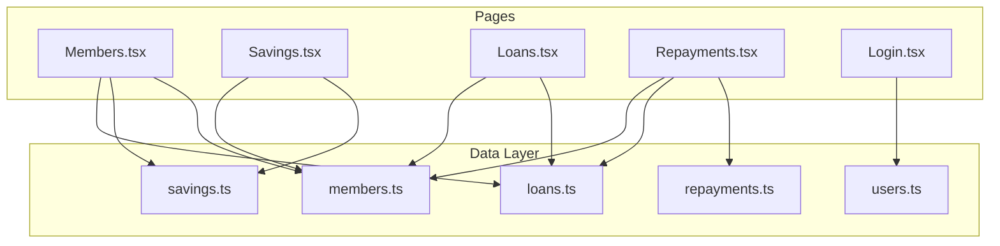
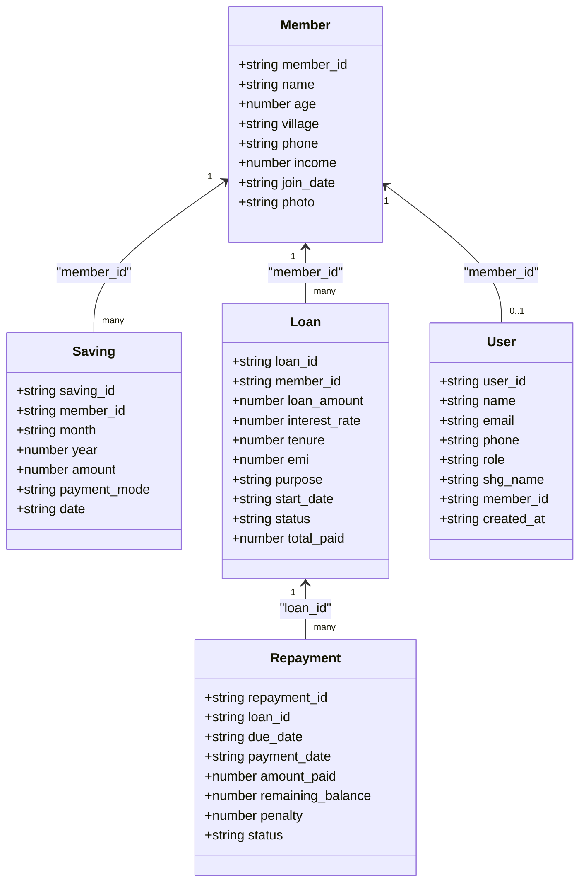
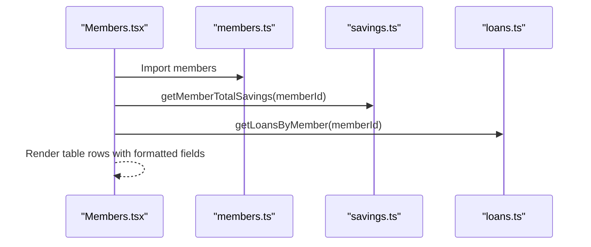
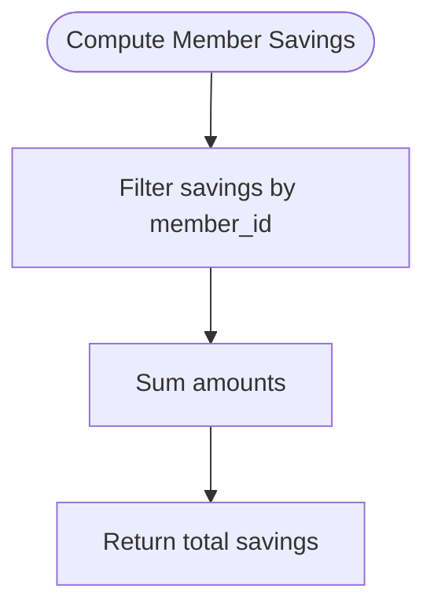
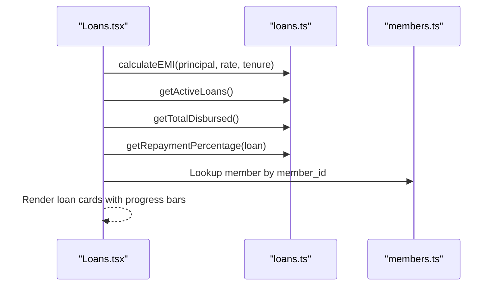
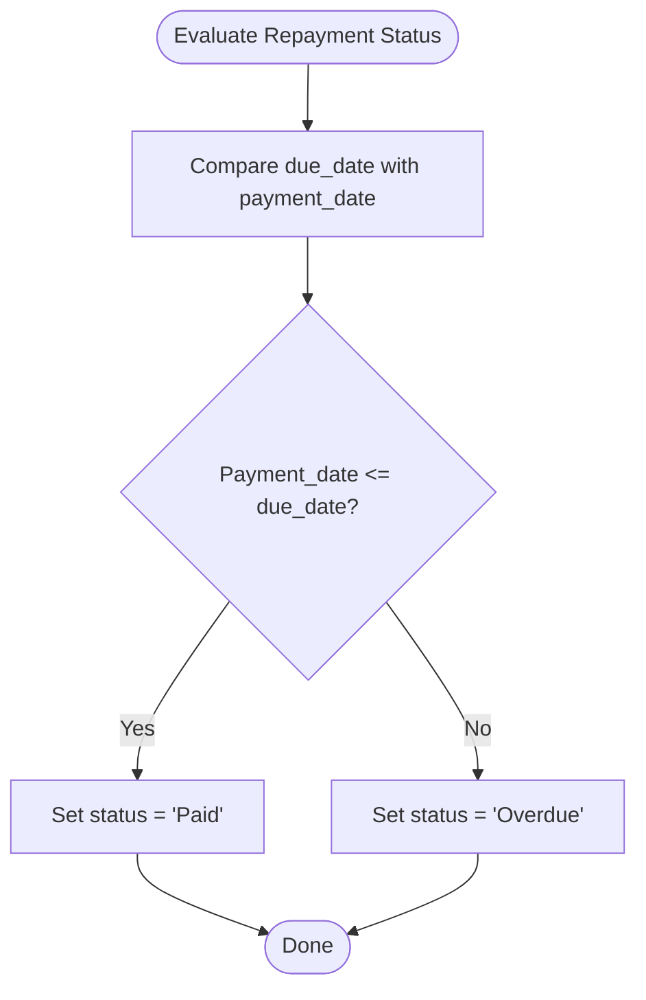
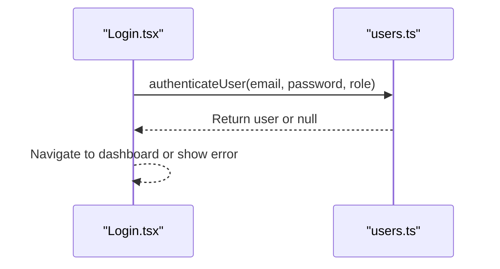
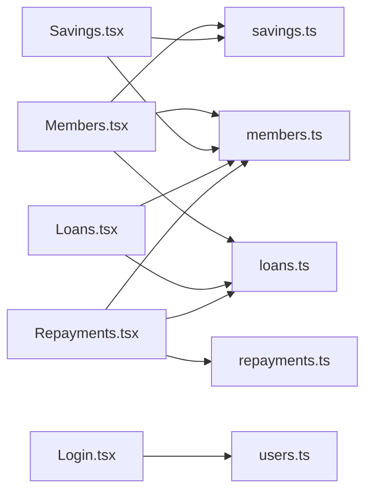

# Data Management

<cite>
**Referenced Files in This Document**
- [README.md](file://README.md)
- [members.ts](file://src/data/members.ts)
- [savings.ts](file://src/data/savings.ts)
- [loans.ts](file://src/data/loans.ts)
- [repayments.ts](file://src/data/repayments.ts)
- [users.ts](file://src/data/users.ts)
- [Members.tsx](file://src/pages/Members.tsx)
- [Savings.tsx](file://src/pages/Savings.tsx)
- [Loans.tsx](file://src/pages/Loans.tsx)
- [Repayments.tsx](file://src/pages/Repayments.tsx)
- [Login.tsx](file://src/pages/Login.tsx)
- [utils.ts](file://src/lib/utils.ts)
</cite>

## Table of Contents
1. [Introduction](#introduction)
2. [Project Structure](#project-structure)
3. [Core Components](#core-components)
4. [Architecture Overview](#architecture-overview)
5. [Detailed Component Analysis](#detailed-component-analysis)
6. [Dependency Analysis](#dependency-analysis)
7. [Performance Considerations](#performance-considerations)
8. [Troubleshooting Guide](#troubleshooting-guide)
9. [Conclusion](#conclusion)
10. [Appendices](#appendices)

## Introduction
This document describes the SHG Management System’s data layer and how it integrates with the frontend. It focuses on the core data entities (Member profiles, Savings records, Loan applications, Repayment schedules, and User accounts), their field definitions, data types, validation rules, relationships, and business constraints. It also covers data lifecycle management, local storage patterns, persistence strategies, backup considerations, data integrity requirements, audit trails, export capabilities, TypeScript interfaces, data transformation patterns, and frontend integration.

## Project Structure
The data layer is organized under a dedicated folder with TypeScript interfaces and in-memory datasets. Pages consume these datasets and expose CRUD-like operations through forms and tables. The project uses React with TypeScript and Tailwind CSS for styling.

**Diagram sources**
- [members.ts](file://src/data/members.ts#L1-L122)
- [savings.ts](file://src/data/savings.ts#L1-L73)
- [loans.ts](file://src/data/loans.ts#L1-L140)
- [repayments.ts](file://src/data/repayments.ts#L1-L71)
- [users.ts](file://src/data/users.ts#L1-L78)
- [Members.tsx](file://src/pages/Members.tsx#L23-L26)
- [Savings.tsx](file://src/pages/Savings.tsx#L31-L32)
- [Loans.tsx](file://src/pages/Loans.tsx#L25-L26)
- [Repayments.tsx](file://src/pages/Repayments.tsx#L15-L17)
- [Login.tsx](file://src/pages/Login.tsx#L15-L25)

**Section sources**
- [README.md](file://README.md#L53-L61)

## Core Components
This section documents the five core data entities and their relationships.

- Member
  - Purpose: Represents SHG member profiles with personal and financial details.
  - Fields and types:
    - member_id: string (unique identifier)
    - name: string
    - age: number
    - village: string
    - phone: string
    - income: number
    - join_date: string (ISO date)
    - photo?: string (optional)
  - Validation rules:
    - member_id must be unique and non-empty.
    - age must be a positive integer.
    - income must be a non-negative number.
    - join_date must be a valid ISO date string.
    - phone must be a 10-digit numeric string.
  - Relationships:
    - One-to-many with Savings (via member_id).
    - One-to-many with Loans (via member_id).
    - One-to-one with User (via optional member_id).
  - Business constraints:
    - Village and phone are used for grouping and communication.
    - Join date determines membership duration and eligibility for certain benefits.

- Saving
  - Purpose: Records monthly savings contributions with payment tracking and modes.
  - Fields and types:
    - saving_id: string (unique identifier)
    - member_id: string (foreign key to Member)
    - month: string (enumerated month)
    - year: number (4-digit year)
    - amount: number (non-negative)
    - payment_mode: "Cash" | "UPI" | "Bank Transfer"
    - date: string (ISO date)
  - Validation rules:
    - saving_id must be unique and non-empty.
    - amount must be a positive number.
    - month must be one of the supported months.
    - year must be a valid 4-digit year.
    - date must be a valid ISO date string.
    - payment_mode must be one of the allowed values.
  - Relationships:
    - Many-to-one with Member (via member_id).
  - Business constraints:
    - Monthly contribution tracking requires consistent month/year combinations per member.
    - Payment modes support cash, UPI, and bank transfer.

- Loan
  - Purpose: Manages loan applications, EMI calculations, and disbursement details.
  - Fields and types:
    - loan_id: string (unique identifier)
    - member_id: string (foreign key to Member)
    - loan_amount: number (positive)
    - interest_rate: number (percentage)
    - tenure: number (months)
    - emi: number (monthly payment)
    - purpose: string
    - start_date: string (ISO date)
    - status: "Active" | "Completed" | "Defaulted"
    - total_paid: number (accumulated payments)
  - Validation rules:
    - loan_id must be unique and non-empty.
    - loan_amount must be positive.
    - interest_rate must be non-negative.
    - tenure must be a positive integer.
    - status must be one of the allowed values.
    - start_date must be a valid ISO date string.
    - total_paid must be non-negative.
  - Relationships:
    - Many-to-one with Member (via member_id).
    - One-to-many with Repayment (via loan_id).
  - Business constraints:
    - EMI is calculated using the standard formula and rounded to whole numbers.
    - Status transitions are governed by payment history and outstanding balance.

- Repayment
  - Purpose: Tracks due date, payment dates, penalties, and balances for loan EMIs.
  - Fields and types:
    - repayment_id: string (unique identifier)
    - loan_id: string (foreign key to Loan)
    - due_date: string (ISO date)
    - payment_date: string | null (ISO date or null)
    - amount_paid: number
    - remaining_balance: number
    - penalty: number
    - status: "Paid" | "Pending" | "Overdue"
  - Validation rules:
    - repayment_id must be unique and non-empty.
    - due_date must be a valid ISO date string.
    - payment_date must be null or a valid ISO date string.
    - amount_paid must be non-negative.
    - remaining_balance must be non-negative.
    - penalty must be non-negative.
    - status must be one of the allowed values.
  - Relationships:
    - Many-to-one with Loan (via loan_id).
  - Business constraints:
    - Status depends on due_date vs payment_date and outstanding balance.
    - Penalty applies when payment_date is after due_date.

- User
  - Purpose: Manages system access for Admin, SHG Leader, and Member roles.
  - Fields and types:
    - user_id: string (unique identifier)
    - name: string
    - email: string
    - phone: string
    - role: "Admin" | "SHG Leader" | "Member"
    - shg_name: string
    - member_id?: string (optional, links to Member)
    - created_at: string (ISO date)
  - Validation rules:
    - user_id must be unique and non-empty.
    - email must be unique and non-empty.
    - role must be one of the allowed values.
    - member_id must reference an existing Member if present.
    - created_at must be a valid ISO date string.
  - Relationships:
    - One-to-one with Member (via optional member_id).
  - Business constraints:
    - Roles define access to features and dashboards.
    - SHG name groups users within the same SHG.

**Section sources**
- [members.ts](file://src/data/members.ts#L1-L122)
- [savings.ts](file://src/data/savings.ts#L1-L9)
- [loans.ts](file://src/data/loans.ts#L1-L12)
- [repayments.ts](file://src/data/repayments.ts#L1-L10)
- [users.ts](file://src/data/users.ts#L1-L10)

## Architecture Overview
The data layer is a lightweight in-memory store with TypeScript interfaces and helper functions. Pages import these interfaces and datasets to render UI, compute derived metrics, and simulate CRUD operations.

**Diagram sources**
- [members.ts](file://src/data/members.ts#L1-L122)
- [savings.ts](file://src/data/savings.ts#L1-L9)
- [loans.ts](file://src/data/loans.ts#L1-L12)
- [repayments.ts](file://src/data/repayments.ts#L1-L10)
- [users.ts](file://src/data/users.ts#L1-L10)

## Detailed Component Analysis

### Member Profiles
- Responsibilities:
  - Store personal and financial details.
  - Provide searchable attributes for UI filtering.
- Data transformations:
  - Formatting income and join_date for display.
  - Extract initials for avatars.
- Validation:
  - Age and income must be numeric and non-negative.
  - Phone must be a 10-digit number.
- Relationships:
  - Linked to Savings and Loans via member_id.
  - Optionally linked to User via member_id.

**Diagram sources**
- [Members.tsx](file://src/pages/Members.tsx#L23-L26)
- [members.ts](file://src/data/members.ts#L1-L122)
- [savings.ts](file://src/data/savings.ts#L69-L72)
- [loans.ts](file://src/data/loans.ts#L120-L123)

**Section sources**
- [Members.tsx](file://src/pages/Members.tsx#L28-L126)
- [members.ts](file://src/data/members.ts#L1-L122)

### Savings Records
- Responsibilities:
  - Track monthly contributions per member.
  - Compute totals and summaries.
- Data transformations:
  - Aggregate amounts by member and month.
  - Format currency and dates for display.
- Validation:
  - Amount must be positive.
  - Payment mode must be one of the allowed values.
- Relationships:
  - Many-to-one with Member via member_id.

**Diagram sources**
- [savings.ts](file://src/data/savings.ts#L69-L72)

**Section sources**
- [Savings.tsx](file://src/pages/Savings.tsx#L34-L165)
- [savings.ts](file://src/data/savings.ts#L1-L73)

### Loan Applications
- Responsibilities:
  - Manage loan disbursements, EMI calculations, and repayment progress.
- Data transformations:
  - EMI computed using the standard formula and rounded to whole numbers.
  - Repayment percentage derived from total_paid vs total due.
- Validation:
  - Tenure must be a positive integer.
  - Interest rate must be non-negative.
- Relationships:
  - Many-to-one with Member via member_id.
  - One-to-many with Repayment via loan_id.

**Diagram sources**
- [Loans.tsx](file://src/pages/Loans.tsx#L25-L26)
- [loans.ts](file://src/data/loans.ts#L113-L139)
- [members.ts](file://src/data/members.ts#L1-L122)

**Section sources**
- [Loans.tsx](file://src/pages/Loans.tsx#L28-L147)
- [loans.ts](file://src/data/loans.ts#L1-L140)

### Repayment Schedules
- Responsibilities:
  - Track due dates, payments, penalties, and balances.
- Data transformations:
  - Status determined by due_date vs payment_date and outstanding balance.
  - Aggregate collected amounts for reporting.
- Validation:
  - Payment date must be null or a valid date.
  - Penalty must be non-negative.
- Relationships:
  - Many-to-one with Loan via loan_id.

**Diagram sources**
- [repayments.ts](file://src/data/repayments.ts#L1-L10)

**Section sources**
- [Repayments.tsx](file://src/pages/Repayments.tsx#L20-L139)
- [repayments.ts](file://src/data/repayments.ts#L1-L71)

### User Accounts
- Responsibilities:
  - Manage system access with role-based permissions.
- Data transformations:
  - Mock authentication and current user selection.
- Validation:
  - Role must be one of the allowed values.
  - Email must be unique and non-empty.
- Relationships:
  - Optional one-to-one with Member via member_id.

**Diagram sources**
- [Login.tsx](file://src/pages/Login.tsx#L15-L25)
- [users.ts](file://src/data/users.ts#L57-L61)

**Section sources**
- [Login.tsx](file://src/pages/Login.tsx#L15-L119)
- [users.ts](file://src/data/users.ts#L1-L78)

## Dependency Analysis
- Internal dependencies:
  - Pages import interfaces and helper functions from data modules.
  - Data modules depend on each other indirectly via relationships (Member ↔ Savings/Loans, Loan ↔ Repayment).
- External dependencies:
  - UI components from shadcn/ui and Tailwind CSS.
  - Navigation via React Router.

**Diagram sources**
- [Members.tsx](file://src/pages/Members.tsx#L23-L26)
- [Savings.tsx](file://src/pages/Savings.tsx#L31-L32)
- [Loans.tsx](file://src/pages/Loans.tsx#L25-L26)
- [Repayments.tsx](file://src/pages/Repayments.tsx#L15-L17)
- [Login.tsx](file://src/pages/Login.tsx#L15-L25)
- [members.ts](file://src/data/members.ts#L1-L122)
- [savings.ts](file://src/data/savings.ts#L1-L73)
- [loans.ts](file://src/data/loans.ts#L1-L140)
- [repayments.ts](file://src/data/repayments.ts#L1-L71)
- [users.ts](file://src/data/users.ts#L1-L78)

**Section sources**
- [Members.tsx](file://src/pages/Members.tsx#L23-L26)
- [Savings.tsx](file://src/pages/Savings.tsx#L31-L32)
- [Loans.tsx](file://src/pages/Loans.tsx#L25-L26)
- [Repayments.tsx](file://src/pages/Repayments.tsx#L15-L17)
- [Login.tsx](file://src/pages/Login.tsx#L15-L25)

## Performance Considerations
- In-memory datasets:
  - Suitable for small-scale SHGs with limited members and transactions.
  - Sorting and filtering are O(n) per operation; consider indexing or memoization for larger datasets.
- Rendering:
  - Derived computations (totals, averages) are recomputed on each render; cache results if datasets grow.
- UI responsiveness:
  - Debounce search inputs and avoid unnecessary re-renders by using stable references for filtered lists.

[No sources needed since this section provides general guidance]

## Troubleshooting Guide
- Data integrity issues:
  - Ensure unique identifiers (member_id, saving_id, loan_id, repayment_id) are preserved when adding new records.
  - Validate numeric fields (age, income, amount, emi) to prevent runtime errors.
- Relationship mismatches:
  - Verify foreign keys (member_id, loan_id) exist in parent entities before linking.
- Date handling:
  - Use ISO date strings consistently to avoid locale-related parsing issues.
- Export and backup:
  - Export datasets as JSON for backup and restore scenarios.
  - Implement CSV export for reports (e.g., savings, repayments) to enable external analysis.

**Section sources**
- [savings.ts](file://src/data/savings.ts#L69-L72)
- [loans.ts](file://src/data/loans.ts#L113-L139)
- [repayments.ts](file://src/data/repayments.ts#L57-L70)

## Conclusion
The SHG Management System employs a clean, TypeScript-first data layer with explicit interfaces and helper functions. The pages integrate these models to deliver a responsive, role-aware dashboard. While the current implementation uses in-memory datasets, the modular structure enables straightforward migration to persistent storage and advanced features like audit trails, exports, and real-time synchronization.

[No sources needed since this section summarizes without analyzing specific files]

## Appendices

### Data Lifecycle Management
- Creation:
  - Add new records by extending datasets or invoking helper functions.
- Updates:
  - Modify fields in place; recompute derived metrics and refresh UI.
- Deletion:
  - Remove records and update related entities to maintain referential integrity.
- Archival:
  - Maintain historical snapshots for audit and reporting.

[No sources needed since this section provides general guidance]

### Local Storage Patterns
- Current state:
  - Data is stored in memory as arrays of typed objects.
- Recommendations:
  - Persist to localStorage for temporary offline capability.
  - Use structuredClone for deep copying and serialization.
  - Implement optimistic updates with rollback on failure.

[No sources needed since this section provides general guidance]

### Persistence Strategies
- Options:
  - IndexedDB for structured persistence with queries.
  - Local JSON files for simple deployments.
  - Backend API for centralized storage and multi-user sync.
- Migration path:
  - Replace in-memory datasets with async loaders and updaters.
  - Maintain the same TypeScript interfaces for seamless UI integration.

[No sources needed since this section provides general guidance]

### Backup Considerations
- Export formats:
  - JSON for full dataset backups.
  - CSV for spreadsheets and external tools.
- Automation:
  - Schedule periodic exports and store in cloud storage.
  - Version control sensitive export artifacts securely.

[No sources needed since this section provides general guidance]

### Audit Trails
- Track:
  - User actions (login, record creation/edit), timestamps, and affected records.
- Implementation:
  - Maintain an audit log array with entries containing action, actor, timestamp, and payload.
  - Enforce immutability for historical records.

[No sources needed since this section provides general guidance]

### Export Capabilities
- Reports:
  - Member-wise savings summary, loan repayment schedules, and overdue lists.
- Formats:
  - CSV for spreadsheets, PDF for printable statements.
- Frontend integration:
  - Use Blob and download links for client-side exports.

[No sources needed since this section provides general guidance]

### TypeScript Interfaces and Transformation Patterns
- Interfaces:
  - Strongly typed entities ensure compile-time safety.
- Transformations:
  - Convert numeric values to formatted currency strings.
  - Map enums to display labels.
  - Derive computed fields (EMI, totals, percentages) in helper functions.

**Section sources**
- [utils.ts](file://src/lib/utils.ts#L1-L7)