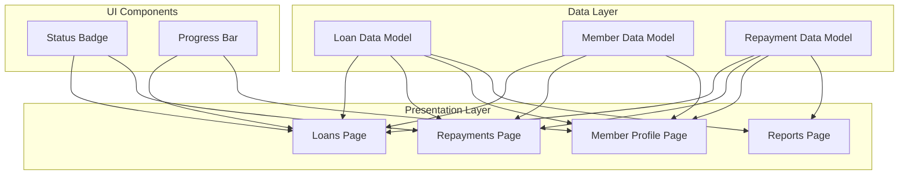
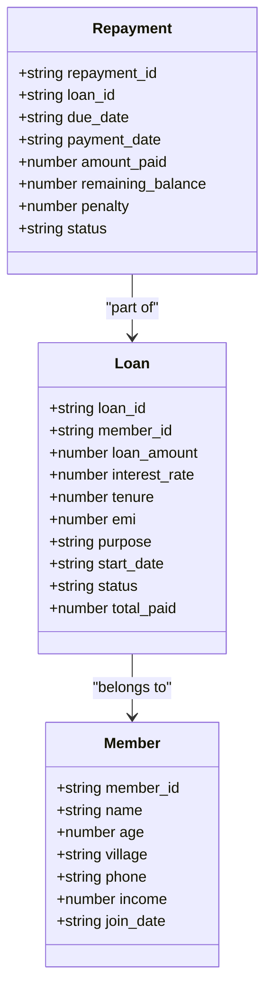
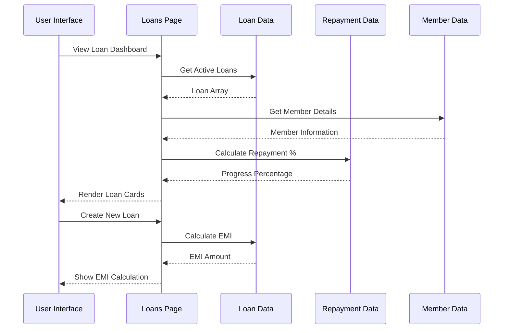
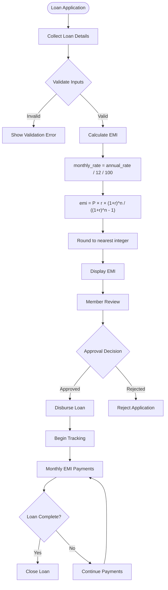
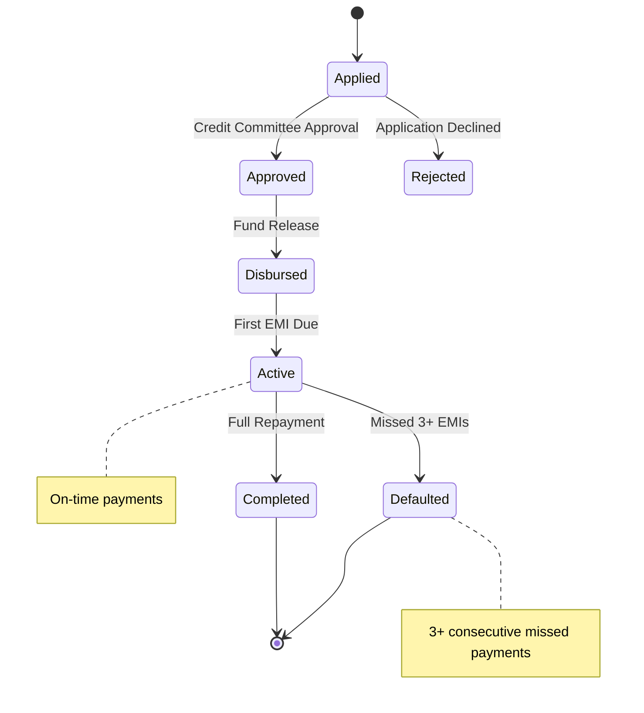
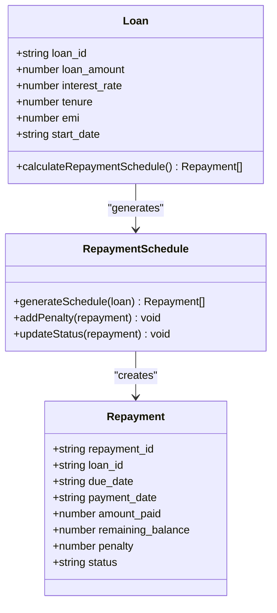
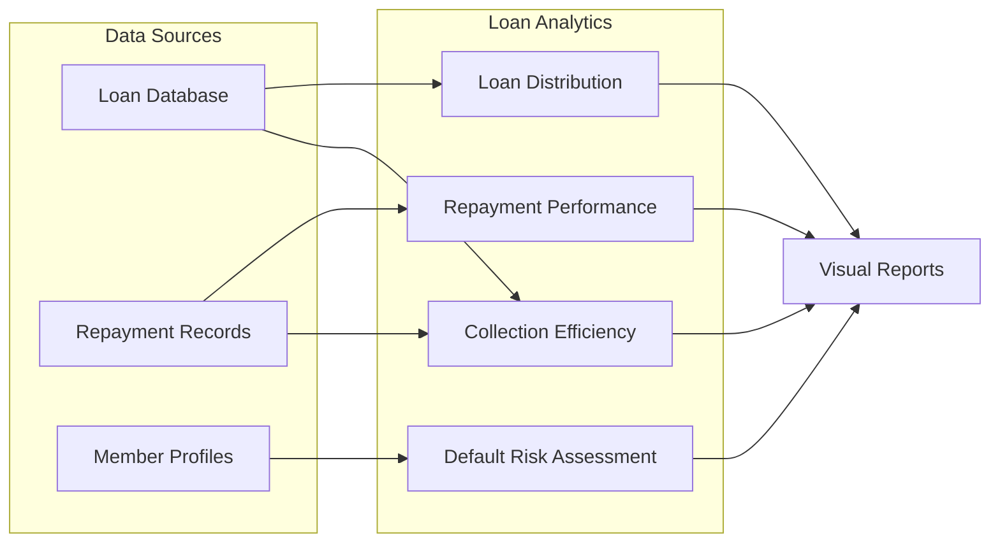
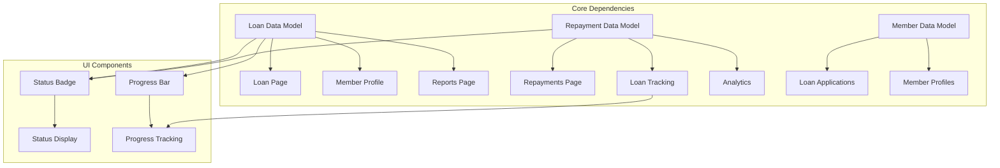

# Loan Data Model

<cite>
**Referenced Files in This Document**
- [loans.ts](file://src/data/loans.ts)
- [repayments.ts](file://src/data/repayments.ts)
- [members.ts](file://src/data/members.ts)
- [Loans.tsx](file://src/pages/Loans.tsx)
- [Repayments.tsx](file://src/pages/Repayments.tsx)
- [MemberProfile.tsx](file://src/pages/MemberProfile.tsx)
- [Reports.tsx](file://src/pages/Reports.tsx)
- [StatusBadge.tsx](file://src/components/StatusBadge.tsx)
- [ProgressBar.tsx](file://src/components/ProgressBar.tsx)
</cite>

## Table of Contents
1. [Introduction](#introduction)
2. [Project Structure](#project-structure)
3. [Core Components](#core-components)
4. [Architecture Overview](#architecture-overview)
5. [Detailed Component Analysis](#detailed-component-analysis)
6. [Dependency Analysis](#dependency-analysis)
7. [Performance Considerations](#performance-considerations)
8. [Troubleshooting Guide](#troubleshooting-guide)
9. [Conclusion](#conclusion)

## Introduction

This document provides comprehensive data model documentation for the Loan entity in the SHG (Self-Help Group) management system. The loan data model covers the complete lifecycle of loans including applications, disbursement, EMI calculations, repayment tracking, and analytics. The system manages financial operations for Self-Help Groups with a focus on microfinance operations for women's groups.

The loan data model integrates seamlessly with member profiles, repayment tracking, and reporting systems to provide a complete financial management solution for SHG operations.

## Project Structure

The loan data model is organized across several key areas within the SHG management system:



**Diagram sources**
- [loans.ts](file://src/data/loans.ts#L1-L140)
- [repayments.ts](file://src/data/repayments.ts#L1-L71)
- [members.ts](file://src/data/members.ts#L1-L122)

**Section sources**
- [loans.ts](file://src/data/loans.ts#L1-L140)
- [repayments.ts](file://src/data/repayments.ts#L1-L71)
- [members.ts](file://src/data/members.ts#L1-L122)

## Core Components

### Loan Data Model Interface

The Loan interface defines the core structure for loan records in the system:



**Diagram sources**
- [loans.ts](file://src/data/loans.ts#L1-L12)
- [repayments.ts](file://src/data/repayments.ts#L1-L10)
- [members.ts](file://src/data/members.ts#L1-L10)

### Key Fields and Their Significance

| Field | Type | Description | Business Impact |
|-------|------|-------------|-----------------|
| `loan_id` | string | Unique identifier for each loan application | Reference and tracking |
| `member_id` | string | Links loan to specific group member | Member association |
| `loan_amount` | number | Principal loan amount disbursed | Financial exposure |
| `interest_rate` | number | Annual interest rate percentage | Revenue generation |
| `tenure` | number | Loan period in months | Cash flow planning |
| `emi` | number | Fixed monthly installment amount | Repayment capacity |
| `purpose` | string | Reason for loan (business, education, etc.) | Risk assessment |
| `start_date` | string | Loan disbursement date | Timeline tracking |
| `status` | enum | Current loan lifecycle stage | Operational visibility |
| `total_paid` | number | Cumulative amount paid so far | Progress measurement |

**Section sources**
- [loans.ts](file://src/data/loans.ts#L1-L12)

## Architecture Overview

The loan system follows a layered architecture with clear separation between data models, presentation logic, and user interface components:



**Diagram sources**
- [Loans.tsx](file://src/pages/Loans.tsx#L28-L148)
- [loans.ts](file://src/data/loans.ts#L113-L140)
- [repayments.ts](file://src/data/repayments.ts#L52-L71)

## Detailed Component Analysis

### EMI Calculation Engine

The EMI calculation follows the standard mathematical formula for fixed-rate loans:



**Diagram sources**
- [loans.ts](file://src/data/loans.ts#L113-L118)
- [Loans.tsx](file://src/pages/Loans.tsx#L150-L253)

The EMI calculation formula implemented in the system:

**Section sources**
- [loans.ts](file://src/data/loans.ts#L113-L118)
- [Loans.tsx](file://src/pages/Loans.tsx#L159-L161)

### Loan Status Management

The loan lifecycle includes five distinct status states:



**Diagram sources**
- [loans.ts](file://src/data/loans.ts#L10-L12)
- [StatusBadge.tsx](file://src/components/StatusBadge.tsx#L3-L23)

The status management system supports:
- **Applied**: New loan applications awaiting approval
- **Approved**: Applications approved by credit committee
- **Disbursed**: Funds released to member
- **Active**: Ongoing loan with regular payments
- **Completed**: Full loan repayment completed
- **Defaulted**: Loan in default status

**Section sources**
- [loans.ts](file://src/data/loans.ts#L10-L12)
- [StatusBadge.tsx](file://src/components/StatusBadge.tsx#L16-L23)

### Repayment Schedule Generation

The system generates structured repayment schedules based on loan parameters:



**Diagram sources**
- [repayments.ts](file://src/data/repayments.ts#L1-L10)
- [repayments.ts](file://src/data/repayments.ts#L12-L50)

**Section sources**
- [repayments.ts](file://src/data/repayments.ts#L1-L10)
- [repayments.ts](file://src/data/repayments.ts#L12-L50)

### Loan Tracking Mechanisms

The system provides comprehensive loan tracking through multiple data points:

| Tracking Metric | Data Source | Calculation Method |
|----------------|-------------|-------------------|
| Repayment Progress | `total_paid` vs `(emi × tenure)` | `getRepaymentPercentage()` |
| Outstanding Balance | `remaining_balance` field | Dynamic calculation |
| Payment History | `repayment_id` entries | Sequential tracking |
| Default Risk | `status` field | Threshold-based monitoring |
| Collection Rate | `amount_paid` vs scheduled | Performance analytics |

**Section sources**
- [loans.ts](file://src/data/loans.ts#L135-L139)
- [repayments.ts](file://src/data/repayments.ts#L52-L71)

### Interest Calculation Methods

The system implements standard compound interest calculations for loan amortization:

```mermaid
flowchart TD
P[Principal Amount] --> I[Interest Rate]
T[Tenure in Months] --> C[Compound Interest Formula]
I --> R[Monthly Rate = Annual Rate / 12 / 100]
R --> F[Formula: P × r × (1+r)^n / ((1+r)^n - 1)]
F --> EMI[Fixed EMI Amount]
EMI --> S[Schedule Generation]
S --> D[Due Dates Calculation]
D --> B[Balance Reduction]
B --> P2[Principal Portion]
P2 --> I2[Interest Portion]
I2 --> T2[Total Payment Split]
```

**Diagram sources**
- [loans.ts](file://src/data/loans.ts#L113-L118)

**Section sources**
- [loans.ts](file://src/data/loans.ts#L113-L118)

### Loan Analytics and Reporting

The system provides comprehensive analytics capabilities:



**Diagram sources**
- [Reports.tsx](file://src/pages/Reports.tsx#L18-L23)
- [Reports.tsx](file://src/pages/Reports.tsx#L119-L172)

**Section sources**
- [Reports.tsx](file://src/pages/Reports.tsx#L18-L23)
- [Reports.tsx](file://src/pages/Reports.tsx#L119-L172)

## Dependency Analysis

The loan system maintains clear dependencies between components:



**Diagram sources**
- [Loans.tsx](file://src/pages/Loans.tsx#L25-L26)
- [Repayments.tsx](file://src/pages/Repayments.tsx#L15-L17)
- [MemberProfile.tsx](file://src/pages/MemberProfile.tsx#L150-L177)

**Section sources**
- [Loans.tsx](file://src/pages/Loans.tsx#L25-L26)
- [Repayments.tsx](file://src/pages/Repayments.tsx#L15-L17)
- [MemberProfile.tsx](file://src/pages/MemberProfile.tsx#L150-L177)

## Performance Considerations

### Data Structure Optimizations

The loan data model employs several performance optimization strategies:

1. **Array-Based Storage**: Uses simple arrays for efficient iteration and filtering
2. **Pre-calculated Values**: Stores computed EMI amounts to avoid real-time calculations
3. **Index Fields**: Maintains `member_id` for fast member-based queries
4. **Status Filtering**: Provides dedicated helper functions for common queries

### Query Performance

Common query patterns and their performance characteristics:

| Operation | Complexity | Optimization Strategy |
|-----------|------------|----------------------|
| Get Loans by Member | O(n) | Filter existing array |
| Get Active Loans | O(n) | Single pass filter |
| Calculate EMI | O(1) | Mathematical formula |
| Get Repayment Percentage | O(1) | Direct calculation |

### Memory Management

The system handles memory efficiently through:
- **Immutable Data Structures**: Loan data remains unchanged after creation
- **Helper Functions**: Computation results cached in UI components
- **Lazy Loading**: Data loaded only when needed

## Troubleshooting Guide

### Common Issues and Solutions

#### EMI Calculation Errors
**Problem**: Incorrect EMI amounts displayed
**Solution**: Verify interest rate conversion (annual to monthly) and tenure in months

#### Status Display Issues
**Problem**: Loan status not updating correctly
**Solution**: Check status mapping in StatusBadge component and ensure consistent status values

#### Repayment Tracking Problems
**Problem**: Progress bars not reflecting actual payments
**Solution**: Verify `total_paid` field updates and `getRepaymentPercentage()` calculation

#### Data Consistency Issues
**Problem**: Mismatch between loan and repayment data
**Solution**: Implement validation checks when creating new loans and repayments

### Debugging Strategies

1. **Console Logging**: Add logging for critical calculations
2. **Data Validation**: Implement input validation for loan applications
3. **Status Monitoring**: Track status transitions for audit trails
4. **Performance Profiling**: Monitor expensive operations like large dataset filtering

**Section sources**
- [StatusBadge.tsx](file://src/components/StatusBadge.tsx#L25-L36)
- [ProgressBar.tsx](file://src/components/ProgressBar.tsx#L24-L49)

## Conclusion

The Loan data model provides a comprehensive foundation for managing SHG microfinance operations. The system successfully balances simplicity with functionality, offering:

- **Complete Lifecycle Management**: From application to completion
- **Real-time Tracking**: Through detailed progress metrics
- **Robust Analytics**: With built-in reporting capabilities
- **Scalable Architecture**: Supporting growth in loan portfolio size

The modular design allows for easy extension while maintaining data integrity and performance. The integration with member profiles and repayment tracking creates a cohesive financial management ecosystem suitable for Self-Help Group operations.

Future enhancements could include:
- Real-time status updates
- Advanced risk assessment algorithms
- Automated penalty calculations
- Enhanced reporting dashboards
- Mobile-responsive loan applications