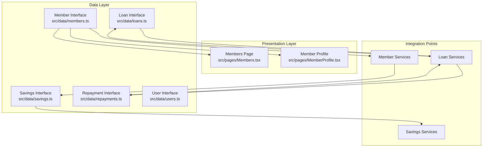
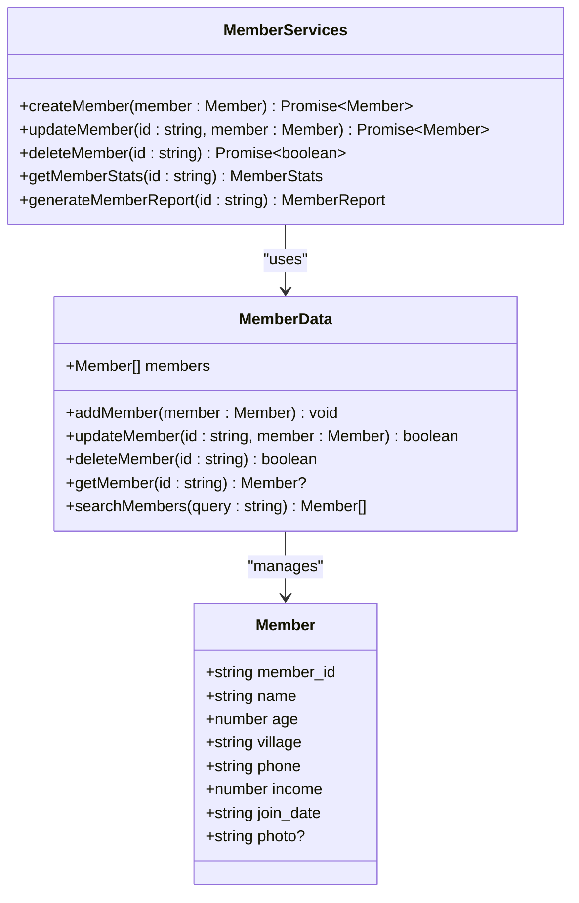
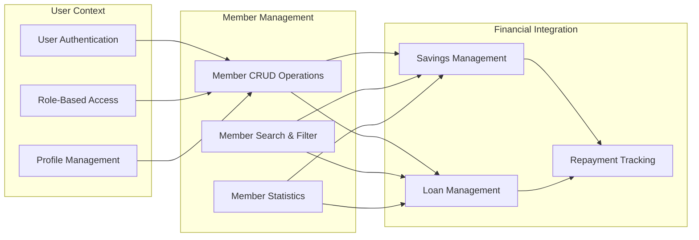
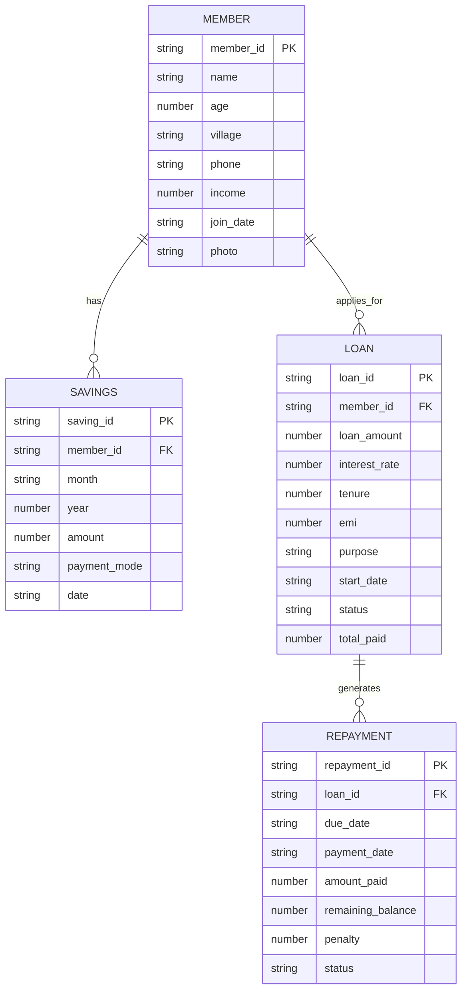
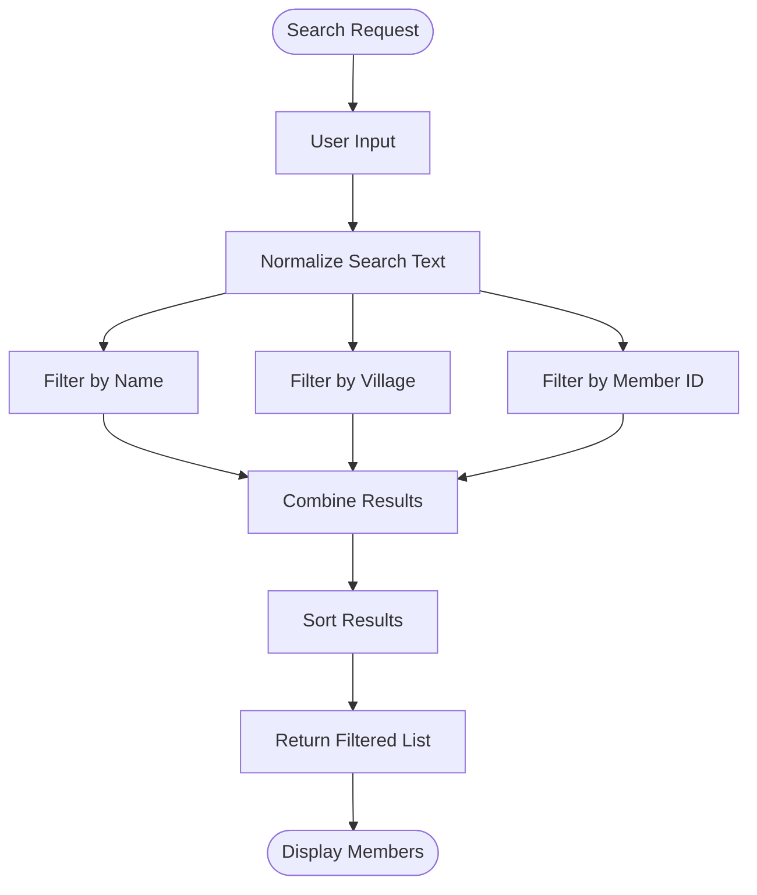
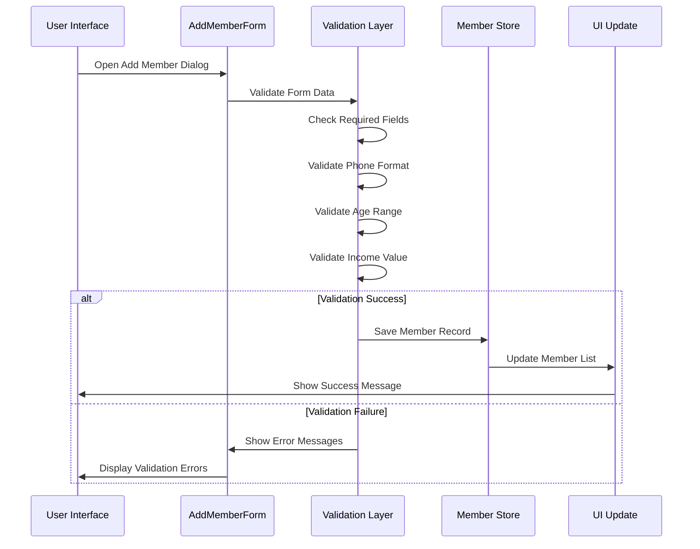
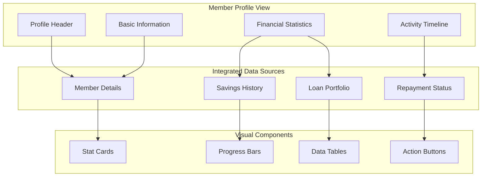
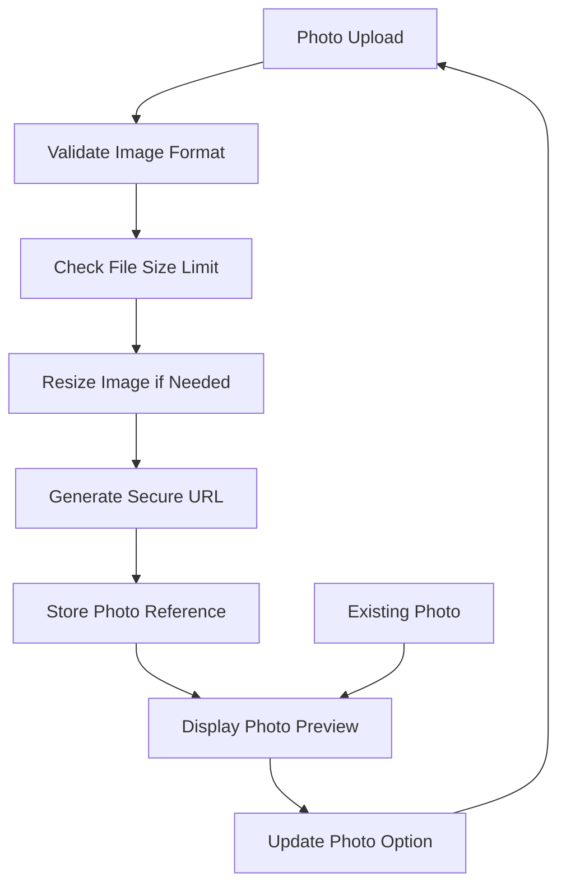
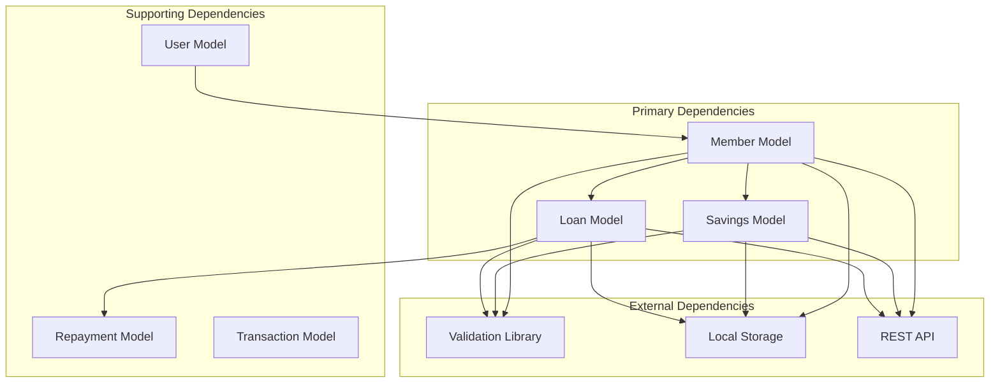
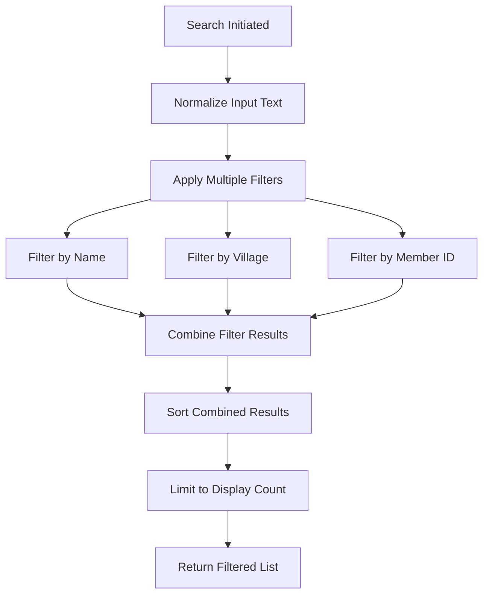

# Member Data Model

<cite>
**Referenced Files in This Document**
- [members.ts](file://src/data/members.ts)
- [Members.tsx](file://src/pages/Members.tsx)
- [MemberProfile.tsx](file://src/pages/MemberProfile.tsx)
- [savings.ts](file://src/data/savings.ts)
- [loans.ts](file://src/data/loans.ts)
- [repayments.ts](file://src/data/repayments.ts)
- [users.ts](file://src/data/users.ts)
</cite>

## Table of Contents
1. [Introduction](#introduction)
2. [Project Structure](#project-structure)
3. [Core Components](#core-components)
4. [Architecture Overview](#architecture-overview)
5. [Detailed Component Analysis](#detailed-component-analysis)
6. [Dependency Analysis](#dependency-analysis)
7. [Performance Considerations](#performance-considerations)
8. [Troubleshooting Guide](#troubleshooting-guide)
9. [Conclusion](#conclusion)

## Introduction

The Member data model is the foundational entity in the SHG Management System, representing individual members of Self-Help Groups (SHGs). This comprehensive documentation covers the Member interface definition, field specifications, validation rules, business constraints, and integration patterns with related data models including savings and loans.

The Member entity serves as the central hub for member management, providing essential demographic and financial information while enabling seamless integration with the broader SHG ecosystem of savings, loans, and repayments.

## Project Structure

The Member data model is organized within the data layer of the SHG Management System, following a clean architecture pattern that separates concerns between data models, business logic, and presentation components.

**Diagram sources**
- [members.ts](file://src/data/members.ts#L1-L122)
- [Members.tsx](file://src/pages/Members.tsx#L1-L217)
- [MemberProfile.tsx](file://src/pages/MemberProfile.tsx#L1-L177)

**Section sources**
- [members.ts](file://src/data/members.ts#L1-L122)
- [Members.tsx](file://src/pages/Members.tsx#L1-L217)
- [MemberProfile.tsx](file://src/pages/MemberProfile.tsx#L1-L177)

## Core Components

### Member Interface Definition

The Member interface defines the core structure for member records in the SHG Management System, establishing standardized data representation across all components.

**Diagram sources**
- [members.ts](file://src/data/members.ts#L1-L122)

### Field Specifications

Each field in the Member interface serves a specific business purpose and follows established validation patterns:

| Field Name | Data Type | Description | Validation Rules | Business Constraints |
|------------|-----------|-------------|------------------|---------------------|
| member_id | string | Unique identifier for each member | Required, unique, format: MEMNNN | Primary key, auto-generated |
| name | string | Full legal name of the member | Required, max 100 characters | Must be alphabetic with spaces |
| age | number | Age in years | Required, numeric, 18-120 | Must be adult, verified by documents |
| village | string | Residential village name | Required, max 50 characters | Must match SHG coverage area |
| phone | string | 10-digit mobile number | Required, 10 digits, numeric | Valid Indian mobile number |
| income | number | Monthly income in INR | Required, positive number | Must be verifiable, >= 0 |
| join_date | string | Membership registration date | Required, valid date | Cannot be future date |
| photo | string | Profile image URL | Optional, valid URL format | Image format validation |

**Section sources**
- [members.ts](file://src/data/members.ts#L1-L122)

## Architecture Overview

The Member data model integrates seamlessly with the broader SHG ecosystem through well-defined relationships and service boundaries.

**Diagram sources**
- [Members.tsx](file://src/pages/Members.tsx#L28-L126)
- [MemberProfile.tsx](file://src/pages/MemberProfile.tsx#L22-L176)
- [savings.ts](file://src/data/savings.ts#L59-L72)
- [loans.ts](file://src/data/loans.ts#L120-L123)

## Detailed Component Analysis

### Member Data Structure

The Member interface establishes a comprehensive foundation for member representation, incorporating both essential demographic information and financial context.

#### Core Member Properties

**Diagram sources**
- [members.ts](file://src/data/members.ts#L1-L122)
- [savings.ts](file://src/data/savings.ts#L1-L9)
- [loans.ts](file://src/data/loans.ts#L1-L12)
- [repayments.ts](file://src/data/repayments.ts#L1-L10)

#### Sample Member Records

The system includes comprehensive sample data demonstrating various member profiles across different villages and economic conditions:

| Member ID | Name | Age | Village | Phone | Income | Join Date |
|-----------|------|-----|---------|-------|--------|-----------|
| MEM001 | Lakshmi Devi | 35 | Rampur | 9876543210 | 8000 | 2023-01-15 |
| MEM002 | Sunita Kumari | 42 | Rampur | 9876543211 | 6500 | 2023-01-15 |
| MEM003 | Meera Bai | 28 | Gopalnagar | 9876543212 | 7500 | 2023-02-01 |
| MEM004 | Kamla Devi | 45 | Rampur | 9876543213 | 5500 | 2023-02-15 |
| MEM005 | Geeta Rani | 32 | Shivpuri | 9876543214 | 9000 | 2023-03-01 |

**Section sources**
- [members.ts](file://src/data/members.ts#L12-L121)

### Member Management Operations

#### Search and Filtering Implementation

The Member search functionality provides flexible filtering capabilities across multiple criteria:

**Diagram sources**
- [Members.tsx](file://src/pages/Members.tsx#L32-L37)

The search implementation supports:
- Case-insensitive name matching
- Village-based filtering
- Exact member ID matching
- Real-time filtering during user input

#### Member Creation Workflow

The member addition process follows a structured form-based approach with input validation:

**Diagram sources**
- [Members.tsx](file://src/pages/Members.tsx#L128-L216)

**Section sources**
- [Members.tsx](file://src/pages/Members.tsx#L28-L126)
- [Members.tsx](file://src/pages/Members.tsx#L128-L216)

### Member Profile Management

#### Profile Display and Statistics

The Member Profile page provides comprehensive member information with integrated financial statistics:

**Diagram sources**
- [MemberProfile.tsx](file://src/pages/MemberProfile.tsx#L22-L176)

#### Financial Integration Patterns

The Member profile integrates with multiple financial data sources to provide comprehensive member insights:

| Data Source | Integration Point | Purpose | Frequency |
|-------------|------------------|---------|-----------|
| Savings Data | Total Savings Calculation | Financial Health Assessment | Real-time |
| Loan Data | Active Loans Count | Credit Risk Evaluation | Real-time |
| Repayment Data | Payment History | Creditworthiness Analysis | Real-time |
| User Data | Role-based Access | Security Context | Session-based |

**Section sources**
- [MemberProfile.tsx](file://src/pages/MemberProfile.tsx#L22-L176)
- [savings.ts](file://src/data/savings.ts#L59-L72)
- [loans.ts](file://src/data/loans.ts#L120-L139)

### Photo Handling and Profile Management

#### Photo Management Architecture

The Member data model includes optional photo support for profile representation:

**Diagram sources**
- [members.ts](file://src/data/members.ts#L9-L9)

Current photo handling capabilities:
- Optional field support
- URL-based storage
- Placeholder image fallback
- Basic validation for URL format

**Section sources**
- [members.ts](file://src/data/members.ts#L9-L9)

## Dependency Analysis

### Data Model Dependencies

The Member data model maintains clear relationships with related entities while maintaining loose coupling:

**Diagram sources**
- [members.ts](file://src/data/members.ts#L1-L122)
- [savings.ts](file://src/data/savings.ts#L1-L73)
- [loans.ts](file://src/data/loans.ts#L1-L140)
- [repayments.ts](file://src/data/repayments.ts#L1-L71)
- [users.ts](file://src/data/users.ts#L1-L78)

### Integration Patterns

The Member model participates in several key integration patterns:

#### 1. One-to-Many Relationships
- Member to Savings: One member can have multiple savings records
- Member to Loans: One member can have multiple loan applications
- Loan to Repayments: One loan generates multiple repayment installments

#### 2. Cross-Model Validation
- Savings validation ensures member exists before creation
- Loan validation checks member eligibility and repayment capacity
- Repayment validation verifies loan existence and member association

#### 3. Data Consistency Patterns
- Atomic operations for member updates
- Cascade operations for dependent record cleanup
- Transaction boundaries for complex member operations

**Section sources**
- [savings.ts](file://src/data/savings.ts#L59-L72)
- [loans.ts](file://src/data/loans.ts#L120-L139)
- [repayments.ts](file://src/data/repayments.ts#L52-L70)

## Performance Considerations

### Data Structure Optimization

The Member data model employs several optimization strategies for efficient data handling:

#### Memory Efficiency
- Compact data representation using primitive types
- Minimal field count to reduce memory footprint
- Optional fields for sparse data scenarios

#### Query Performance
- Indexed member_id for O(1) lookups
- Efficient filtering algorithms for search operations
- Batch operations for bulk data processing

#### Scalability Factors
- Horizontal scaling through member partitioning
- Caching strategies for frequently accessed members
- Lazy loading for associated financial data

### Search and Filtering Performance

The search implementation utilizes optimized filtering algorithms:

**Diagram sources**
- [Members.tsx](file://src/pages/Members.tsx#L32-L37)

## Troubleshooting Guide

### Common Issues and Solutions

#### Member Creation Failures
**Issue**: Member creation fails validation
**Causes**: 
- Invalid phone number format
- Age outside acceptable range
- Duplicate member ID
- Missing required fields

**Solutions**:
- Verify phone number follows 10-digit Indian mobile format
- Ensure age is between 18 and 120 years
- Check for unique member ID generation
- Validate all required fields are present

#### Search Performance Issues
**Issue**: Slow search response times
**Causes**:
- Large dataset without indexing
- Complex filtering operations
- Inefficient string matching algorithms

**Solutions**:
- Implement database indexing on member_id
- Optimize string comparison operations
- Consider search result caching
- Implement pagination for large result sets

#### Data Integrity Problems
**Issue**: Inconsistent member data
**Causes**:
- Concurrent modification conflicts
- Missing foreign key relationships
- Data validation bypasses

**Solutions**:
- Implement optimistic concurrency control
- Enforce foreign key constraints
- Add comprehensive data validation
- Implement audit trails for data changes

### Debugging Strategies

#### Data Validation Debugging
- Log validation errors with specific field names
- Implement detailed error messages for user feedback
- Test boundary conditions for numeric fields
- Validate date format consistency

#### Integration Testing
- Test member creation with associated savings
- Verify loan application with member verification
- Check repayment processing with loan updates
- Validate user authentication with member roles

**Section sources**
- [Members.tsx](file://src/pages/Members.tsx#L128-L216)
- [MemberProfile.tsx](file://src/pages/MemberProfile.tsx#L22-L37)

## Conclusion

The Member data model in the SHG Management System provides a robust foundation for member management with comprehensive field definitions, validation rules, and integration patterns. The model successfully balances simplicity with functionality, supporting both basic member information and complex financial relationships.

Key strengths of the Member data model include:

- **Clear Data Structure**: Well-defined interfaces with explicit field types and constraints
- **Flexible Integration**: Seamless connections with savings, loans, and repayment systems
- **Performance Optimization**: Efficient search and filtering capabilities
- **Extensibility**: Support for optional fields like photo handling
- **Business Alignment**: Field definitions align with SHG management requirements

The model demonstrates excellent separation of concerns through its layered architecture, with clear boundaries between data models, business logic, and presentation components. This design enables future enhancements while maintaining system stability and performance.

Future enhancement opportunities include implementing comprehensive validation libraries, adding advanced search capabilities, and expanding photo management functionality to support modern image handling standards.