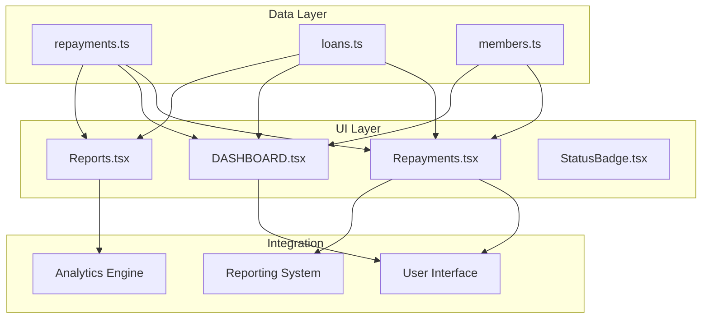
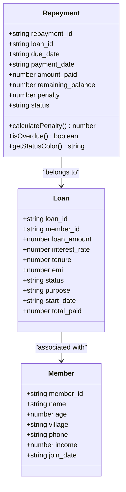
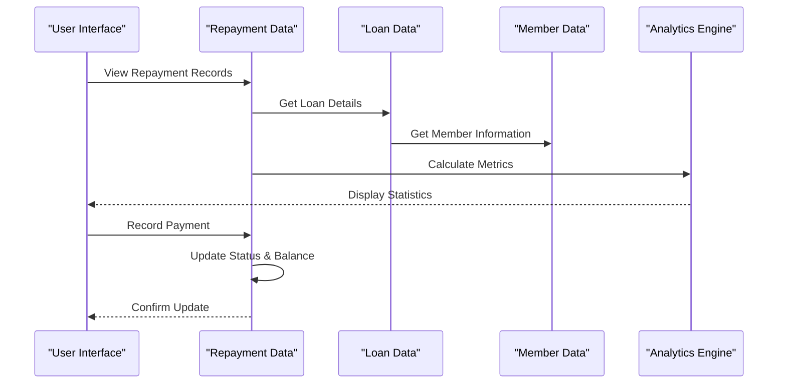
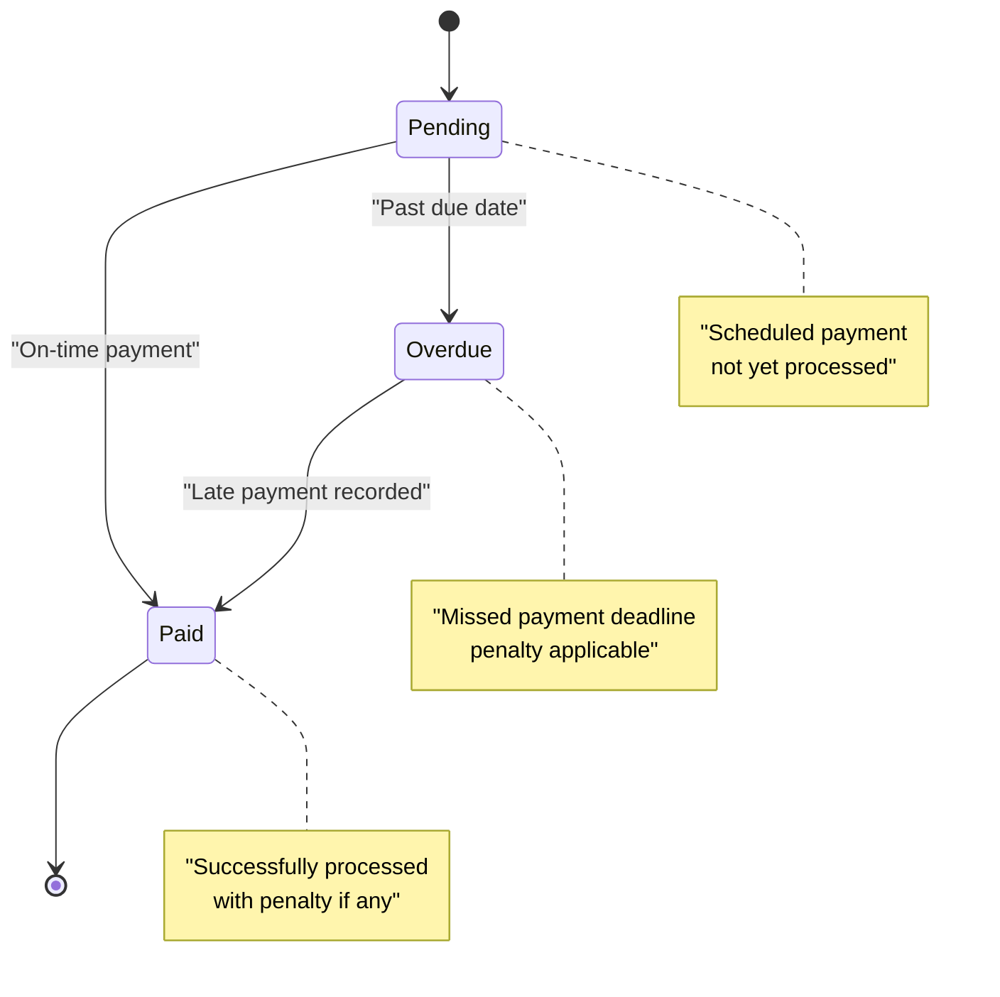
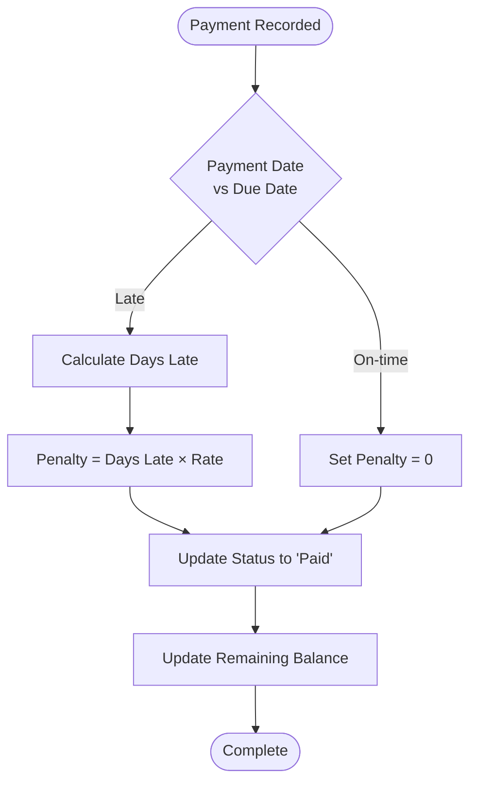
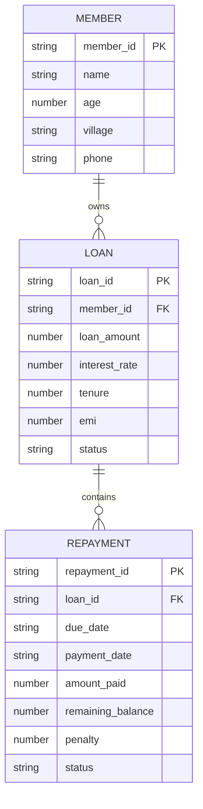
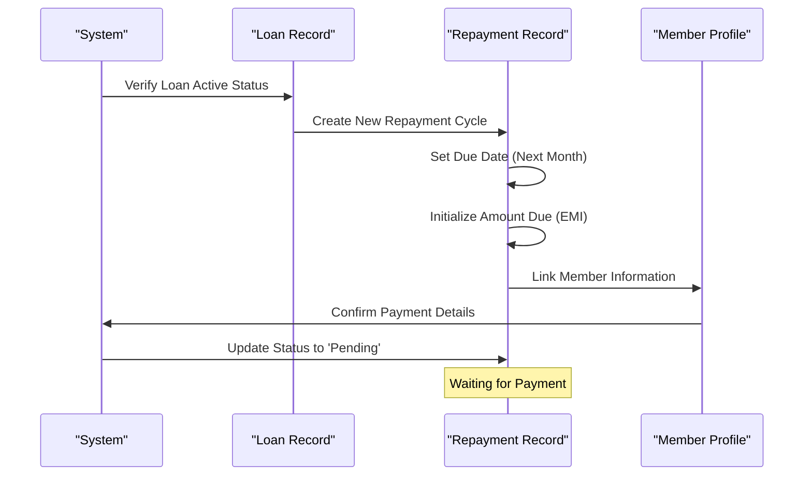
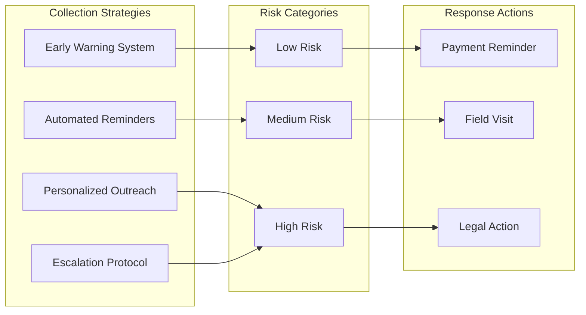
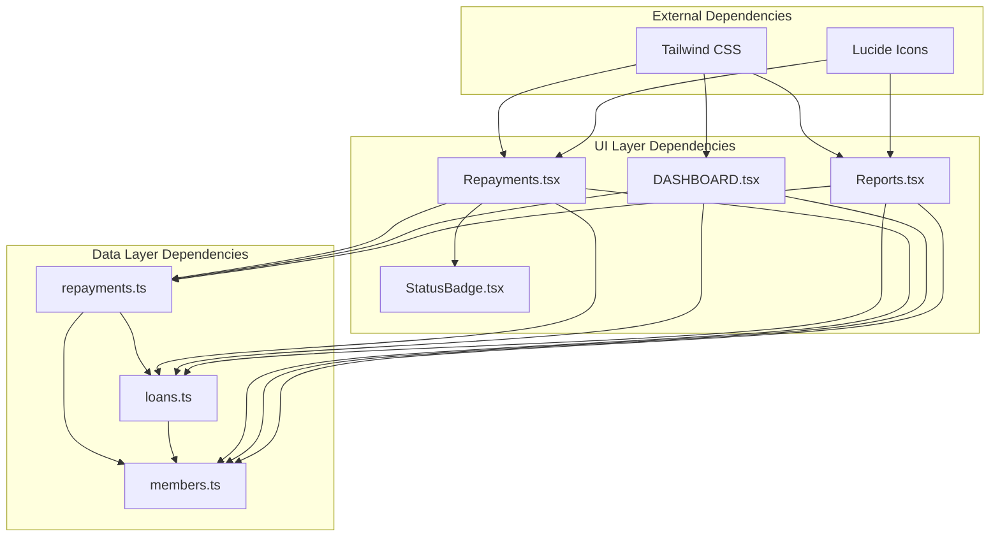

# Repayment Data Model

<cite>
**Referenced Files in This Document**
- [repayments.ts](file://src/data/repayments.ts)
- [loans.ts](file://src/data/loans.ts)
- [members.ts](file://src/data/members.ts)
- [Repayments.tsx](file://src/pages/Repayments.tsx)
- [Reports.tsx](file://src/pages/Reports.tsx)
- [Dashboard.tsx](file://src/pages/Dashboard.tsx)
- [StatusBadge.tsx](file://src/components/StatusBadge.tsx)
</cite>

## Table of Contents
1. [Introduction](#introduction)
2. [Project Structure](#project-structure)
3. [Core Components](#core-components)
4. [Architecture Overview](#architecture-overview)
5. [Detailed Component Analysis](#detailed-component-analysis)
6. [Dependency Analysis](#dependency-analysis)
7. [Performance Considerations](#performance-considerations)
8. [Troubleshooting Guide](#troubleshooting-guide)
9. [Conclusion](#conclusion)

## Introduction
This document provides comprehensive data model documentation for the Repayment entity in the Self-Help Group (SHG) management system. The repayment system tracks loan payment cycles, due date management, and overdue tracking. It integrates with loan entities and member profiles to provide complete financial oversight for SHG operations.

The system manages monthly EMI (Equated Monthly Installment) payments, penalty calculations for late payments, and provides analytics for repayment performance monitoring.

## Project Structure
The repayment functionality is organized across several key modules:

**Diagram sources**
- [repayments.ts](file://src/data/repayments.ts#L1-L71)
- [loans.ts](file://src/data/loans.ts#L1-L140)
- [members.ts](file://src/data/members.ts#L1-L122)
- [Repayments.tsx](file://src/pages/Repayments.tsx#L1-L141)
- [Dashboard.tsx](file://src/pages/Dashboard.tsx#L150-L190)
- [Reports.tsx](file://src/pages/Reports.tsx#L1-L213)

**Section sources**
- [repayments.ts](file://src/data/repayments.ts#L1-L71)
- [loans.ts](file://src/data/loans.ts#L1-L140)
- [members.ts](file://src/data/members.ts#L1-L122)

## Core Components

### Repayment Entity Definition
The Repayment entity serves as the central data structure for tracking loan payment cycles:

**Diagram sources**
- [repayments.ts](file://src/data/repayments.ts#L1-L10)
- [loans.ts](file://src/data/loans.ts#L1-L12)
- [members.ts](file://src/data/members.ts#L1-L10)

### Field Specifications

| Field | Type | Description | Example |
|-------|------|-------------|---------|
| **repayment_id** | string | Unique identifier for each repayment cycle | "REP001" |
| **loan_id** | string | Foreign key linking to loan entity | "LOAN001" |
| **due_date** | string (date) | Scheduled payment due date | "2024-02-15" |
| **payment_date** | string \| null | Actual payment completion date | "2024-02-14" or null |
| **amount_paid** | number | Amount actually paid in this cycle | 889 |
| **remaining_balance** | number | Outstanding principal balance | 9111 |
| **penalty** | number | Late payment penalty amount | 0 or 20 |
| **status** | enum | Current repayment status | "Paid", "Pending", "Overdue" |

**Section sources**
- [repayments.ts](file://src/data/repayments.ts#L1-L10)

## Architecture Overview

### Data Flow Architecture
The repayment system follows a reactive data flow pattern:

**Diagram sources**
- [Repayments.tsx](file://src/pages/Repayments.tsx#L15-L24)
- [loans.ts](file://src/data/loans.ts#L120-L123)
- [members.ts](file://src/data/members.ts#L12-L121)

### Status Management System
The system implements a three-tier status classification:

**Diagram sources**
- [repayments.ts](file://src/data/repayments.ts#L8-L9)
- [StatusBadge.tsx](file://src/components/StatusBadge.tsx#L7-L14)

**Section sources**
- [repayments.ts](file://src/data/repayments.ts#L52-L70)
- [StatusBadge.tsx](file://src/components/StatusBadge.tsx#L1-L37)

## Detailed Component Analysis

### Repayment Data Model Implementation

#### Core Data Structure
The repayment system maintains a comprehensive dataset with realistic loan scenarios:

| Loan Scenario | On-time Payments | Late Payments | Overdue Cases |
|---------------|------------------|---------------|---------------|
| LOAN001 (12-month) | 4/5 cycles | 0 | 0 |
| LOAN002 (18-month) | 3/5 cycles | 1 cycle | 0 |
| LOAN003 (10-month) | 2/5 cycles | 0 | 1 cycle |
| LOAN005 (24-month) | 3/5 cycles | 0 | 0 |
| LOAN006 (12-month) | 2/3 cycles | 0 | 1 cycle |
| LOAN008 (24-month) | 4/5 cycles | 0 | 0 |

#### Penalty Calculation Algorithm
The penalty system implements tiered late fee calculation:

**Diagram sources**
- [repayments.ts](file://src/data/repayments.ts#L31-L42)

**Section sources**
- [repayments.ts](file://src/data/repayments.ts#L12-L50)

### Loan Integration and Relationship Management

#### Cross-Entity Relationships
The repayment system integrates with multiple data entities:

**Diagram sources**
- [loans.ts](file://src/data/loans.ts#L1-L12)
- [repayments.ts](file://src/data/repayments.ts#L1-L10)
- [members.ts](file://src/data/members.ts#L1-L10)

#### Payment Reconciliation Process
The system implements automatic payment reconciliation:

**Diagram sources**
- [loans.ts](file://src/data/loans.ts#L1-L12)
- [repayments.ts](file://src/data/repayments.ts#L12-L18)

**Section sources**
- [loans.ts](file://src/data/loans.ts#L1-L140)
- [members.ts](file://src/data/members.ts#L1-L122)

### Analytics and Reporting System

#### Performance Metrics Dashboard
The system provides comprehensive analytics through multiple visualization components:

| Metric | Calculation | Purpose |
|--------|-------------|---------|
| **Total Collected** | Sum of all paid amounts | Track cash flow |
| **Repayment Success Rate** | (Paid / Total) × 100 | Measure performance |
| **Pending Collections** | Count of pending repayments | Monitor upcoming obligations |
| **Overdue Exposure** | Count of overdue repayments | Risk assessment |

#### Collection Strategies
The system supports multiple collection approaches:

**Diagram sources**
- [Reports.tsx](file://src/pages/Reports.tsx#L119-L172)
- [Dashboard.tsx](file://src/pages/Dashboard.tsx#L150-L190)

**Section sources**
- [Reports.tsx](file://src/pages/Reports.tsx#L1-L213)
- [Dashboard.tsx](file://src/pages/Dashboard.tsx#L150-L190)

## Dependency Analysis

### Component Dependencies
The repayment system exhibits clear separation of concerns:

**Diagram sources**
- [repayments.ts](file://src/data/repayments.ts#L1-L71)
- [loans.ts](file://src/data/loans.ts#L1-L140)
- [members.ts](file://src/data/members.ts#L1-L122)
- [Repayments.tsx](file://src/pages/Repayments.tsx#L1-L141)
- [Dashboard.tsx](file://src/pages/Dashboard.tsx#L150-L190)
- [Reports.tsx](file://src/pages/Reports.tsx#L1-L213)

### Cohesion and Coupling Analysis
The system demonstrates excellent modularity with:
- **High Cohesion**: Each module focuses on specific functionality
- **Low Coupling**: Clear separation between data, presentation, and business logic
- **Single Responsibility**: Each component handles one primary concern

**Section sources**
- [repayments.ts](file://src/data/repayments.ts#L52-L70)
- [Repayments.tsx](file://src/pages/Repayments.tsx#L15-L24)

## Performance Considerations

### Data Structure Optimizations
The current implementation uses in-memory arrays which provide:
- **Fast Access**: O(1) lookup for direct array access
- **Simple Updates**: Direct property modification
- **Memory Efficiency**: Minimal overhead for small datasets

### Scalability Recommendations
For production deployment, consider:
- **Database Migration**: Replace in-memory arrays with persistent storage
- **Indexing Strategy**: Add indices on frequently queried fields (loan_id, status)
- **Pagination**: Implement server-side pagination for large datasets
- **Caching Layer**: Add Redis caching for frequently accessed loan data

### Query Performance
Current filtering operations are O(n) complexity. For improved performance:
- **Pre-computed Metrics**: Cache calculated statistics
- **Batch Operations**: Group related operations
- **Lazy Loading**: Load data on-demand rather than pre-loading all records

## Troubleshooting Guide

### Common Issues and Solutions

#### Status Synchronization Problems
**Issue**: Repayment status not updating correctly
**Solution**: Verify due_date comparison logic and ensure payment_date validation

#### Data Consistency Issues
**Issue**: Inconsistent remaining_balance calculations
**Solution**: Implement atomic transaction updates for payment processing

#### Performance Degradation
**Issue**: Slow rendering with large datasets
**Solution**: Implement virtual scrolling and lazy loading for the repayment table

### Debugging Tools and Techniques

#### Validation Functions
The system includes built-in validation helpers:
- `getRepaymentsByLoan()`: Filter repayments by loan ID
- `getOverdueRepayments()`: Identify overdue payments
- `getPendingRepayments()`: Track upcoming obligations
- `getTotalCollected()`: Calculate total collected amount

#### Error Prevention Strategies
- **Type Safety**: Strongly typed interfaces prevent runtime errors
- **Boundary Checks**: Validate date comparisons and numeric calculations
- **Graceful Degradation**: Handle null values in payment_date fields

**Section sources**
- [repayments.ts](file://src/data/repayments.ts#L52-L70)

## Conclusion

The Repayment data model provides a robust foundation for SHG loan management with comprehensive tracking capabilities. The system successfully integrates loan, member, and repayment data to deliver actionable insights into repayment performance.

Key strengths of the implementation include:
- **Clear Data Modeling**: Well-defined entities with explicit relationships
- **Realistic Scenarios**: Representative data sets demonstrating various repayment patterns
- **Comprehensive Analytics**: Multiple visualization approaches for different stakeholder needs
- **Extensible Architecture**: Modular design supporting future enhancements

The system effectively balances simplicity for demonstration purposes with the complexity needed for real-world SHG operations. Future enhancements should focus on database migration, performance optimization, and advanced analytics capabilities.