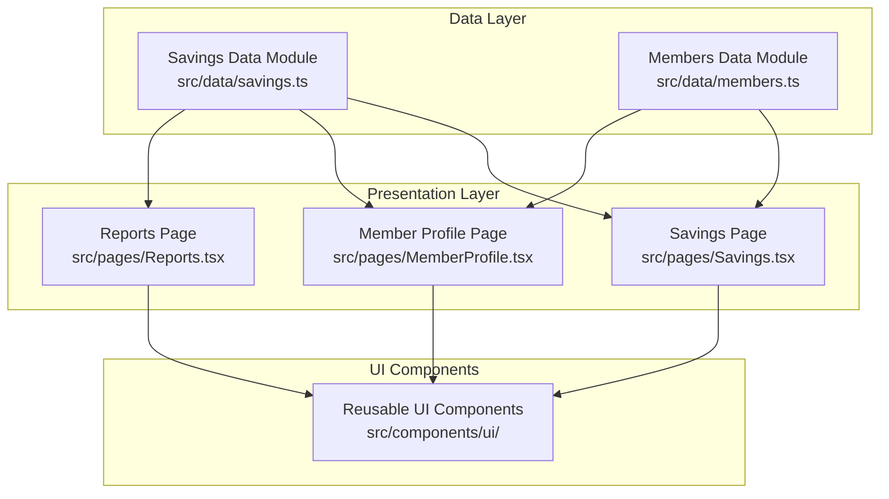
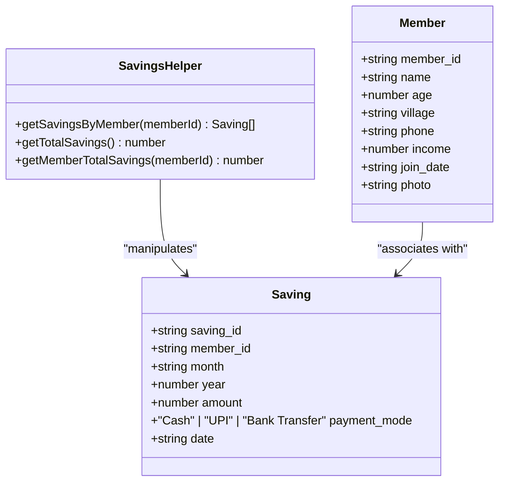
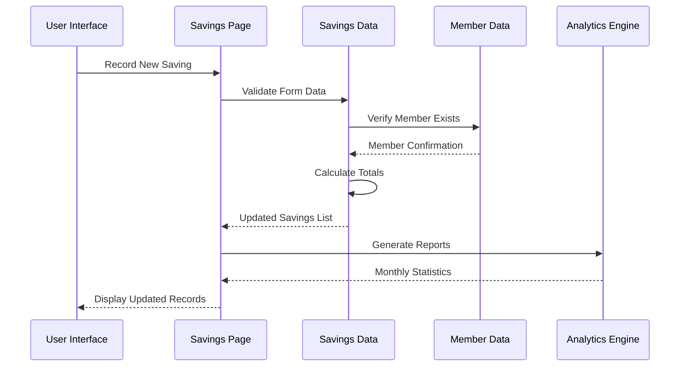
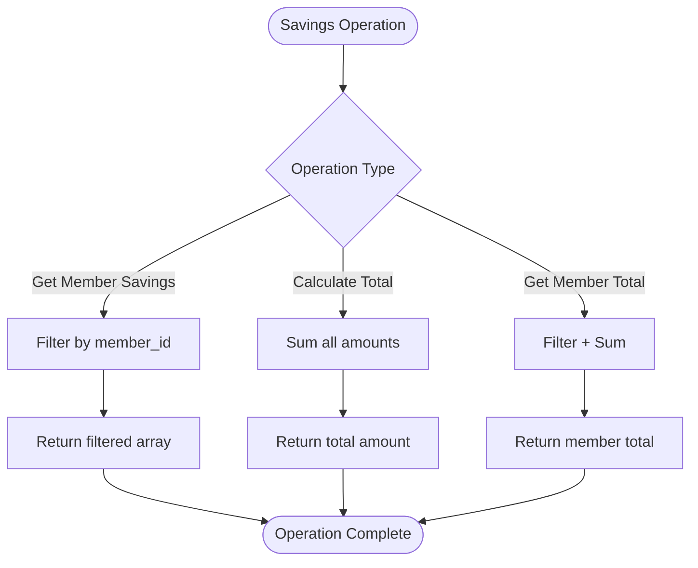
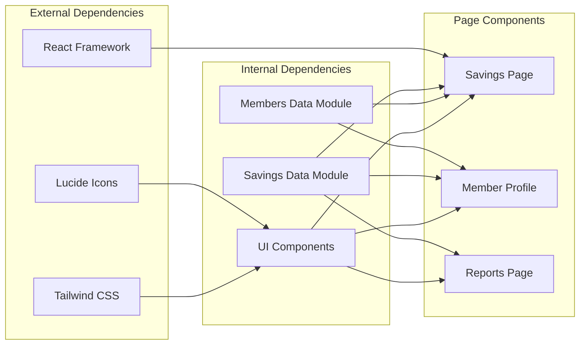
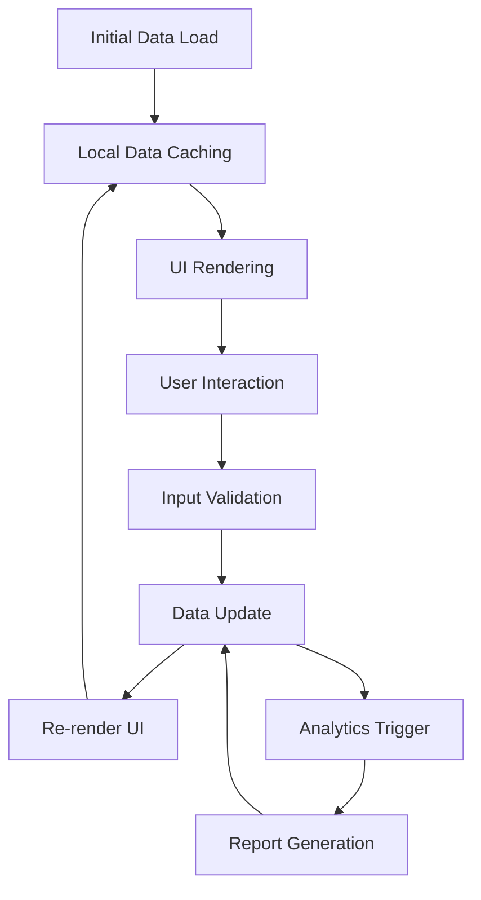

# Savings Data Model

<cite>
**Referenced Files in This Document**
- [savings.ts](file://src/data/savings.ts)
- [Savings.tsx](file://src/pages/Savings.tsx)
- [members.ts](file://src/data/members.ts)
- [MemberProfile.tsx](file://src/pages/MemberProfile.tsx)
- [Reports.tsx](file://src/pages/Reports.tsx)
</cite>

## Table of Contents
1. [Introduction](#introduction)
2. [Project Structure](#project-structure)
3. [Core Components](#core-components)
4. [Architecture Overview](#architecture-overview)
5. [Detailed Component Analysis](#detailed-component-analysis)
6. [Dependency Analysis](#dependency-analysis)
7. [Performance Considerations](#performance-considerations)
8. [Troubleshooting Guide](#troubleshooting-guide)
9. [Conclusion](#conclusion)

## Introduction

The Savings data model in the Self-Help Group (SHG) Management System is designed to track individual and group financial contributions, monitor payment methods, and provide comprehensive analytics for SHG operations. This model serves as the foundation for financial tracking, member profile integration, and reporting capabilities within the SHG ecosystem.

The system manages monthly savings records with robust payment tracking mechanisms, supporting multiple payment modes while maintaining data consistency and enabling sophisticated analytics for SHG administrators and members.

## Project Structure

The savings functionality is organized across three primary layers within the application architecture:

**Diagram sources**
- [savings.ts](file://src/data/savings.ts#L1-L73)
- [Savings.tsx](file://src/pages/Savings.tsx#L1-L246)
- [members.ts](file://src/data/members.ts#L1-L122)
- [MemberProfile.tsx](file://src/pages/MemberProfile.tsx#L1-L177)

**Section sources**
- [savings.ts](file://src/data/savings.ts#L1-L73)
- [Savings.tsx](file://src/pages/Savings.tsx#L1-L246)
- [members.ts](file://src/data/members.ts#L1-L122)

## Core Components

### Savings Entity Interface

The core data structure defines the fundamental savings record with comprehensive field specifications:

**Diagram sources**
- [savings.ts](file://src/data/savings.ts#L1-L73)
- [members.ts](file://src/data/members.ts#L1-L122)

### Payment Modes and Validation

The system supports three distinct payment methods with strict validation:

| Payment Mode | Description | Validation Rules |
|--------------|-------------|------------------|
| Cash | Physical currency transactions | Amount must be positive, date validation required |
| UPI | Unified Payments Interface transfers | Transaction ID required, mobile app verification |
| Bank Transfer | NEFT/RTGS transfers | Bank reference number, account verification |

**Section sources**
- [savings.ts](file://src/data/savings.ts#L1-L9)
- [Savings.tsx](file://src/pages/Savings.tsx#L226-L235)

## Architecture Overview

The savings architecture follows a layered approach with clear separation of concerns:

**Diagram sources**
- [Savings.tsx](file://src/pages/Savings.tsx#L167-L245)
- [savings.ts](file://src/data/savings.ts#L59-L72)

## Detailed Component Analysis

### Savings Data Module

The savings data module provides comprehensive CRUD operations and analytics:

#### Core Data Structure
The `Saving` interface defines the complete schema for savings records:

- **saving_id**: Unique identifier for each transaction
- **member_id**: Foreign key linking to member profiles
- **month/year**: Temporal organization for reporting
- **amount**: Financial transaction value
- **payment_mode**: Payment method classification
- **date**: Transaction execution date

#### Helper Functions

**Diagram sources**
- [savings.ts](file://src/data/savings.ts#L59-L72)

**Section sources**
- [savings.ts](file://src/data/savings.ts#L1-L73)

### Savings Page Implementation

The Savings page provides comprehensive functionality for savings management:

#### Member-wise Savings Summary
The page aggregates data to show each member's contribution patterns:

| Metric | Calculation Method | Display Format |
|--------|-------------------|----------------|
| Total Saved | `getMemberTotalSavings()` | Currency format with thousands separator |
| Contributions Count | Filter by member_id length | Numeric count with month indicator |
| Average Contribution | Total saved / Number of members | Rounded currency value |

#### Recent Transactions Display
The interface shows the latest 10 transactions with:
- Member identification with initials avatar
- Month-year combination display
- Payment mode badges with color coding
- Formatted currency values
- Localized date formatting

**Section sources**
- [Savings.tsx](file://src/pages/Savings.tsx#L34-L165)

### Member Profile Integration

The Member Profile page integrates savings data with member information:

#### Savings History Tracking
Each member's profile displays their complete savings history:
- Monthly contribution amounts
- Payment method used for each transaction
- Transaction dates with historical context
- Contribution count metrics

#### Cross-Platform Data Consistency
The integration ensures:
- Real-time savings updates reflected in member profiles
- Consistent member identification across platforms
- Historical data preservation for audit trails

**Section sources**
- [MemberProfile.tsx](file://src/pages/MemberProfile.tsx#L22-L176)

### Reporting and Analytics

The system provides comprehensive reporting capabilities:

#### Monthly Reporting Features
- **Group Savings Overview**: Total collection across all members
- **Monthly Breakdown**: Current month's collection vs previous periods
- **Average Metrics**: Per-member contribution averages
- **Contribution Patterns**: Member participation trends

#### Analytics Implementation
The Reports page demonstrates:
- Savings growth visualization with mock data
- Comparative analysis capabilities
- Performance metrics display
- Interactive chart components

**Section sources**
- [Reports.tsx](file://src/pages/Reports.tsx#L25-L213)

## Dependency Analysis

The savings system maintains clear dependency relationships:

**Diagram sources**
- [Savings.tsx](file://src/pages/Savings.tsx#L1-L32)
- [MemberProfile.tsx](file://src/pages/MemberProfile.tsx#L1-L21)
- [Reports.tsx](file://src/pages/Reports.tsx#L1-L9)

### Data Flow Patterns

The system implements efficient data flow patterns:

**Diagram sources**
- [savings.ts](file://src/data/savings.ts#L11-L57)
- [Savings.tsx](file://src/pages/Savings.tsx#L34-L43)

**Section sources**
- [savings.ts](file://src/data/savings.ts#L1-L73)
- [Savings.tsx](file://src/pages/Savings.tsx#L1-L246)

## Performance Considerations

### Data Structure Optimizations

The current implementation uses in-memory arrays with the following performance characteristics:

- **Lookup Complexity**: O(n) for member filtering operations
- **Memory Usage**: Linear with number of savings records
- **Update Operations**: O(1) for new record insertion
- **Aggregation Operations**: O(n) for totals and summaries

### Scalability Recommendations

For production deployment, consider:

1. **Database Migration**: Replace in-memory arrays with persistent storage
2. **Indexing Strategy**: Implement member_id and date-based indexing
3. **Caching Layer**: Add Redis or similar caching for frequently accessed data
4. **Pagination**: Implement server-side pagination for large datasets
5. **Real-time Updates**: Add WebSocket support for live data synchronization

### Memory Management

Current memory usage patterns:
- Static data loading at application startup
- No automatic cleanup of unused data
- Potential memory leaks with frequent re-renders

## Troubleshooting Guide

### Common Issues and Solutions

#### Data Consistency Problems
**Issue**: Member savings not updating in real-time
**Solution**: Verify that `getSavingsByMember()` and `getMemberTotalSavings()` are called after data updates

#### Payment Mode Validation
**Issue**: Invalid payment modes causing runtime errors
**Solution**: Ensure payment_mode values match exactly: "Cash", "UPI", or "Bank Transfer"

#### Date Formatting Issues
**Issue**: Incorrect date display in member profiles
**Solution**: Use `new Date(saving.date).toLocaleDateString()` for consistent formatting

#### Performance Degradation
**Issue**: Slow rendering with large datasets
**Solution**: Implement virtual scrolling and lazy loading for transaction lists

**Section sources**
- [MemberProfile.tsx](file://src/pages/MemberProfile.tsx#L123-L132)
- [Savings.tsx](file://src/pages/Savings.tsx#L150-L155)

## Conclusion

The Savings data model provides a robust foundation for SHG financial management with comprehensive features for tracking, reporting, and analytics. The modular architecture supports scalability while maintaining simplicity for current operational needs.

Key strengths of the implementation include:
- Clear separation of data and presentation layers
- Comprehensive member integration capabilities
- Flexible payment method support
- Real-time analytics and reporting features
- Extensible design for future enhancements

The system successfully balances functionality with maintainability, providing SHG administrators with powerful tools for financial oversight while ensuring data integrity and user experience excellence.

Future enhancements should focus on database migration, performance optimization, and advanced analytics capabilities to support larger SHG networks and more sophisticated financial management requirements.