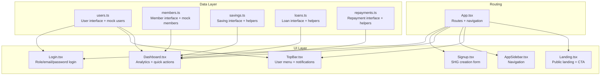
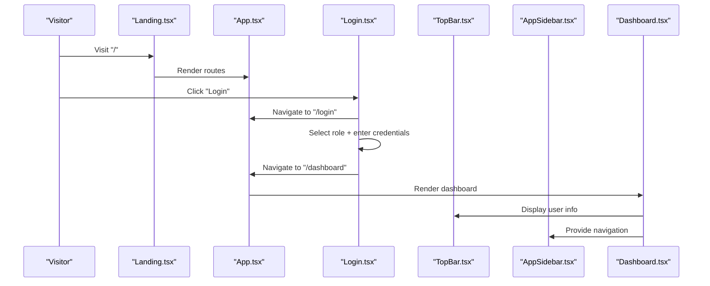
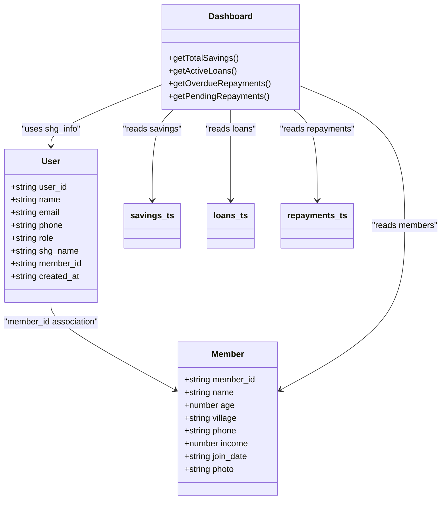
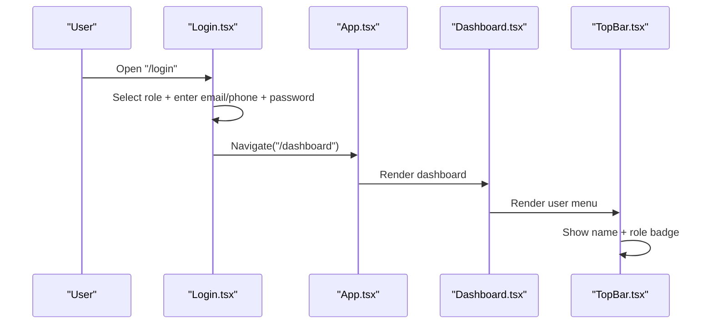
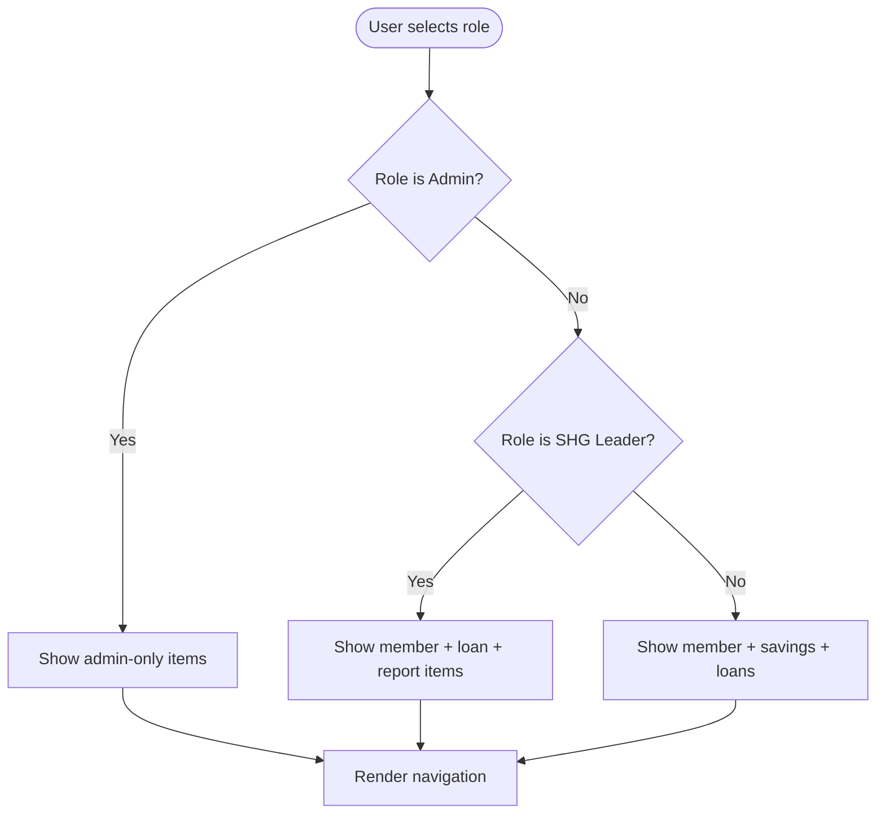
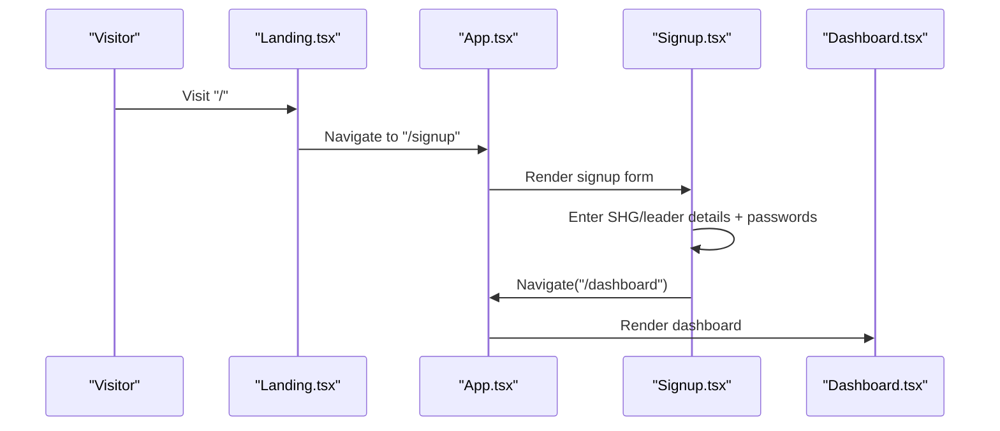
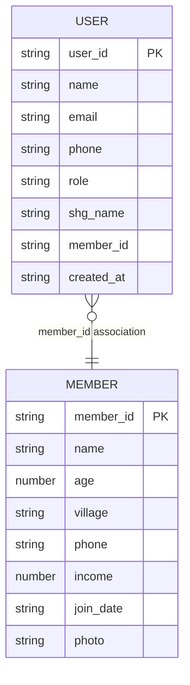
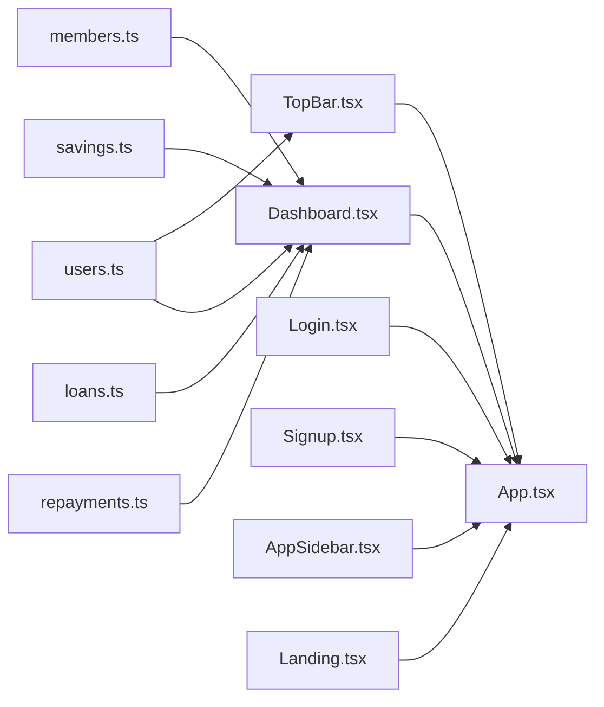

# User Data Model

<cite>
**Referenced Files in This Document**
- [users.ts](file://src/data/users.ts)
- [members.ts](file://src/data/members.ts)
- [Login.tsx](file://src/pages/Login.tsx)
- [Signup.tsx](file://src/pages/Signup.tsx)
- [App.tsx](file://src/App.tsx)
- [AppSidebar.tsx](file://src/components/AppSidebar.tsx)
- [TopBar.tsx](file://src/components/TopBar.tsx)
- [Dashboard.tsx](file://src/pages/Dashboard.tsx)
- [Landing.tsx](file://src/pages/Landing.tsx)
- [savings.ts](file://src/data/savings.ts)
- [loans.ts](file://src/data/loans.ts)
- [repayments.ts](file://src/data/repayments.ts)
</cite>

## Table of Contents
1. [Introduction](#introduction)
2. [Project Structure](#project-structure)
3. [Core Components](#core-components)
4. [Architecture Overview](#architecture-overview)
5. [Detailed Component Analysis](#detailed-component-analysis)
6. [Dependency Analysis](#dependency-analysis)
7. [Performance Considerations](#performance-considerations)
8. [Troubleshooting Guide](#troubleshooting-guide)
9. [Conclusion](#conclusion)

## Introduction
This document defines the User data model for the SHG management application, focusing on system access and authentication. It documents the User entity’s fields, role-based access control, authentication requirements, and security considerations. It also covers user registration workflows, password management, session handling, profile management, permissions, integration with member data for SHG Leaders, and analytics/activity tracking aligned with the current mock implementation.

## Project Structure
The user-related data and UI are organized across:
- Data models and mock datasets under src/data
- Authentication UI under src/pages
- Application routing under src/App.tsx
- Shared UI components for navigation and profile under src/components

**Diagram sources**
- [users.ts](file://src/data/users.ts#L1-L78)
- [members.ts](file://src/data/members.ts#L1-L122)
- [savings.ts](file://src/data/savings.ts#L1-L73)
- [loans.ts](file://src/data/loans.ts#L1-L140)
- [repayments.ts](file://src/data/repayments.ts#L1-L71)
- [Login.tsx](file://src/pages/Login.tsx#L1-L197)
- [Signup.tsx](file://src/pages/Signup.tsx#L1-L142)
- [Dashboard.tsx](file://src/pages/Dashboard.tsx#L1-L190)
- [AppSidebar.tsx](file://src/components/AppSidebar.tsx#L1-L101)
- [TopBar.tsx](file://src/components/TopBar.tsx#L1-L65)
- [Landing.tsx](file://src/pages/Landing.tsx#L1-L337)
- [App.tsx](file://src/App.tsx#L1-L48)

**Section sources**
- [users.ts](file://src/data/users.ts#L1-L78)
- [App.tsx](file://src/App.tsx#L1-L48)

## Core Components
This section documents the User entity and related components that participate in authentication and access control.

- User entity fields
  - user_id: Unique identifier for the user
  - name: Full name
  - email: Contact email
  - phone: Contact phone
  - role: Role enumeration (Admin, SHG Leader, Member)
  - shg_name: Associated SHG name
  - member_id: Optional association to a Member record (for SHG Leaders and Members)
  - created_at: Timestamp of account creation

- Current user and authentication helpers
  - currentUser: Mock current user reference
  - authenticateUser: Mock authentication helper

- Role-based access control
  - Navigation items are static; role-based visibility is not implemented in the current code
  - The TopBar displays the current user’s role via a badge

- Registration workflow
  - Signup page collects SHG name, leader name, phone, and password
  - On submit, navigates to the dashboard (mock behavior)

- Session handling
  - No persistent session storage; navigation is client-side only

- Profile management
  - TopBar shows user name and role; “Profile Settings” is present in the dropdown but not implemented

- Permissions and integrations
  - SHG Leader role is associated with a member_id and an SHG name
  - Dashboard integrates with members, savings, loans, and repayments data

- Analytics and activity
  - Dashboard aggregates totals and recent activity from savings, loans, and repayments
  - No explicit audit logs or activity timestamps are present in the current data model

**Section sources**
- [users.ts](file://src/data/users.ts#L1-L78)
- [TopBar.tsx](file://src/components/TopBar.tsx#L1-L65)
- [AppSidebar.tsx](file://src/components/AppSidebar.tsx#L1-L101)
- [Signup.tsx](file://src/pages/Signup.tsx#L1-L142)
- [Dashboard.tsx](file://src/pages/Dashboard.tsx#L1-L190)

## Architecture Overview
The application routes users through a landing page, login/signup forms, and the dashboard. Authentication is currently mock-based, relying on role selection and navigation. Access control is not enforced at the routing level; all roles see the same navigation.

**Diagram sources**
- [Landing.tsx](file://src/pages/Landing.tsx#L1-L337)
- [App.tsx](file://src/App.tsx#L1-L48)
- [Login.tsx](file://src/pages/Login.tsx#L1-L197)
- [TopBar.tsx](file://src/components/TopBar.tsx#L1-L65)
- [AppSidebar.tsx](file://src/components/AppSidebar.tsx#L1-L101)
- [Dashboard.tsx](file://src/pages/Dashboard.tsx#L1-L190)

## Detailed Component Analysis

### User Entity and Data Model
The User entity is defined with typed fields and includes optional member association for SHG Leaders and Members. Roles are constrained to Admin, SHG Leader, and Member. The mock dataset includes sample users and a current user reference.

**Diagram sources**
- [users.ts](file://src/data/users.ts#L1-L78)
- [members.ts](file://src/data/members.ts#L1-L122)
- [Dashboard.tsx](file://src/pages/Dashboard.tsx#L1-L190)
- [savings.ts](file://src/data/savings.ts#L1-L73)
- [loans.ts](file://src/data/loans.ts#L1-L140)
- [repayments.ts](file://src/data/repayments.ts#L1-L71)

**Section sources**
- [users.ts](file://src/data/users.ts#L1-L78)
- [members.ts](file://src/data/members.ts#L1-L122)

### Authentication and Login Workflow
The Login page presents a role selector and credential fields. On submission, navigation to the dashboard occurs (mock behavior). The TopBar displays the current user’s name and role.

**Diagram sources**
- [Login.tsx](file://src/pages/Login.tsx#L1-L197)
- [App.tsx](file://src/App.tsx#L1-L48)
- [Dashboard.tsx](file://src/pages/Dashboard.tsx#L1-L190)
- [TopBar.tsx](file://src/components/TopBar.tsx#L1-L65)

**Section sources**
- [Login.tsx](file://src/pages/Login.tsx#L1-L197)
- [TopBar.tsx](file://src/components/TopBar.tsx#L1-L65)

### Role-Based Access Control (RBAC)
Navigation items are static and not filtered by role. The TopBar shows the current user’s role via a badge. To implement RBAC:
- Conditionally render AppSidebar navigation items based on user role
- Guard route access using a higher-order component or route wrappers
- Integrate with the current user context

[No sources needed since this diagram shows conceptual workflow, not actual code structure]

**Section sources**
- [AppSidebar.tsx](file://src/components/AppSidebar.tsx#L1-L101)
- [TopBar.tsx](file://src/components/TopBar.tsx#L1-L65)

### Registration Workflow
The Signup page collects SHG name, leader name, phone, and password. Submission navigates to the dashboard (mock behavior). In a production system, this would involve:
- Validating form inputs
- Creating SHG and leader records
- Generating initial user credentials
- Redirecting to onboarding steps

**Diagram sources**
- [Landing.tsx](file://src/pages/Landing.tsx#L1-L337)
- [App.tsx](file://src/App.tsx#L1-L48)
- [Signup.tsx](file://src/pages/Signup.tsx#L1-L142)
- [Dashboard.tsx](file://src/pages/Dashboard.tsx#L1-L190)

**Section sources**
- [Signup.tsx](file://src/pages/Signup.tsx#L1-L142)

### Password Management
- The Login page accepts a password field; no password hashing or reset flow is implemented
- The Signup page requires password confirmation
- Recommendations for production:
  - Enforce strong password policies
  - Hash passwords server-side
  - Implement secure password reset with OTP/email verification

[No sources needed since this section provides general guidance]

### Session Handling
- Current implementation uses client-side navigation without persistent sessions
- Recommendations for production:
  - Implement token-based sessions (e.g., JWT)
  - Store tokens securely (HttpOnly cookies or secure storage)
  - Add refresh token mechanisms and logout cleanup

[No sources needed since this section provides general guidance]

### Profile Management
- The TopBar dropdown includes “Profile Settings,” “Help & Support,” and “Logout”
- These are placeholders; implement profile editing, preferences, and account settings

[No sources needed since this section provides general guidance]

### Permission Systems and Member Integration
- SHG Leaders have member_id and shg_name; they can manage SHG data
- Members are linked via member_id to the Member entity
- Dashboard integrates with members, savings, loans, and repayments

**Diagram sources**
- [users.ts](file://src/data/users.ts#L1-L78)
- [members.ts](file://src/data/members.ts#L1-L122)

**Section sources**
- [users.ts](file://src/data/users.ts#L1-L78)
- [members.ts](file://src/data/members.ts#L1-L122)

### Analytics, Activity Tracking, and Account Lifecycle
- Dashboard aggregates:
  - Total members
  - Group savings
  - Active loans and totals
  - Overdue and pending repayments
- No explicit user activity logs or lifecycle events are modeled in the current data
- Recommendations:
  - Track login/logout events
  - Add account creation/update timestamps
  - Implement audit trails for sensitive operations

**Section sources**
- [Dashboard.tsx](file://src/pages/Dashboard.tsx#L1-L190)
- [savings.ts](file://src/data/savings.ts#L1-L73)
- [loans.ts](file://src/data/loans.ts#L1-L140)
- [repayments.ts](file://src/data/repayments.ts#L1-L71)

## Dependency Analysis
The User entity depends on Member data for SHG Leaders and Members. The Dashboard consumes multiple data modules to render analytics.

**Diagram sources**
- [users.ts](file://src/data/users.ts#L1-L78)
- [members.ts](file://src/data/members.ts#L1-L122)
- [savings.ts](file://src/data/savings.ts#L1-L73)
- [loans.ts](file://src/data/loans.ts#L1-L140)
- [repayments.ts](file://src/data/repayments.ts#L1-L71)
- [Login.tsx](file://src/pages/Login.tsx#L1-L197)
- [Signup.tsx](file://src/pages/Signup.tsx#L1-L142)
- [Dashboard.tsx](file://src/pages/Dashboard.tsx#L1-L190)
- [AppSidebar.tsx](file://src/components/AppSidebar.tsx#L1-L101)
- [TopBar.tsx](file://src/components/TopBar.tsx#L1-L65)
- [Landing.tsx](file://src/pages/Landing.tsx#L1-L337)
- [App.tsx](file://src/App.tsx#L1-L48)

**Section sources**
- [users.ts](file://src/data/users.ts#L1-L78)
- [members.ts](file://src/data/members.ts#L1-L122)
- [Dashboard.tsx](file://src/pages/Dashboard.tsx#L1-L190)
- [App.tsx](file://src/App.tsx#L1-L48)

## Performance Considerations
- Current mock datasets are small; performance is not a concern
- As data grows, consider:
  - Pagination for lists
  - Efficient filtering and aggregation helpers
  - Memoization for computed metrics

[No sources needed since this section provides general guidance]

## Troubleshooting Guide
Common issues and resolutions:
- Login does not redirect
  - Verify navigation path and route definitions
  - Ensure the Login form handler triggers navigation

- Role selection not reflected in UI
  - Confirm role state updates and TopBar reads the current user
  - Implement role-based navigation rendering

- Missing member association for leaders
  - Validate member_id presence in the mock dataset
  - Ensure the Member entity is loaded for dashboard components

**Section sources**
- [Login.tsx](file://src/pages/Login.tsx#L1-L197)
- [TopBar.tsx](file://src/components/TopBar.tsx#L1-L65)
- [users.ts](file://src/data/users.ts#L1-L78)
- [members.ts](file://src/data/members.ts#L1-L122)

## Conclusion
The User data model supports Admin, SHG Leader, and Member roles with optional member association. Authentication is currently mock-based, and navigation is role-unaware. To harden the system:
- Implement robust authentication (password hashing, secure storage, password reset)
- Add role-based navigation and route guards
- Introduce session management and profile settings
- Enhance analytics with activity tracking and lifecycle events