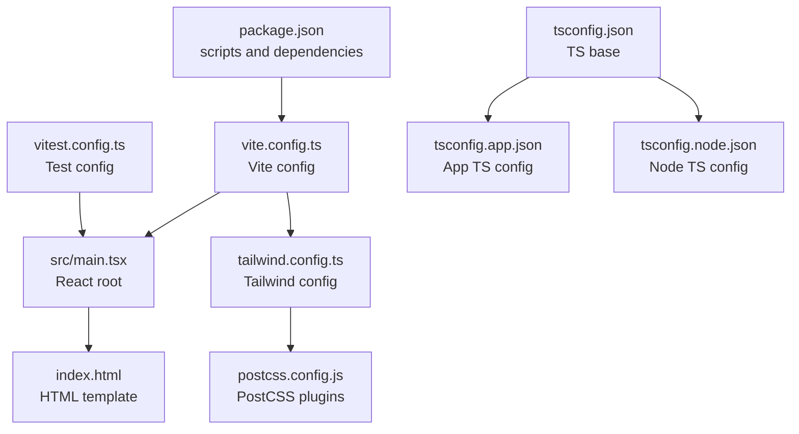
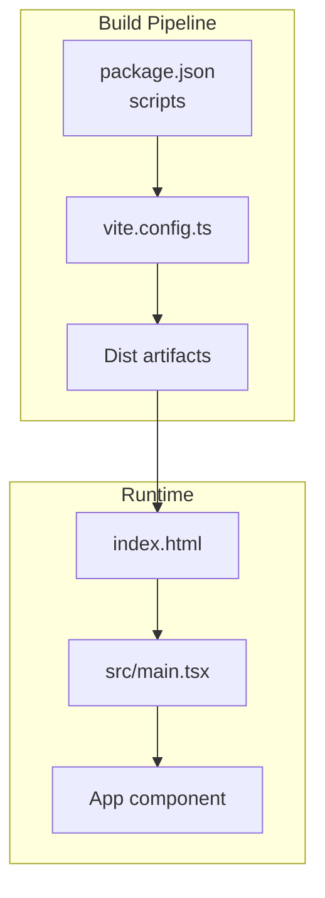
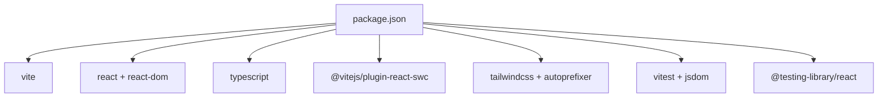

# Deployment and Maintenance

<cite>
**Referenced Files in This Document**
- [package.json](file://package.json)
- [vite.config.ts](file://vite.config.ts)
- [README.md](file://README.md)
- [tailwind.config.ts](file://tailwind.config.ts)
- [postcss.config.js](file://postcss.config.js)
- [vitest.config.ts](file://vitest.config.ts)
- [tsconfig.json](file://tsconfig.json)
- [tsconfig.app.json](file://tsconfig.app.json)
- [tsconfig.node.json](file://tsconfig.node.json)
- [index.html](file://index.html)
- [src/main.tsx](file://src/main.tsx)
</cite>

## Table of Contents
1. [Introduction](#introduction)
2. [Project Structure](#project-structure)
3. [Core Components](#core-components)
4. [Architecture Overview](#architecture-overview)
5. [Detailed Component Analysis](#detailed-component-analysis)
6. [Dependency Analysis](#dependency-analysis)
7. [Performance Considerations](#performance-considerations)
8. [Troubleshooting Guide](#troubleshooting-guide)
9. [Conclusion](#conclusion)
10. [Appendices](#appendices)

## Introduction
This document provides comprehensive deployment and maintenance guidance for the SHG Management System. It covers the Vite-based build process, production optimization settings, deployment strategies for Lovable and other platforms, custom domain configuration, environment variable management, maintenance procedures, update and rollback strategies, monitoring and performance monitoring, user feedback collection, CI/CD considerations, automated testing, quality assurance, scaling, multi-environment management, production issue handling, backup and migration strategies, and long-term maintenance planning.

## Project Structure
The project is a Vite + React + TypeScript application configured with Tailwind CSS and Vitest for testing. Key build and runtime files include:
- Build scripts and dependencies in package.json
- Vite configuration in vite.config.ts
- Tailwind and PostCSS configuration
- TypeScript configurations for app and node contexts
- Test configuration in vitest.config.ts
- Application entry point and HTML template

**Diagram sources**
- [package.json](file://package.json#L1-L90)
- [vite.config.ts](file://vite.config.ts#L1-L22)
- [src/main.tsx](file://src/main.tsx#L1-L5)
- [index.html](file://index.html#L1-L27)
- [tailwind.config.ts](file://tailwind.config.ts#L1-L129)
- [postcss.config.js](file://postcss.config.js#L1-L7)
- [vitest.config.ts](file://vitest.config.ts#L1-L17)
- [tsconfig.json](file://tsconfig.json#L1-L17)
- [tsconfig.app.json](file://tsconfig.app.json#L1-L31)
- [tsconfig.node.json](file://tsconfig.node.json#L1-L23)

**Section sources**
- [package.json](file://package.json#L1-L90)
- [vite.config.ts](file://vite.config.ts#L1-L22)
- [tailwind.config.ts](file://tailwind.config.ts#L1-L129)
- [postcss.config.js](file://postcss.config.js#L1-L7)
- [vitest.config.ts](file://vitest.config.ts#L1-L17)
- [tsconfig.json](file://tsconfig.json#L1-L17)
- [tsconfig.app.json](file://tsconfig.app.json#L1-L31)
- [tsconfig.node.json](file://tsconfig.node.json#L1-L23)
- [index.html](file://index.html#L1-L27)
- [src/main.tsx](file://src/main.tsx#L1-L5)

## Core Components
- Build and Dev Scripts: The project defines scripts for development, production builds, preview, linting, and testing.
- Vite Configuration: Defines dev server, plugin usage (including Lovable component tagging in development), and path aliases.
- Tailwind and PostCSS: Tailwind is configured for content scanning and theme extensions; PostCSS applies Tailwind and Autoprefixer.
- TypeScript Configuration: Split configurations for app and node contexts with bundler module resolution and JSX support.
- Testing Setup: Vitest configured with jsdom environment, global setup, and include patterns.

**Section sources**
- [package.json](file://package.json#L6-L14)
- [vite.config.ts](file://vite.config.ts#L7-L21)
- [tailwind.config.ts](file://tailwind.config.ts#L3-L128)
- [postcss.config.js](file://postcss.config.js#L1-L7)
- [tsconfig.app.json](file://tsconfig.app.json#L2-L27)
- [tsconfig.node.json](file://tsconfig.node.json#L2-L13)
- [vitest.config.ts](file://vitest.config.ts#L5-L16)

## Architecture Overview
The deployment architecture centers around Vite’s build pipeline and runtime rendering via React. The build produces static assets consumed by the browser through index.html and the React root.

**Diagram sources**
- [package.json](file://package.json#L6-L14)
- [vite.config.ts](file://vite.config.ts#L7-L21)
- [index.html](file://index.html#L22-L26)
- [src/main.tsx](file://src/main.tsx#L1-L5)

## Detailed Component Analysis

### Build and Production Optimization
- Build commands:
  - Development build: uses Vite dev server with HMR and component tagging in development mode.
  - Production build: standard Vite build for optimized static assets.
- Optimization settings:
  - Vite’s default bundling and minification apply during production builds.
  - Path aliases improve module resolution and maintainability.
- Environment-specific behavior:
  - Development mode enables Lovable component tagging via a conditional plugin.
- Static asset consumption:
  - index.html injects the compiled script and mounts the React root.

Recommended production optimization practices:
- Enable code splitting and dynamic imports via route-based splitting.
- Configure asset hashing and CDN distribution for long-term caching.
- Add service worker caching strategies for offline resilience.
- Integrate image optimization and font optimization.

**Section sources**
- [package.json](file://package.json#L6-L14)
- [vite.config.ts](file://vite.config.ts#L7-L21)
- [index.html](file://index.html#L22-L26)

### Lovable Deployment Process
- Deployment via Lovable:
  - The project supports publishing directly through Lovable’s interface.
  - Custom domains can be connected through Lovable’s domain settings.
- Project URL and editing modes:
  - The repository includes a project URL placeholder and instructions for editing via Lovable, IDE, GitHub, and Codespaces.

Operational steps:
- Commit changes to the repository.
- Open the Lovable project page and publish the latest changes.
- Configure custom domain under Project > Settings > Domains.

**Section sources**
- [README.md](file://README.md#L1-L74)

### Custom Domain Configuration
- Steps:
  - Navigate to Project > Settings > Domains.
  - Click Connect Domain and follow the prompts.
- Reference:
  - Official documentation link is provided in the repository’s README.

**Section sources**
- [README.md](file://README.md#L67-L73)

### Environment Variable Management
- Current configuration:
  - No explicit environment variables are defined in the repository’s build or runtime files.
- Recommendations:
  - Define environment variables for feature flags, API endpoints, and third-party integrations.
  - Use Vite’s built-in environment variable prefixing for client-side exposure.
  - Store secrets securely and avoid committing sensitive values.

**Section sources**
- [vite.config.ts](file://vite.config.ts#L7-L21)
- [package.json](file://package.json#L6-L14)

### Maintenance Procedures
- Routine tasks:
  - Run tests regularly using the test scripts.
  - Perform periodic lint checks and fix issues.
  - Review and update dependencies to address security advisories.
- Rollback strategy:
  - Maintain versioned releases and keep previous build artifacts for quick rollback.
  - Use immutable deployment practices to minimize risk.

**Section sources**
- [package.json](file://package.json#L10-L14)
- [vitest.config.ts](file://vitest.config.ts#L7-L12)

### Update Strategies
- Patch updates:
  - Apply minor dependency updates and re-run tests.
- Major updates:
  - Incrementally upgrade major versions, verify compatibility, and validate UI/UX.
- Branching strategy:
  - Use feature branches for changes; merge via pull requests after review and tests.

**Section sources**
- [package.json](file://package.json#L66-L88)
- [vite.config.ts](file://vite.config.ts#L7-L21)

### Monitoring and Performance Monitoring
- Monitoring requirements:
  - Implement application performance monitoring (APM) and error tracking.
  - Track key metrics such as load time, first contentful paint, and user session duration.
- Performance monitoring:
  - Use Lighthouse or similar tools to audit performance.
  - Monitor bundle size and optimize chunking and lazy loading.

[No sources needed since this section provides general guidance]

### User Feedback Collection
- Suggested approaches:
  - Integrate feedback widgets or in-app surveys.
  - Collect telemetry on feature usage and drop-off points.
  - Establish channels for bug reports and feature requests.

[No sources needed since this section provides general guidance]

### CI/CD Considerations
- Recommended pipeline stages:
  - Install dependencies, lint, test, build, and deploy.
  - Use caching for dependencies to speed up builds.
- Automated testing:
  - Run unit and integration tests in CI using the existing Vitest configuration.
- Quality assurance:
  - Enforce code coverage thresholds and accessibility checks.
  - Perform snapshot testing for UI components.

**Section sources**
- [vitest.config.ts](file://vitest.config.ts#L7-L12)
- [package.json](file://package.json#L10-L14)

### Scaling the Application
- Horizontal scaling:
  - Serve static assets via CDN and configure load balancers.
- Vertical scaling:
  - Optimize bundle size and leverage code splitting.
- Multi-environment management:
  - Maintain separate configurations for development, staging, and production.
  - Use environment-specific variables and deployment targets.

**Section sources**
- [vite.config.ts](file://vite.config.ts#L7-L21)
- [package.json](file://package.json#L6-L14)

### Handling Production Issues
- Immediate actions:
  - Rollback to the last known good release.
  - Enable verbose logging and capture error traces.
- Communication:
  - Notify stakeholders and provide ETA for resolution.
- Post-mortem:
  - Document root cause, impact, and preventive measures.

**Section sources**
- [README.md](file://README.md#L63-L74)

### Backup Strategies and Data Migration
- Backup:
  - Back up source code, configuration files, and deployment artifacts.
- Data migration:
  - For database-backed features, implement versioned migrations and maintain backups before applying changes.

[No sources needed since this section provides general guidance]

### Long-Term Maintenance Planning
- Roadmap:
  - Plan quarterly reviews of dependencies, performance, and feature priorities.
- Documentation:
  - Keep deployment and operational documentation current with changes.

[No sources needed since this section provides general guidance]

## Dependency Analysis
The project’s dependency graph focuses on build-time and runtime libraries managed via npm scripts and Vite.

**Diagram sources**
- [package.json](file://package.json#L15-L88)

**Section sources**
- [package.json](file://package.json#L15-L88)

## Performance Considerations
- Bundle optimization:
  - Prefer dynamic imports for routes and heavy components.
  - Remove unused styles and components.
- Runtime performance:
  - Minimize re-renders with React.memo and proper state scoping.
  - Use virtualized lists for large datasets.

[No sources needed since this section provides general guidance]

## Troubleshooting Guide
- Development server issues:
  - Verify port availability and host binding.
  - Disable overlays in development for cleaner logs.
- Build failures:
  - Check TypeScript configuration and module resolution.
  - Ensure Tailwind content paths match project structure.
- Testing issues:
  - Confirm jsdom environment and setup files are correctly configured.

**Section sources**
- [vite.config.ts](file://vite.config.ts#L8-L14)
- [tsconfig.app.json](file://tsconfig.app.json#L9-L14)
- [tailwind.config.ts](file://tailwind.config.ts#L4-L5)
- [vitest.config.ts](file://vitest.config.ts#L7-L12)

## Conclusion
The SHG Management System leverages a modern Vite + React + TypeScript stack with Tailwind CSS and Vitest. Deployment is streamlined via Lovable with optional custom domain configuration. Robust maintenance hinges on disciplined testing, CI/CD automation, environment segregation, and continuous performance monitoring. Adopt the recommended practices to scale safely, manage rollouts confidently, and sustain long-term reliability.

## Appendices
- Quick reference for key files:
  - Build and scripts: [package.json](file://package.json#L6-L14)
  - Vite config: [vite.config.ts](file://vite.config.ts#L7-L21)
  - Tailwind config: [tailwind.config.ts](file://tailwind.config.ts#L3-L128)
  - PostCSS config: [postcss.config.js](file://postcss.config.js#L1-L7)
  - Test config: [vitest.config.ts](file://vitest.config.ts#L5-L16)
  - TS configs: [tsconfig.json](file://tsconfig.json#L1-L17), [tsconfig.app.json](file://tsconfig.app.json#L1-L31), [tsconfig.node.json](file://tsconfig.node.json#L1-L23)
  - Entry and HTML: [src/main.tsx](file://src/main.tsx#L1-L5), [index.html](file://index.html#L1-L27)