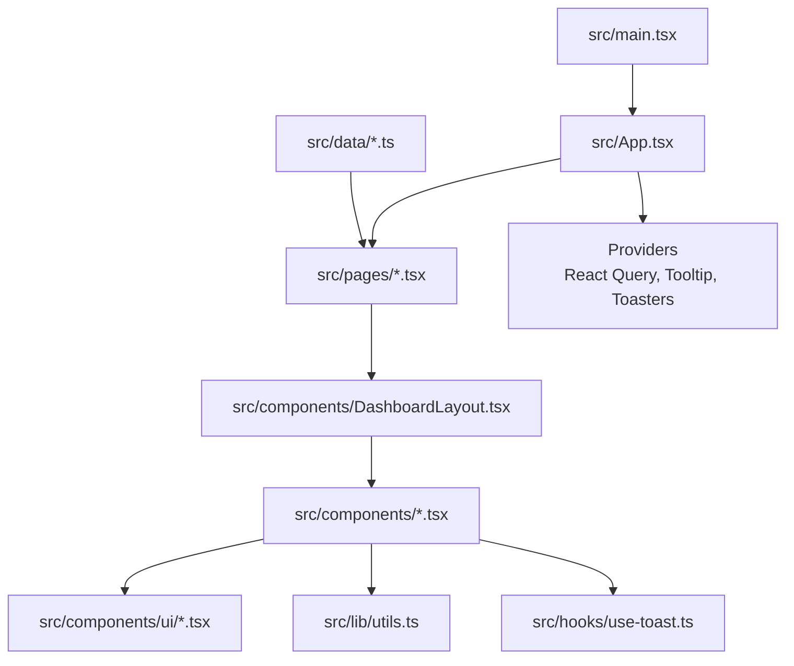
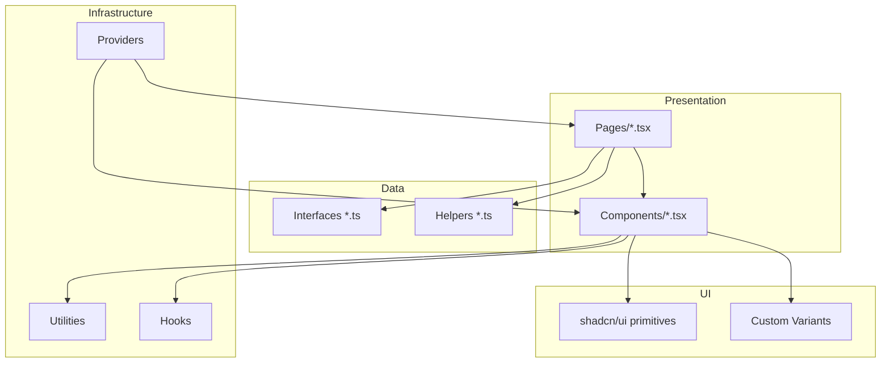
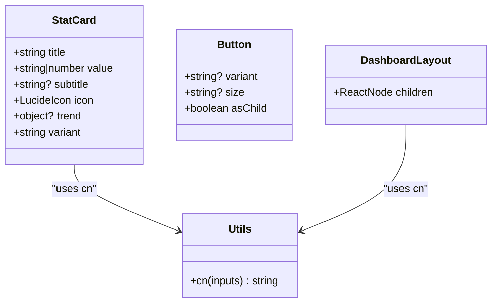
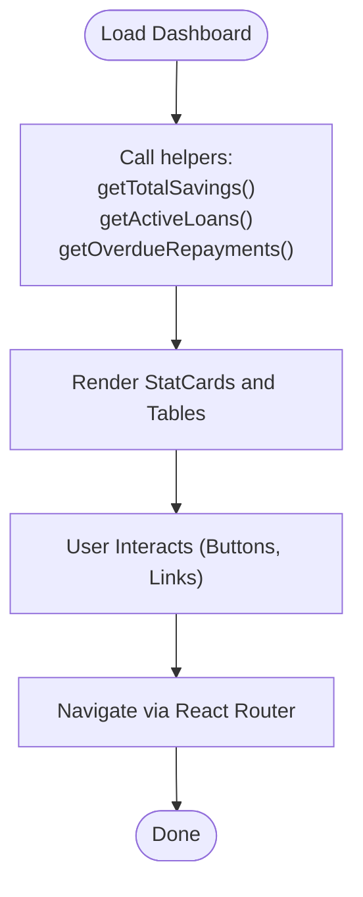
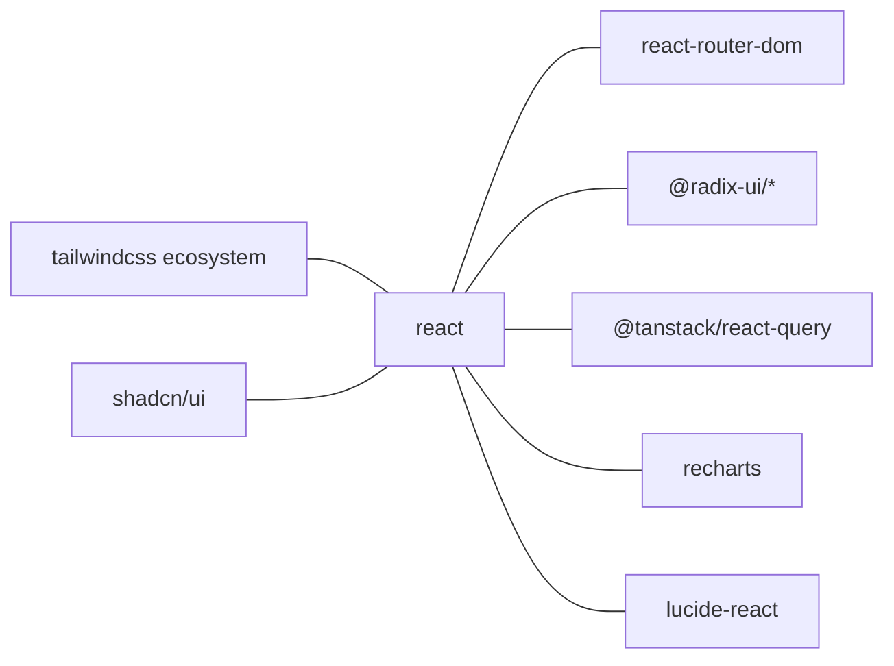

# Development Guidelines

<cite>
**Referenced Files in This Document**
- [package.json](file://package.json)
- [eslint.config.js](file://eslint.config.js)
- [tailwind.config.ts](file://tailwind.config.ts)
- [components.json](file://components.json)
- [vite.config.ts](file://vite.config.ts)
- [tsconfig.json](file://tsconfig.json)
- [README.md](file://README.md)
- [src/main.tsx](file://src/main.tsx)
- [src/App.tsx](file://src/App.tsx)
- [src/lib/utils.ts](file://src/lib/utils.ts)
- [src/hooks/use-toast.ts](file://src/hooks/use-toast.ts)
- [src/components/DashboardLayout.tsx](file://src/components/DashboardLayout.tsx)
- [src/pages/Dashboard.tsx](file://src/pages/Dashboard.tsx)
- [src/components/ui/button.tsx](file://src/components/ui/button.tsx)
- [src/components/StatCard.tsx](file://src/components/StatCard.tsx)
- [src/data/members.ts](file://src/data/members.ts)
- [src/data/savings.ts](file://src/data/savings.ts)
- [src/data/loans.ts](file://src/data/loans.ts)
- [vitest.config.ts](file://vitest.config.ts)
</cite>

## Table of Contents
1. [Introduction](#introduction)
2. [Project Structure](#project-structure)
3. [Core Components](#core-components)
4. [Architecture Overview](#architecture-overview)
5. [Detailed Component Analysis](#detailed-component-analysis)
6. [Dependency Analysis](#dependency-analysis)
7. [Performance Considerations](#performance-considerations)
8. [Troubleshooting Guide](#troubleshooting-guide)
9. [Conclusion](#conclusion)
10. [Appendices](#appendices)

## Introduction
This document defines the development guidelines for the SHG Management System. It consolidates code organization principles, naming conventions, component design patterns, and quality standards used across the application. It also documents the ESLint configuration, testing setup, TypeScript practices, component architecture, styling conventions with shadcn/ui and Tailwind CSS, and the development workflow and contribution practices.

## Project Structure
The project follows a feature-driven, layer-based organization:
- src/main.tsx initializes the React root and mounts the App.
- src/App.tsx configures routing, providers, and global UI elements.
- src/components contains reusable UI components and layout components.
- src/components/ui contains shadcn/ui primitives and custom variants.
- src/pages contains route-level pages.
- src/data contains TypeScript interfaces and local datasets used for demonstration.
- src/hooks contains shared hooks (e.g., toast manager).
- src/lib contains shared utilities (e.g., cn for Tailwind merging).
- Tooling configurations define linting, formatting, bundling, and testing.

**Diagram sources**
- [src/main.tsx](file://src/main.tsx#L1-L5)
- [src/App.tsx](file://src/App.tsx#L1-L48)
- [src/components/DashboardLayout.tsx](file://src/components/DashboardLayout.tsx#L1-L20)
- [src/lib/utils.ts](file://src/lib/utils.ts#L1-L7)
- [src/hooks/use-toast.ts](file://src/hooks/use-toast.ts#L1-L186)
- [src/data/members.ts](file://src/data/members.ts#L1-L122)
- [src/data/savings.ts](file://src/data/savings.ts#L1-L73)
- [src/data/loans.ts](file://src/data/loans.ts#L1-L140)

**Section sources**
- [src/main.tsx](file://src/main.tsx#L1-L5)
- [src/App.tsx](file://src/App.tsx#L1-L48)
- [src/components/DashboardLayout.tsx](file://src/components/DashboardLayout.tsx#L1-L20)
- [src/lib/utils.ts](file://src/lib/utils.ts#L1-L7)
- [src/hooks/use-toast.ts](file://src/hooks/use-toast.ts#L1-L186)
- [src/data/members.ts](file://src/data/members.ts#L1-L122)
- [src/data/savings.ts](file://src/data/savings.ts#L1-L73)
- [src/data/loans.ts](file://src/data/loans.ts#L1-L140)

## Core Components
- Providers and Routing
  - Global providers: React Query, Tooltip, Toaster, Sonner, and Router are wired in App.
  - Routes are declared centrally to ensure catch-all handling and consistent navigation.
- Layout and Navigation
  - DashboardLayout composes Sidebar and TopBar with a responsive main area.
- UI Utilities
  - cn utility merges Tailwind classes safely.
  - use-toast implements a lightweight toast manager with controlled concurrency and timeouts.
- Data Modeling
  - Interfaces define strict shapes for domain entities (Member, Saving, Loan).
  - Helper functions encapsulate data transformations and aggregations.

**Section sources**
- [src/App.tsx](file://src/App.tsx#L1-L48)
- [src/components/DashboardLayout.tsx](file://src/components/DashboardLayout.tsx#L1-L20)
- [src/lib/utils.ts](file://src/lib/utils.ts#L1-L7)
- [src/hooks/use-toast.ts](file://src/hooks/use-toast.ts#L1-L186)
- [src/data/members.ts](file://src/data/members.ts#L1-L122)
- [src/data/savings.ts](file://src/data/savings.ts#L1-L73)
- [src/data/loans.ts](file://src/data/loans.ts#L1-L140)

## Architecture Overview
The app uses a layered architecture:
- Presentation Layer: Pages and Components
- UI Layer: shadcn/ui primitives and custom variants
- Data Layer: Local datasets and helpers
- Infrastructure Layer: Providers (React Query, Router), Utilities, Hooks

**Diagram sources**
- [src/pages/Dashboard.tsx](file://src/pages/Dashboard.tsx#L1-L190)
- [src/components/ui/button.tsx](file://src/components/ui/button.tsx#L1-L56)
- [src/components/StatCard.tsx](file://src/components/StatCard.tsx#L1-L73)
- [src/data/members.ts](file://src/data/members.ts#L1-L122)
- [src/data/savings.ts](file://src/data/savings.ts#L1-L73)
- [src/data/loans.ts](file://src/data/loans.ts#L1-L140)
- [src/lib/utils.ts](file://src/lib/utils.ts#L1-L7)
- [src/hooks/use-toast.ts](file://src/hooks/use-toast.ts#L1-L186)
- [src/App.tsx](file://src/App.tsx#L1-L48)

## Detailed Component Analysis

### Component Architecture and Design Patterns
- Props Contract Pattern
  - Components define explicit props interfaces to enforce shape and defaults.
  - Example: StatCard props include title, value, optional subtitle, icon, trend, and variant.
- Composition Over Inheritance
  - Layouts (e.g., DashboardLayout) accept children and compose UI parts.
- Variant System with shadcn/ui
  - Use cva for consistent variants and sizes; apply cn for safe merging.
- Provider Pattern
  - App wires providers once; consumers access features via hooks or direct imports.

**Diagram sources**
- [src/components/StatCard.tsx](file://src/components/StatCard.tsx#L1-L73)
- [src/components/ui/button.tsx](file://src/components/ui/button.tsx#L1-L56)
- [src/components/DashboardLayout.tsx](file://src/components/DashboardLayout.tsx#L1-L20)
- [src/lib/utils.ts](file://src/lib/utils.ts#L1-L7)

**Section sources**
- [src/components/StatCard.tsx](file://src/components/StatCard.tsx#L1-L73)
- [src/components/ui/button.tsx](file://src/components/ui/button.tsx#L1-L56)
- [src/components/DashboardLayout.tsx](file://src/components/DashboardLayout.tsx#L1-L20)
- [src/lib/utils.ts](file://src/lib/utils.ts#L1-L7)

### Data Modeling and State Management Patterns
- TypeScript Interfaces
  - Define domain entities with precise field types and constraints.
- Helper Functions
  - Encapsulate filtering, aggregation, and calculations to keep components pure.
- React Query
  - Centralized caching and invalidation are configured at the root level.

**Diagram sources**
- [src/pages/Dashboard.tsx](file://src/pages/Dashboard.tsx#L1-L190)
- [src/data/savings.ts](file://src/data/savings.ts#L1-L73)
- [src/data/loans.ts](file://src/data/loans.ts#L1-L140)

**Section sources**
- [src/data/members.ts](file://src/data/members.ts#L1-L122)
- [src/data/savings.ts](file://src/data/savings.ts#L1-L73)
- [src/data/loans.ts](file://src/data/loans.ts#L1-L140)
- [src/pages/Dashboard.tsx](file://src/pages/Dashboard.tsx#L1-L190)

### UI Component Usage Guidelines (shadcn/ui)
- Prefer shadcn/ui primitives for consistent behavior and accessibility.
- Use variant and size props to align with design tokens.
- Apply cn for conditional class merging; avoid inline styles.
- Respect semantic roles and keyboard navigation.

**Section sources**
- [src/components/ui/button.tsx](file://src/components/ui/button.tsx#L1-L56)
- [src/components/StatCard.tsx](file://src/components/StatCard.tsx#L1-L73)
- [src/lib/utils.ts](file://src/lib/utils.ts#L1-L7)

### Tailwind CSS Best Practices
- Use design tokens (colors, spacing, typography) defined in Tailwind config.
- Merge classes with cn to prevent conflicts.
- Keep component-specific styles scoped to the component.
- Leverage animations and shadows defined in theme.extend.

**Section sources**
- [tailwind.config.ts](file://tailwind.config.ts#L1-L129)
- [src/lib/utils.ts](file://src/lib/utils.ts#L1-L7)

### Testing and Quality Standards
- Vitest runs tests in a jsdom environment with React testing utilities.
- Setup files can initialize mocks and globals.
- Run tests via npm scripts.

**Section sources**
- [vitest.config.ts](file://vitest.config.ts#L1-L17)
- [package.json](file://package.json#L12-L13)

### Code Quality and Formatting
- ESLint enforces recommended rules for JavaScript/TypeScript and React Hooks.
- Disables unused variable linting to reduce noise.
- React Refresh warnings are configured per recommendation.

**Section sources**
- [eslint.config.js](file://eslint.config.js#L1-L27)
- [package.json](file://package.json#L66-L87)

### Naming Conventions
- Files: PascalCase for components (e.g., StatCard.tsx), kebab-case for pages (e.g., dashboard.tsx).
- Interfaces: PascalCase (e.g., Member, Saving, Loan).
- Constants: UPPER_SNAKE_CASE for static data arrays (e.g., members, savings, loans).
- Helpers: camelCase for functions (e.g., getTotalSavings, getActiveLoans).

**Section sources**
- [src/components/StatCard.tsx](file://src/components/StatCard.tsx#L1-L73)
- [src/data/members.ts](file://src/data/members.ts#L1-L122)
- [src/data/savings.ts](file://src/data/savings.ts#L1-L73)
- [src/data/loans.ts](file://src/data/loans.ts#L1-L140)

### File Structure Conventions
- Feature grouping: components, pages, data, hooks, lib.
- Aliasing: @ resolves to src for clean imports.
- Tooling configs centralized at project root.

**Section sources**
- [tsconfig.json](file://tsconfig.json#L1-L17)
- [vite.config.ts](file://vite.config.ts#L1-L22)
- [components.json](file://components.json#L1-L21)

## Dependency Analysis
External libraries and their roles:
- React and Router: UI and routing.
- Radix UI primitives: Accessible base components.
- React Query: Data fetching and caching.
- Recharts: Charts.
- Tailwind ecosystem: Utility-first styling and animations.
- shadcn/ui: Styled components with design tokens.

**Diagram sources**
- [package.json](file://package.json#L15-L64)

**Section sources**
- [package.json](file://package.json#L15-L64)

## Performance Considerations
- Prefer memoization for heavy computations and stable callbacks.
- Lazy-load non-critical routes and components.
- Minimize re-renders by keeping props shallow and using React.memo where appropriate.
- Use efficient data helpers and avoid unnecessary array/object copies.

## Troubleshooting Guide
- Lint errors
  - Run the lint script to identify issues; review ESLint configuration for rule overrides.
- Test failures
  - Use Vitest watch mode to iterate quickly; ensure jsdom environment and setup files are correct.
- Build issues
  - Verify aliases and plugin configurations; confirm TypeScript references and path mapping.

**Section sources**
- [eslint.config.js](file://eslint.config.js#L1-L27)
- [vitest.config.ts](file://vitest.config.ts#L1-L17)
- [vite.config.ts](file://vite.config.ts#L1-L22)
- [tsconfig.json](file://tsconfig.json#L1-L17)

## Conclusion
These guidelines standardize development practices across the SHG Management System. By adhering to the established patterns—component composition, variant systems, data modeling, provider wiring, and tooling—you ensure maintainability, consistency, and scalability.

## Appendices

### Development Workflow and Branching
- Use feature branches for new features and bug fixes.
- Open pull requests with clear descriptions and screenshots where applicable.
- Keep commits small and focused; reference related issues.

### Contribution Guidelines
- Follow naming conventions and component patterns.
- Add unit tests for new logic; ensure existing tests pass.
- Run lint and build checks locally before submitting changes.

**Section sources**
- [README.md](file://README.md#L1-L74)