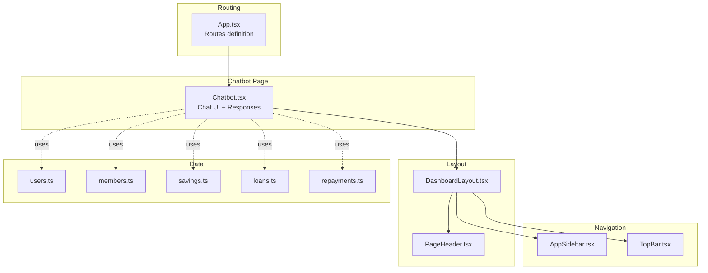
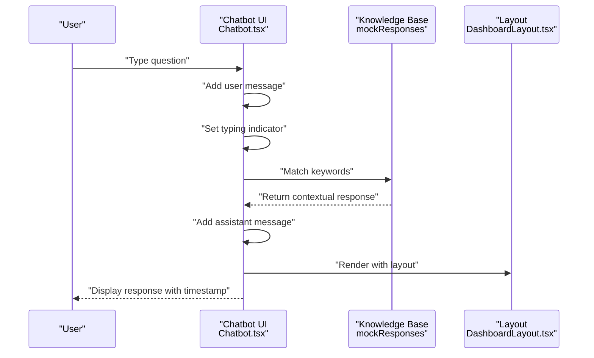
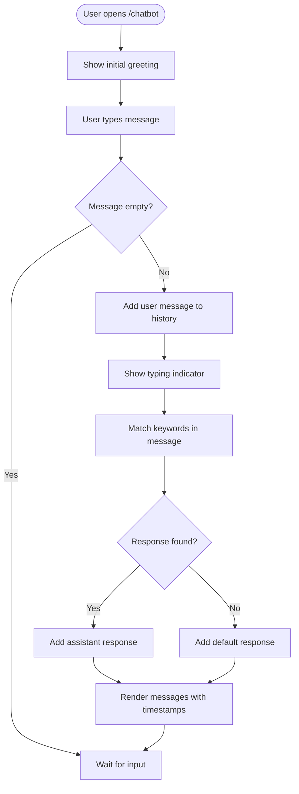
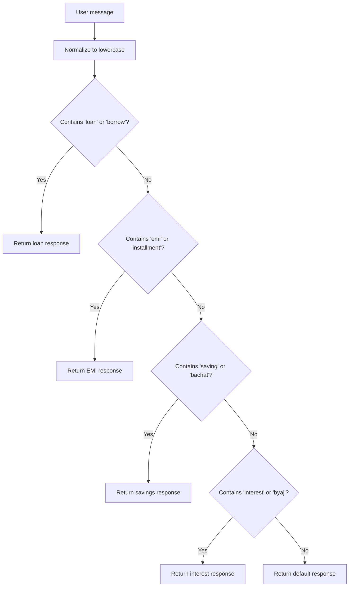
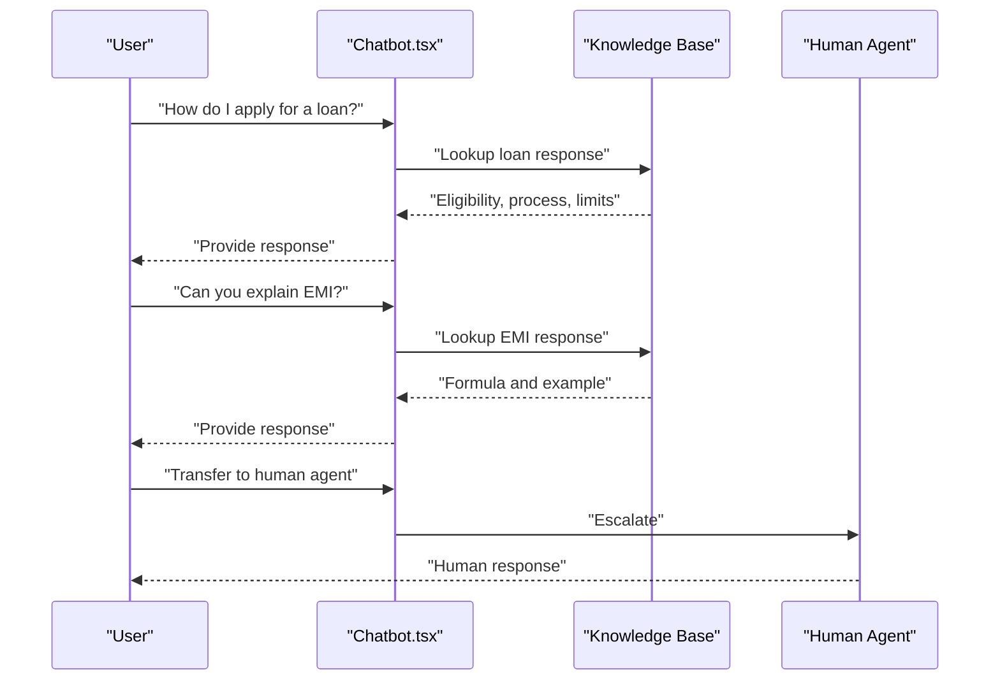
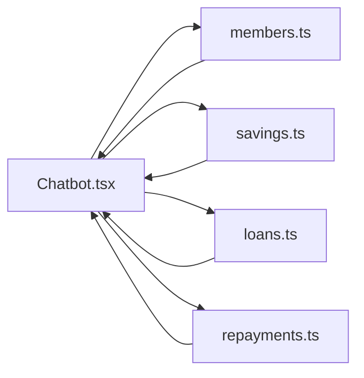
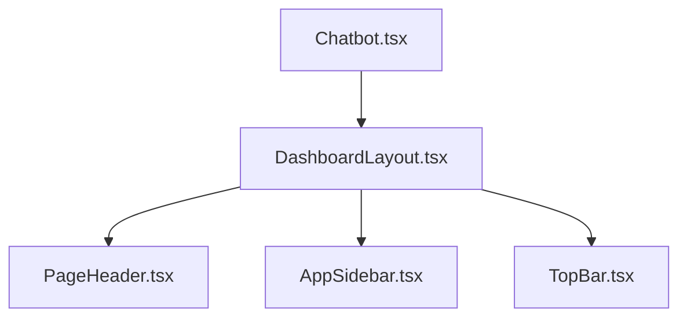
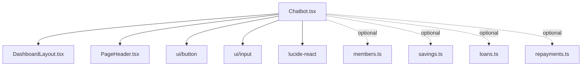

# AI Chatbot Support

<cite>
**Referenced Files in This Document**
- [Chatbot.tsx](file://src/pages/Chatbot.tsx)
- [App.tsx](file://src/App.tsx)
- [DashboardLayout.tsx](file://src/components/DashboardLayout.tsx)
- [PageHeader.tsx](file://src/components/PageHeader.tsx)
- [AppSidebar.tsx](file://src/components/AppSidebar.tsx)
- [TopBar.tsx](file://src/components/TopBar.tsx)
- [users.ts](file://src/data/users.ts)
- [members.ts](file://src/data/members.ts)
- [savings.ts](file://src/data/savings.ts)
- [loans.ts](file://src/data/loans.ts)
- [repayments.ts](file://src/data/repayments.ts)
</cite>

## Table of Contents
1. [Introduction](#introduction)
2. [Project Structure](#project-structure)
3. [Core Components](#core-components)
4. [Architecture Overview](#architecture-overview)
5. [Detailed Component Analysis](#detailed-component-analysis)
6. [Dependency Analysis](#dependency-analysis)
7. [Performance Considerations](#performance-considerations)
8. [Troubleshooting Guide](#troubleshooting-guide)
9. [Conclusion](#conclusion)

## Introduction
This document describes the AI Chatbot Support module that provides contextual assistance, FAQ responses, and intelligent support for SHG administrators and members. It covers the Chatbot page interface, the chatbot’s knowledge base around SHG management procedures, financial calculations, policy information, and system navigation help. It also explains the conversational AI integration, natural language processing capabilities, context-aware responses, conversation flows, escalation to human support, and user feedback collection. The chatbot serves as a 24/7 support resource, aiding onboarding and offering step-by-step guidance for SHG management tasks.

## Project Structure
The Chatbot module is integrated into the application as a dedicated page routed under /chatbot. It uses shared layout and UI components to maintain consistency with the rest of the dashboard.

**Diagram sources**
- [App.tsx](file://src/App.tsx#L19-L45)
- [Chatbot.tsx](file://src/pages/Chatbot.tsx#L1-L182)
- [DashboardLayout.tsx](file://src/components/DashboardLayout.tsx#L9-L19)
- [PageHeader.tsx](file://src/components/PageHeader.tsx#L13-L32)
- [AppSidebar.tsx](file://src/components/AppSidebar.tsx#L35-L155)
- [TopBar.tsx](file://src/components/TopBar.tsx#L15-L79)
- [users.ts](file://src/data/users.ts#L1-L57)
- [members.ts](file://src/data/members.ts#L1-L122)
- [savings.ts](file://src/data/savings.ts#L1-L73)
- [loans.ts](file://src/data/loans.ts#L1-L140)
- [repayments.ts](file://src/data/repayments.ts#L1-L71)

**Section sources**
- [App.tsx](file://src/App.tsx#L19-L45)
- [Chatbot.tsx](file://src/pages/Chatbot.tsx#L1-L182)

## Core Components
- Chatbot page: Provides a real-time chat interface with simulated AI responses, typing indicators, and responsive message rendering.
- Knowledge base: Built-in responses for SHG topics such as loans, EMIs, savings, and interest rates.
- Routing: Exposes the chatbot route at /chatbot and integrates with the dashboard layout.
- Layout and navigation: Uses DashboardLayout, PageHeader, AppSidebar, and TopBar to fit the chatbot into the broader application.

Key responsibilities:
- Accept user input and display messages with timestamps.
- Simulate AI response generation with a short delay.
- Provide contextual answers based on keyword matching.
- Offer helpful prompts for common queries.

**Section sources**
- [Chatbot.tsx](file://src/pages/Chatbot.tsx#L9-L31)
- [Chatbot.tsx](file://src/pages/Chatbot.tsx#L33-L84)
- [App.tsx](file://src/App.tsx#L38-L38)

## Architecture Overview
The chatbot is a self-contained page component that renders a conversation UI and responds to user input with pre-defined knowledge base entries. It leverages shared layout components for consistent navigation and branding.

**Diagram sources**
- [Chatbot.tsx](file://src/pages/Chatbot.tsx#L38-L77)
- [DashboardLayout.tsx](file://src/components/DashboardLayout.tsx#L9-L19)

## Detailed Component Analysis

### Chatbot Page Interface
The Chatbot page implements a responsive chat interface with:
- Initial welcome message from the assistant.
- Message history with distinct styling for user and assistant.
- Timestamps for each message.
- Typing indicator while the assistant “thinks”.
- Input field with Enter key submission and send button.
- Placeholder prompts to guide users toward common queries.

**Diagram sources**
- [Chatbot.tsx](file://src/pages/Chatbot.tsx#L16-L31)
- [Chatbot.tsx](file://src/pages/Chatbot.tsx#L38-L77)
- [Chatbot.tsx](file://src/pages/Chatbot.tsx#L96-L157)

**Section sources**
- [Chatbot.tsx](file://src/pages/Chatbot.tsx#L86-L181)

### Knowledge Base and Contextual Responses
The chatbot’s knowledge base is implemented as keyword-driven responses covering:
- Loans: Eligibility, amounts, and interest rates.
- EMIs: Formula and example calculation.
- Savings: Group totals, per-member averages, and contribution patterns.
- Interest: Rates for savings and loans.

**Diagram sources**
- [Chatbot.tsx](file://src/pages/Chatbot.tsx#L52-L76)
- [Chatbot.tsx](file://src/pages/Chatbot.tsx#L25-L31)

**Section sources**
- [Chatbot.tsx](file://src/pages/Chatbot.tsx#L25-L31)

### Conversation Flows
- Onboarding and guidance: The initial greeting introduces capabilities and encourages specific queries.
- Step-by-step guidance: Users can ask about loans, EMIs, savings, and interest to receive structured explanations and examples.
- Escalation to human support: The current implementation simulates AI responses; future enhancements can integrate a live agent handoff mechanism.
- Feedback collection: The current implementation does not include explicit feedback widgets; future iterations can add quick rating or feedback prompts after responses.

**Diagram sources**
- [Chatbot.tsx](file://src/pages/Chatbot.tsx#L25-L31)
- [Chatbot.tsx](file://src/pages/Chatbot.tsx#L52-L76)

**Section sources**
- [Chatbot.tsx](file://src/pages/Chatbot.tsx#L16-L31)
- [Chatbot.tsx](file://src/pages/Chatbot.tsx#L38-L77)

### Integrations with SHG Data
While the current chatbot simulates responses, it can be extended to integrate with SHG data for richer, personalized answers:
- Member profiles: Use members.ts to tailor responses to specific members.
- Savings: Use savings.ts to provide accurate group and individual balances.
- Loans: Use loans.ts and repayments.ts to inform about loan status, EMIs, and repayment schedules.

**Diagram sources**
- [Chatbot.tsx](file://src/pages/Chatbot.tsx#L1-L10)
- [members.ts](file://src/data/members.ts#L1-L122)
- [savings.ts](file://src/data/savings.ts#L1-L73)
- [loans.ts](file://src/data/loans.ts#L1-L140)
- [repayments.ts](file://src/data/repayments.ts#L1-L71)

**Section sources**
- [members.ts](file://src/data/members.ts#L1-L122)
- [savings.ts](file://src/data/savings.ts#L1-L73)
- [loans.ts](file://src/data/loans.ts#L1-L140)
- [repayments.ts](file://src/data/repayments.ts#L1-L71)

### Layout and Navigation Integration
The chatbot page is embedded within the dashboard layout and navigation:
- DashboardLayout provides the main container with sidebar and top bar.
- PageHeader displays the page title and description.
- AppSidebar and TopBar ensure consistent branding and navigation across the app.

**Diagram sources**
- [DashboardLayout.tsx](file://src/components/DashboardLayout.tsx#L9-L19)
- [PageHeader.tsx](file://src/components/PageHeader.tsx#L13-L32)
- [AppSidebar.tsx](file://src/components/AppSidebar.tsx#L35-L155)
- [TopBar.tsx](file://src/components/TopBar.tsx#L15-L79)
- [Chatbot.tsx](file://src/pages/Chatbot.tsx#L86-L181)

**Section sources**
- [DashboardLayout.tsx](file://src/components/DashboardLayout.tsx#L9-L19)
- [PageHeader.tsx](file://src/components/PageHeader.tsx#L13-L32)
- [AppSidebar.tsx](file://src/components/AppSidebar.tsx#L35-L155)
- [TopBar.tsx](file://src/components/TopBar.tsx#L15-L79)
- [Chatbot.tsx](file://src/pages/Chatbot.tsx#L86-L181)

## Dependency Analysis
The Chatbot page depends on:
- Layout components for UI consistency.
- Shared UI primitives (buttons, inputs, icons).
- Data modules for potential future integrations.

**Diagram sources**
- [Chatbot.tsx](file://src/pages/Chatbot.tsx#L1-L8)
- [DashboardLayout.tsx](file://src/components/DashboardLayout.tsx#L9-L19)
- [PageHeader.tsx](file://src/components/PageHeader.tsx#L13-L32)
- [members.ts](file://src/data/members.ts#L1-L122)
- [savings.ts](file://src/data/savings.ts#L1-L73)
- [loans.ts](file://src/data/loans.ts#L1-L140)
- [repayments.ts](file://src/data/repayments.ts#L1-L71)

**Section sources**
- [Chatbot.tsx](file://src/pages/Chatbot.tsx#L1-L8)

## Performance Considerations
- Rendering: The chat history is rendered as a list; for very long histories, consider virtualization to improve performance.
- Simulated latency: The current 1-second delay is lightweight but should remain asynchronous to avoid blocking the UI.
- Keyword matching: The current substring checks are O(n) per message; for larger knowledge bases, consider indexing or a small NLP library for intent classification.
- Data integration: When integrating with real data, fetch and cache responses to minimize repeated computations.

## Troubleshooting Guide
Common issues and resolutions:
- No response after sending: Ensure the input is not empty and the send button is enabled. Verify the typing indicator appears briefly.
- Incorrect or generic response: Confirm the message includes relevant keywords (e.g., “loan,” “emi,” “saving,” “interest”).
- UI not updating: Check that the message array is updated immutably and re-rendering occurs after state changes.
- Escalation and feedback: These features are not implemented yet; add a “Need help?” prompt and a feedback widget in future iterations.

**Section sources**
- [Chatbot.tsx](file://src/pages/Chatbot.tsx#L38-L84)
- [Chatbot.tsx](file://src/pages/Chatbot.tsx#L96-L157)

## Conclusion
The AI Chatbot Support module delivers immediate, contextual assistance for SHG administrators and members. Its current implementation provides a friendly, guided interface with keyword-driven responses covering loans, EMIs, savings, and interest. By integrating with SHG data and extending the knowledge base, the chatbot can become a powerful 24/7 support resource that aids onboarding, accelerates daily tasks, and improves user satisfaction. Future enhancements should focus on scalable intent detection, personalized data-driven responses, escalation to human agents, and user feedback collection.