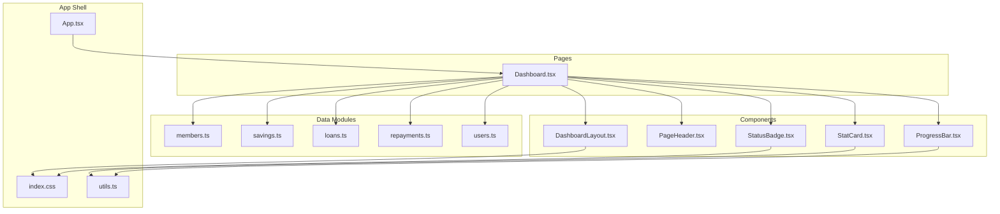
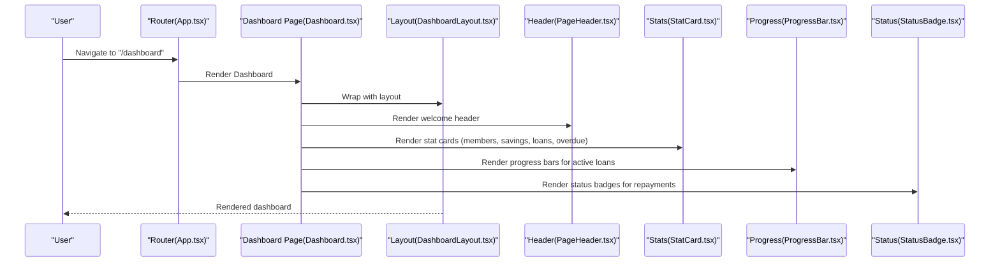
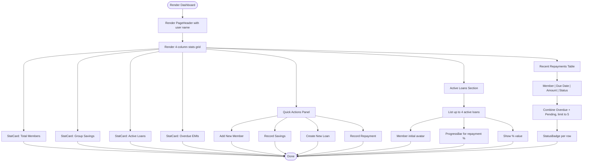
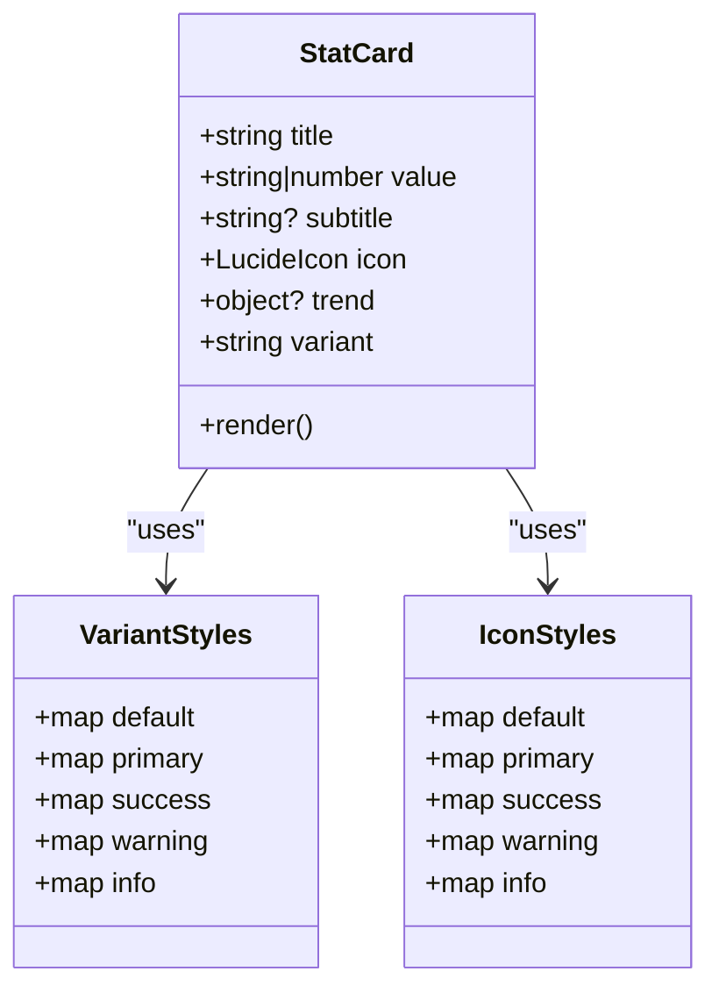
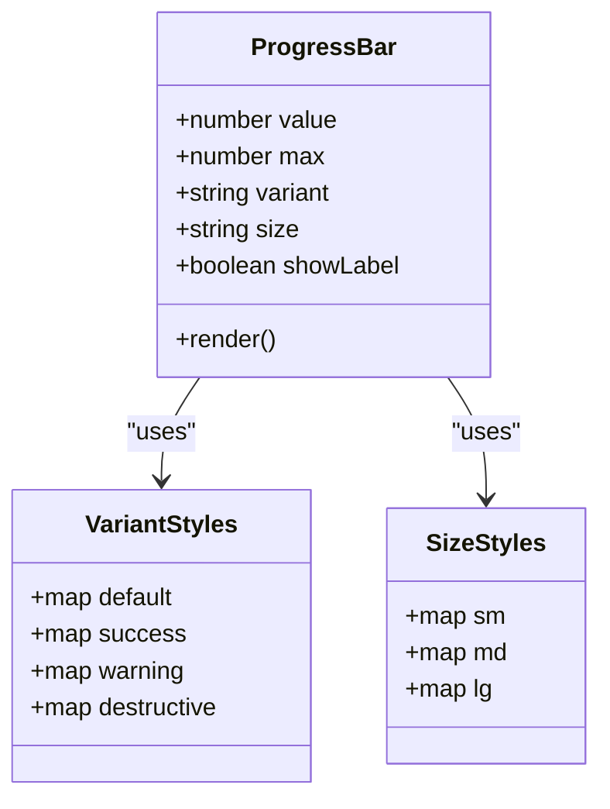
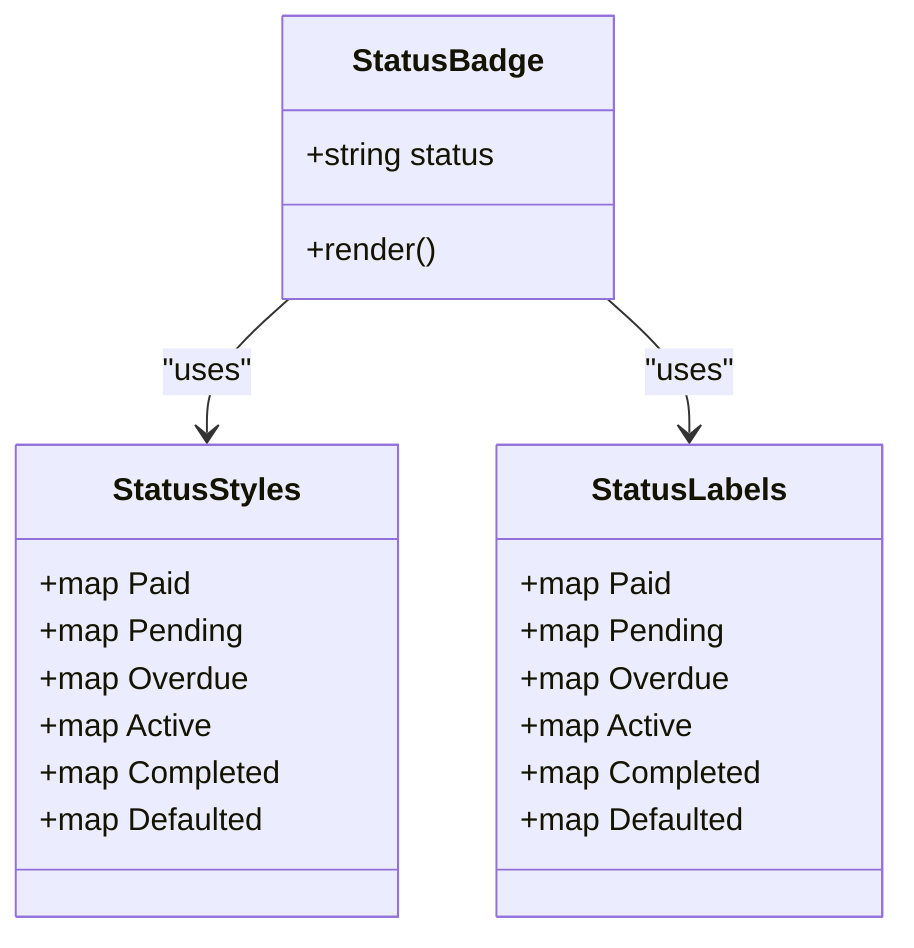
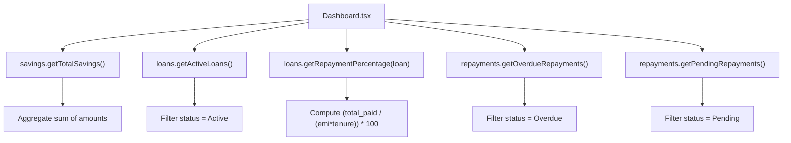
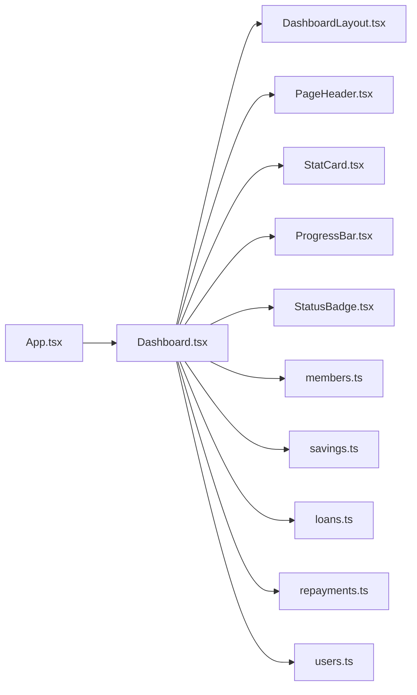

# Dashboard & Analytics

<cite>
**Referenced Files in This Document**
- [Dashboard.tsx](file://src/pages/Dashboard.tsx)
- [DashboardLayout.tsx](file://src/components/DashboardLayout.tsx)
- [PageHeader.tsx](file://src/components/PageHeader.tsx)
- [StatCard.tsx](file://src/components/StatCard.tsx)
- [ProgressBar.tsx](file://src/components/ProgressBar.tsx)
- [StatusBadge.tsx](file://src/components/StatusBadge.tsx)
- [members.ts](file://src/data/members.ts)
- [savings.ts](file://src/data/savings.ts)
- [loans.ts](file://src/data/loans.ts)
- [repayments.ts](file://src/data/repayments.ts)
- [users.ts](file://src/data/users.ts)
- [App.tsx](file://src/App.tsx)
- [index.css](file://src/index.css)
- [utils.ts](file://src/lib/utils.ts)
</cite>

## Table of Contents
1. [Introduction](#introduction)
2. [Project Structure](#project-structure)
3. [Core Components](#core-components)
4. [Architecture Overview](#architecture-overview)
5. [Detailed Component Analysis](#detailed-component-analysis)
6. [Dependency Analysis](#dependency-analysis)
7. [Performance Considerations](#performance-considerations)
8. [Troubleshooting Guide](#troubleshooting-guide)
9. [Conclusion](#conclusion)
10. [Appendices](#appendices)

## Introduction
This document describes the Dashboard & Analytics module of the SHG Management System. It focuses on the main dashboard interface that presents a financial overview of the Self-Help Group (SHG), including total members, group savings, active loans, and overdue EMIs. It explains the visualization components used for data presentation (StatCard, ProgressBar, StatusBadge), the quick actions panel for navigation shortcuts, the active loans display with repayment progress tracking, and the recent repayments table. It also covers integration with data modules for financial reporting, user welcome functionality, navigation patterns, layout structure, responsive design, and data aggregation patterns.

## Project Structure
The Dashboard page composes reusable UI components and integrates with data modules to render financial insights. The layout wraps the dashboard content and provides consistent navigation and top bar behavior. Styling leverages a theme-driven design system with Tailwind CSS and custom CSS utilities.

**Diagram sources**
- [Dashboard.tsx](file://src/pages/Dashboard.tsx#L1-L190)
- [DashboardLayout.tsx](file://src/components/DashboardLayout.tsx#L1-L20)
- [PageHeader.tsx](file://src/components/PageHeader.tsx#L1-L24)
- [StatCard.tsx](file://src/components/StatCard.tsx#L1-L73)
- [ProgressBar.tsx](file://src/components/ProgressBar.tsx#L1-L50)
- [StatusBadge.tsx](file://src/components/StatusBadge.tsx#L1-L37)
- [members.ts](file://src/data/members.ts#L1-L122)
- [savings.ts](file://src/data/savings.ts#L1-L73)
- [loans.ts](file://src/data/loans.ts#L1-L140)
- [repayments.ts](file://src/data/repayments.ts#L1-L71)
- [users.ts](file://src/data/users.ts#L1-L78)
- [App.tsx](file://src/App.tsx#L1-L48)
- [index.css](file://src/index.css#L1-L209)
- [utils.ts](file://src/lib/utils.ts#L1-L7)

**Section sources**
- [Dashboard.tsx](file://src/pages/Dashboard.tsx#L1-L190)
- [App.tsx](file://src/App.tsx#L1-L48)

## Core Components
- Dashboard page orchestrates the financial overview, quick actions, active loans, and recent repayments.
- StatCard renders KPIs with optional trend indicators and variant styling.
- ProgressBar visualizes repayment progress with configurable variants and sizes.
- StatusBadge displays repayment statuses with themed styles.
- DashboardLayout provides consistent layout with sidebar and top bar.
- PageHeader renders the welcome header with dynamic user name.
- Data modules supply aggregated metrics and lists for rendering.

Key responsibilities:
- Dashboard.tsx: Aggregates data via helpers, renders grid of StatCards, quick action buttons, active loans with progress, and recent repayments table.
- StatCard.tsx: Renders labeled cards with icons, values, subtitles, and trend indicators.
- ProgressBar.tsx: Renders horizontal progress with size and variant options.
- StatusBadge.tsx: Renders status badges with themed CSS classes.
- DashboardLayout.tsx: Wraps content with sidebar and top bar.
- PageHeader.tsx: Provides page header layout and optional actions.
- Data modules: Provide typed models and helper functions for totals, filters, and computations.

**Section sources**
- [Dashboard.tsx](file://src/pages/Dashboard.tsx#L30-L189)
- [StatCard.tsx](file://src/components/StatCard.tsx#L32-L72)
- [ProgressBar.tsx](file://src/components/ProgressBar.tsx#L24-L49)
- [StatusBadge.tsx](file://src/components/StatusBadge.tsx#L25-L36)
- [DashboardLayout.tsx](file://src/components/DashboardLayout.tsx#L9-L19)
- [PageHeader.tsx](file://src/components/PageHeader.tsx#L11-L23)
- [members.ts](file://src/data/members.ts#L1-L122)
- [savings.ts](file://src/data/savings.ts#L64-L73)
- [loans.ts](file://src/data/loans.ts#L125-L139)
- [repayments.ts](file://src/data/repayments.ts#L57-L70)
- [users.ts](file://src/data/users.ts#L64-L77)

## Architecture Overview
The dashboard follows a component-driven architecture:
- Page-level composition pulls data from domain modules.
- UI components encapsulate presentation logic and styling.
- Layout components provide consistent shell behavior.
- Styling uses a theme system with Tailwind utilities and custom CSS classes.

**Diagram sources**
- [App.tsx](file://src/App.tsx#L26-L41)
- [Dashboard.tsx](file://src/pages/Dashboard.tsx#L36-L187)
- [DashboardLayout.tsx](file://src/components/DashboardLayout.tsx#L9-L19)
- [PageHeader.tsx](file://src/components/PageHeader.tsx#L11-L23)
- [StatCard.tsx](file://src/components/StatCard.tsx#L32-L72)
- [ProgressBar.tsx](file://src/components/ProgressBar.tsx#L24-L49)
- [StatusBadge.tsx](file://src/components/StatusBadge.tsx#L25-L36)

## Detailed Component Analysis

### Dashboard Page
The dashboard aggregates financial metrics and displays them in a responsive grid. It:
- Welcomes the user by name from user data.
- Renders four StatCards for total members, group savings, active loans, and overdue EMIs.
- Provides quick action buttons linking to core modules.
- Shows active loans with repayment progress bars.
- Displays recent repayments with status indicators.

**Diagram sources**
- [Dashboard.tsx](file://src/pages/Dashboard.tsx#L36-L187)
- [PageHeader.tsx](file://src/components/PageHeader.tsx#L11-L23)
- [StatCard.tsx](file://src/components/StatCard.tsx#L32-L72)
- [ProgressBar.tsx](file://src/components/ProgressBar.tsx#L24-L49)
- [StatusBadge.tsx](file://src/components/StatusBadge.tsx#L25-L36)

**Section sources**
- [Dashboard.tsx](file://src/pages/Dashboard.tsx#L30-L189)
- [users.ts](file://src/data/users.ts#L64-L77)

### StatCard Component
Purpose:
- Display KPIs with title, value, optional subtitle, icon, and trend indicator.
- Support multiple variants for visual emphasis.

Implementation highlights:
- Props include title, value, optional subtitle, icon, optional trend, and variant.
- Variant maps to background and border styles.
- Icon area uses variant-specific color classes.
- Trend indicator shows direction and percentage change.

**Diagram sources**
- [StatCard.tsx](file://src/components/StatCard.tsx#L4-L39)

**Section sources**
- [StatCard.tsx](file://src/components/StatCard.tsx#L32-L72)
- [utils.ts](file://src/lib/utils.ts#L4-L6)

### ProgressBar Component
Purpose:
- Visualize progress percentages for repayment completion.

Implementation highlights:
- Props include value, max, variant, size, and optional label.
- Computes percentage clamped to 100.
- Uses size classes for thickness and variant classes for color.
- Optional label shows computed percentage.

**Diagram sources**
- [ProgressBar.tsx](file://src/components/ProgressBar.tsx#L3-L29)

**Section sources**
- [ProgressBar.tsx](file://src/components/ProgressBar.tsx#L24-L49)

### StatusBadge Component
Purpose:
- Display repayment and loan statuses with consistent theming.

Implementation highlights:
- Props include status enum.
- Maps status to CSS classes for visual indication.
- Renders a small, bordered badge with status text.

**Diagram sources**
- [StatusBadge.tsx](file://src/components/StatusBadge.tsx#L3-L23)

**Section sources**
- [StatusBadge.tsx](file://src/components/StatusBadge.tsx#L25-L36)
- [index.css](file://src/index.css#L165-L180)

### Data Aggregation and Financial Reporting
The dashboard relies on helper functions in data modules to compute:
- Total group savings from all savings records.
- Active loans by filtering loan status.
- Repayment progress percentage per loan.
- Overdue and pending repayments for recent activity.

**Diagram sources**
- [Dashboard.tsx](file://src/pages/Dashboard.tsx#L31-L34)
- [savings.ts](file://src/data/savings.ts#L64-L67)
- [loans.ts](file://src/data/loans.ts#L125-L139)
- [repayments.ts](file://src/data/repayments.ts#L57-L65)

**Section sources**
- [Dashboard.tsx](file://src/pages/Dashboard.tsx#L31-L34)
- [savings.ts](file://src/data/savings.ts#L64-L73)
- [loans.ts](file://src/data/loans.ts#L125-L139)
- [repayments.ts](file://src/data/repayments.ts#L57-L70)

### Navigation Patterns and Quick Actions
The dashboard provides quick navigation to core modules:
- Add New Member
- Record Savings
- Create New Loan
- Record Repayment

These are implemented as outline buttons with icons and links routed via React Router.

**Section sources**
- [Dashboard.tsx](file://src/pages/Dashboard.tsx#L84-L108)
- [App.tsx](file://src/App.tsx#L31-L38)

### Layout and Responsive Design
- DashboardLayout provides a two-column shell with sidebar and top bar, and a scrollable main area.
- The dashboard uses Tailwind’s responsive utilities:
  - Stats grid adapts from 2 to 4 columns based on screen size.
  - Active loans section stacks on smaller screens.
  - Recent repayments table is horizontally scrollable for narrow widths.
- Theme variables and custom utilities define consistent colors, shadows, and status badges.

**Section sources**
- [DashboardLayout.tsx](file://src/components/DashboardLayout.tsx#L9-L19)
- [Dashboard.tsx](file://src/pages/Dashboard.tsx#L44-L148)
- [index.css](file://src/index.css#L1-L209)

## Dependency Analysis
The dashboard depends on:
- Layout and header components for shell behavior.
- UI components for visualization.
- Data modules for metrics and lists.
- Routing for navigation.

**Diagram sources**
- [Dashboard.tsx](file://src/pages/Dashboard.tsx#L1-L20)
- [DashboardLayout.tsx](file://src/components/DashboardLayout.tsx#L1-L20)
- [PageHeader.tsx](file://src/components/PageHeader.tsx#L1-L24)
- [StatCard.tsx](file://src/components/StatCard.tsx#L1-L73)
- [ProgressBar.tsx](file://src/components/ProgressBar.tsx#L1-L50)
- [StatusBadge.tsx](file://src/components/StatusBadge.tsx#L1-L37)
- [members.ts](file://src/data/members.ts#L1-L122)
- [savings.ts](file://src/data/savings.ts#L1-L73)
- [loans.ts](file://src/data/loans.ts#L1-L140)
- [repayments.ts](file://src/data/repayments.ts#L1-L71)
- [users.ts](file://src/data/users.ts#L1-L78)
- [App.tsx](file://src/App.tsx#L1-L48)

**Section sources**
- [Dashboard.tsx](file://src/pages/Dashboard.tsx#L1-L20)
- [App.tsx](file://src/App.tsx#L26-L41)

## Performance Considerations
- Prefer memoization for derived values if datasets grow large.
- Virtualize long lists (e.g., recent repayments) if performance becomes an issue.
- Keep StatCard and ProgressBar renders lightweight; avoid unnecessary re-renders by passing stable props.
- Use minimal recomputation in helpers; cache totals when appropriate.

## Troubleshooting Guide
Common issues and resolutions:
- Missing user name in welcome header:
  - Verify current user data and ensure the user module exports the expected shape.
- Zero or unexpected totals:
  - Confirm helper functions are invoked and data arrays are populated.
- Incorrect progress percentage:
  - Ensure loan EMI and tenure are accurate and total paid reflects paid installments.
- Status badge not styled:
  - Confirm Tailwind utilities for status classes are present and not overridden by custom CSS.

**Section sources**
- [users.ts](file://src/data/users.ts#L54-L77)
- [savings.ts](file://src/data/savings.ts#L64-L73)
- [loans.ts](file://src/data/loans.ts#L135-L139)
- [repayments.ts](file://src/data/repayments.ts#L57-L70)
- [index.css](file://src/index.css#L165-L180)

## Conclusion
The Dashboard & Analytics module delivers a comprehensive financial overview for SHG leaders. It combines reusable UI components with domain data to present key metrics, quick navigation, repayment progress, and recent activity. The modular design supports maintainability and extensibility while the responsive layout ensures usability across devices.

## Appendices

### API and Data Model References
- Members: [members.ts](file://src/data/members.ts#L1-L122)
- Savings: [savings.ts](file://src/data/savings.ts#L1-L73)
- Loans: [loans.ts](file://src/data/loans.ts#L1-L140)
- Repayments: [repayments.ts](file://src/data/repayments.ts#L1-L71)
- Users: [users.ts](file://src/data/users.ts#L1-L78)

### UI Component References
- StatCard: [StatCard.tsx](file://src/components/StatCard.tsx#L1-L73)
- ProgressBar: [ProgressBar.tsx](file://src/components/ProgressBar.tsx#L1-L50)
- StatusBadge: [StatusBadge.tsx](file://src/components/StatusBadge.tsx#L1-L37)
- DashboardLayout: [DashboardLayout.tsx](file://src/components/DashboardLayout.tsx#L1-L20)
- PageHeader: [PageHeader.tsx](file://src/components/PageHeader.tsx#L1-L24)