# Feature Modules

<cite>
**Referenced Files in This Document**
- [README.md](file://README.md)
- [package.json](file://package.json)
- [App.tsx](file://src/App.tsx)
- [Dashboard.tsx](file://src/pages/Dashboard.tsx)
- [Members.tsx](file://src/pages/Members.tsx)
- [Savings.tsx](file://src/pages/Savings.tsx)
- [Loans.tsx](file://src/pages/Loans.tsx)
- [Repayments.tsx](file://src/pages/Repayments.tsx)
- [Reports.tsx](file://src/pages/Reports.tsx)
- [Chatbot.tsx](file://src/pages/Chatbot.tsx)
- [members.ts](file://src/data/members.ts)
- [savings.ts](file://src/data/savings.ts)
- [loans.ts](file://src/data/loans.ts)
- [repayments.ts](file://src/data/repayments.ts)
- [users.ts](file://src/data/users.ts)
</cite>

## Table of Contents
1. [Introduction](#introduction)
2. [Project Structure](#project-structure)
3. [Core Components](#core-components)
4. [Architecture Overview](#architecture-overview)
5. [Detailed Component Analysis](#detailed-component-analysis)
6. [Dependency Analysis](#dependency-analysis)
7. [Performance Considerations](#performance-considerations)
8. [Troubleshooting Guide](#troubleshooting-guide)
9. [Conclusion](#conclusion)
10. [Appendices](#appendices)

## Introduction
This document describes the SHG Management System feature modules and how they fit together. It focuses on the major functional areas: Dashboard Analytics, Member Management, Savings Operations, Loan Processing, Repayment Monitoring, Financial Reporting, and AI Chatbot Support. For each module, we explain business workflows, user roles and permissions, data models, user interfaces, data entry processes, reporting capabilities, administrative functions, module-specific business rules, validation requirements, error handling strategies, usage scenarios, common workflows, and integration points with the broader system.

## Project Structure
The application is a React-based single-page application using routing, UI primitives from shadcn/ui, and charting libraries. Pages are organized under src/pages, shared UI components under src/components, and mock data under src/data. Routing is configured in the main App component.

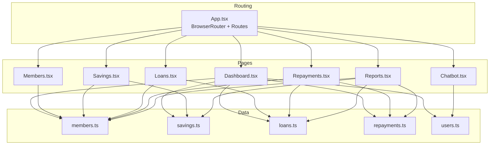

**Diagram sources**
- [App.tsx](file://src/App.tsx#L1-L48)
- [Dashboard.tsx](file://src/pages/Dashboard.tsx#L1-L190)
- [Members.tsx](file://src/pages/Members.tsx#L1-L217)
- [Savings.tsx](file://src/pages/Savings.tsx#L1-L246)
- [Loans.tsx](file://src/pages/Loans.tsx#L1-L254)
- [Repayments.tsx](file://src/pages/Repayments.tsx#L1-L141)
- [Reports.tsx](file://src/pages/Reports.tsx#L1-L213)
- [Chatbot.tsx](file://src/pages/Chatbot.tsx#L1-L182)
- [members.ts](file://src/data/members.ts#L1-L122)
- [savings.ts](file://src/data/savings.ts#L1-L73)
- [loans.ts](file://src/data/loans.ts#L1-L140)
- [repayments.ts](file://src/data/repayments.ts#L1-L71)
- [users.ts](file://src/data/users.ts#L1-L78)

**Section sources**
- [App.tsx](file://src/App.tsx#L1-L48)
- [package.json](file://package.json#L1-L90)

## Core Components
- Routing and Layout: The App component configures routes and wraps the app with providers for UI tooltips, notifications, and React Query. Each page composes a DashboardLayout and PageHeader to maintain consistent UX.
- Shared UI Primitives: Buttons, inputs, dialogs, tables, selects, badges, and cards are used across modules to present data and collect input.
- Mock Data Layer: Each module consumes typed data models and helper functions from src/data to compute summaries, filters, and derived metrics.

Key responsibilities:
- Dashboard: Aggregates group stats, highlights active loans and recent repayments, and provides quick actions.
- Members: Lists members, supports search, and provides add/edit/delete actions.
- Savings: Records savings, computes totals, and displays transaction history.
- Loans: Creates loans, calculates EMIs, tracks repayment progress, and shows statuses.
- Repayments: Tracks due dates, payments, balances, penalties, and statuses.
- Reports: Visualizes savings growth, loan distribution, repayment performance, and village-wise membership.
- Chatbot: Provides contextual assistance with predefined responses.

**Section sources**
- [App.tsx](file://src/App.tsx#L1-L48)
- [Dashboard.tsx](file://src/pages/Dashboard.tsx#L1-L190)
- [Members.tsx](file://src/pages/Members.tsx#L1-L217)
- [Savings.tsx](file://src/pages/Savings.tsx#L1-L246)
- [Loans.tsx](file://src/pages/Loans.tsx#L1-L254)
- [Repayments.tsx](file://src/pages/Repayments.tsx#L1-L141)
- [Reports.tsx](file://src/pages/Reports.tsx#L1-L213)
- [Chatbot.tsx](file://src/pages/Chatbot.tsx#L1-L182)
- [members.ts](file://src/data/members.ts#L1-L122)
- [savings.ts](file://src/data/savings.ts#L1-L73)
- [loans.ts](file://src/data/loans.ts#L1-L140)
- [repayments.ts](file://src/data/repayments.ts#L1-L71)
- [users.ts](file://src/data/users.ts#L1-L78)

## Architecture Overview
The system follows a front-end-centric architecture with:
- Client-side routing for navigation between modules.
- A shared UI component library for consistent presentation.
- A small data layer with typed models and helper functions for computations.
- Optional integration points for backend APIs (not present in the current codebase).

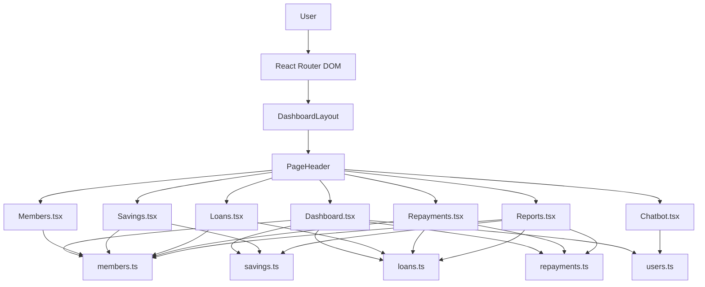

**Diagram sources**
- [App.tsx](file://src/App.tsx#L1-L48)
- [Dashboard.tsx](file://src/pages/Dashboard.tsx#L1-L190)
- [Members.tsx](file://src/pages/Members.tsx#L1-L217)
- [Savings.tsx](file://src/pages/Savings.tsx#L1-L246)
- [Loans.tsx](file://src/pages/Loans.tsx#L1-L254)
- [Repayments.tsx](file://src/pages/Repayments.tsx#L1-L141)
- [Reports.tsx](file://src/pages/Reports.tsx#L1-L213)
- [Chatbot.tsx](file://src/pages/Chatbot.tsx#L1-L182)
- [members.ts](file://src/data/members.ts#L1-L122)
- [savings.ts](file://src/data/savings.ts#L1-L73)
- [loans.ts](file://src/data/loans.ts#L1-L140)
- [repayments.ts](file://src/data/repayments.ts#L1-L71)
- [users.ts](file://src/data/users.ts#L1-L78)

## Detailed Component Analysis

### Dashboard Analytics
Business workflow:
- Aggregate group-level KPIs: total members, total savings, active loans, overdue/pending EMIs.
- Present quick actions to navigate to member, savings, loan, and repayment modules.
- Display recent repayments and highlight overdue items.

User roles and permissions:
- Accessible to Admin, SHG Leader, and Member roles as defined in the users model.

Data models involved:
- members, savings, loans, repayments, users.

UI components:
- StatCard, ProgressBar, StatusBadge, Table, Button, Link.

Integration patterns:
- Uses helpers from savings, loans, and repayments to compute totals and lists.

Common workflows:
- On dashboard load, fetch aggregated stats and render quick action buttons.

Validation and error handling:
- Defensive rendering for missing dates and balances; fallbacks for empty states.

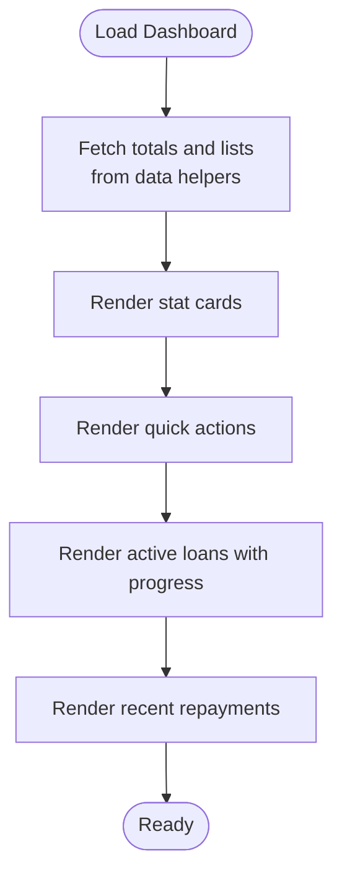

**Diagram sources**
- [Dashboard.tsx](file://src/pages/Dashboard.tsx#L30-L189)
- [savings.ts](file://src/data/savings.ts#L65-L73)
- [loans.ts](file://src/data/loans.ts#L125-L139)
- [repayments.ts](file://src/data/repayments.ts#L57-L71)
- [users.ts](file://src/data/users.ts#L64-L77)

**Section sources**
- [Dashboard.tsx](file://src/pages/Dashboard.tsx#L1-L190)
- [savings.ts](file://src/data/savings.ts#L1-L73)
- [loans.ts](file://src/data/loans.ts#L1-L140)
- [repayments.ts](file://src/data/repayments.ts#L1-L71)
- [users.ts](file://src/data/users.ts#L1-L78)

### Member Management
Business workflow:
- View all members with search/filter by name, village, or ID.
- Add a new member via a modal form.
- Edit and delete actions are present in the UI scaffolding.

User roles and permissions:
- Add/Edit/Delete actions are exposed in the UI; permission enforcement is not implemented in code.

Data models involved:
- Member interface and mock dataset.

UI components:
- Dialog, Table, Input, Label, Button.

Data entry process:
- Form collects name, age, village, phone, and monthly income.
- Submission triggers a mock add operation.

Report generation:
- Not applicable in current implementation.

Administrative functions:
- Search/filter, view profile link, edit, delete.

Module-specific business rules:
- No explicit validation logic is implemented in code; placeholders exist for future validation.

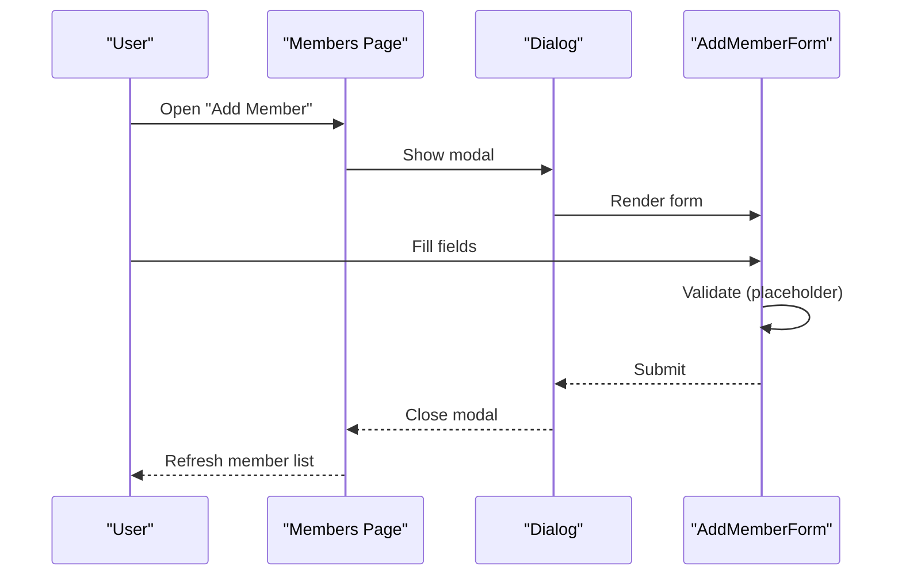

**Diagram sources**
- [Members.tsx](file://src/pages/Members.tsx#L28-L126)
- [Members.tsx](file://src/pages/Members.tsx#L128-L217)
- [members.ts](file://src/data/members.ts#L1-L122)

**Section sources**
- [Members.tsx](file://src/pages/Members.tsx#L1-L217)
- [members.ts](file://src/data/members.ts#L1-L122)

### Savings Operations
Business workflow:
- Record a new saving entry for a member with month, amount, and payment mode.
- Compute totals and averages for display.
- Show recent transactions and member-wise summaries.

User roles and permissions:
- Record saving action is exposed in UI; permission enforcement is not implemented in code.

Data models involved:
- Saving interface and mock dataset.

UI components:
- Dialog, Select, Input, Table, StatCard.

Data entry process:
- Select member, choose month, enter amount, choose payment mode.
- EMI-like calculation is not used here; amounts are recorded directly.

Report generation:
- Member-wise totals and recent transactions are shown.

Administrative functions:
- View totals, average per member, and recent transactions.

Module-specific business rules:
- Amount must be numeric; payment mode must be selected.
- No backend validation is implemented in code.

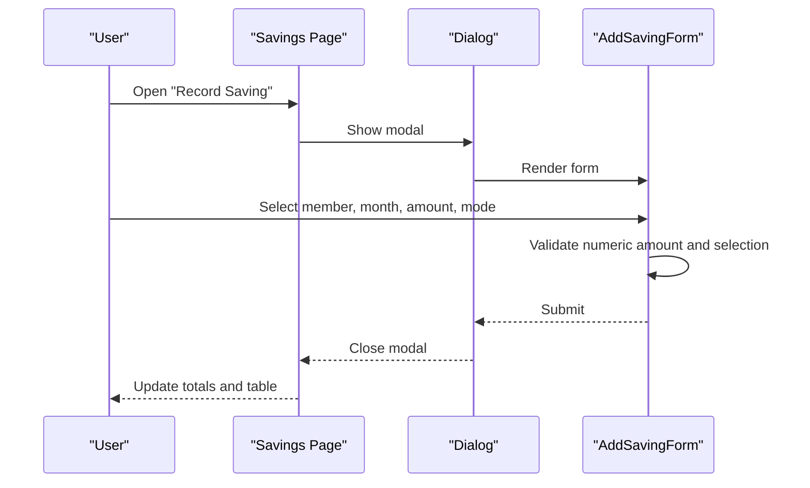

**Diagram sources**
- [Savings.tsx](file://src/pages/Savings.tsx#L34-L165)
- [Savings.tsx](file://src/pages/Savings.tsx#L167-L246)
- [savings.ts](file://src/data/savings.ts#L1-L73)

**Section sources**
- [Savings.tsx](file://src/pages/Savings.tsx#L1-L246)
- [savings.ts](file://src/data/savings.ts#L1-L73)

### Loan Processing
Business workflow:
- Create a new loan for a member with amount, interest rate, tenure, and purpose.
- Calculate EMI and show total payable.
- Track loan status and repayment progress.

User roles and permissions:
- Create loan action is exposed in UI; permission enforcement is not implemented in code.

Data models involved:
- Loan interface and mock dataset.

UI components:
- Dialog, Select, Input, StatCard, ProgressBar, StatusBadge.

Data entry process:
- Select member, enter amount, interest rate, choose tenure, enter purpose.
- EMI computed live; submission triggers a mock creation.

Report generation:
- Not applicable in current implementation.

Administrative functions:
- View loan cards with details and progress bars.

Module-specific business rules:
- Tenure must be selected from predefined options.
- Interest rate and amount must be numeric.

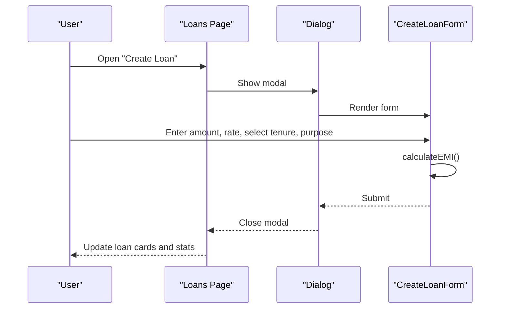

**Diagram sources**
- [Loans.tsx](file://src/pages/Loans.tsx#L28-L148)
- [Loans.tsx](file://src/pages/Loans.tsx#L150-L254)
- [loans.ts](file://src/data/loans.ts#L113-L139)

**Section sources**
- [Loans.tsx](file://src/pages/Loans.tsx#L1-L254)
- [loans.ts](file://src/data/loans.ts#L1-L140)

### Repayment Monitoring
Business workflow:
- Track due dates, payment dates, amounts paid, remaining balances, penalties, and statuses.
- Categorize repayments as Paid, Pending, or Overdue.

User roles and permissions:
- Record payment action is exposed in UI; permission enforcement is not implemented in code.

Data models involved:
- Repayment interface and mock dataset.

UI components:
- Table, StatusBadge, StatCard.

Data entry process:
- UI exposes a "Record Payment" button; form logic is not implemented in code.

Report generation:
- Not applicable in current implementation.

Administrative functions:
- View all repayments with color-coded rows for overdue items.

Module-specific business rules:
- Payment date may be null for pending items.
- Penalty is shown when applicable.

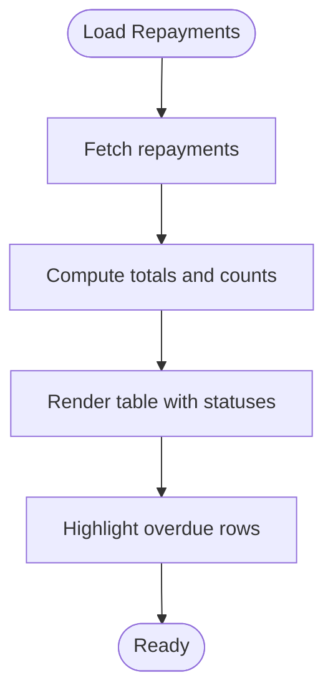

**Diagram sources**
- [Repayments.tsx](file://src/pages/Repayments.tsx#L20-L141)
- [repayments.ts](file://src/data/repayments.ts#L1-L71)

**Section sources**
- [Repayments.tsx](file://src/pages/Repayments.tsx#L1-L141)
- [repayments.ts](file://src/data/repayments.ts#L1-L71)

### Financial Reporting
Business workflow:
- Present summary statistics and visualizations for savings, loans, and repayments.
- Show savings growth trend, loan distribution by purpose, repayment performance, and village-wise membership.

User roles and permissions:
- Accessible to Admin, SHG Leader, and Member roles as defined in the users model.

Data models involved:
- members, savings, loans, repayments.

UI components:
- StatCard, SVG charts, bars, and radial indicators.

Report generation:
- Static mock data is used for charts; no export functionality is implemented.

Administrative functions:
- Not applicable in current implementation.

Module-specific business rules:
- Percentages and widths are computed from mock datasets.

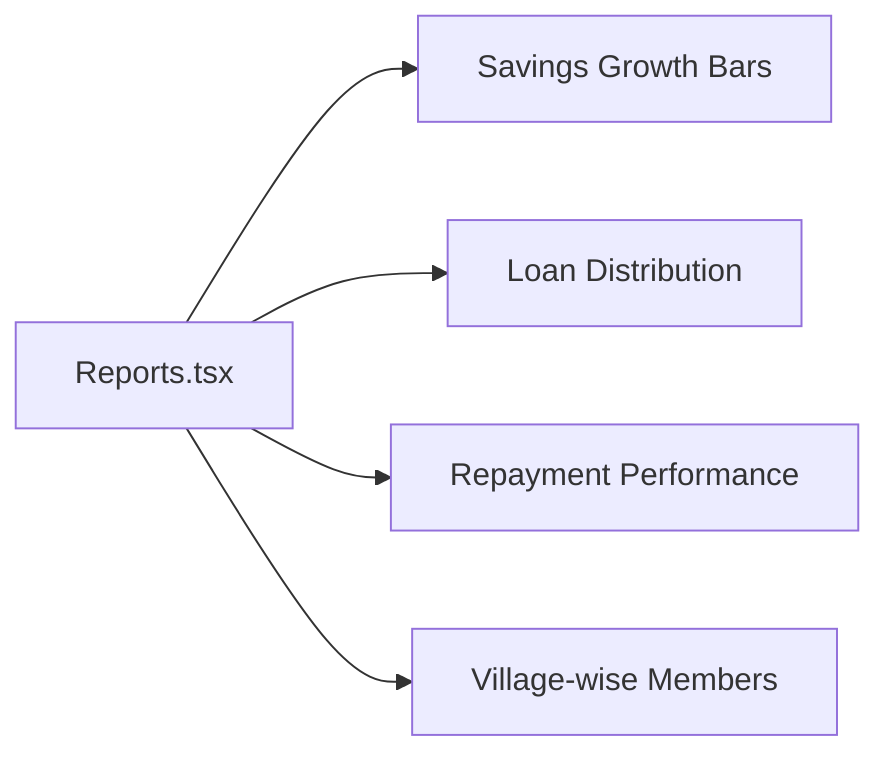

**Diagram sources**
- [Reports.tsx](file://src/pages/Reports.tsx#L25-L213)

**Section sources**
- [Reports.tsx](file://src/pages/Reports.tsx#L1-L213)
- [savings.ts](file://src/data/savings.ts#L1-L73)
- [loans.ts](file://src/data/loans.ts#L1-L140)
- [repayments.ts](file://src/data/repayments.ts#L1-L71)
- [members.ts](file://src/data/members.ts#L1-L122)

### AI Chatbot Support
Business workflow:
- Users send messages; the assistant responds with predefined answers based on keyword matching.
- Initial greeting message is shown; typing indicators appear during simulated response delay.

User roles and permissions:
- Accessible to Admin, SHG Leader, and Member roles as defined in the users model.

Data models involved:
- Message interface and mock responses.

UI components:
- Input, Button, chat bubbles, timestamps.

Data entry process:
- User types a query and presses Enter or clicks Send.
- Assistant responds after a short timeout.

Report generation:
- Not applicable in current implementation.

Administrative functions:
- Not applicable in current implementation.

Module-specific business rules:
- Responses are matched against keywords like loan, emi, savings, interest.
- Default response is used if no keyword matches.

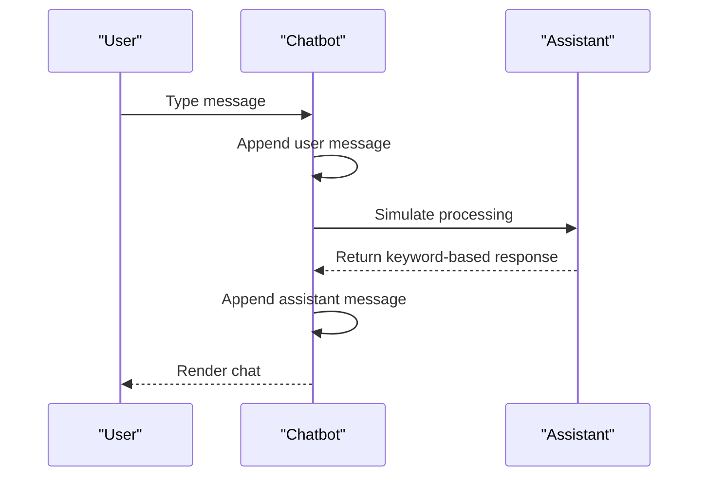

**Diagram sources**
- [Chatbot.tsx](file://src/pages/Chatbot.tsx#L33-L182)

**Section sources**
- [Chatbot.tsx](file://src/pages/Chatbot.tsx#L1-L182)
- [users.ts](file://src/data/users.ts#L1-L78)

## Dependency Analysis
External dependencies relevant to modules:
- Routing: react-router-dom
- UI primitives: shadcn/ui components
- State/cache: @tanstack/react-query
- Charts: recharts
- Icons: lucide-react
- Forms/validation: react-hook-form, zod
- Date utilities: date-fns

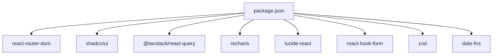

**Diagram sources**
- [package.json](file://package.json#L15-L64)

**Section sources**
- [package.json](file://package.json#L1-L90)

## Performance Considerations
- Rendering large tables: Use virtualization or pagination for extensive datasets.
- Computation-heavy UI updates: Memoize derived values and avoid unnecessary re-renders.
- Network readiness: Introduce React Query cache and optimistic updates when integrating backend APIs.
- Chart rendering: Defer heavy chart computations to idle callbacks or Web Workers if needed.

## Troubleshooting Guide
Common issues and resolutions:
- Empty or stale data: Ensure data helpers are imported and invoked on render; verify mock datasets are populated.
- Form submission failures: Implement validation with react-hook-form and zod; surface errors via toast notifications.
- Navigation problems: Confirm route paths match App routing configuration.
- Chart anomalies: Validate mock data lengths and percentages; ensure safe division by zero checks.

**Section sources**
- [App.tsx](file://src/App.tsx#L26-L41)
- [Dashboard.tsx](file://src/pages/Dashboard.tsx#L30-L189)
- [Members.tsx](file://src/pages/Members.tsx#L28-L126)
- [Savings.tsx](file://src/pages/Savings.tsx#L34-L165)
- [Loans.tsx](file://src/pages/Loans.tsx#L28-L148)
- [Repayments.tsx](file://src/pages/Repayments.tsx#L20-L141)
- [Reports.tsx](file://src/pages/Reports.tsx#L25-L213)
- [Chatbot.tsx](file://src/pages/Chatbot.tsx#L33-L182)

## Conclusion
The SHG Management System provides a modular front-end foundation for managing SHG operations. Each module encapsulates a distinct workflow while sharing common UI components and data models. The current implementation uses mock data and static helpers, enabling rapid iteration and UI validation. Future enhancements should focus on robust validation, backend integration, role-based permissions, and comprehensive reporting/export capabilities.

## Appendices
- User roles and permissions: Defined in the users model; enforced in UI scaffolding but not yet implemented in code.
- Data model relationships:
  - Member has many Savings and is linked to User via member_id.
  - Member has many Loans; each Loan has many Repayments.

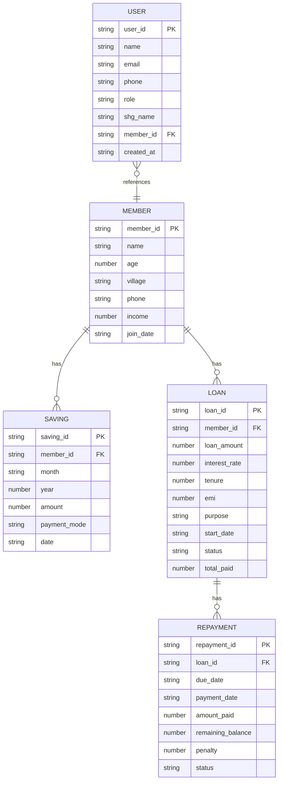

**Diagram sources**
- [members.ts](file://src/data/members.ts#L1-L122)
- [savings.ts](file://src/data/savings.ts#L1-L73)
- [loans.ts](file://src/data/loans.ts#L1-L140)
- [repayments.ts](file://src/data/repayments.ts#L1-L71)
- [users.ts](file://src/data/users.ts#L1-L78)