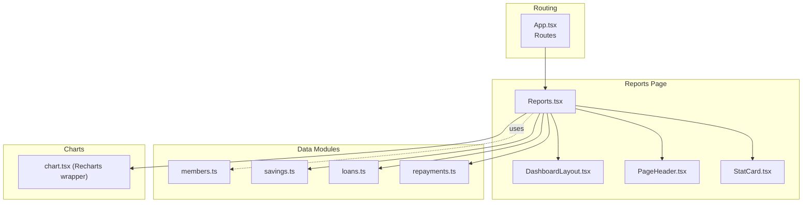
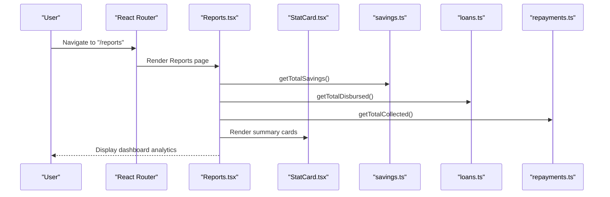
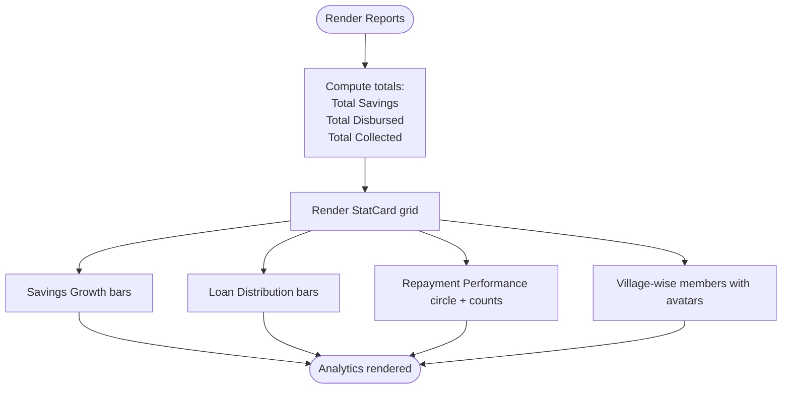
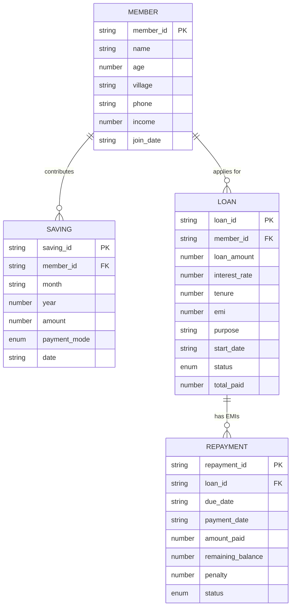
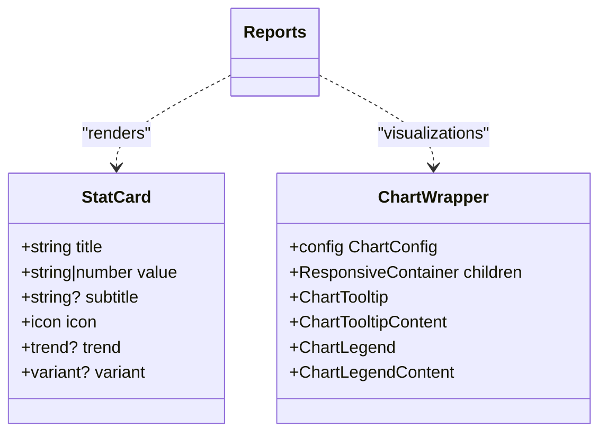
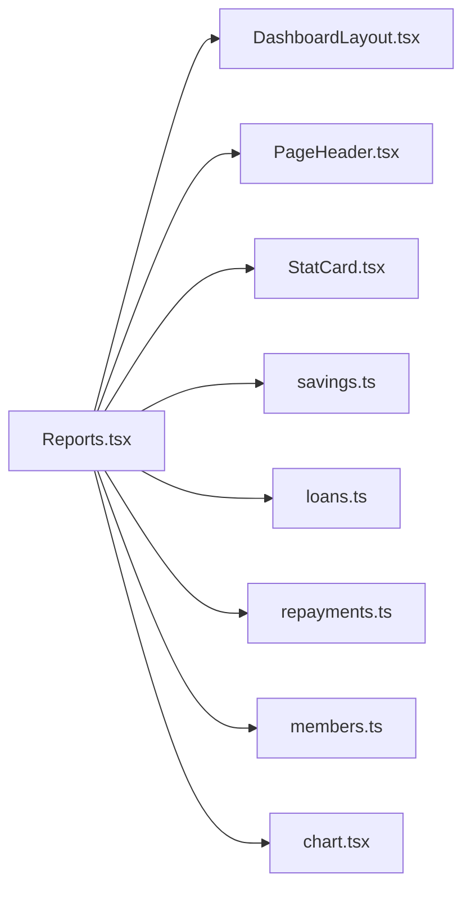

# Financial Reporting

<cite>
**Referenced Files in This Document**
- [Reports.tsx](file://src/pages/Reports.tsx)
- [StatCard.tsx](file://src/components/StatCard.tsx)
- [DashboardLayout.tsx](file://src/components/DashboardLayout.tsx)
- [PageHeader.tsx](file://src/components/PageHeader.tsx)
- [members.ts](file://src/data/members.ts)
- [savings.ts](file://src/data/savings.ts)
- [loans.ts](file://src/data/loans.ts)
- [repayments.ts](file://src/data/repayments.ts)
- [chart.tsx](file://src/components/ui/chart.tsx)
- [App.tsx](file://src/App.tsx)
</cite>

## Table of Contents
1. [Introduction](#introduction)
2. [Project Structure](#project-structure)
3. [Core Components](#core-components)
4. [Architecture Overview](#architecture-overview)
5. [Detailed Component Analysis](#detailed-component-analysis)
6. [Dependency Analysis](#dependency-analysis)
7. [Performance Considerations](#performance-considerations)
8. [Troubleshooting Guide](#troubleshooting-guide)
9. [Conclusion](#conclusion)

## Introduction
This document describes the Financial Reporting module for the Self-Help Group (SHG) management application. It covers the Reports page interface, group analytics, individual member insights, and dashboard visualizations. It also documents the reporting data sources (member contributions, loan disbursements, repayment collections, and financial summaries), report generation capabilities, data visualization options, and export formats. Finally, it outlines group financial health indicators, member contribution analysis, loan portfolio reports, cash flow statements, report scheduling, automated reporting, data aggregation techniques, and compliance reporting requirements for SHG financial transparency.

## Project Structure
The Financial Reporting module centers around the Reports page and integrates with shared UI components and data modules. The routing exposes the Reports page under the "/reports" path.

**Diagram sources**
- [App.tsx](file://src/App.tsx#L32-L47)
- [Reports.tsx](file://src/pages/Reports.tsx#L1-L213)
- [DashboardLayout.tsx](file://src/components/DashboardLayout.tsx#L1-L20)
- [PageHeader.tsx](file://src/components/PageHeader.tsx#L1-L24)
- [StatCard.tsx](file://src/components/StatCard.tsx#L1-L73)
- [members.ts](file://src/data/members.ts#L1-L122)
- [savings.ts](file://src/data/savings.ts#L1-L73)
- [loans.ts](file://src/data/loans.ts#L1-L140)
- [repayments.ts](file://src/data/repayments.ts#L1-L71)
- [chart.tsx](file://src/components/ui/chart.tsx#L1-L304)

**Section sources**
- [App.tsx](file://src/App.tsx#L32-L47)
- [Reports.tsx](file://src/pages/Reports.tsx#L1-L213)

## Core Components
- Reports page: Renders summary statistics, charts, and grouped analytics for SHG finances.
- StatCard: Reusable metric cards for totals and KPIs.
- DashboardLayout and PageHeader: Consistent layout and page header for the reporting area.
- Data modules: Provide aggregated and computed metrics for savings, loans, and repayments.

Key responsibilities:
- Aggregate group-level totals (total members, total savings, loans disbursed, repayments collected).
- Visualize trends and distributions via bar charts, pie-like radial charts, and distribution bars.
- Support drill-down to member-specific views (via links to member profiles).
- Prepare foundation for export and scheduled reporting.

**Section sources**
- [Reports.tsx](file://src/pages/Reports.tsx#L25-L63)
- [StatCard.tsx](file://src/components/StatCard.tsx#L32-L72)
- [DashboardLayout.tsx](file://src/components/DashboardLayout.tsx#L9-L19)
- [PageHeader.tsx](file://src/components/PageHeader.tsx#L11-L23)

## Architecture Overview
The Reports page composes reusable UI components and consumes data modules to compute and render financial insights. It leverages helper functions to derive totals and ratios from raw datasets.

**Diagram sources**
- [App.tsx](file://src/App.tsx#L32-L47)
- [Reports.tsx](file://src/pages/Reports.tsx#L25-L63)
- [StatCard.tsx](file://src/components/StatCard.tsx#L32-L72)
- [savings.ts](file://src/data/savings.ts#L64-L72)
- [loans.ts](file://src/data/loans.ts#L130-L139)
- [repayments.ts](file://src/data/repayments.ts#L67-L70)

## Detailed Component Analysis

### Reports Page
The Reports page orchestrates:
- Summary statistics cards for total members, total savings, loans disbursed, and repayments collected.
- Savings growth visualization using horizontal bars.
- Loan distribution by purpose using proportional bars.
- Repayment performance using a circular progress visualization and counts for paid/pending/overdue.
- Village-wise member composition with avatars.

**Diagram sources**
- [Reports.tsx](file://src/pages/Reports.tsx#L25-L212)

**Section sources**
- [Reports.tsx](file://src/pages/Reports.tsx#L25-L212)

### Data Sources and Aggregation
The module relies on four data modules to compute financial insights:
- members.ts: Provides member metadata for grouping and filtering.
- savings.ts: Supplies monthly contribution records and helper functions to compute totals and per-member totals.
- loans.ts: Supplies loan records, EMI calculations, and helper functions for active loans and total disbursed.
- repayments.ts: Supplies repayment schedules and statuses, with helpers for overdue and pending repayments and total collected.

**Diagram sources**
- [members.ts](file://src/data/members.ts#L1-L122)
- [savings.ts](file://src/data/savings.ts#L1-L73)
- [loans.ts](file://src/data/loans.ts#L1-L140)
- [repayments.ts](file://src/data/repayments.ts#L1-L71)

**Section sources**
- [members.ts](file://src/data/members.ts#L1-L122)
- [savings.ts](file://src/data/savings.ts#L1-L73)
- [loans.ts](file://src/data/loans.ts#L1-L140)
- [repayments.ts](file://src/data/repayments.ts#L1-L71)

### Visualization Components
- StatCard: Reusable card component for displaying metrics with icons and variants.
- chart.tsx: Wrapper around Recharts to standardize chart theming and tooltips.

**Diagram sources**
- [StatCard.tsx](file://src/components/StatCard.tsx#L4-L14)
- [chart.tsx](file://src/components/ui/chart.tsx#L32-L58)
- [Reports.tsx](file://src/pages/Reports.tsx#L25-L212)

**Section sources**
- [StatCard.tsx](file://src/components/StatCard.tsx#L32-L72)
- [chart.tsx](file://src/components/ui/chart.tsx#L1-L304)
- [Reports.tsx](file://src/pages/Reports.tsx#L66-L209)

### Report Generation Capabilities
Current capabilities:
- Group-level financial summaries (totals and counts).
- Savings trend visualization by month.
- Loan distribution by purpose.
- Repayment performance visualization and counts.
- Village-wise member composition.

Planned enhancements (future scope):
- Export to CSV/PDF for audit and compliance.
- Custom date-range filters and drill-down by member/village.
- Automated report scheduling and delivery.
- Cash flow statement generation from savings and repayment streams.
- Compliance reporting templates aligned with SHG transparency requirements.

[No sources needed since this section provides future scope and does not analyze specific files]

## Dependency Analysis
The Reports page depends on:
- Layout and header components for consistent presentation.
- Data modules for computed metrics and aggregations.
- Recharts wrapper for standardized chart rendering.

**Diagram sources**
- [Reports.tsx](file://src/pages/Reports.tsx#L1-L8)
- [DashboardLayout.tsx](file://src/components/DashboardLayout.tsx#L1-L20)
- [PageHeader.tsx](file://src/components/PageHeader.tsx#L1-L24)
- [StatCard.tsx](file://src/components/StatCard.tsx#L1-L73)
- [savings.ts](file://src/data/savings.ts#L1-L73)
- [loans.ts](file://src/data/loans.ts#L1-L140)
- [repayments.ts](file://src/data/repayments.ts#L1-L71)
- [members.ts](file://src/data/members.ts#L1-L122)
- [chart.tsx](file://src/components/ui/chart.tsx#L1-L304)

**Section sources**
- [Reports.tsx](file://src/pages/Reports.tsx#L1-L8)

## Performance Considerations
- Rendering efficiency: The Reports page currently uses inline mock data for charts. For larger datasets, consider virtualizing lists and deferring heavy computations to background threads or memoized selectors.
- Data locality: Keep aggregated metrics close to the page to minimize repeated recomputation across renders.
- Chart performance: Prefer Recharts with ResponsiveContainer and minimal re-renders; avoid unnecessary prop churn.
- Pagination and filtering: Introduce pagination and filters for member lists and transaction tables to reduce DOM size.

[No sources needed since this section provides general guidance]

## Troubleshooting Guide
Common issues and resolutions:
- Missing or zero totals: Verify that helper functions in data modules are invoked correctly and that datasets are populated.
- Chart anomalies: Ensure chart data arrays are non-empty and formatted consistently; confirm Recharts wrapper props are passed correctly.
- Layout inconsistencies: Confirm DashboardLayout and PageHeader are included and that responsive grid classes are applied as intended.
- Export functionality: Not implemented yet; implement client-side export libraries and integrate with the Reports page controls.

**Section sources**
- [Reports.tsx](file://src/pages/Reports.tsx#L25-L212)
- [chart.tsx](file://src/components/ui/chart.tsx#L32-L58)

## Conclusion
The Financial Reporting module provides a solid foundation for SHG financial oversight with group-level summaries, visual analytics, and member-centric insights. By leveraging helper functions in data modules and reusable UI components, the module supports quick comprehension of savings trends, loan distribution, repayment performance, and community composition. Future enhancements should focus on export capabilities, custom report creation, automated scheduling, cash flow statements, and compliance reporting to meet SHG transparency standards.