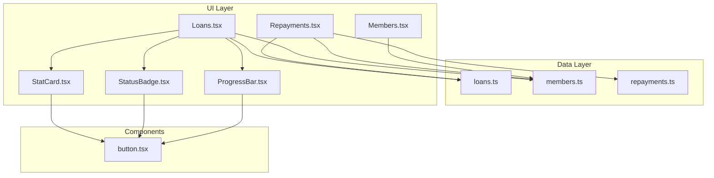
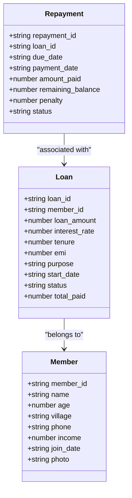
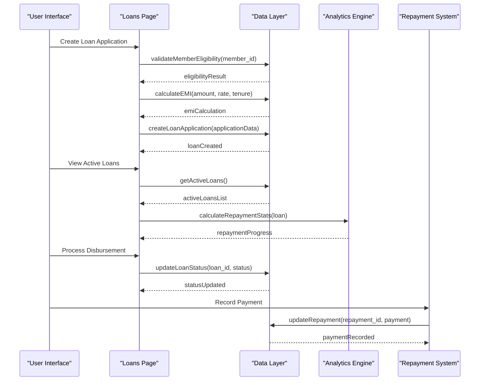
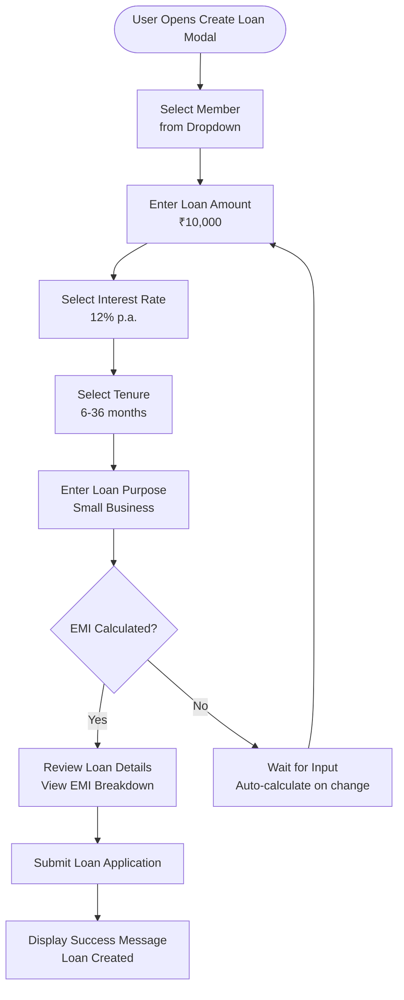
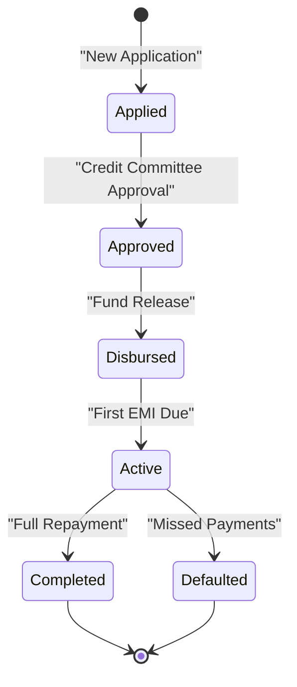
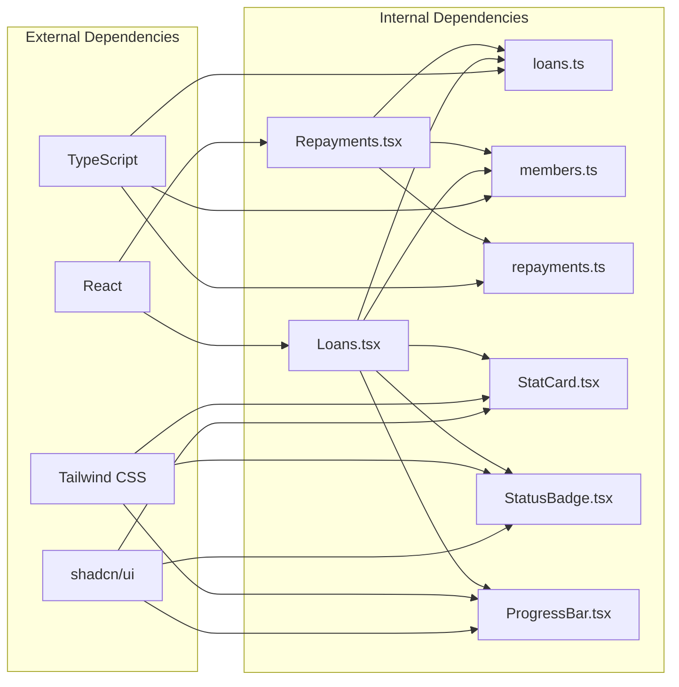

# Loan Processing

<cite>
**Referenced Files in This Document**
- [Loans.tsx](file://src/pages/Loans.tsx)
- [loans.ts](file://src/data/loans.ts)
- [members.ts](file://src/data/members.ts)
- [repayments.ts](file://src/data/repayments.ts)
- [StatCard.tsx](file://src/components/StatCard.tsx)
- [StatusBadge.tsx](file://src/components/StatusBadge.tsx)
- [ProgressBar.tsx](file://src/components/ProgressBar.tsx)
- [Repayments.tsx](file://src/pages/Repayments.tsx)
- [Members.tsx](file://src/pages/Members.tsx)
- [button.tsx](file://src/components/ui/button.tsx)
</cite>

## Table of Contents
1. [Introduction](#introduction)
2. [Project Structure](#project-structure)
3. [Core Components](#core-components)
4. [Architecture Overview](#architecture-overview)
5. [Detailed Component Analysis](#detailed-component-analysis)
6. [Dependency Analysis](#dependency-analysis)
7. [Performance Considerations](#performance-considerations)
8. [Troubleshooting Guide](#troubleshooting-guide)
9. [Conclusion](#conclusion)

## Introduction
This document provides comprehensive documentation for the Loan Processing module within the SHG Management system. The module manages loan applications, disbursement, EMI calculations, and loan tracking. It covers the Loans page interface for creating new loan applications, managing existing loans, and processing loan disbursements. The documentation explains the loan data model, loan lifecycle from application to full repayment, EMI calculation algorithms, loan approval workflows, payment scheduling, loan analytics, outstanding balances, interest calculations, and integration with repayment tracking. It also addresses loan policy compliance, eligibility criteria, risk assessment considerations, and loan modification procedures.

## Project Structure
The Loan Processing module is organized around three primary data domains: loans, members, and repayments. The user interface is built using React components with shadcn/ui design system and Tailwind CSS for styling. The module consists of:

- **Data Layer**: TypeScript interfaces and arrays representing loan records, member profiles, and repayment schedules
- **UI Layer**: React components for displaying loan cards, statistics, forms, and interactive elements
- **Business Logic**: Helper functions for EMI calculations, loan filtering, and repayment analytics

**Diagram sources**
- [Loans.tsx](file://src/pages/Loans.tsx#L1-L254)
- [loans.ts](file://src/data/loans.ts#L1-L140)
- [members.ts](file://src/data/members.ts#L1-L122)
- [repayments.ts](file://src/data/repayments.ts#L1-L71)

**Section sources**
- [Loans.tsx](file://src/pages/Loans.tsx#L1-L254)
- [loans.ts](file://src/data/loans.ts#L1-L140)
- [members.ts](file://src/data/members.ts#L1-L122)
- [repayments.ts](file://src/data/repayments.ts#L1-L71)

## Core Components
The Loan Processing module comprises several core components that work together to provide comprehensive loan management functionality:

### Loan Data Model
The loan data model defines the structure for loan records with comprehensive fields for tracking loan lifecycle:

**Diagram sources**
- [loans.ts](file://src/data/loans.ts#L1-L12)
- [members.ts](file://src/data/members.ts#L1-L10)
- [repayments.ts](file://src/data/repayments.ts#L1-L10)

### EMI Calculation Engine
The EMI calculation engine implements the standard formula for monthly installment calculations:

**Section sources**
- [loans.ts](file://src/data/loans.ts#L113-L118)

### Loan Tracking Interface
The Loans page provides a comprehensive interface for loan management with real-time statistics and interactive elements:

**Section sources**
- [Loans.tsx](file://src/pages/Loans.tsx#L28-L148)

## Architecture Overview
The Loan Processing module follows a clean architecture pattern with clear separation between data, business logic, and presentation layers:

**Diagram sources**
- [Loans.tsx](file://src/pages/Loans.tsx#L150-L253)
- [loans.ts](file://src/data/loans.ts#L113-L139)
- [repayments.ts](file://src/data/repayments.ts#L52-L70)

## Detailed Component Analysis

### Loans Page Interface
The Loans page serves as the central hub for loan management operations, providing comprehensive functionality for loan creation, tracking, and analytics.

#### Loan Creation Form
The loan creation form implements a guided workflow for generating new loan applications:

**Diagram sources**
- [Loans.tsx](file://src/pages/Loans.tsx#L150-L253)

#### Loan Tracking Cards
Each loan is displayed as an interactive card showing comprehensive details and repayment progress:

**Section sources**
- [Loans.tsx](file://src/pages/Loans.tsx#L84-L145)

### Loan Data Model and Lifecycle
The loan data model encompasses the complete lifecycle of a loan from application to full repayment:

#### Loan Status Management
The system tracks four distinct loan states with clear transitions:

#### EMI Calculation Algorithm
The EMI calculation follows the standard mathematical formula for compound interest:

**Section sources**
- [loans.ts](file://src/data/loans.ts#L113-L118)

### Repayment Tracking System
The repayment tracking system provides comprehensive oversight of loan payment schedules and collections:

#### Repayment Schedule Generation
The system generates structured repayment schedules with automatic due date calculations:

**Section sources**
- [repayments.ts](file://src/data/repayments.ts#L12-L50)

#### Overdue Management
The system identifies and categorizes overdue repayments for collection management:

**Section sources**
- [repayments.ts](file://src/data/repayments.ts#L57-L65)

### Member Integration
The loan system integrates seamlessly with the member management system:

#### Eligibility Validation
Members serve as the foundation for loan eligibility determination:

**Section sources**
- [members.ts](file://src/data/members.ts#L12-L121)

### Analytics and Reporting
The system provides comprehensive analytics for loan portfolio management:

#### Portfolio Statistics
Real-time statistics provide insights into loan portfolio performance:

**Section sources**
- [Loans.tsx](file://src/pages/Loans.tsx#L54-L81)

## Dependency Analysis
The Loan Processing module exhibits well-structured dependencies with clear separation of concerns:

**Diagram sources**
- [Loans.tsx](file://src/pages/Loans.tsx#L1-L254)
- [loans.ts](file://src/data/loans.ts#L1-L140)
- [members.ts](file://src/data/members.ts#L1-L122)
- [repayments.ts](file://src/data/repayments.ts#L1-L71)

## Performance Considerations
The Loan Processing module implements several performance optimizations:

### Data Structure Optimizations
- **Array-based Storage**: Uses native JavaScript arrays for efficient iteration and filtering
- **Object Lookup**: Implements O(n) search operations for member and loan lookups
- **Memoization Opportunities**: EMI calculations could benefit from caching for repeated calculations

### UI Performance Features
- **Conditional Rendering**: Only renders EMI calculations when sufficient data is available
- **Efficient Filtering**: Uses optimized filter operations for loan status queries
- **Component Reusability**: Shared components minimize redundant rendering

### Scalability Considerations
- **Pagination Strategy**: Current implementation loads all data; consider pagination for large datasets
- **Lazy Loading**: Implement lazy loading for loan details and repayment histories
- **Caching Mechanisms**: Introduce client-side caching for frequently accessed loan data

## Troubleshooting Guide

### Common Issues and Solutions

#### EMI Calculation Problems
**Issue**: Incorrect EMI calculations or NaN values
**Solution**: Verify input validation for amount, rate, and tenure fields

#### Loan Status Updates
**Issue**: Loan status not updating correctly
**Solution**: Check database synchronization and ensure proper state management

#### Repayment Tracking Errors
**Issue**: Repayment dates not aligning with EMI schedule
**Solution**: Validate date calculations and timezone handling

#### Performance Degradation
**Issue**: Slow loading times with large datasets
**Solution**: Implement pagination, virtual scrolling, and data caching

### Debugging Strategies
- **Console Logging**: Implement strategic logging for loan calculations and status updates
- **Error Boundaries**: Add error boundaries to handle unexpected errors gracefully
- **Validation Layers**: Implement comprehensive input validation at multiple levels

**Section sources**
- [Loans.tsx](file://src/pages/Loans.tsx#L150-L253)
- [loans.ts](file://src/data/loans.ts#L113-L139)

## Conclusion
The Loan Processing module provides a comprehensive solution for managing microfinance operations within Self-Help Groups (SHGs). The module successfully integrates loan application, disbursement, EMI calculation, and repayment tracking into a cohesive system. Key strengths include:

- **Complete Data Model**: Comprehensive loan lifecycle tracking with detailed status management
- **User-Friendly Interface**: Intuitive forms and dashboards for loan management
- **Robust Analytics**: Real-time statistics and progress tracking capabilities
- **Integration Design**: Seamless connection between loans, members, and repayments

The module demonstrates strong architectural principles with clear separation of concerns, reusable components, and scalable data structures. Future enhancements could include advanced risk assessment algorithms, automated eligibility checking, and expanded reporting capabilities.