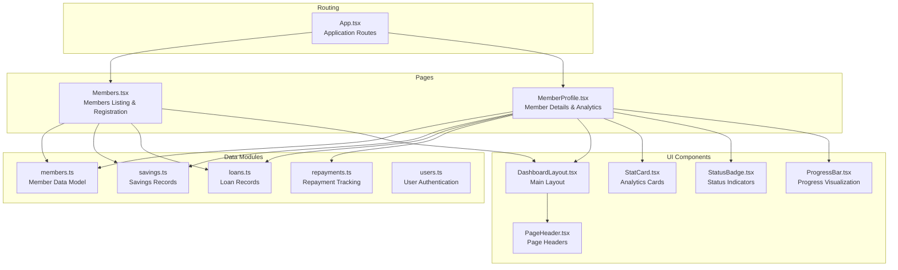
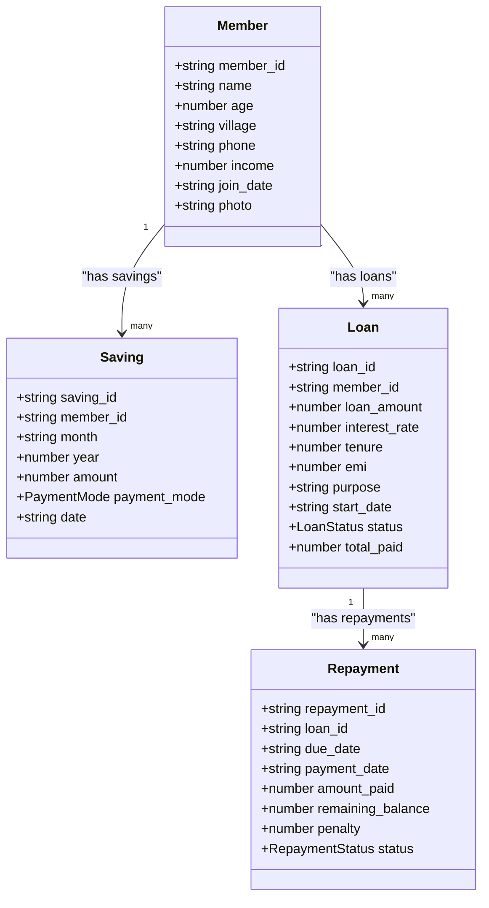
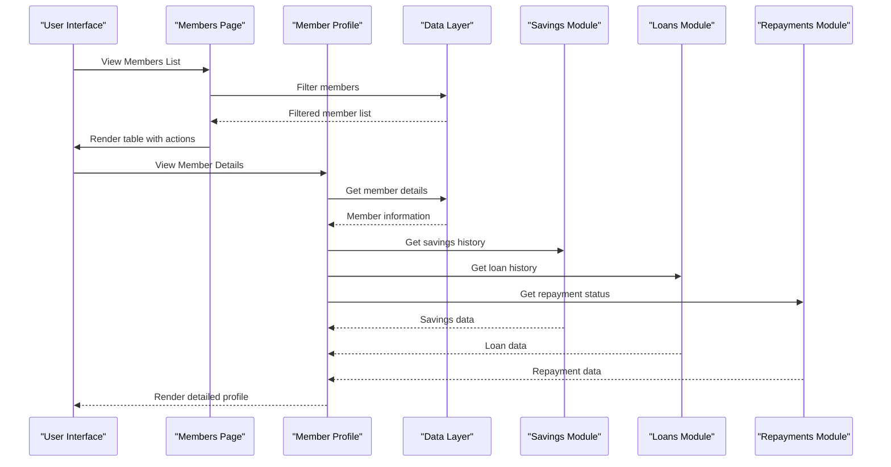
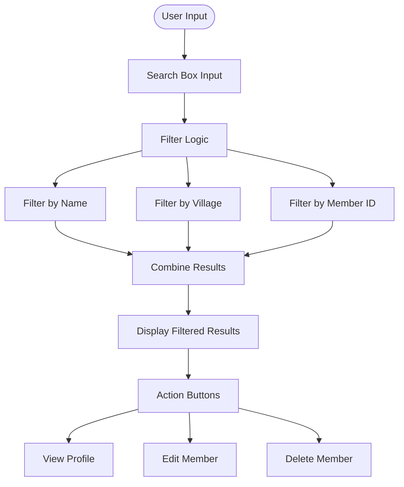
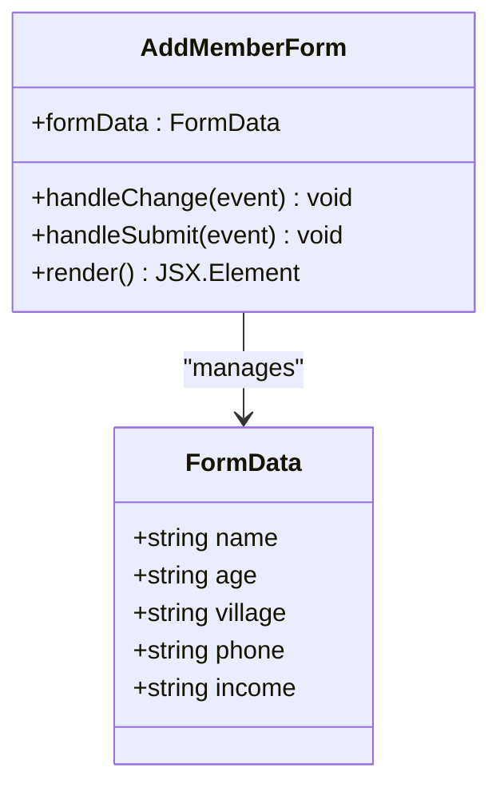
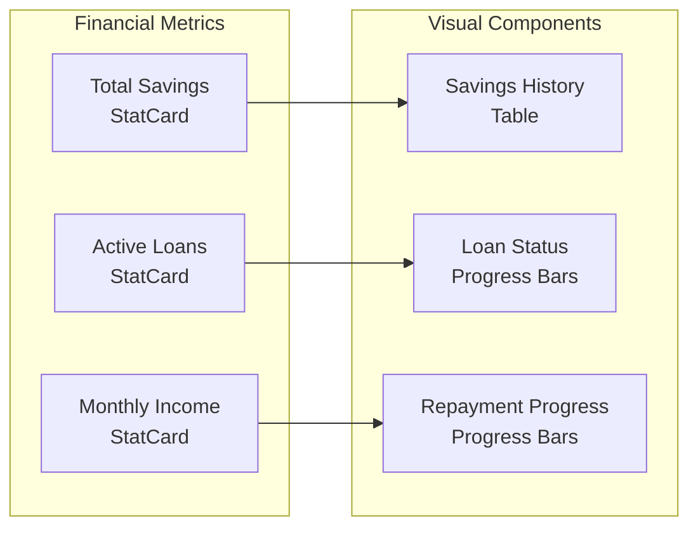
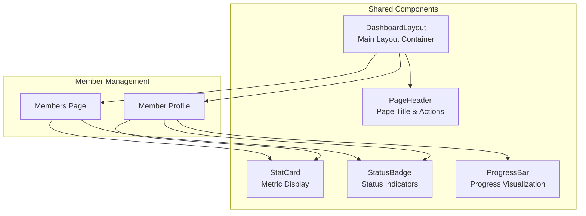
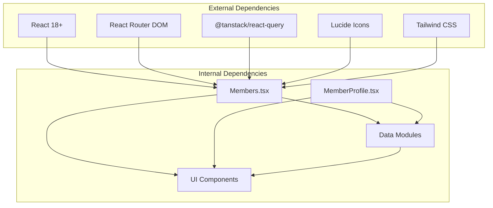

# Member Management

<cite>
**Referenced Files in This Document**
- [Members.tsx](file://src/pages/Members.tsx)
- [MemberProfile.tsx](file://src/pages/MemberProfile.tsx)
- [members.ts](file://src/data/members.ts)
- [savings.ts](file://src/data/savings.ts)
- [loans.ts](file://src/data/loans.ts)
- [repayments.ts](file://src/data/repayments.ts)
- [users.ts](file://src/data/users.ts)
- [DashboardLayout.tsx](file://src/components/DashboardLayout.tsx)
- [PageHeader.tsx](file://src/components/PageHeader.tsx)
- [StatCard.tsx](file://src/components/StatCard.tsx)
- [StatusBadge.tsx](file://src/components/StatusBadge.tsx)
- [ProgressBar.tsx](file://src/components/ProgressBar.tsx)
- [App.tsx](file://src/App.tsx)
</cite>

## Table of Contents
1. [Introduction](#introduction)
2. [Project Structure](#project-structure)
3. [Core Components](#core-components)
4. [Architecture Overview](#architecture-overview)
5. [Detailed Component Analysis](#detailed-component-analysis)
6. [Dependency Analysis](#dependency-analysis)
7. [Performance Considerations](#performance-considerations)
8. [Troubleshooting Guide](#troubleshooting-guide)
9. [Conclusion](#conclusion)

## Introduction
This document provides comprehensive documentation for the Member Management system within the SHG (Self-Help Group) management application. The system enables administrators and SHG leaders to register new members, manage existing member profiles, view comprehensive member listings, and track member financial activities including savings and loans. The documentation covers the Members page interface for viewing all group members, adding new members, and managing member records; the MemberProfile page for detailed member information, personal details, financial history, and member-specific analytics; the member data model including personal information, contact details, membership status, and financial records; member CRUD operations, search and filtering capabilities, member status management; integration with savings and loans modules; validation rules, data privacy considerations; and member lifecycle management within the SHG context.

## Project Structure
The Member Management system is organized around React pages, TypeScript data models, and reusable UI components. The structure follows a clear separation of concerns with dedicated pages for member management, data modules for business logic, and shared components for consistent UI presentation.

**Diagram sources**
- [Members.tsx](file://src/pages/Members.tsx#L1-L217)
- [MemberProfile.tsx](file://src/pages/MemberProfile.tsx#L1-L177)
- [members.ts](file://src/data/members.ts#L1-L122)
- [savings.ts](file://src/data/savings.ts#L1-L73)
- [loans.ts](file://src/data/loans.ts#L1-L140)
- [repayments.ts](file://src/data/repayments.ts#L1-L71)
- [users.ts](file://src/data/users.ts#L1-L78)
- [DashboardLayout.tsx](file://src/components/DashboardLayout.tsx#L1-L20)
- [PageHeader.tsx](file://src/components/PageHeader.tsx#L1-L24)
- [StatCard.tsx](file://src/components/StatCard.tsx#L1-L73)
- [StatusBadge.tsx](file://src/components/StatusBadge.tsx#L1-L37)
- [ProgressBar.tsx](file://src/components/ProgressBar.tsx#L1-L50)
- [App.tsx](file://src/App.tsx#L1-L48)

**Section sources**
- [Members.tsx](file://src/pages/Members.tsx#L1-L217)
- [MemberProfile.tsx](file://src/pages/MemberProfile.tsx#L1-L177)
- [App.tsx](file://src/App.tsx#L1-L48)

## Core Components
The Member Management system consists of several core components that work together to provide comprehensive member management functionality:

### Member Data Model
The system defines a comprehensive Member interface with essential personal and financial information:

**Diagram sources**
- [members.ts](file://src/data/members.ts#L1-L122)
- [savings.ts](file://src/data/savings.ts#L1-L73)
- [loans.ts](file://src/data/loans.ts#L1-L140)
- [repayments.ts](file://src/data/repayments.ts#L1-L71)

### Member Management Pages
The system provides two primary pages for member management:

1. **Members Page**: Comprehensive listing with search, filtering, and member registration
2. **MemberProfile Page**: Detailed member information with financial analytics

**Section sources**
- [members.ts](file://src/data/members.ts#L1-L122)
- [savings.ts](file://src/data/savings.ts#L1-L73)
- [loans.ts](file://src/data/loans.ts#L1-L140)
- [repayments.ts](file://src/data/repayments.ts#L1-L71)

## Architecture Overview
The Member Management system follows a modular architecture with clear separation between presentation, data, and business logic layers:

**Diagram sources**
- [Members.tsx](file://src/pages/Members.tsx#L28-L126)
- [MemberProfile.tsx](file://src/pages/MemberProfile.tsx#L22-L176)
- [savings.ts](file://src/data/savings.ts#L59-L72)
- [loans.ts](file://src/data/loans.ts#L120-L140)
- [repayments.ts](file://src/data/repayments.ts#L52-L70)

The architecture ensures loose coupling between components while maintaining clear data flow and consistent user experience across the application.

## Detailed Component Analysis

### Members Page Implementation
The Members page serves as the central hub for member management operations, providing comprehensive functionality for viewing, searching, and managing SHG members.

#### Search and Filtering Capabilities
The system implements intelligent search functionality that allows users to filter members by multiple criteria:

**Diagram sources**
- [Members.tsx](file://src/pages/Members.tsx#L29-L37)

#### Member Registration Form
The Add Member form provides a structured approach to member onboarding with validation and data collection:

**Diagram sources**
- [Members.tsx](file://src/pages/Members.tsx#L128-L216)

#### Member Listing Table
The table displays comprehensive member information with interactive elements for member management operations.

**Section sources**
- [Members.tsx](file://src/pages/Members.tsx#L1-L217)

### MemberProfile Page Implementation
The MemberProfile page provides detailed analytics and comprehensive information about individual members, integrating data from multiple modules.

#### Financial Analytics Dashboard
The profile page presents key financial metrics through specialized components:

**Diagram sources**
- [MemberProfile.tsx](file://src/pages/MemberProfile.tsx#L86-L173)
- [StatCard.tsx](file://src/components/StatCard.tsx#L1-L73)
- [ProgressBar.tsx](file://src/components/ProgressBar.tsx#L1-L50)

#### Loan History and Repayment Tracking
The system provides detailed loan information with repayment progress visualization:

**Section sources**
- [MemberProfile.tsx](file://src/pages/MemberProfile.tsx#L1-L177)

### Data Model and Validation
The member data model ensures comprehensive coverage of essential member information with appropriate validation rules:

#### Member Information Schema
The Member interface defines the core attributes required for SHG member management:

| Field | Type | Description | Validation |
|-------|------|-------------|------------|
| member_id | string | Unique identifier | Required, unique |
| name | string | Full name | Required, 2-50 chars |
| age | number | Age in years | Required, 18-120 |
| village | string | Residence location | Required, 2-30 chars |
| phone | string | Contact number | Required, 10 digits |
| income | number | Monthly income | Required, >0 |
| join_date | string | Registration date | Required, valid date |

#### Financial Data Integration
The system integrates multiple financial data sources to provide comprehensive member analytics:

**Section sources**
- [members.ts](file://src/data/members.ts#L1-L122)
- [savings.ts](file://src/data/savings.ts#L1-L73)
- [loans.ts](file://src/data/loans.ts#L1-L140)
- [repayments.ts](file://src/data/repayments.ts#L1-L71)

### Component Integration and Dependencies
The Member Management system relies on several shared components for consistent UI presentation and functionality:

**Diagram sources**
- [DashboardLayout.tsx](file://src/components/DashboardLayout.tsx#L1-L20)
- [PageHeader.tsx](file://src/components/PageHeader.tsx#L1-L24)
- [StatCard.tsx](file://src/components/StatCard.tsx#L1-L73)
- [StatusBadge.tsx](file://src/components/StatusBadge.tsx#L1-L37)
- [ProgressBar.tsx](file://src/components/ProgressBar.tsx#L1-L50)

**Section sources**
- [DashboardLayout.tsx](file://src/components/DashboardLayout.tsx#L1-L20)
- [PageHeader.tsx](file://src/components/PageHeader.tsx#L1-L24)
- [StatCard.tsx](file://src/components/StatCard.tsx#L1-L73)
- [StatusBadge.tsx](file://src/components/StatusBadge.tsx#L1-L37)
- [ProgressBar.tsx](file://src/components/ProgressBar.tsx#L1-L50)

## Dependency Analysis
The Member Management system exhibits clear dependency relationships that support maintainability and scalability:

**Diagram sources**
- [App.tsx](file://src/App.tsx#L1-L48)
- [Members.tsx](file://src/pages/Members.tsx#L1-L27)
- [MemberProfile.tsx](file://src/pages/MemberProfile.tsx#L1-L21)

The dependency analysis reveals a well-structured system with clear separation between presentation, business logic, and data layers. The use of React Router for navigation and TanStack Query for state management demonstrates modern React development practices.

**Section sources**
- [App.tsx](file://src/App.tsx#L1-L48)
- [Members.tsx](file://src/pages/Members.tsx#L1-L27)
- [MemberProfile.tsx](file://src/pages/MemberProfile.tsx#L1-L21)

## Performance Considerations
The Member Management system incorporates several performance optimization strategies:

### Data Loading and Caching
- **Local Data Storage**: Member, savings, and loan data are stored locally for immediate access
- **Efficient Filtering**: Search operations use client-side filtering with optimized string comparison
- **Lazy Loading**: Components render only when needed based on routing

### UI Performance Optimizations
- **Component Reusability**: Shared components minimize redundant rendering
- **State Management**: Local state management reduces unnecessary re-renders
- **Responsive Design**: Mobile-first approach ensures optimal performance across devices

### Data Processing Efficiency
- **Aggregation Functions**: Pre-computed totals and statistics reduce runtime calculations
- **Pagination Strategy**: Table components support horizontal scrolling for large datasets
- **Conditional Rendering**: Expensive operations only execute when data is available

## Troubleshooting Guide
Common issues and their solutions within the Member Management system:

### Member Search Issues
**Problem**: Search functionality not returning expected results
**Solution**: Verify search query format and check member data availability

### Member Profile Loading Errors
**Problem**: Member profile page shows "Member not found" message
**Solution**: Confirm member ID exists in the members database and route parameters are correct

### Financial Data Synchronization
**Problem**: Discrepancies between savings and loan calculations
**Solution**: Verify data consistency between savings.ts, loans.ts, and repayments.ts modules

### UI Component Issues
**Problem**: Status badges or progress bars not displaying correctly
**Solution**: Check component prop validation and ensure proper data formatting

**Section sources**
- [MemberProfile.tsx](file://src/pages/MemberProfile.tsx#L26-L37)
- [Members.tsx](file://src/pages/Members.tsx#L32-L37)

## Conclusion
The Member Management system provides a comprehensive solution for SHG member administration with intuitive interfaces, robust data modeling, and seamless integration with financial modules. The system's modular architecture ensures maintainability and scalability while the clean separation of concerns facilitates future enhancements. The implementation demonstrates best practices in React development with TypeScript, modern UI components, and efficient data management strategies. The system successfully addresses the core requirements of member registration, profile management, financial tracking, and analytics within the SHG context, providing a solid foundation for community-based financial management applications.