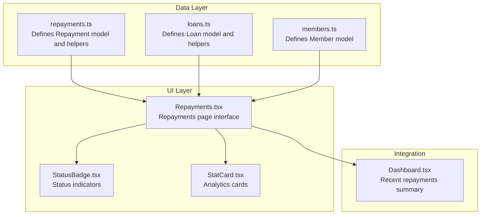
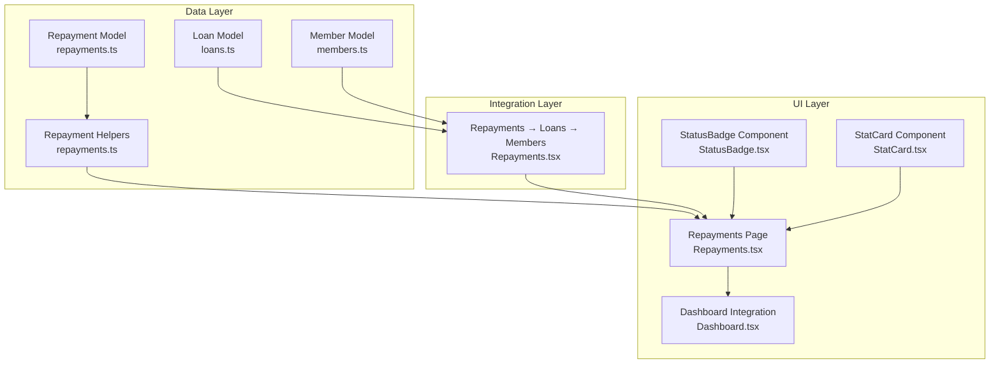
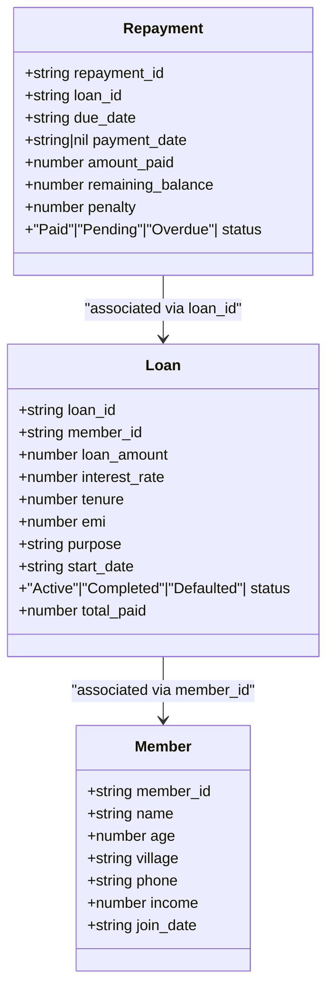
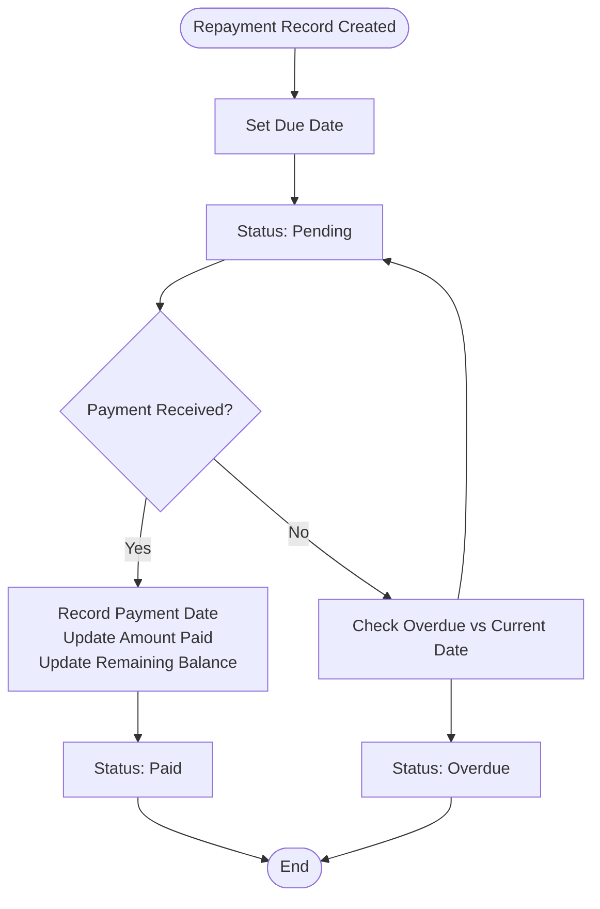
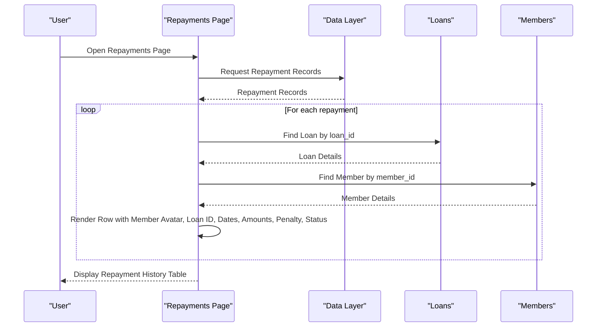
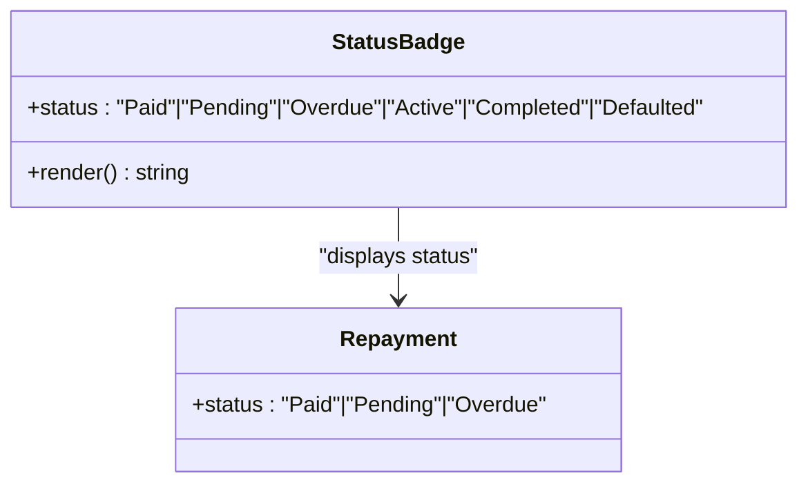
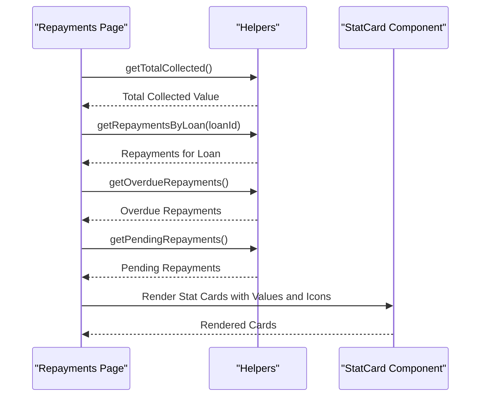
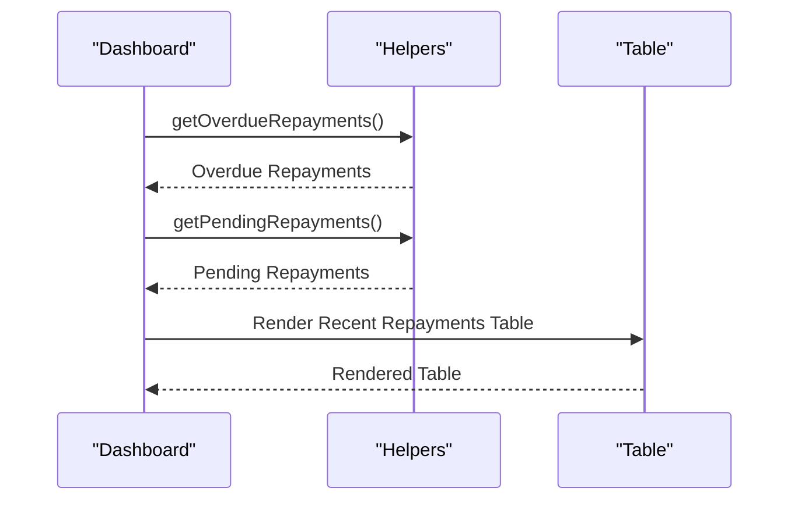
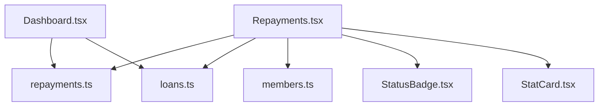

# Repayment Monitoring

<cite>
**Referenced Files in This Document**
- [Repayments.tsx](file://src/pages/Repayments.tsx)
- [repayments.ts](file://src/data/repayments.ts)
- [loans.ts](file://src/data/loans.ts)
- [members.ts](file://src/data/members.ts)
- [StatusBadge.tsx](file://src/components/StatusBadge.tsx)
- [StatCard.tsx](file://src/components/StatCard.tsx)
- [Dashboard.tsx](file://src/pages/Dashboard.tsx)
</cite>

## Table of Contents
1. [Introduction](#introduction)
2. [Project Structure](#project-structure)
3. [Core Components](#core-components)
4. [Architecture Overview](#architecture-overview)
5. [Detailed Component Analysis](#detailed-component-analysis)
6. [Dependency Analysis](#dependency-analysis)
7. [Performance Considerations](#performance-considerations)
8. [Troubleshooting Guide](#troubleshooting-guide)
9. [Conclusion](#conclusion)

## Introduction
This document provides comprehensive documentation for the Repayment Monitoring module. It covers due date tracking, payment recording, overdue management, and repayment history functionality. The module enables administrators to monitor EMI payments, track due collections, manage repayment schedules, and gain insights through analytics and status indicators. It integrates with the loan management system to associate repayments with specific loans and members, and provides visual indicators for payment status including on-time, overdue, and pending states.

## Project Structure
The Repayment Monitoring module is organized around three primary areas:
- Data layer: Defines the repayment data model and helper functions for filtering and aggregation.
- UI layer: Provides the Repayments page with statistics cards, repayment history table, and status badges.
- Integration layer: Connects repayments to loans and members for enriched display and analytics.

**Diagram sources**
- [repayments.ts](file://src/data/repayments.ts#L1-L71)
- [loans.ts](file://src/data/loans.ts#L1-L140)
- [members.ts](file://src/data/members.ts#L1-L122)
- [Repayments.tsx](file://src/pages/Repayments.tsx#L1-L141)
- [StatusBadge.tsx](file://src/components/StatusBadge.tsx#L1-L37)
- [StatCard.tsx](file://src/components/StatCard.tsx#L1-L73)
- [Dashboard.tsx](file://src/pages/Dashboard.tsx#L133-L189)

**Section sources**
- [Repayments.tsx](file://src/pages/Repayments.tsx#L1-L141)
- [repayments.ts](file://src/data/repayments.ts#L1-L71)
- [loans.ts](file://src/data/loans.ts#L1-L140)
- [members.ts](file://src/data/members.ts#L1-L122)
- [StatusBadge.tsx](file://src/components/StatusBadge.tsx#L1-L37)
- [StatCard.tsx](file://src/components/StatCard.tsx#L1-L73)
- [Dashboard.tsx](file://src/pages/Dashboard.tsx#L133-L189)

## Core Components
This section outlines the core components that implement the Repayment Monitoring functionality.

- Repayment data model
  - Fields include repayment identifiers, associated loan identifier, due date, payment date, amount paid, remaining balance, penalty, and status.
  - Status values are constrained to Paid, Pending, or Overdue.

- Repayment helpers
  - Filtering helpers for overdue and pending repayments.
  - Aggregation helper to compute total collected across all paid repayments.

- Repayments page
  - Displays four key statistics: Total Collected, Paid This Month, Pending, and Overdue.
  - Renders a comprehensive table of all repayments with member and loan associations, due dates, payment dates, amounts, balances, penalties, and status indicators.

- Status indicators
  - A reusable component that renders status badges with appropriate styles for Paid, Pending, Overdue, Active, Completed, and Defaulted states.

- Analytics cards
  - A reusable component that displays key metrics with icons, labels, and optional trend indicators.

- Dashboard integration
  - The dashboard page surfaces recent repayments, highlighting overdue and pending items for quick oversight.

**Section sources**
- [repayments.ts](file://src/data/repayments.ts#L1-L10)
- [repayments.ts](file://src/data/repayments.ts#L52-L71)
- [Repayments.tsx](file://src/pages/Repayments.tsx#L20-L65)
- [Repayments.tsx](file://src/pages/Repayments.tsx#L88-L133)
- [StatusBadge.tsx](file://src/components/StatusBadge.tsx#L3-L23)
- [StatCard.tsx](file://src/components/StatCard.tsx#L4-L14)
- [Dashboard.tsx](file://src/pages/Dashboard.tsx#L150-L186)

## Architecture Overview
The Repayment Monitoring module follows a layered architecture:
- Data layer encapsulates the repayment domain model and provides helper functions for filtering and aggregation.
- Integration layer connects repayments to loans and members to enrich display and enable cross-entity analytics.
- UI layer renders statistics, repayment history, and status indicators with reusable components for consistency and maintainability.

**Diagram sources**
- [repayments.ts](file://src/data/repayments.ts#L1-L71)
- [loans.ts](file://src/data/loans.ts#L1-L140)
- [members.ts](file://src/data/members.ts#L1-L122)
- [Repayments.tsx](file://src/pages/Repayments.tsx#L88-L133)
- [StatusBadge.tsx](file://src/components/StatusBadge.tsx#L1-L37)
- [StatCard.tsx](file://src/components/StatCard.tsx#L1-L73)
- [Dashboard.tsx](file://src/pages/Dashboard.tsx#L150-L186)

**Section sources**
- [repayments.ts](file://src/data/repayments.ts#L1-L71)
- [loans.ts](file://src/data/loans.ts#L1-L140)
- [members.ts](file://src/data/members.ts#L1-L122)
- [Repayments.tsx](file://src/pages/Repayments.tsx#L88-L133)
- [StatusBadge.tsx](file://src/components/StatusBadge.tsx#L1-L37)
- [StatCard.tsx](file://src/components/StatCard.tsx#L1-L73)
- [Dashboard.tsx](file://src/pages/Dashboard.tsx#L150-L186)

## Detailed Component Analysis

### Repayment Data Model
The repayment data model defines the structure for storing and retrieving repayment records. It includes:
- Unique repayment identifiers
- Associated loan identifiers
- Due date and optional payment date
- Amount paid and remaining balance
- Penalty amount
- Status field constrained to Paid, Pending, or Overdue

**Diagram sources**
- [repayments.ts](file://src/data/repayments.ts#L1-L10)
- [loans.ts](file://src/data/loans.ts#L1-L12)
- [members.ts](file://src/data/members.ts#L1-L10)

**Section sources**
- [repayments.ts](file://src/data/repayments.ts#L1-L10)
- [loans.ts](file://src/data/loans.ts#L1-L12)
- [members.ts](file://src/data/members.ts#L1-L10)

### Repayment Tracking System
The Repayment Tracking System manages the lifecycle of repayment records:
- Due date tracking: Each repayment record stores a due date and an optional payment date.
- Payment recording: When a payment is made, the payment date is recorded, amount paid is updated, and the remaining balance is recalculated.
- Status updates: Status transitions from Pending to Paid upon successful payment; overdue status is determined by comparing due dates with current date.

**Diagram sources**
- [repayments.ts](file://src/data/repayments.ts#L1-L10)
- [repayments.ts](file://src/data/repayments.ts#L52-L71)

**Section sources**
- [repayments.ts](file://src/data/repayments.ts#L1-L10)
- [repayments.ts](file://src/data/repayments.ts#L52-L71)

### Repayment History Table
The Repayment History Table presents a comprehensive view of repayment records:
- Columns include Repayment ID, Member, Loan ID, Due Date, Payment Date, Amount, Balance, Penalty, and Status.
- Member information is derived from the associated loan and member records.
- Overdue rows are visually highlighted for quick identification.

**Diagram sources**
- [Repayments.tsx](file://src/pages/Repayments.tsx#L88-L133)
- [loans.ts](file://src/data/loans.ts#L120-L123)
- [members.ts](file://src/data/members.ts#L12-L121)

**Section sources**
- [Repayments.tsx](file://src/pages/Repayments.tsx#L88-L133)
- [loans.ts](file://src/data/loans.ts#L120-L123)
- [members.ts](file://src/data/members.ts#L12-L121)

### Status Management and Visual Indicators
Status badges provide immediate visual feedback on repayment status:
- Paid: Indicates on-time or early payment.
- Pending: Indicates upcoming due date without payment.
- Overdue: Indicates missed or late payment.

**Diagram sources**
- [StatusBadge.tsx](file://src/components/StatusBadge.tsx#L3-L23)
- [repayments.ts](file://src/data/repayments.ts#L8-L9)

**Section sources**
- [StatusBadge.tsx](file://src/components/StatusBadge.tsx#L3-L23)
- [repayments.ts](file://src/data/repayments.ts#L8-L9)

### Analytics and Metrics
The Repayments page includes four key analytics cards:
- Total Collected: Sum of all amounts paid across Paid repayments.
- Paid This Month: Count of repayments marked as Paid.
- Pending: Count of repayments marked as Pending.
- Overdue: Count of repayments marked as Overdue.

These metrics are computed using helper functions and displayed using the StatCard component.

**Diagram sources**
- [Repayments.tsx](file://src/pages/Repayments.tsx#L20-L24)
- [repayments.ts](file://src/data/repayments.ts#L52-L71)
- [StatCard.tsx](file://src/components/StatCard.tsx#L32-L72)

**Section sources**
- [Repayments.tsx](file://src/pages/Repayments.tsx#L20-L24)
- [repayments.ts](file://src/data/repayments.ts#L52-L71)
- [StatCard.tsx](file://src/components/StatCard.tsx#L32-L72)

### Dashboard Integration
The dashboard page includes a "Recent Repayments" section that highlights overdue and pending items, enabling quick oversight and follow-up actions.

**Diagram sources**
- [Dashboard.tsx](file://src/pages/Dashboard.tsx#L150-L186)
- [repayments.ts](file://src/data/repayments.ts#L57-L65)

**Section sources**
- [Dashboard.tsx](file://src/pages/Dashboard.tsx#L150-L186)
- [repayments.ts](file://src/data/repayments.ts#L57-L65)

## Dependency Analysis
The Repayment Monitoring module exhibits clear separation of concerns:
- The Repayments page depends on the data layer for repayment records and on the integration layer for loan and member associations.
- The StatusBadge and StatCard components are reusable and support consistent UI across the application.
- The dashboard integrates recent repayment data to provide a high-level overview.

**Diagram sources**
- [Repayments.tsx](file://src/pages/Repayments.tsx#L14-L18)
- [repayments.ts](file://src/data/repayments.ts#L1-L71)
- [loans.ts](file://src/data/loans.ts#L1-L140)
- [members.ts](file://src/data/members.ts#L1-L122)
- [StatusBadge.tsx](file://src/components/StatusBadge.tsx#L1-L37)
- [StatCard.tsx](file://src/components/StatCard.tsx#L1-L73)
- [Dashboard.tsx](file://src/pages/Dashboard.tsx#L150-L186)

**Section sources**
- [Repayments.tsx](file://src/pages/Repayments.tsx#L14-L18)
- [repayments.ts](file://src/data/repayments.ts#L1-L71)
- [loans.ts](file://src/data/loans.ts#L1-L140)
- [members.ts](file://src/data/members.ts#L1-L122)
- [StatusBadge.tsx](file://src/components/StatusBadge.tsx#L1-L37)
- [StatCard.tsx](file://src/components/StatCard.tsx#L1-L73)
- [Dashboard.tsx](file://src/pages/Dashboard.tsx#L150-L186)

## Performance Considerations
- Data filtering and aggregation: The helper functions filter and reduce arrays client-side. For larger datasets, consider server-side filtering and pagination.
- Rendering efficiency: The repayment table iterates through all repayment records. Virtualization or lazy loading can improve rendering performance for large lists.
- Status rendering: Reusable components minimize redundant logic and improve maintainability.

## Troubleshooting Guide
- Repayment status discrepancies
  - Verify due dates and payment dates in the repayment records.
  - Confirm helper functions are correctly filtering overdue and pending statuses.

- Missing member or loan information
  - Ensure loan and member records exist and match the identifiers in repayment records.
  - Check for typos in loan_id or member_id fields.

- Dashboard recent repayments not updating
  - Confirm helper functions are returning the expected counts for overdue and pending repayments.
  - Verify the dashboard integration is using the correct helper functions.

**Section sources**
- [repayments.ts](file://src/data/repayments.ts#L52-L71)
- [loans.ts](file://src/data/loans.ts#L120-L123)
- [members.ts](file://src/data/members.ts#L12-L121)
- [Dashboard.tsx](file://src/pages/Dashboard.tsx#L150-L186)

## Conclusion
The Repayment Monitoring module provides a robust foundation for tracking loan payments, managing overdue collections, and delivering actionable insights through analytics. Its modular design, clear data models, and reusable UI components facilitate maintainability and scalability. Future enhancements could include automated due date reminders, payment validation workflows, late fee calculations, and recovery procedures to further strengthen the repayment monitoring capabilities.