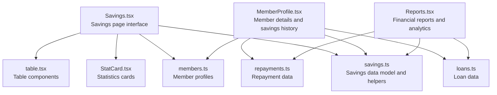
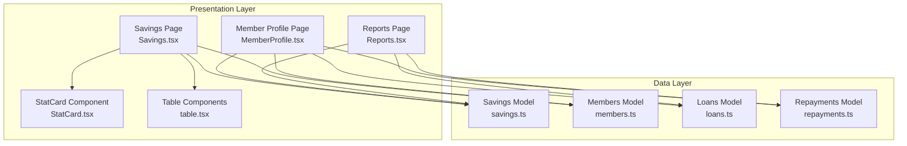
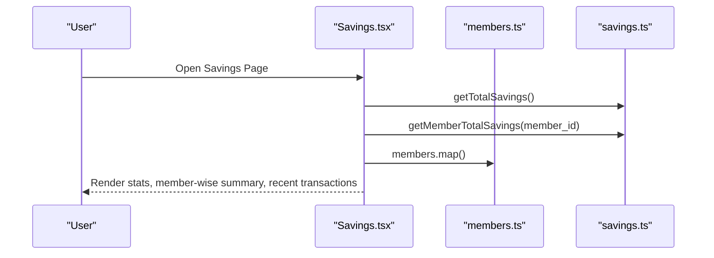
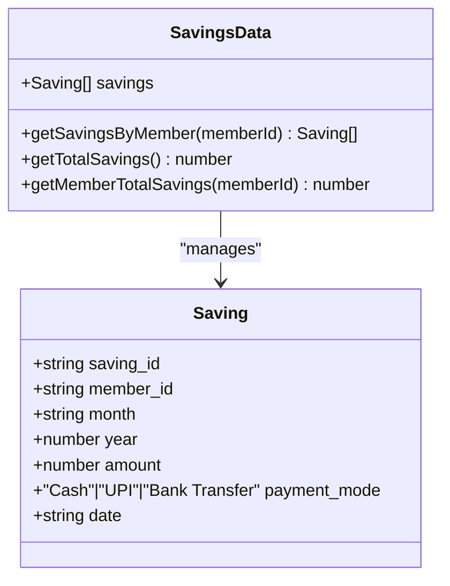
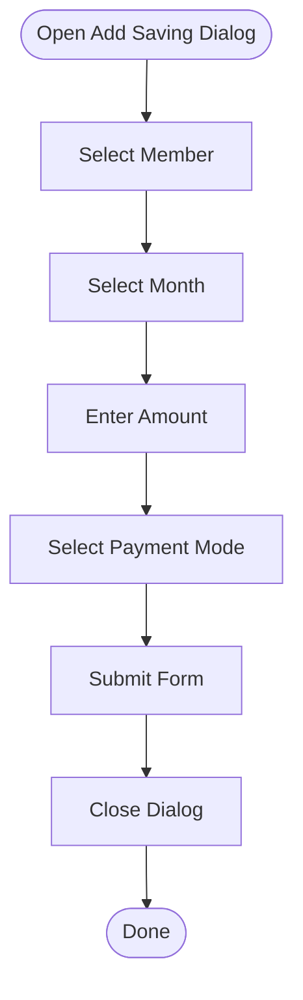
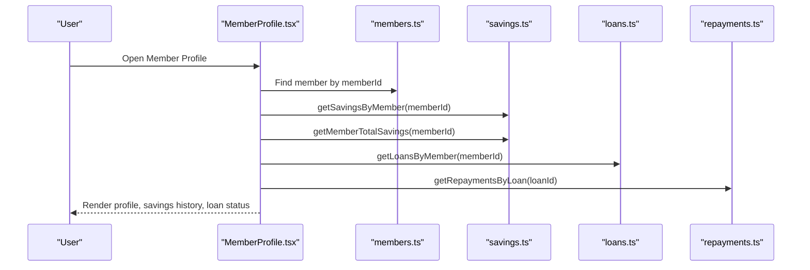
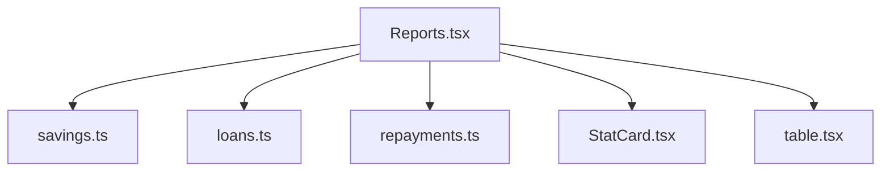
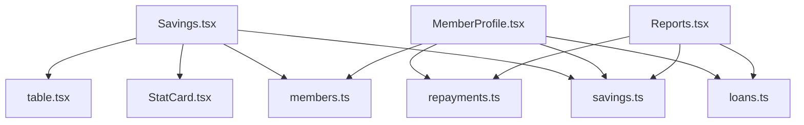

# Savings Operations

<cite>
**Referenced Files in This Document**
- [Savings.tsx](file://src/pages/Savings.tsx)
- [savings.ts](file://src/data/savings.ts)
- [members.ts](file://src/data/members.ts)
- [MemberProfile.tsx](file://src/pages/MemberProfile.tsx)
- [Members.tsx](file://src/pages/Members.tsx)
- [Reports.tsx](file://src/pages/Reports.tsx)
- [StatCard.tsx](file://src/components/StatCard.tsx)
- [table.tsx](file://src/components/ui/table.tsx)
- [loans.ts](file://src/data/loans.ts)
- [repayments.ts](file://src/data/repayments.ts)
</cite>

## Table of Contents
1. [Introduction](#introduction)
2. [Project Structure](#project-structure)
3. [Core Components](#core-components)
4. [Architecture Overview](#architecture-overview)
5. [Detailed Component Analysis](#detailed-component-analysis)
6. [Dependency Analysis](#dependency-analysis)
7. [Performance Considerations](#performance-considerations)
8. [Troubleshooting Guide](#troubleshooting-guide)
9. [Conclusion](#conclusion)

## Introduction
This document provides comprehensive documentation for the Savings Operations module, focusing on monthly savings collection, payment recording, and savings tracking functionality. It covers the Savings page interface for recording new savings payments, viewing payment history, and managing savings records. The documentation explains the savings data model, including payment amounts, payment modes (cash, UPI, bank transfer), payment dates, and member associations. It details the savings calculation logic, monthly reporting capabilities, payment validation rules, and integration with member profiles. Additionally, it includes savings analytics, collection summaries, payment method tracking, and reconciliation processes, addressing savings policy compliance, amount validation, and audit trail requirements for financial transparency.

## Project Structure
The Savings Operations module is organized around a few key files:
- Savings page: Displays savings statistics, member-wise savings summary, recent transactions, and provides a form to record new savings payments.
- Savings data: Defines the savings data model and helper functions for calculations and filtering.
- Members data: Provides member profiles and associated savings data.
- Member profile page: Shows detailed savings history for a specific member.
- Reports page: Offers financial insights and analytics, including savings growth trends.
- UI components: Reusable components like StatCard and table components used across the module.

**Diagram sources**
- [Savings.tsx](file://src/pages/Savings.tsx#L34-L165)
- [savings.ts](file://src/data/savings.ts#L1-L73)
- [members.ts](file://src/data/members.ts#L1-L122)
- [MemberProfile.tsx](file://src/pages/MemberProfile.tsx#L22-L176)
- [Reports.tsx](file://src/pages/Reports.tsx#L25-L212)
- [StatCard.tsx](file://src/components/StatCard.tsx#L32-L72)
- [table.tsx](file://src/components/ui/table.tsx#L5-L72)
- [loans.ts](file://src/data/loans.ts#L1-L140)
- [repayments.ts](file://src/data/repayments.ts#L1-L71)

**Section sources**
- [Savings.tsx](file://src/pages/Savings.tsx#L34-L165)
- [savings.ts](file://src/data/savings.ts#L1-L73)
- [members.ts](file://src/data/members.ts#L1-L122)
- [MemberProfile.tsx](file://src/pages/MemberProfile.tsx#L22-L176)
- [Reports.tsx](file://src/pages/Reports.tsx#L25-L212)
- [StatCard.tsx](file://src/components/StatCard.tsx#L32-L72)
- [table.tsx](file://src/components/ui/table.tsx#L5-L72)
- [loans.ts](file://src/data/loans.ts#L1-L140)
- [repayments.ts](file://src/data/repayments.ts#L1-L71)

## Core Components
This section outlines the core components involved in savings operations:
- Savings page: Presents savings statistics, member-wise savings summary, recent transactions, and a dialog for adding new savings payments.
- Savings data model: Defines the structure of savings records and provides helper functions for calculations and filtering.
- Member profile page: Displays detailed savings history for a specific member and integrates with loans and repayments data.
- Reports page: Provides financial insights and analytics, including savings growth trends and repayment performance metrics.
- UI components: Reusable components for displaying statistics and tabular data.

Key responsibilities:
- Savings page: Render savings statistics, member-wise summaries, recent transactions, and handle the form submission for new savings payments.
- Savings data: Define the savings interface, maintain the savings dataset, and provide helper functions for calculating totals and filtering by member.
- Member profile page: Fetch and display member details, savings history, and integrate with loan and repayment data for a comprehensive view.
- Reports page: Aggregate financial data to present savings growth, loan distribution, repayment performance, and member distribution by village.

**Section sources**
- [Savings.tsx](file://src/pages/Savings.tsx#L34-L165)
- [savings.ts](file://src/data/savings.ts#L1-L73)
- [MemberProfile.tsx](file://src/pages/MemberProfile.tsx#L22-L176)
- [Reports.tsx](file://src/pages/Reports.tsx#L25-L212)
- [StatCard.tsx](file://src/components/StatCard.tsx#L32-L72)
- [table.tsx](file://src/components/ui/table.tsx#L5-L72)

## Architecture Overview
The Savings Operations module follows a data-driven architecture:
- Data layer: Defines the savings, members, loans, and repayments datasets and provides helper functions for calculations and filtering.
- Presentation layer: Renders the Savings page, Member profile page, and Reports page using reusable UI components.
- Integration: The Savings page integrates with members data to display member-wise savings summaries and recent transactions. The Member profile page integrates with savings, loans, and repayments data to provide a comprehensive view of a member's financial activities.

**Diagram sources**
- [Savings.tsx](file://src/pages/Savings.tsx#L34-L165)
- [savings.ts](file://src/data/savings.ts#L1-L73)
- [members.ts](file://src/data/members.ts#L1-L122)
- [MemberProfile.tsx](file://src/pages/MemberProfile.tsx#L22-L176)
- [Reports.tsx](file://src/pages/Reports.tsx#L25-L212)
- [StatCard.tsx](file://src/components/StatCard.tsx#L32-L72)
- [table.tsx](file://src/components/ui/table.tsx#L5-L72)
- [loans.ts](file://src/data/loans.ts#L1-L140)
- [repayments.ts](file://src/data/repayments.ts#L1-L71)

## Detailed Component Analysis

### Savings Page Interface
The Savings page provides:
- Statistics cards for total group savings, monthly collection, and average savings per member.
- Member-wise savings summary table showing contributions and total saved amounts.
- Recent transactions table displaying payment details including member, month, amount, payment mode, and date.

**Diagram sources**
- [Savings.tsx](file://src/pages/Savings.tsx#L34-L165)
- [savings.ts](file://src/data/savings.ts#L64-L72)
- [members.ts](file://src/data/members.ts#L12-L121)

**Section sources**
- [Savings.tsx](file://src/pages/Savings.tsx#L34-L165)

### Savings Data Model
The savings data model defines:
- Interface for savings records with fields for saving_id, member_id, month, year, amount, payment_mode, and date.
- Dataset containing sample savings records for demonstration.
- Helper functions for retrieving savings by member, calculating total savings, and calculating member-specific totals.

**Diagram sources**
- [savings.ts](file://src/data/savings.ts#L1-L73)

**Section sources**
- [savings.ts](file://src/data/savings.ts#L1-L73)

### Payment Recording Form
The Savings page includes a dialog for recording new savings payments:
- Form fields for selecting a member, month, amount, and payment mode.
- Submission handler that closes the dialog upon successful submission.

**Diagram sources**
- [Savings.tsx](file://src/pages/Savings.tsx#L167-L245)

**Section sources**
- [Savings.tsx](file://src/pages/Savings.tsx#L167-L245)

### Member Profile Integration
The Member profile page integrates savings data with member details:
- Displays profile header with member information.
- Shows savings history table with month, amount, payment mode, and date.
- Integrates with loans and repayments data for a comprehensive financial view.

**Diagram sources**
- [MemberProfile.tsx](file://src/pages/MemberProfile.tsx#L22-L176)
- [members.ts](file://src/data/members.ts#L12-L121)
- [savings.ts](file://src/data/savings.ts#L59-L72)
- [loans.ts](file://src/data/loans.ts#L120-L123)
- [repayments.ts](file://src/data/repayments.ts#L52-L55)

**Section sources**
- [MemberProfile.tsx](file://src/pages/MemberProfile.tsx#L22-L176)
- [members.ts](file://src/data/members.ts#L12-L121)
- [savings.ts](file://src/data/savings.ts#L59-L72)
- [loans.ts](file://src/data/loans.ts#L120-L123)
- [repayments.ts](file://src/data/repayments.ts#L52-L55)

### Reporting and Analytics
The Reports page provides financial insights:
- Summary statistics for total members, total savings, loans disbursed, and repayments collected.
- Savings growth chart showing monthly savings collection trends.
- Loan distribution by purpose and repayment performance metrics.

**Diagram sources**
- [Reports.tsx](file://src/pages/Reports.tsx#L25-L212)
- [savings.ts](file://src/data/savings.ts#L64-L72)
- [loans.ts](file://src/data/loans.ts#L130-L139)
- [repayments.ts](file://src/data/repayments.ts#L67-L70)
- [StatCard.tsx](file://src/components/StatCard.tsx#L32-L72)
- [table.tsx](file://src/components/ui/table.tsx#L5-L72)

**Section sources**
- [Reports.tsx](file://src/pages/Reports.tsx#L25-L212)

## Dependency Analysis
The Savings Operations module exhibits the following dependencies:
- Savings page depends on savings data for calculations and on members data for member-wise summaries.
- Member profile page depends on savings data for member-specific totals and history, on members data for profile details, and on loans and repayments data for integrated financial views.
- Reports page aggregates data from savings, loans, and repayments for comprehensive analytics.
- UI components (StatCard and table components) are reused across pages for consistent presentation.

**Diagram sources**
- [Savings.tsx](file://src/pages/Savings.tsx#L31-L32)
- [savings.ts](file://src/data/savings.ts#L1-L73)
- [members.ts](file://src/data/members.ts#L1-L122)
- [MemberProfile.tsx](file://src/pages/MemberProfile.tsx#L17-L20)
- [Reports.tsx](file://src/pages/Reports.tsx#L5-L8)
- [StatCard.tsx](file://src/components/StatCard.tsx#L32-L72)
- [table.tsx](file://src/components/ui/table.tsx#L5-L72)
- [loans.ts](file://src/data/loans.ts#L1-L140)
- [repayments.ts](file://src/data/repayments.ts#L1-L71)

**Section sources**
- [Savings.tsx](file://src/pages/Savings.tsx#L31-L32)
- [MemberProfile.tsx](file://src/pages/MemberProfile.tsx#L17-L20)
- [Reports.tsx](file://src/pages/Reports.tsx#L5-L8)

## Performance Considerations
- Data filtering and calculations: The module uses simple array filtering and reduce operations for calculations. These operations are efficient for small to medium datasets but may require optimization for larger datasets.
- Rendering performance: The Savings page renders member-wise summaries and recent transactions. Consider virtualizing large tables if the number of transactions grows significantly.
- UI responsiveness: The StatCard and table components are lightweight and should render quickly. Ensure that heavy computations are performed outside of render cycles.

## Troubleshooting Guide
Common issues and resolutions:
- Missing member data: Ensure that member IDs in savings records match existing members in the members dataset.
- Incorrect totals: Verify that the getTotalSavings and getMemberTotalSavings functions are correctly summing amounts.
- Payment mode validation: Confirm that payment modes are one of the allowed values (Cash, UPI, Bank Transfer).
- Date formatting: Ensure that dates are formatted consistently and displayed using the appropriate locale.

**Section sources**
- [savings.ts](file://src/data/savings.ts#L64-L72)
- [members.ts](file://src/data/members.ts#L12-L121)

## Conclusion
The Savings Operations module provides a comprehensive solution for managing savings within a Self-Help Group (SHG). It offers intuitive interfaces for recording savings payments, tracking member contributions, and generating financial reports. The module integrates seamlessly with member profiles and loan/repayment data to deliver a holistic view of financial activities. By leveraging reusable UI components and maintaining a clean data model, the module ensures scalability and maintainability while supporting essential financial transparency requirements.