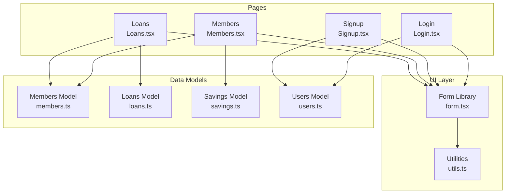
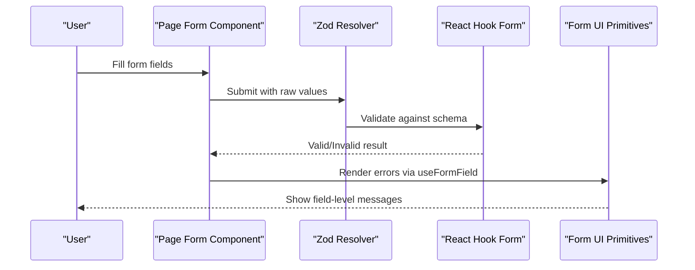
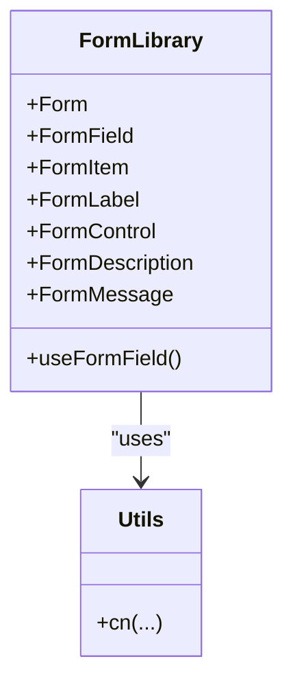
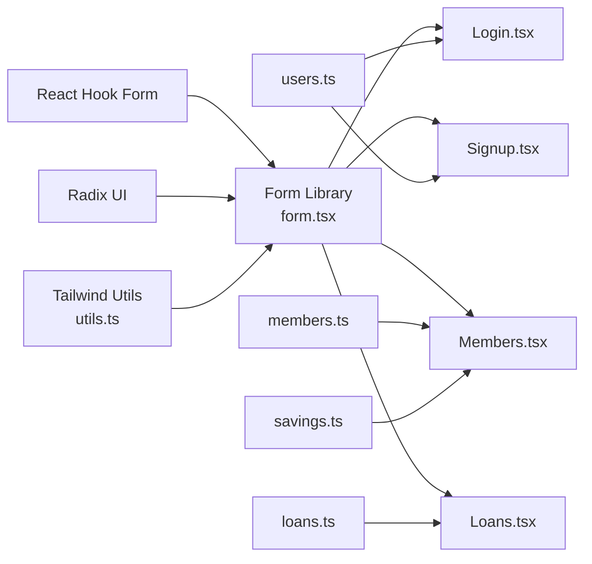

# Forms and Validation

<cite>
**Referenced Files in This Document**
- [form.tsx](file://src/components/ui/form.tsx)
- [utils.ts](file://src/lib/utils.ts)
- [Login.tsx](file://src/pages/Login.tsx)
- [Signup.tsx](file://src/pages/Signup.tsx)
- [Members.tsx](file://src/pages/Members.tsx)
- [Loans.tsx](file://src/pages/Loans.tsx)
- [members.ts](file://src/data/members.ts)
- [loans.ts](file://src/data/loans.ts)
- [savings.ts](file://src/data/savings.ts)
- [users.ts](file://src/data/users.ts)
</cite>

## Table of Contents
1. [Introduction](#introduction)
2. [Project Structure](#project-structure)
3. [Core Components](#core-components)
4. [Architecture Overview](#architecture-overview)
5. [Detailed Component Analysis](#detailed-component-analysis)
6. [Dependency Analysis](#dependency-analysis)
7. [Performance Considerations](#performance-considerations)
8. [Troubleshooting Guide](#troubleshooting-guide)
9. [Conclusion](#conclusion)
10. [Appendices](#appendices)

## Introduction
This document explains the SHG Management System’s forms and validation architecture. It focuses on the custom form component library built on top of React Hook Form, the current validation approach used across pages, and the pathways to integrate robust client-side validation with Zod. It also documents form state management, accessibility features, error presentation, and submission workflows. Finally, it provides guidelines for adding new forms and maintaining validation consistency.

## Project Structure
The forms and validation architecture spans UI primitives, page-level forms, and data models:
- UI primitives: a reusable form component library that wraps React Hook Form primitives and integrates with Radix UI and Tailwind utilities.
- Pages: Login, Signup, Members, and Loans demonstrate form usage patterns, controlled inputs, and mock submission flows.
- Data models: TypeScript interfaces define domain entities and helpers support calculations and filtering.

**Diagram sources**
- [form.tsx](file://src/components/ui/form.tsx#L1-L130)
- [utils.ts](file://src/lib/utils.ts#L1-L7)
- [Login.tsx](file://src/pages/Login.tsx#L1-L119)
- [Signup.tsx](file://src/pages/Signup.tsx#L1-L142)
- [Members.tsx](file://src/pages/Members.tsx#L1-L217)
- [Loans.tsx](file://src/pages/Loans.tsx#L1-L254)
- [members.ts](file://src/data/members.ts#L1-L122)
- [loans.ts](file://src/data/loans.ts#L1-L140)
- [savings.ts](file://src/data/savings.ts#L1-L73)
- [users.ts](file://src/data/users.ts#L1-L78)

**Section sources**
- [form.tsx](file://src/components/ui/form.tsx#L1-L130)
- [utils.ts](file://src/lib/utils.ts#L1-L7)
- [Login.tsx](file://src/pages/Login.tsx#L1-L119)
- [Signup.tsx](file://src/pages/Signup.tsx#L1-L142)
- [Members.tsx](file://src/pages/Members.tsx#L1-L217)
- [Loans.tsx](file://src/pages/Loans.tsx#L1-L254)
- [members.ts](file://src/data/members.ts#L1-L122)
- [loans.ts](file://src/data/loans.ts#L1-L140)
- [savings.ts](file://src/data/savings.ts#L1-L73)
- [users.ts](file://src/data/users.ts#L1-L78)

## Core Components
The form component library provides a structured way to build accessible, validated forms using React Hook Form and Radix UI:
- Form provider and field container: centralizes form context and field scoping.
- Field item and label: manage IDs and accessibility attributes.
- Control and description/message: attach ARIA attributes and render user-facing messages.
- Utility class merging: Tailwind-based class composition.

Key behaviors:
- Accessibility: auto-attaches aria-invalid and aria-describedby to form controls based on field state.
- Error rendering: renders field-level messages when present.
- Controlled components: integrates with native inputs and selection components.

**Section sources**
- [form.tsx](file://src/components/ui/form.tsx#L1-L130)
- [utils.ts](file://src/lib/utils.ts#L1-L7)

## Architecture Overview
The current pages implement straightforward controlled forms with local state and basic validation checks. There is no Zod resolver integrated yet. The recommended path is to:
- Define Zod schemas per form.
- Integrate @hookform/resolvers/zod with React Hook Form.
- Replace manual validation with declarative schema-driven validation.
- Keep the existing UI primitives intact for consistent UX and accessibility.

[No sources needed since this diagram shows conceptual workflow, not actual code structure]

## Detailed Component Analysis

### Form Library (React Hook Form + Radix UI)
The form library composes React Hook Form’s Controller, FormProvider, and field contexts with Radix UI and Tailwind utilities. It exposes:
- Form, FormItem, FormLabel, FormControl, FormDescription, FormMessage, FormField
- useFormField hook to derive IDs and error state for accessibility and messaging

Accessibility highlights:
- FormControl sets aria-invalid and aria-describedby based on field error state.
- FormLabel binds to the form item ID for screen reader compatibility.

**Diagram sources**
- [form.tsx](file://src/components/ui/form.tsx#L1-L130)
- [utils.ts](file://src/lib/utils.ts#L1-L7)

**Section sources**
- [form.tsx](file://src/components/ui/form.tsx#L1-L130)
- [utils.ts](file://src/lib/utils.ts#L1-L7)

### Login Page Form
Current implementation:
- Uses controlled state for role, email, and password.
- Submits via a handler that navigates to the dashboard.
- No client-side validation is applied.

Validation opportunities:
- Add Zod schema for email/phone and password strength.
- Integrate resolver with React Hook Form.
- Present field-level errors using the form library’s FormMessage.

Accessibility:
- Labels are associated with inputs via ids.
- Consider adding aria-describedby for help text and error messages.

**Section sources**
- [Login.tsx](file://src/pages/Login.tsx#L1-L119)

### Signup Page Form
Current implementation:
- Single form state object for SHG and leader details.
- Controlled inputs update state on change.
- Submission handler navigates to dashboard.

Validation opportunities:
- Schema-driven validation for SHG name, leader name, phone, and password confirmation.
- Use FormMessage to surface validation errors.
- Consider grouping fields into logical sections for better UX.

**Section sources**
- [Signup.tsx](file://src/pages/Signup.tsx#L1-L142)

### Members Page Form (Add Member)
Current implementation:
- Local state for name, age, village, phone, income.
- Controlled inputs and a submit handler that closes the dialog.

Validation opportunities:
- Zod schema for numeric fields (age, income) and required constraints.
- Use FormField/FormLabel/FormControl/FormMessage for consistent error display.
- Consider Select components for required dropdowns.

**Section sources**
- [Members.tsx](file://src/pages/Members.tsx#L128-L216)

### Loans Page Form (Create Loan)
Current implementation:
- Local state for member selection, amount, interest rate, tenure, and purpose.
- Calculates EMI on the fly and conditionally renders summary.
- Submit handler closes the dialog.

Validation opportunities:
- Schema for amount, interest rate, tenure, and purpose.
- Ensure member selection is required.
- Use FormMessage to show validation errors and keep EMI calculation hidden until valid.

**Section sources**
- [Loans.tsx](file://src/pages/Loans.tsx#L150-L253)

### Data Models and Integrations
- Members model defines the Member interface and a static dataset used by pages.
- Loans model defines the Loan interface, helper functions for EMI, totals, and repayment progress.
- Savings and Users models provide supporting data for derived computations and authentication mocks.

These models inform form field types and validation constraints (e.g., numeric fields, required selections).

**Section sources**
- [members.ts](file://src/data/members.ts#L1-L122)
- [loans.ts](file://src/data/loans.ts#L1-L140)
- [savings.ts](file://src/data/savings.ts#L1-L73)
- [users.ts](file://src/data/users.ts#L1-L78)

## Dependency Analysis
The form library depends on:
- React Hook Form for form state and validation orchestration.
- Radix UI for accessible labels and slots.
- Tailwind utilities for class composition.

Pages depend on:
- The form library for consistent UX and accessibility.
- Data models for options and computed values (e.g., member lists, EMI calculations).

**Diagram sources**
- [form.tsx](file://src/components/ui/form.tsx#L1-L130)
- [utils.ts](file://src/lib/utils.ts#L1-L7)
- [Login.tsx](file://src/pages/Login.tsx#L1-L119)
- [Signup.tsx](file://src/pages/Signup.tsx#L1-L142)
- [Members.tsx](file://src/pages/Members.tsx#L1-L217)
- [Loans.tsx](file://src/pages/Loans.tsx#L1-L254)
- [members.ts](file://src/data/members.ts#L1-L122)
- [loans.ts](file://src/data/loans.ts#L1-L140)
- [savings.ts](file://src/data/savings.ts#L1-L73)
- [users.ts](file://src/data/users.ts#L1-L78)

**Section sources**
- [form.tsx](file://src/components/ui/form.tsx#L1-L130)
- [utils.ts](file://src/lib/utils.ts#L1-L7)
- [Login.tsx](file://src/pages/Login.tsx#L1-L119)
- [Signup.tsx](file://src/pages/Signup.tsx#L1-L142)
- [Members.tsx](file://src/pages/Members.tsx#L1-L217)
- [Loans.tsx](file://src/pages/Loans.tsx#L1-L254)
- [members.ts](file://src/data/members.ts#L1-L122)
- [loans.ts](file://src/data/loans.ts#L1-L140)
- [savings.ts](file://src/data/savings.ts#L1-L73)
- [users.ts](file://src/data/users.ts#L1-L78)

## Performance Considerations
- Prefer controlled components with minimal re-renders; avoid unnecessary state updates.
- Defer heavy computations (e.g., EMI) until required; cache results when inputs are unchanged.
- Keep validation synchronous for immediate feedback; defer async validations to onBlur/onSubmit as needed.
- Use the form library’s built-in accessibility attributes to reduce DOM overhead and improve assistive tech performance.

[No sources needed since this section provides general guidance]

## Troubleshooting Guide
Common issues and remedies:
- Missing field-level errors: ensure FormMessage is rendered and useFormField is called inside FormItem/FormLabel/FormControl.
- Incorrect ARIA attributes: verify FormControl sets aria-invalid and aria-describedby based on error state.
- Lost focus after validation: preserve focus on the first invalid field using React Hook Form’s focus option.
- Styling conflicts: rely on cn(...) for class merging to avoid specificity wars.

**Section sources**
- [form.tsx](file://src/components/ui/form.tsx#L33-L54)
- [form.tsx](file://src/components/ui/form.tsx#L85-L99)
- [form.tsx](file://src/components/ui/form.tsx#L111-L127)

## Conclusion
The SHG Management System currently uses controlled forms with local state and straightforward submission handlers. The form component library provides a solid foundation for accessible, consistent form UX. To strengthen validation, adopt Zod schemas, integrate @hookform/resolvers/zod, and leverage the existing UI primitives for error presentation. This approach ensures maintainable, accessible, and scalable forms across the application.

[No sources needed since this section summarizes without analyzing specific files]

## Appendices

### Validation Pipeline and Timing
- Validation timing:
  - On blur: trigger field-level validation immediately after leaving a field.
  - On submit: validate the entire form before submission.
- Error handling:
  - Use FormMessage to display field-level messages.
  - Combine with FormDescription for contextual hints.
- Accessibility:
  - FormControl sets aria-invalid and aria-describedby automatically.
  - FormLabel associates labels with inputs via IDs.

**Section sources**
- [form.tsx](file://src/components/ui/form.tsx#L75-L99)
- [form.tsx](file://src/components/ui/form.tsx#L111-L127)

### Guidelines for Creating New Forms
- Define a Zod schema for the form’s fields and integrate it with React Hook Form.
- Wrap fields in FormField, FormItem, FormLabel, FormControl, FormDescription, FormMessage.
- Use useFormField to access IDs and error state for accessibility.
- Implement validation timing:
  - onBlur for immediate feedback.
  - onSubmit for aggregated validation.
- Keep error messages concise and actionable; avoid exposing internal validation keys.
- Reuse the form library across pages to maintain consistency.

**Section sources**
- [form.tsx](file://src/components/ui/form.tsx#L1-L130)