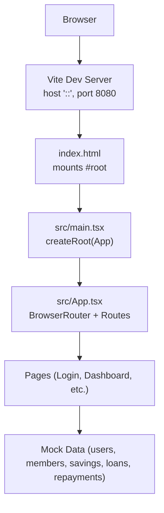
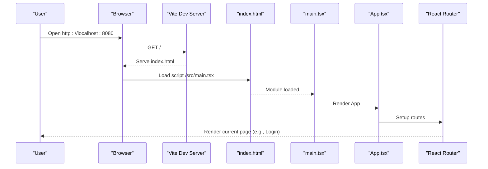
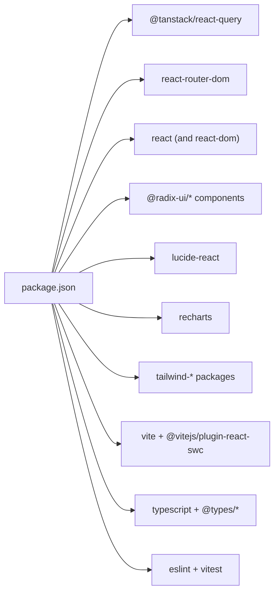

# Getting Started

<cite>
**Referenced Files in This Document**
- [README.md](file://README.md)
- [package.json](file://package.json)
- [vite.config.ts](file://vite.config.ts)
- [tailwind.config.ts](file://tailwind.config.ts)
- [components.json](file://components.json)
- [index.html](file://index.html)
- [src/main.tsx](file://src/main.tsx)
- [src/App.tsx](file://src/App.tsx)
- [src/pages/Login.tsx](file://src/pages/Login.tsx)
- [src/pages/Dashboard.tsx](file://src/pages/Dashboard.tsx)
- [src/data/users.ts](file://src/data/users.ts)
- [src/data/members.ts](file://src/data/members.ts)
- [src/data/savings.ts](file://src/data/savings.ts)
- [src/data/loans.ts](file://src/data/loans.ts)
- [src/data/repayments.ts](file://src/data/repayments.ts)
</cite>

## Table of Contents
1. [Introduction](#introduction)
2. [Project Structure](#project-structure)
3. [Core Components](#core-components)
4. [Architecture Overview](#architecture-overview)
5. [Detailed Component Analysis](#detailed-component-analysis)
6. [Dependency Analysis](#dependency-analysis)
7. [Performance Considerations](#performance-considerations)
8. [Troubleshooting Guide](#troubleshooting-guide)
9. [Conclusion](#conclusion)
10. [Appendices](#appendices)

## Introduction
This guide helps you quickly install, run, and explore the SHG Management System. It covers prerequisites, local setup, development server startup, basic navigation, and initial configuration. It also includes troubleshooting tips, browser compatibility notes, and guidance for using GitHub Codespaces.

## Project Structure
The project is a React application using Vite, TypeScript, Tailwind CSS, and shadcn/ui components. Routing is handled by React Router, and state/network requests are managed with TanStack React Query. The app ships with mock data for users, members, savings, loans, and repayments to demonstrate functionality out of the box.

**Diagram sources**
- [vite.config.ts](file://vite.config.ts#L8-L14)
- [index.html](file://index.html#L22-L26)
- [src/main.tsx](file://src/main.tsx#L1-L5)
- [src/App.tsx](file://src/App.tsx#L1-L48)
- [src/pages/Login.tsx](file://src/pages/Login.tsx#L1-L119)
- [src/pages/Dashboard.tsx](file://src/pages/Dashboard.tsx#L1-L190)
- [src/data/users.ts](file://src/data/users.ts#L1-L78)
- [src/data/members.ts](file://src/data/members.ts#L1-L122)
- [src/data/savings.ts](file://src/data/savings.ts#L1-L73)
- [src/data/loans.ts](file://src/data/loans.ts#L1-L140)
- [src/data/repayments.ts](file://src/data/repayments.ts#L1-L71)

**Section sources**
- [README.md](file://README.md#L53-L61)
- [package.json](file://package.json#L1-L90)
- [vite.config.ts](file://vite.config.ts#L1-L22)
- [tailwind.config.ts](file://tailwind.config.ts#L1-L129)
- [components.json](file://components.json#L1-L21)
- [index.html](file://index.html#L1-L27)
- [src/main.tsx](file://src/main.tsx#L1-L5)
- [src/App.tsx](file://src/App.tsx#L1-L48)

## Core Components
- Development scripts and toolchain are defined in package.json, including dev, build, lint, preview, and test commands.
- Vite config sets the dev server host/port, disables overlay, enables React plugin, and aliases @ to src.
- Tailwind is configured for content scanning across pages/components/app/src and includes animations plugin.
- shadcn/ui is configured with TSX, default style, and aliases for components, utils, ui, lib, hooks.
- The app mounts at index.html and renders App, which wires routing and providers.

What you need to know now:
- Node.js and npm are required.
- Run npm install to install dependencies.
- Run npm run dev to start the dev server.
- Access the app at http://localhost:8080.

**Section sources**
- [README.md](file://README.md#L21-L37)
- [package.json](file://package.json#L6-L14)
- [vite.config.ts](file://vite.config.ts#L7-L21)
- [tailwind.config.ts](file://tailwind.config.ts#L3-L129)
- [components.json](file://components.json#L1-L21)
- [index.html](file://index.html#L22-L26)

## Architecture Overview
High-level runtime flow:
- index.html loads the app bundle and mounts the root element.
- main.tsx creates the root and renders App.
- App wraps routes with React Router and providers for UI tooltips, notifications, and React Query.
- Pages render based on route paths.

**Diagram sources**
- [index.html](file://index.html#L22-L26)
- [src/main.tsx](file://src/main.tsx#L1-L5)
- [src/App.tsx](file://src/App.tsx#L26-L42)
- [vite.config.ts](file://vite.config.ts#L8-L14)

**Section sources**
- [index.html](file://index.html#L1-L27)
- [src/main.tsx](file://src/main.tsx#L1-L5)
- [src/App.tsx](file://src/App.tsx#L1-L48)
- [vite.config.ts](file://vite.config.ts#L1-L22)

## Detailed Component Analysis

### Installation and Setup
- Prerequisites: Node.js and npm.
- Steps:
  - Clone the repository.
  - Navigate to the project directory.
  - Install dependencies with npm install.
  - Start the development server with npm run dev.
- Alternative: Use GitHub Codespaces by selecting the “Codespaces” tab after clicking the green “Code” button and creating a new codespace.

What to expect:
- The dev server starts at http://localhost:8080.
- The app displays the landing page by default.

**Section sources**
- [README.md](file://README.md#L21-L37)
- [README.md](file://README.md#L45-L51)
- [package.json](file://package.json#L6-L14)
- [vite.config.ts](file://vite.config.ts#L8-L14)

### Build and Preview
- Build for production using the build script.
- Preview the production build locally using the preview script.
- Linting and testing scripts are available for development quality checks.

**Section sources**
- [package.json](file://package.json#L6-L14)

### Authentication and Navigation
- Default routes include:
  - / (Landing)
  - /login (Login)
  - /dashboard (Dashboard)
  - /members, /members/:memberId, /savings, /loans, /repayments, /reports, /chatbot
- The Login page demonstrates role selection and navigation to the dashboard on submit.
- The Dashboard page uses mock data to render statistics, quick actions, active loans, and recent repayments.

Accessing the app:
- Open http://localhost:8080 in your browser.
- Use the Login page to navigate to the Dashboard.

**Section sources**
- [src/App.tsx](file://src/App.tsx#L27-L41)
- [src/pages/Login.tsx](file://src/pages/Login.tsx#L15-L25)
- [src/pages/Dashboard.tsx](file://src/pages/Dashboard.tsx#L30-L41)

### Understanding Mock Data and Roles
- Users include roles such as Admin, SHG Leader, and Member.
- The dashboard pulls statistics from mock datasets for members, savings, loans, and repayments.
- The current logged-in user is set to a mock SHG Leader for demonstration.

Default credentials:
- The Login page accepts any role and any email/password combination and navigates to the dashboard. There is no backend validation in this template.

**Section sources**
- [src/data/users.ts](file://src/data/users.ts#L12-L61)
- [src/pages/Login.tsx](file://src/pages/Login.tsx#L17-L25)
- [src/pages/Dashboard.tsx](file://src/pages/Dashboard.tsx#L14-L18)
- [src/data/members.ts](file://src/data/members.ts#L12-L122)
- [src/data/savings.ts](file://src/data/savings.ts#L64-L72)
- [src/data/loans.ts](file://src/data/loans.ts#L125-L139)
- [src/data/repayments.ts](file://src/data/repayments.ts#L57-L70)

### UI Framework and Styling
- Tailwind CSS is configured with content paths covering pages, components, app, and src.
- shadcn/ui is configured with TSX enabled and aliases for components, utils, ui, lib, hooks.
- The app uses Radix UI primitives and shadcn/ui components for controls and layouts.

**Section sources**
- [tailwind.config.ts](file://tailwind.config.ts#L3-L129)
- [components.json](file://components.json#L1-L21)

## Dependency Analysis
Key runtime dependencies include React, React Router DOM, TanStack React Query, and numerous Radix UI components. Development dependencies include Vite, TypeScript, Tailwind CSS, ESLint, and Vitest.

**Diagram sources**
- [package.json](file://package.json#L15-L88)

**Section sources**
- [package.json](file://package.json#L15-L88)

## Performance Considerations
- Use the production build script for optimized bundles.
- Keep dependencies updated and avoid unused components to minimize bundle size.
- Leverage React Query caching and queries efficiently to reduce unnecessary re-fetches.

[No sources needed since this section provides general guidance]

## Troubleshooting Guide
Common setup issues and resolutions:
- Port already in use:
  - The dev server listens on port 8080. If it is in use, change the port in the Vite configuration or stop the conflicting service.
- Host binding issues:
  - The dev server binds to "::" (all interfaces). On some systems, prefer 127.0.0.1 explicitly if needed.
- Missing dependencies:
  - Re-run npm install to ensure all dependencies and devDependencies are installed.
- TypeScript or ESLint errors:
  - Run the lint script to identify issues; fix type errors or lint warnings as indicated.
- Testing failures:
  - Use the test and test:watch scripts to run unit tests and observe changes.

**Section sources**
- [vite.config.ts](file://vite.config.ts#L8-L14)
- [package.json](file://package.json#L6-L14)

## Conclusion
You now have everything needed to install the SHG Management System, start the development server, and navigate the application. Explore the Login and Dashboard pages, review the mock data, and use the provided scripts for building, previewing, linting, and testing.

[No sources needed since this section summarizes without analyzing specific files]

## Appendices

### A. Step-by-step Installation Checklist
- Confirm Node.js and npm are installed.
- Clone the repository and cd into the project directory.
- Install dependencies: npm install.
- Start the dev server: npm run dev.
- Open http://localhost:8080 in your browser.
- Optional: Use GitHub Codespaces from the repository’s “Code” menu.

**Section sources**
- [README.md](file://README.md#L21-L37)
- [README.md](file://README.md#L45-L51)
- [package.json](file://package.json#L6-L14)
- [vite.config.ts](file://vite.config.ts#L8-L14)

### B. Default Login Behavior
- The Login page does not validate credentials; submitting the form navigates to the dashboard regardless of inputs.
- Roles available: Admin, SHG Leader, Member.

**Section sources**
- [src/pages/Login.tsx](file://src/pages/Login.tsx#L17-L25)
- [src/pages/Login.tsx](file://src/pages/Login.tsx#L62-L67)

### C. Basic Navigation Guide
- Landing: /
- Login: /login
- Dashboard: /dashboard
- Members: /members
- Member Profile: /members/:memberId
- Savings: /savings
- Loans: /loans
- Repayments: /repayments
- Reports: /reports
- Chatbot: /chatbot
- 404: Catch-all route "*"

**Section sources**
- [src/App.tsx](file://src/App.tsx#L27-L41)

### D. Browser Compatibility
- The project uses modern web APIs and React with Vite. Ensure your browser supports ES modules and the latest ECMAScript features.
- For best results, use a recent version of Chrome, Firefox, Edge, or Safari.

[No sources needed since this section provides general guidance]