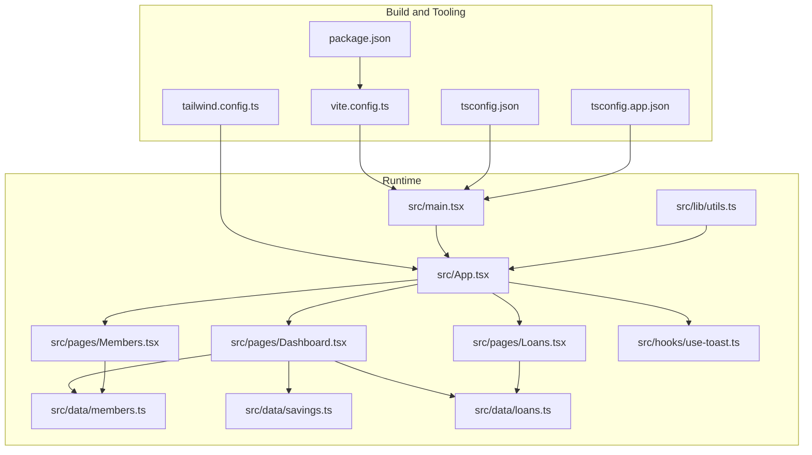
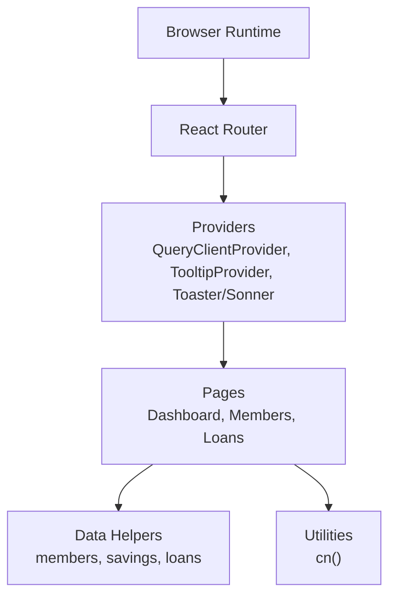
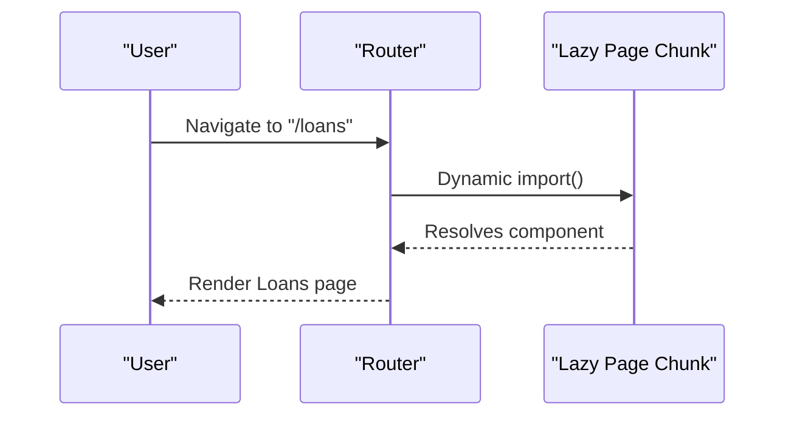
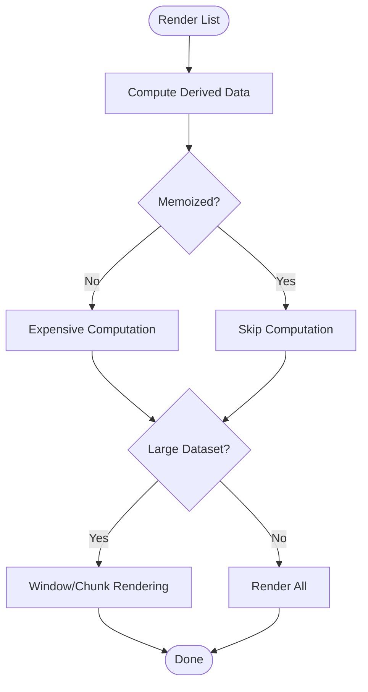
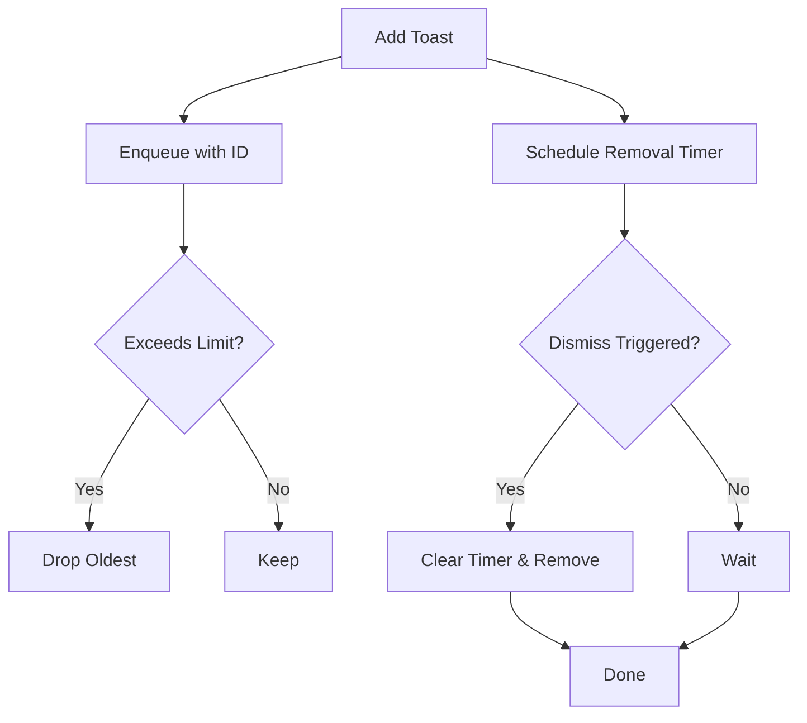
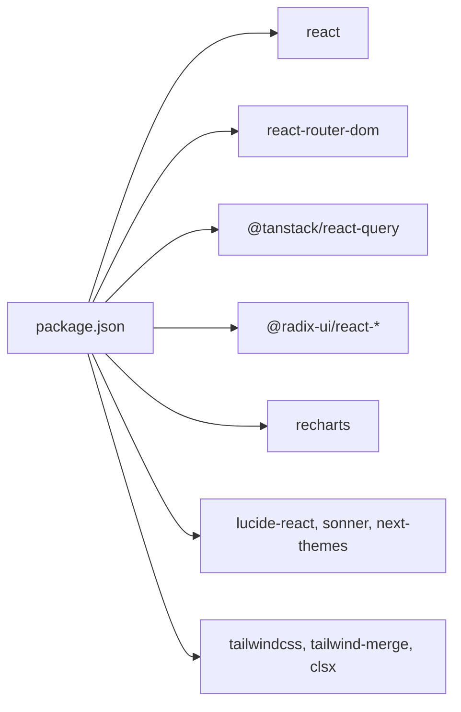

# Performance Optimization

<cite>
**Referenced Files in This Document**
- [vite.config.ts](file://vite.config.ts)
- [package.json](file://package.json)
- [tsconfig.json](file://tsconfig.json)
- [tsconfig.app.json](file://tsconfig.app.json)
- [tailwind.config.ts](file://tailwind.config.ts)
- [src/main.tsx](file://src/main.tsx)
- [src/App.tsx](file://src/App.tsx)
- [src/pages/Dashboard.tsx](file://src/pages/Dashboard.tsx)
- [src/pages/Members.tsx](file://src/pages/Members.tsx)
- [src/pages/Loans.tsx](file://src/pages/Loans.tsx)
- [src/data/members.ts](file://src/data/members.ts)
- [src/data/savings.ts](file://src/data/savings.ts)
- [src/data/loans.ts](file://src/data/loans.ts)
- [src/hooks/use-toast.ts](file://src/hooks/use-toast.ts)
- [src/lib/utils.ts](file://src/lib/utils.ts)
</cite>

## Table of Contents
1. [Introduction](#introduction)
2. [Project Structure](#project-structure)
3. [Core Components](#core-components)
4. [Architecture Overview](#architecture-overview)
5. [Detailed Component Analysis](#detailed-component-analysis)
6. [Dependency Analysis](#dependency-analysis)
7. [Performance Considerations](#performance-considerations)
8. [Troubleshooting Guide](#troubleshooting-guide)
9. [Conclusion](#conclusion)
10. [Appendices](#appendices)

## Introduction
This document provides a comprehensive performance optimization guide for the SHG Management System built with Vite, React, TypeScript, and Tailwind CSS. It focuses on Vite build configuration, bundle optimization strategies, code splitting techniques, lazy loading, component splitting, asset optimization, performance monitoring, bundle analysis, profiling, memory management, rendering optimizations, state management performance, TypeScript configuration benefits, tree shaking effectiveness, and production build optimizations. It also includes practical guidelines for identifying bottlenecks, measuring speed, and implementing improvements.

## Project Structure
The project follows a conventional React + TypeScript + Vite setup with a clear separation of concerns:
- Application bootstrap and routing are defined in the main entry and root App component.
- Pages are organized under a dedicated folder and imported directly into routes.
- Shared UI components are grouped under a components directory with a nested ui subfolder.
- Data helpers reside under a data directory, providing computed metrics and filtering logic.
- Utility functions encapsulate cross-cutting concerns like class merging.
- Build-time configuration is centralized in Vite and TypeScript compiler options.

**Diagram sources**
- [vite.config.ts](file://vite.config.ts#L1-L22)
- [package.json](file://package.json#L1-L90)
- [tsconfig.json](file://tsconfig.json#L1-L17)
- [tsconfig.app.json](file://tsconfig.app.json#L1-L31)
- [tailwind.config.ts](file://tailwind.config.ts#L1-L129)
- [src/main.tsx](file://src/main.tsx#L1-L5)
- [src/App.tsx](file://src/App.tsx#L1-L48)
- [src/pages/Dashboard.tsx](file://src/pages/Dashboard.tsx#L1-L190)
- [src/pages/Members.tsx](file://src/pages/Members.tsx#L1-L217)
- [src/pages/Loans.tsx](file://src/pages/Loans.tsx#L1-L254)
- [src/data/members.ts](file://src/data/members.ts#L1-L122)
- [src/data/savings.ts](file://src/data/savings.ts#L1-L73)
- [src/data/loans.ts](file://src/data/loans.ts#L1-L140)
- [src/lib/utils.ts](file://src/lib/utils.ts#L1-L7)
- [src/hooks/use-toast.ts](file://src/hooks/use-toast.ts#L1-L186)

**Section sources**
- [vite.config.ts](file://vite.config.ts#L1-L22)
- [package.json](file://package.json#L1-L90)
- [tsconfig.json](file://tsconfig.json#L1-L17)
- [tsconfig.app.json](file://tsconfig.app.json#L1-L31)
- [tailwind.config.ts](file://tailwind.config.ts#L1-L129)
- [src/main.tsx](file://src/main.tsx#L1-L5)
- [src/App.tsx](file://src/App.tsx#L1-L48)

## Core Components
- Vite configuration defines server behavior, plugin activation, and path aliases. It enables React Fast Refresh via @vitejs/plugin-react-swc and conditionally loads a component tagging plugin in development.
- TypeScript configurations enable bundler module resolution, strictness toggles, and path mapping for clean imports.
- Tailwind CSS configuration scopes scanning to pages/components/app/src to minimize CSS bloat.
- Application bootstrap initializes React root and registers providers for routing, tooltips, notifications, and state caching.
- Pages compose domain-specific UI and data helpers to render dashboards, lists, and forms efficiently.

Key performance-relevant observations:
- Path aliases simplify imports and improve DX; ensure they remain consistent to avoid unnecessary duplication.
- TypeScript bundler mode and module resolution reduce bundling ambiguity and support tree shaking.
- Tailwind’s scoped content glob avoids shipping unused styles.

**Section sources**
- [vite.config.ts](file://vite.config.ts#L1-L22)
- [tsconfig.app.json](file://tsconfig.app.json#L1-L31)
- [tailwind.config.ts](file://tailwind.config.ts#L1-L129)
- [src/main.tsx](file://src/main.tsx#L1-L5)
- [src/App.tsx](file://src/App.tsx#L1-L48)

## Architecture Overview
The runtime architecture centers around route-based page composition with shared UI components and data helpers. Providers encapsulate global concerns (routing, tooltips, notifications, caching). Data helpers compute metrics and filter collections for rendering.

**Diagram sources**
- [src/App.tsx](file://src/App.tsx#L1-L48)
- [src/pages/Dashboard.tsx](file://src/pages/Dashboard.tsx#L1-L190)
- [src/pages/Members.tsx](file://src/pages/Members.tsx#L1-L217)
- [src/pages/Loans.tsx](file://src/pages/Loans.tsx#L1-L254)
- [src/data/members.ts](file://src/data/members.ts#L1-L122)
- [src/data/savings.ts](file://src/data/savings.ts#L1-L73)
- [src/data/loans.ts](file://src/data/loans.ts#L1-L140)
- [src/lib/utils.ts](file://src/lib/utils.ts#L1-L7)

## Detailed Component Analysis

### Vite Build Configuration and Bundle Optimization
- Server and HMR: Host binding, port, and overlay customization optimize developer experience and reduce noise during hot updates.
- Plugins: React plugin is always enabled; component tagging plugin is conditionally enabled in development to aid component inspection.
- Aliases: Path alias for "@/*" simplifies imports and reduces bundle churn from long relative paths.

Optimization recommendations:
- Enable esbuild minification and target modern browsers for smaller bundles.
- Configure dynamic import boundaries to split vendor/runtime chunks.
- Introduce explicit manual chunking for large libraries (e.g., charting, date utilities).
- Enable pre-bundling for frequently changing dependencies.

**Section sources**
- [vite.config.ts](file://vite.config.ts#L1-L22)

### TypeScript Configuration Benefits and Tree Shaking
- Bundler mode and module resolution: Favor ESNext modules with bundler resolution to maximize compatibility and tree shaking.
- Strictness toggles: Loosen strict checks where appropriate for faster builds while maintaining safety.
- Path mapping: Consistent "@/*" mapping improves readability and reduces errors.

Tree shaking effectiveness:
- Prefer named exports for UI components and utilities to allow elimination of unused code.
- Keep side-effectful imports minimal; isolate them to dedicated modules.

**Section sources**
- [tsconfig.json](file://tsconfig.json#L1-L17)
- [tsconfig.app.json](file://tsconfig.app.json#L1-L31)

### Tailwind CSS Scanning and Asset Optimization
- Content globs restrict scanned files to pages, components, app, and src, minimizing CSS extraction overhead.
- Extensive animations and shadows are defined centrally; ensure only used utilities are generated.

Recommendations:
- Remove unused color scales, spacing, and shadow variants.
- Split animations into feature-specific chunks if the app grows.
- Audit image assets and compress where possible.

**Section sources**
- [tailwind.config.ts](file://tailwind.config.ts#L1-L129)

### Routing and Lazy Loading Strategies
Current routing imports pages statically. To implement lazy loading:
- Wrap page imports with dynamic imports to create separate chunks.
- Use React.lazy and Suspense around route components for code splitting.
- Consider route-level code splitting for heavy pages (e.g., Reports, Chatbot).

Benefits:
- Reduces initial bundle size.
- Improves Time to Interactive (TTI) by deferring non-critical code.

[No sources needed since this diagram shows conceptual workflow, not actual code structure]

**Section sources**
- [src/App.tsx](file://src/App.tsx#L1-L48)

### Component Splitting and Rendering Optimizations
- Dashboard composes multiple StatCards, Tables, and Progress indicators. Consider virtualizing large tables and memoizing derived computations.
- Members and Loans pages render lists; apply windowing for very large datasets.
- Use React.memo for pure presentational components and useMemo/useCallback for expensive computations.

[No sources needed since this diagram shows conceptual workflow, not actual code structure]

**Section sources**
- [src/pages/Dashboard.tsx](file://src/pages/Dashboard.tsx#L1-L190)
- [src/pages/Members.tsx](file://src/pages/Members.tsx#L1-L217)
- [src/pages/Loans.tsx](file://src/pages/Loans.tsx#L1-L254)

### Data Helpers and State Management Performance
- Data helpers compute totals, filters, and derived metrics. Centralize these to avoid recomputation and enable caching.
- React Query client is initialized at the root; ensure queries are configured with appropriate stale times and background refetch policies to balance freshness and performance.

Recommendations:
- Normalize data and cache results per route or page lifecycle.
- Use selective invalidation and targeted refetches to minimize network overhead.
- Debounce search/filter operations to avoid excessive re-renders.

**Section sources**
- [src/App.tsx](file://src/App.tsx#L1-L48)
- [src/data/members.ts](file://src/data/members.ts#L1-L122)
- [src/data/savings.ts](file://src/data/savings.ts#L1-L73)
- [src/data/loans.ts](file://src/data/loans.ts#L1-L140)

### Notifications and Memory Management
- Toast manager maintains a finite queue and schedules removal timers. Ensure timers are cleared on unmount to prevent memory leaks.
- Limit concurrent toasts and use dismissal callbacks to keep state minimal.

**Diagram sources**
- [src/hooks/use-toast.ts](file://src/hooks/use-toast.ts#L1-L186)

**Section sources**
- [src/hooks/use-toast.ts](file://src/hooks/use-toast.ts#L1-L186)

### Utilities and CSS Class Merging
- Utility function merges and deduplicates Tailwind classes efficiently. Keep class composition simple to avoid runtime overhead.

**Section sources**
- [src/lib/utils.ts](file://src/lib/utils.ts#L1-L7)

## Dependency Analysis
The project relies on a curated set of UI primitives, state management, routing, and charting libraries. Dependencies are declared in package.json with development tooling for building, testing, and linting.

**Diagram sources**
- [package.json](file://package.json#L1-L90)

**Section sources**
- [package.json](file://package.json#L1-L90)

## Performance Considerations
- Build-time
  - Minification: Enable esbuild minification and target modern browsers.
  - Chunking: Introduce manual and automatic chunking for vendor/runtime separation.
  - Pre-bundling: Leverage Vite’s pre-bundling for stable dependencies.
  - Asset optimization: Compress images and fonts; defer non-critical assets.
- Runtime
  - Lazy loading: Split routes and heavy components.
  - Rendering: Memoize, virtualize large lists, and avoid unnecessary re-renders.
  - State: Configure React Query with sensible cache policies and selective invalidation.
  - Memory: Clean up timers and subscriptions; limit global state footprint.
- Observability
  - Profiling: Use React DevTools Profiler and browser devtools.
  - Metrics: Measure LCP, FID, CLS, and TTI; track bundle sizes and asset counts.
  - Monitoring: Integrate lightweight analytics for user interactions and performance signals.

[No sources needed since this section provides general guidance]

## Troubleshooting Guide
Common performance issues and remedies:
- Large initial bundle
  - Analyze bundle composition and split vendor/runtime chunks.
  - Defer non-critical imports and lazy-load heavy pages.
- Excessive re-renders
  - Identify components with frequent prop changes; wrap with React.memo.
  - Extract heavy computations into useMemo/useCallback.
- Slow list rendering
  - Apply virtualization for large tables/lists.
  - Paginate or filter data incrementally.
- Toast memory growth
  - Ensure dismissal clears timers and removes toasts promptly.
- CSS bloat
  - Verify Tailwind content globs and remove unused utilities.

**Section sources**
- [src/hooks/use-toast.ts](file://src/hooks/use-toast.ts#L1-L186)
- [tailwind.config.ts](file://tailwind.config.ts#L1-L129)

## Conclusion
The SHG Management System is structured to support strong performance foundations through modern tooling and modular architecture. By implementing route-level lazy loading, optimizing data computation, leveraging React Query effectively, and refining build configuration, the application can achieve faster load times, smoother interactions, and lower memory usage. Adopt continuous measurement and profiling to sustain performance gains as the application evolves.

[No sources needed since this section summarizes without analyzing specific files]

## Appendices
- Bundle analysis tools: Use Vite’s built-in analyzer plugin or third-party tools to inspect bundle composition.
- Profiling techniques: Use React Profiler, Chrome DevTools Performance panel, and Lighthouse for audits.
- Guidelines checklist:
  - Split routes and heavy components.
  - Memoize derived data and computations.
  - Optimize images and fonts.
  - Configure React Query cache policies.
  - Monitor bundle size and runtime metrics.

[No sources needed since this section provides general guidance]