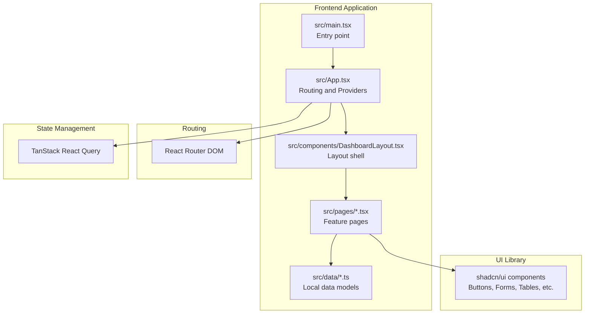
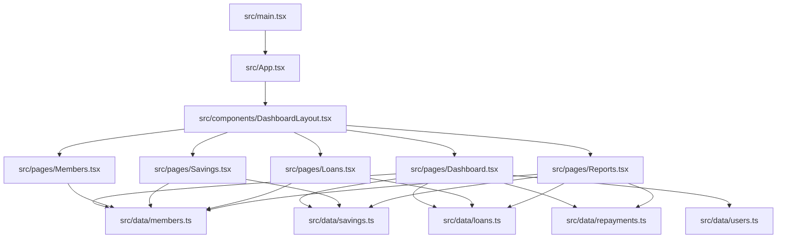
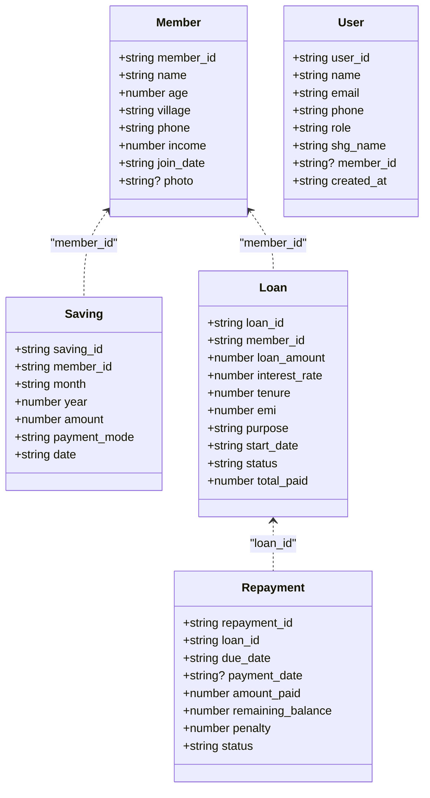
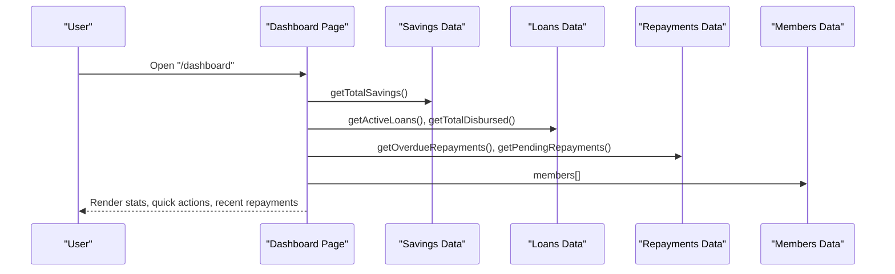
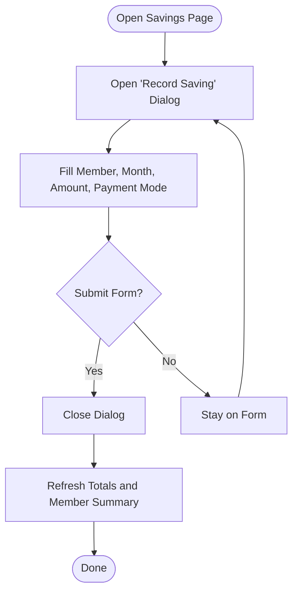
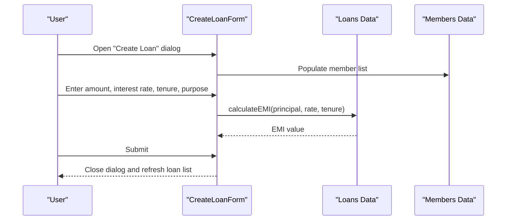
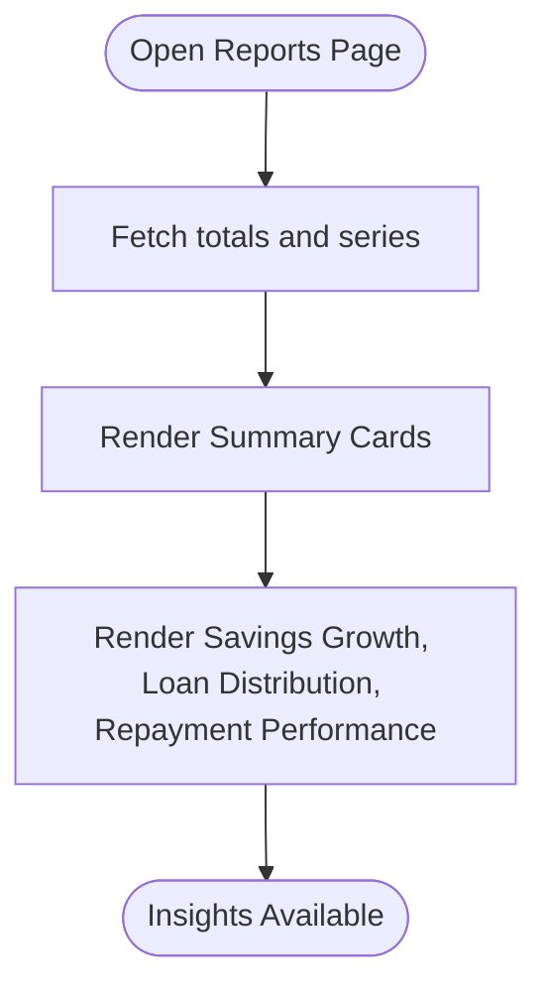
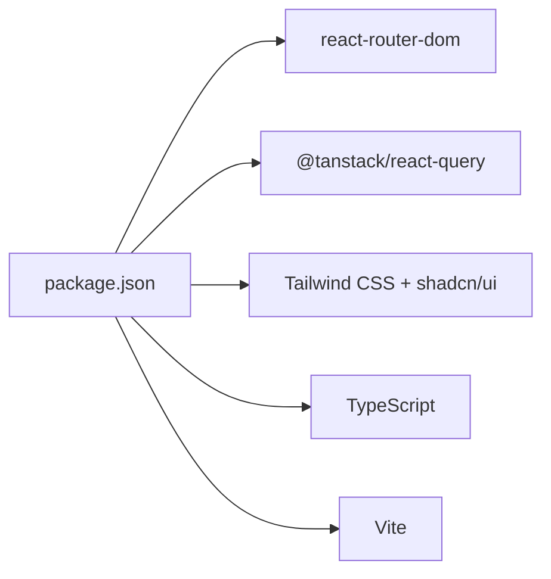

# Project Overview

<cite>
**Referenced Files in This Document**
- [README.md](file://README.md)
- [package.json](file://package.json)
- [src/main.tsx](file://src/main.tsx)
- [src/App.tsx](file://src/App.tsx)
- [src/components/DashboardLayout.tsx](file://src/components/DashboardLayout.tsx)
- [src/pages/Dashboard.tsx](file://src/pages/Dashboard.tsx)
- [src/pages/Members.tsx](file://src/pages/Members.tsx)
- [src/pages/Savings.tsx](file://src/pages/Savings.tsx)
- [src/pages/Loans.tsx](file://src/pages/Loans.tsx)
- [src/pages/Repayments.tsx](file://src/pages/Repayments.tsx)
- [src/pages/Reports.tsx](file://src/pages/Reports.tsx)
- [src/data/members.ts](file://src/data/members.ts)
- [src/data/savings.ts](file://src/data/savings.ts)
- [src/data/loans.ts](file://src/data/loans.ts)
- [src/data/repayments.ts](file://src/data/repayments.ts)
- [src/data/users.ts](file://src/data/users.ts)
</cite>

## Table of Contents
1. [Introduction](#introduction)
2. [Project Structure](#project-structure)
3. [Core Components](#core-components)
4. [Architecture Overview](#architecture-overview)
5. [Detailed Component Analysis](#detailed-component-analysis)
6. [Dependency Analysis](#dependency-analysis)
7. [Performance Considerations](#performance-considerations)
8. [Troubleshooting Guide](#troubleshooting-guide)
9. [Conclusion](#conclusion)

## Introduction
The SHG Management System is a Self Help Group (SHG) platform designed to digitize traditional grassroots financial cooperative operations for women-led groups. It targets SHG leaders, members, and administrators, enabling streamlined management of member registration, savings tracking, loan disbursement, repayment monitoring, and financial reporting. The system’s mission is to improve financial inclusion by offering a practical, accessible digital solution that works offline-first and integrates local data storage to support low-resource environments.

Key value propositions:
- Centralized, real-time visibility into group finances (savings, loans, repayments)
- Automated calculations for EMIs and repayment progress
- Role-based dashboards and actionable insights
- Local-first data model suitable for offline-first deployments

Positioning in the fintech space:
- Focused on grassroots financial organizations and self-help groups
- Emphasizes simplicity, accessibility, and offline usability
- Bridges traditional paper-based workflows with modern data-driven insights

## Project Structure
The project is a frontend-only React application bootstrapped with Vite and TypeScript, styled with Tailwind CSS and UI components from shadcn/ui. Routing is handled by React Router, and state/cache are managed with TanStack React Query. Data is modeled locally in TypeScript modules under src/data and consumed by page components.

**Diagram sources**
- [src/main.tsx](file://src/main.tsx#L1-L5)
- [src/App.tsx](file://src/App.tsx#L1-L48)
- [src/components/DashboardLayout.tsx](file://src/components/DashboardLayout.tsx#L1-L20)
- [src/pages/Dashboard.tsx](file://src/pages/Dashboard.tsx#L1-L190)
- [src/pages/Members.tsx](file://src/pages/Members.tsx#L1-L217)
- [src/pages/Savings.tsx](file://src/pages/Savings.tsx#L1-L246)
- [src/pages/Loans.tsx](file://src/pages/Loans.tsx#L1-L254)
- [src/pages/Reports.tsx](file://src/pages/Reports.tsx#L1-L213)
- [src/data/members.ts](file://src/data/members.ts#L1-L122)
- [src/data/savings.ts](file://src/data/savings.ts#L1-L73)
- [src/data/loans.ts](file://src/data/loans.ts#L1-L140)
- [src/data/repayments.ts](file://src/data/repayments.ts#L1-L71)
- [src/data/users.ts](file://src/data/users.ts#L1-L78)

**Section sources**
- [README.md](file://README.md#L53-L62)
- [package.json](file://package.json#L1-L90)
- [src/main.tsx](file://src/main.tsx#L1-L5)
- [src/App.tsx](file://src/App.tsx#L1-L48)

## Core Components
- Data modules define strongly typed models and helper functions for members, savings, loans, repayments, and users. These act as the local data layer and include aggregation helpers (e.g., totals, filters).
- Page components render domain-specific views (Dashboard, Members, Savings, Loans, Reports) and orchestrate UI interactions.
- Layout and shared UI components provide consistent navigation, tables, forms, and status indicators.

Representative responsibilities:
- src/data/members.ts: Member profiles and village-based grouping
- src/data/savings.ts: Monthly savings records, totals, and member-level aggregations
- src/data/loans.ts: Loan lifecycle, EMI calculation, active/disbursed metrics
- src/data/repayments.ts: EMI schedules, overdue/pending tracking, collections
- src/data/users.ts: Roles, current user mock, and SHG metadata
- src/pages/Dashboard.tsx: Executive overview, quick actions, recent repayment highlights
- src/pages/Members.tsx: Member listing, search, add-member dialog
- src/pages/Savings.tsx: Savings recording, member-wise summaries, recent transactions
- src/pages/Loans.tsx: Loan creation wizard, EMI calculator, loan cards
- src/pages/Reports.tsx: Financial summaries, charts, and analytics

**Section sources**
- [src/data/members.ts](file://src/data/members.ts#L1-L122)
- [src/data/savings.ts](file://src/data/savings.ts#L1-L73)
- [src/data/loans.ts](file://src/data/loans.ts#L1-L140)
- [src/data/repayments.ts](file://src/data/repayments.ts#L1-L71)
- [src/data/users.ts](file://src/data/users.ts#L1-L78)
- [src/pages/Dashboard.tsx](file://src/pages/Dashboard.tsx#L1-L190)
- [src/pages/Members.tsx](file://src/pages/Members.tsx#L1-L217)
- [src/pages/Savings.tsx](file://src/pages/Savings.tsx#L1-L246)
- [src/pages/Loans.tsx](file://src/pages/Loans.tsx#L1-L254)
- [src/pages/Reports.tsx](file://src/pages/Reports.tsx#L1-L213)

## Architecture Overview
The system follows a client-side architecture:
- Entry point initializes providers for routing, tooltips, notifications, and caching.
- Pages consume local data modules and present domain-specific views.
- UI components are reused across pages for consistency.

**Diagram sources**
- [src/main.tsx](file://src/main.tsx#L1-L5)
- [src/App.tsx](file://src/App.tsx#L1-L48)
- [src/components/DashboardLayout.tsx](file://src/components/DashboardLayout.tsx#L1-L20)
- [src/pages/Dashboard.tsx](file://src/pages/Dashboard.tsx#L1-L190)
- [src/pages/Members.tsx](file://src/pages/Members.tsx#L1-L217)
- [src/pages/Savings.tsx](file://src/pages/Savings.tsx#L1-L246)
- [src/pages/Loans.tsx](file://src/pages/Loans.tsx#L1-L254)
- [src/pages/Reports.tsx](file://src/pages/Reports.tsx#L1-L213)
- [src/data/members.ts](file://src/data/members.ts#L1-L122)
- [src/data/savings.ts](file://src/data/savings.ts#L1-L73)
- [src/data/loans.ts](file://src/data/loans.ts#L1-L140)
- [src/data/repayments.ts](file://src/data/repayments.ts#L1-L71)
- [src/data/users.ts](file://src/data/users.ts#L1-L78)

## Detailed Component Analysis

### Data Model Layer
The data layer defines core entities and helper functions for aggregation and filtering.

**Diagram sources**
- [src/data/members.ts](file://src/data/members.ts#L1-L122)
- [src/data/savings.ts](file://src/data/savings.ts#L1-L73)
- [src/data/loans.ts](file://src/data/loans.ts#L1-L140)
- [src/data/repayments.ts](file://src/data/repayments.ts#L1-L71)
- [src/data/users.ts](file://src/data/users.ts#L1-L78)

**Section sources**
- [src/data/members.ts](file://src/data/members.ts#L1-L122)
- [src/data/savings.ts](file://src/data/savings.ts#L1-L73)
- [src/data/loans.ts](file://src/data/loans.ts#L1-L140)
- [src/data/repayments.ts](file://src/data/repayments.ts#L1-L71)
- [src/data/users.ts](file://src/data/users.ts#L1-L78)

### Dashboard Page Workflow
The dashboard aggregates key metrics and presents quick actions and recent repayment highlights.

**Diagram sources**
- [src/pages/Dashboard.tsx](file://src/pages/Dashboard.tsx#L1-L190)
- [src/data/savings.ts](file://src/data/savings.ts#L64-L73)
- [src/data/loans.ts](file://src/data/loans.ts#L125-L140)
- [src/data/repayments.ts](file://src/data/repayments.ts#L57-L71)
- [src/data/members.ts](file://src/data/members.ts#L1-L122)

**Section sources**
- [src/pages/Dashboard.tsx](file://src/pages/Dashboard.tsx#L30-L190)
- [src/data/savings.ts](file://src/data/savings.ts#L64-L73)
- [src/data/loans.ts](file://src/data/loans.ts#L125-L140)
- [src/data/repayments.ts](file://src/data/repayments.ts#L57-L71)

### Savings Recording Flow
The savings page supports adding new savings and displays member-wise summaries and recent transactions.

**Diagram sources**
- [src/pages/Savings.tsx](file://src/pages/Savings.tsx#L1-L246)
- [src/data/savings.ts](file://src/data/savings.ts#L1-L73)

**Section sources**
- [src/pages/Savings.tsx](file://src/pages/Savings.tsx#L34-L165)
- [src/data/savings.ts](file://src/data/savings.ts#L59-L73)

### Loan Creation and EMI Calculation
The loans page provides a form to create loans with EMI computed dynamically.

**Diagram sources**
- [src/pages/Loans.tsx](file://src/pages/Loans.tsx#L150-L254)
- [src/data/loans.ts](file://src/data/loans.ts#L113-L118)
- [src/data/members.ts](file://src/data/members.ts#L1-L122)

**Section sources**
- [src/pages/Loans.tsx](file://src/pages/Loans.tsx#L28-L148)
- [src/data/loans.ts](file://src/data/loans.ts#L113-L140)

### Reports and Analytics
The reports page aggregates financial summaries and visualizes trends and distributions.

**Diagram sources**
- [src/pages/Reports.tsx](file://src/pages/Reports.tsx#L1-L213)
- [src/data/savings.ts](file://src/data/savings.ts#L64-L73)
- [src/data/loans.ts](file://src/data/loans.ts#L130-L140)
- [src/data/repayments.ts](file://src/data/repayments.ts#L67-L71)

**Section sources**
- [src/pages/Reports.tsx](file://src/pages/Reports.tsx#L25-L213)

## Dependency Analysis
The application relies on a focused set of libraries for UI, routing, state, and styling.

**Diagram sources**
- [package.json](file://package.json#L15-L88)

**Section sources**
- [package.json](file://package.json#L15-L88)

## Performance Considerations
- Local data modules are in-memory arrays; performance remains excellent for small to medium-sized datasets typical of SHGs.
- Prefer filtering and aggregation helpers (e.g., getMemberTotalSavings) to compute derived values efficiently.
- For larger datasets, consider virtualizing long lists in tables and deferring heavy computations to background threads if needed.
- Keep UI updates minimal by leveraging React memoization and efficient re-rendering patterns.

## Troubleshooting Guide
Common areas to check:
- Routing: Ensure routes in App match page paths and catch-all route is last.
- Data integrity: Verify IDs used in foreign-key relations (member_id, loan_id) align across data modules.
- UI interactions: Confirm dialogs and forms close properly after submission and that state resets appropriately.
- Provider setup: Ensure QueryClient provider is initialized before any page requiring caching.

**Section sources**
- [src/App.tsx](file://src/App.tsx#L21-L45)
- [src/pages/Members.tsx](file://src/pages/Members.tsx#L128-L217)
- [src/pages/Savings.tsx](file://src/pages/Savings.tsx#L167-L246)
- [src/pages/Loans.tsx](file://src/pages/Loans.tsx#L150-L254)

## Conclusion
The SHG Management System delivers a practical, offline-ready solution for women-led self-help groups. By centralizing member, savings, loan, and repayment data in local TypeScript modules and exposing them through intuitive React pages, it enables SHG leaders and administrators to track financial health, automate calculations, and generate insights. Its positioning in the fintech ecosystem emphasizes grassroots accessibility and operational digitization for underserved communities.