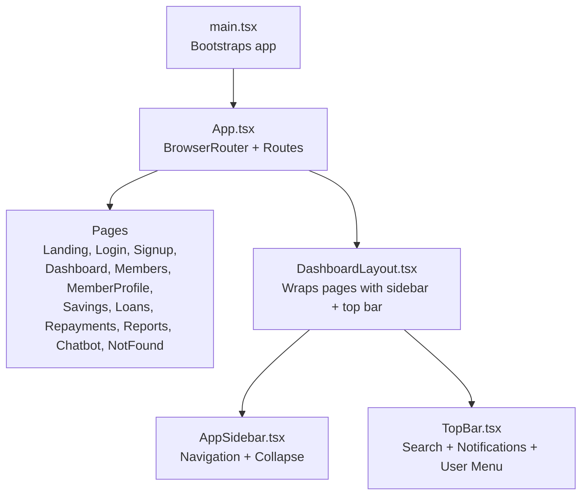
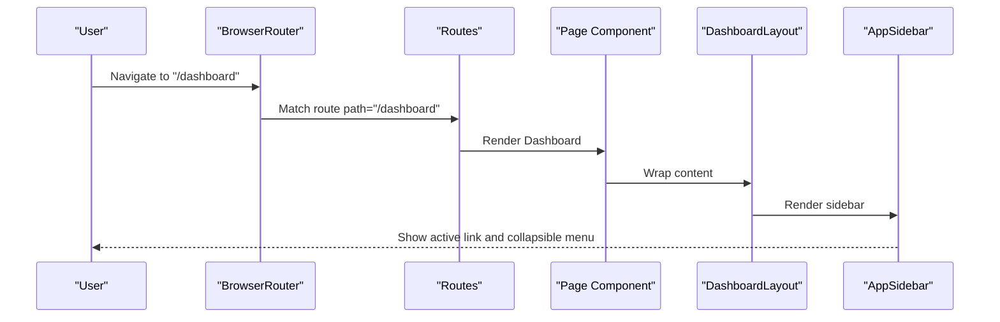
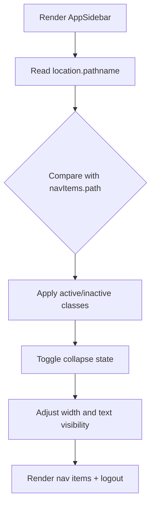
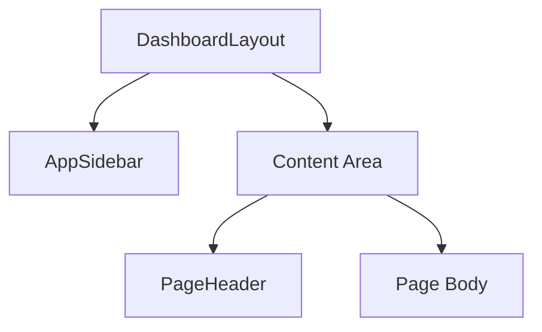
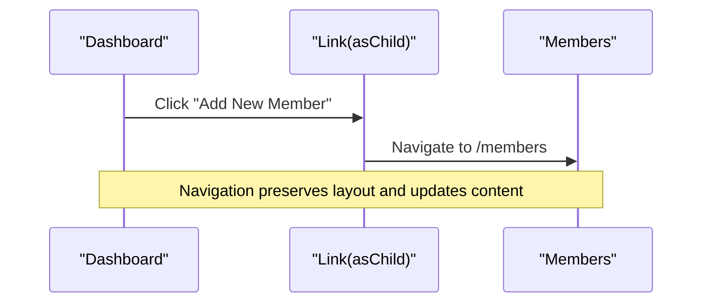
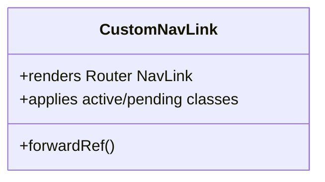
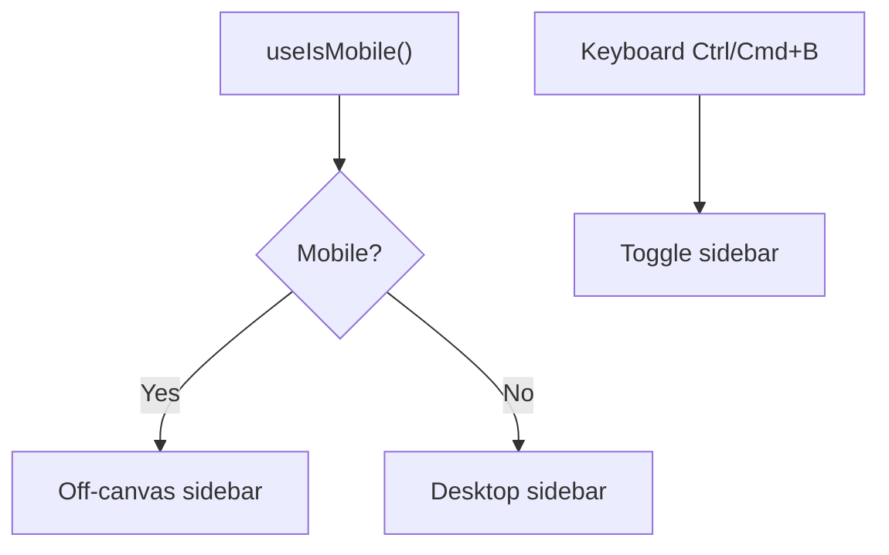
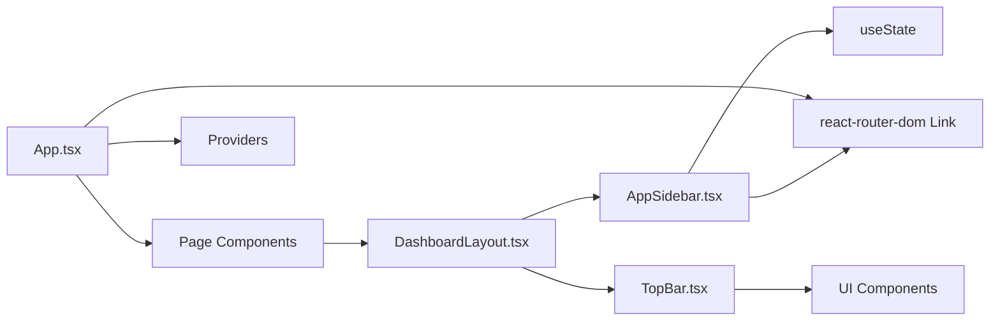

# Routing and Navigation

<cite>
**Referenced Files in This Document**
- [App.tsx](file://src/App.tsx)
- [main.tsx](file://src/main.tsx)
- [DashboardLayout.tsx](file://src/components/DashboardLayout.tsx)
- [AppSidebar.tsx](file://src/components/AppSidebar.tsx)
- [TopBar.tsx](file://src/components/TopBar.tsx)
- [Dashboard.tsx](file://src/pages/Dashboard.tsx)
- [Members.tsx](file://src/pages/Members.tsx)
- [MemberProfile.tsx](file://src/pages/MemberProfile.tsx)
- [NavLink.tsx](file://src/components/NavLink.tsx)
- [PageHeader.tsx](file://src/components/PageHeader.tsx)
- [sidebar.tsx](file://src/components/ui/sidebar.tsx)
- [users.ts](file://src/data/users.ts)
- [use-mobile.tsx](file://src/hooks/use-mobile.tsx)
</cite>

## Table of Contents
1. [Introduction](#introduction)
2. [Project Structure](#project-structure)
3. [Core Components](#core-components)
4. [Architecture Overview](#architecture-overview)
5. [Detailed Component Analysis](#detailed-component-analysis)
6. [Dependency Analysis](#dependency-analysis)
7. [Performance Considerations](#performance-considerations)
8. [Troubleshooting Guide](#troubleshooting-guide)
9. [Conclusion](#conclusion)

## Introduction
This document explains the routing and navigation architecture of the SHG Management System. It covers React Router DOM configuration, route definitions, sidebar navigation with collapsible behavior and active link highlighting, page-level layouts, programmatic navigation patterns, URL conventions, and the planned integration points for authentication, navigation guards, breadcrumbs, accessibility, and mobile responsiveness.

## Project Structure
The application uses React Router DOM for client-side routing. Pages are grouped under the pages directory and wrapped by a dashboard layout that includes a top bar and a sidebar. The sidebar supports collapsing and integrates with keyboard shortcuts and mobile detection.



**Diagram sources**
- [main.tsx](file://src/main.tsx#L1-L5)
- [App.tsx](file://src/App.tsx#L21-L45)
- [DashboardLayout.tsx](file://src/components/DashboardLayout.tsx#L9-L19)
- [AppSidebar.tsx](file://src/components/AppSidebar.tsx#L28-L100)
- [TopBar.tsx](file://src/components/TopBar.tsx#L15-L64)

**Section sources**
- [main.tsx](file://src/main.tsx#L1-L5)
- [App.tsx](file://src/App.tsx#L21-L45)

## Core Components
- App routing provider and routes: Defines the application’s routing tree and lazy-loaded page components.
- Dashboard layout: Provides a consistent header, collapsible sidebar, and content area.
- Sidebar navigation: Collapsible navigation with active link highlighting and logout.
- Top bar: Search input, notifications, and user dropdown menu.
- Page-level components: Dashboard, Members, MemberProfile, and others demonstrate layout usage and navigation patterns.
- Custom NavLink: A wrapper around react-router-dom’s NavLink for consistent active/pending classes.
- Mobile hook: Utility to detect mobile breakpoints for responsive behavior.
- UI sidebar primitives: Low-level building blocks for advanced sidebar behavior (used by the current AppSidebar).

**Section sources**
- [App.tsx](file://src/App.tsx#L21-L45)
- [DashboardLayout.tsx](file://src/components/DashboardLayout.tsx#L9-L19)
- [AppSidebar.tsx](file://src/components/AppSidebar.tsx#L28-L100)
- [TopBar.tsx](file://src/components/TopBar.tsx#L15-L64)
- [Dashboard.tsx](file://src/pages/Dashboard.tsx#L30-L189)
- [Members.tsx](file://src/pages/Members.tsx#L28-L126)
- [MemberProfile.tsx](file://src/pages/MemberProfile.tsx#L22-L176)
- [NavLink.tsx](file://src/components/NavLink.tsx#L11-L28)
- [use-mobile.tsx](file://src/hooks/use-mobile.tsx#L5-L19)
- [sidebar.tsx](file://src/components/ui/sidebar.tsx#L43-L128)

## Architecture Overview
The routing architecture centers on a single BrowserRouter wrapping a Routes collection. Pages are rendered inside a shared DashboardLayout that embeds AppSidebar and TopBar. Navigation links use react-router-dom’s Link or custom NavLink for active state styling. The sidebar supports collapsing and integrates with keyboard shortcuts and mobile detection.



**Diagram sources**
- [App.tsx](file://src/App.tsx#L26-L41)
- [Dashboard.tsx](file://src/pages/Dashboard.tsx#L30-L37)
- [DashboardLayout.tsx](file://src/components/DashboardLayout.tsx#L9-L19)
- [AppSidebar.tsx](file://src/components/AppSidebar.tsx#L28-L100)

## Detailed Component Analysis

### Routing Configuration and URL Conventions
- BrowserRouter is mounted at the root, enabling client-side routing.
- Route definitions cover landing, authentication, dashboard, and feature pages.
- A catch-all wildcard route renders a NotFound page.
- URL conventions:
  - Feature pages: plural nouns (e.g., /members, /savings, /loans, /repayments, /reports)
  - Dashboard: /dashboard
  - Chatbot: /chatbot
  - Authentication: /login, /signup
  - Member profile: /members/:memberId (dynamic segment)
  - Root: /
- Programmatic navigation:
  - Pages use Link and asChild patterns to integrate with UI buttons while preserving router semantics.
  - MemberProfile demonstrates fallback navigation to /members when a member is not found.

```mermaid
flowchart TD
Start(["Route Match"]) --> PathCheck{"Path matches?"}
PathCheck --> |"/" or "/landing"| Landing["Landing"]
PathCheck --> |"/login"| Login["Login"]
PathCheck --> |"/signup"| Signup["Signup"]
PathCheck --> |"/dashboard"| Dashboard["Dashboard"]
PathCheck --> |"/members"| Members["Members"]
PathCheck --> |"/members/:memberId"| MemberProfile["MemberProfile"]
PathCheck --> |"/savings"| Savings["Savings"]
PathCheck --> |"/loans"| Loans["Loans"]
PathCheck --> |"/repayments"| Repayments["Repayments"]
PathCheck --> |"/reports"| Reports["Reports"]
PathCheck --> |"/chatbot"| Chatbot["Chatbot"]
PathCheck --> |"* (catch-all)"| NotFound["NotFound"]
```

**Diagram sources**
- [App.tsx](file://src/App.tsx#L27-L41)

**Section sources**
- [App.tsx](file://src/App.tsx#L26-L41)
- [Dashboard.tsx](file://src/pages/Dashboard.tsx#L85-L108)
- [MemberProfile.tsx](file://src/pages/MemberProfile.tsx#L22-L37)

### Sidebar Navigation System
- Navigation items are defined as a static array with icon, label, and path.
- Active link highlighting is computed from the current location pathname.
- Collapsible behavior toggles width and text visibility; collapse state is stored locally.
- Logout link navigates to the root path.
- The sidebar integrates with the layout and uses Lucide icons for visual cues.



**Diagram sources**
- [AppSidebar.tsx](file://src/components/AppSidebar.tsx#L28-L100)

**Section sources**
- [AppSidebar.tsx](file://src/components/AppSidebar.tsx#L18-L26)
- [AppSidebar.tsx](file://src/components/AppSidebar.tsx#L29-L68)
- [AppSidebar.tsx](file://src/components/AppSidebar.tsx#L73-L97)

### Layout System: Header, Sidebar, Content
- DashboardLayout composes AppSidebar and TopBar with a content area.
- The layout ensures the main content area scrolls independently while keeping the header and sidebar fixed.
- Pages wrap themselves in DashboardLayout to inherit consistent structure.



**Diagram sources**
- [DashboardLayout.tsx](file://src/components/DashboardLayout.tsx#L9-L19)

**Section sources**
- [DashboardLayout.tsx](file://src/components/DashboardLayout.tsx#L9-L19)
- [PageHeader.tsx](file://src/components/PageHeader.tsx#L11-L23)

### Page-Level Navigation Patterns
- Dashboard demonstrates quick action buttons using asChild with Link to navigate to feature pages.
- Members page includes a search bar and a modal dialog; navigation uses Link to open forms and views.
- MemberProfile uses Link to return to the members list and displays dynamic content based on route params.



**Diagram sources**
- [Dashboard.tsx](file://src/pages/Dashboard.tsx#L85-L108)
- [Members.tsx](file://src/pages/Members.tsx#L54-L67)

**Section sources**
- [Dashboard.tsx](file://src/pages/Dashboard.tsx#L85-L118)
- [Members.tsx](file://src/pages/Members.tsx#L40-L124)
- [MemberProfile.tsx](file://src/pages/MemberProfile.tsx#L46-L52)

### Custom NavLink and Active States
- A custom NavLink wrapper forwards refs and applies active/pending classes conditionally.
- This enables consistent styling for active and pending navigation states across the app.



**Diagram sources**
- [NavLink.tsx](file://src/components/NavLink.tsx#L11-L28)

**Section sources**
- [NavLink.tsx](file://src/components/NavLink.tsx#L11-L28)

### Mobile Navigation and Responsive Behavior
- A mobile detection hook determines whether the UI should treat the device as mobile.
- The UI sidebar primitives include a keyboard shortcut to toggle the sidebar and support off-canvas behavior on mobile.
- These primitives can be used to build a more robust responsive sidebar if desired.



**Diagram sources**
- [use-mobile.tsx](file://src/hooks/use-mobile.tsx#L5-L19)
- [sidebar.tsx](file://src/components/ui/sidebar.tsx#L78-L89)

**Section sources**
- [use-mobile.tsx](file://src/hooks/use-mobile.tsx#L5-L19)
- [sidebar.tsx](file://src/components/ui/sidebar.tsx#L15-L20)
- [sidebar.tsx](file://src/components/ui/sidebar.tsx#L78-L89)

### Accessibility Features
- The UI sidebar primitives provide a screen-reader-friendly trigger and rail controls.
- The TopBar’s user menu uses accessible dropdown components.
- The custom NavLink wrapper preserves semantic anchor behavior for keyboard navigation.

**Section sources**
- [sidebar.tsx](file://src/components/ui/sidebar.tsx#L219-L241)
- [TopBar.tsx](file://src/components/TopBar.tsx#L38-L60)
- [NavLink.tsx](file://src/components/NavLink.tsx#L11-L28)

### Authentication, Guards, and Breadcrumbs (Planned)
- Authentication and navigation guards are not yet implemented in the current codebase.
- The users data module defines roles and a mock authentication helper, which can serve as a foundation for implementing guards and protected routes.
- Breadcrumb components exist in the UI library but are not currently integrated into the routing flow.

**Section sources**
- [users.ts](file://src/data/users.ts#L57-L61)
- [AppSidebar.tsx](file://src/components/AppSidebar.tsx#L86-L97)

## Dependency Analysis
The routing and navigation stack exhibits low coupling and clear separation of concerns:
- App.tsx depends on page components and React Router DOM.
- Pages depend on DashboardLayout for consistent structure.
- DashboardLayout composes AppSidebar and TopBar.
- AppSidebar uses react-router-dom Link and local state for collapse behavior.
- Mobile responsiveness leverages a dedicated hook and UI primitives.



**Diagram sources**
- [App.tsx](file://src/App.tsx#L26-L41)
- [DashboardLayout.tsx](file://src/components/DashboardLayout.tsx#L9-L19)
- [AppSidebar.tsx](file://src/components/AppSidebar.tsx#L28-L100)
- [TopBar.tsx](file://src/components/TopBar.tsx#L15-L64)

**Section sources**
- [App.tsx](file://src/App.tsx#L26-L41)
- [DashboardLayout.tsx](file://src/components/DashboardLayout.tsx#L9-L19)
- [AppSidebar.tsx](file://src/components/AppSidebar.tsx#L28-L100)
- [TopBar.tsx](file://src/components/TopBar.tsx#L15-L64)

## Performance Considerations
- Route rendering is declarative and lightweight; ensure future guards and auth checks avoid unnecessary re-renders.
- Prefer lazy loading for heavy pages if needed.
- Keep the sidebar navigation list concise to minimize render cost.
- Use the existing UI primitives for smooth transitions and animations.

## Troubleshooting Guide
- If links do not highlight as active, verify that the nav item paths match the current location exactly.
- If the sidebar does not collapse, check that the collapse state is controlled and that the width classes update accordingly.
- If mobile behavior feels inconsistent, confirm the mobile breakpoint and useIsMobile hook are functioning as expected.
- If keyboard shortcuts do not toggle the sidebar, ensure the global keydown listener is attached and not blocked by other handlers.

**Section sources**
- [AppSidebar.tsx](file://src/components/AppSidebar.tsx#L29-L68)
- [AppSidebar.tsx](file://src/components/AppSidebar.tsx#L73-L97)
- [use-mobile.tsx](file://src/hooks/use-mobile.tsx#L5-L19)
- [sidebar.tsx](file://src/components/ui/sidebar.tsx#L78-L89)

## Conclusion
The SHG Management System employs a clean, modular routing and navigation architecture centered on React Router DOM and a reusable dashboard layout. The sidebar offers collapsible navigation with active state awareness, while pages consistently wrap content within a unified structure. Future enhancements can integrate authentication, navigation guards, and breadcrumbs using the existing foundations and UI primitives.