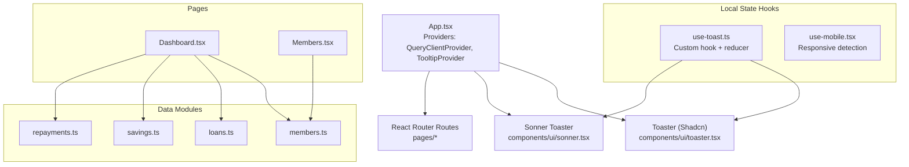
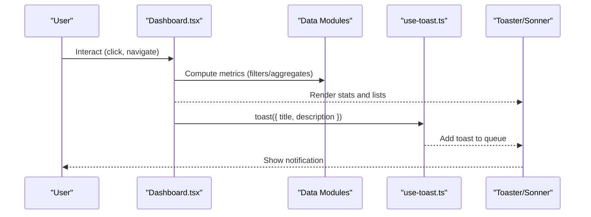
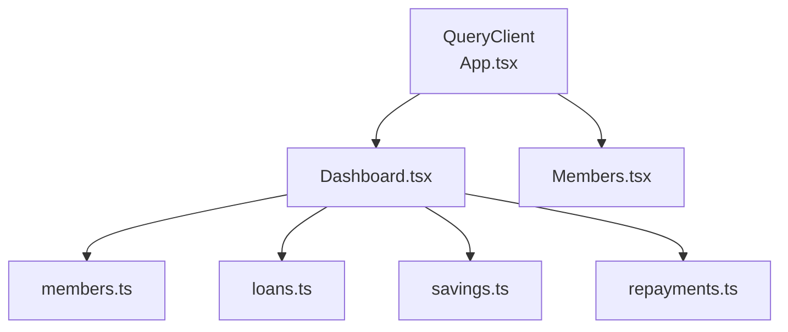
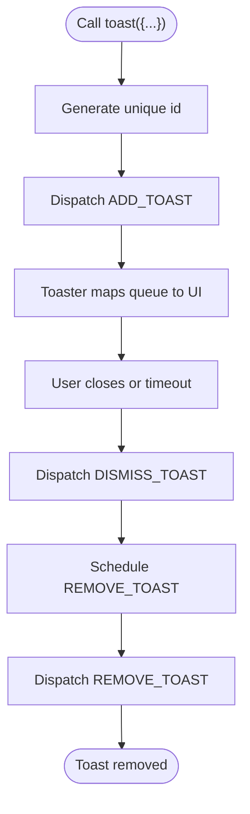
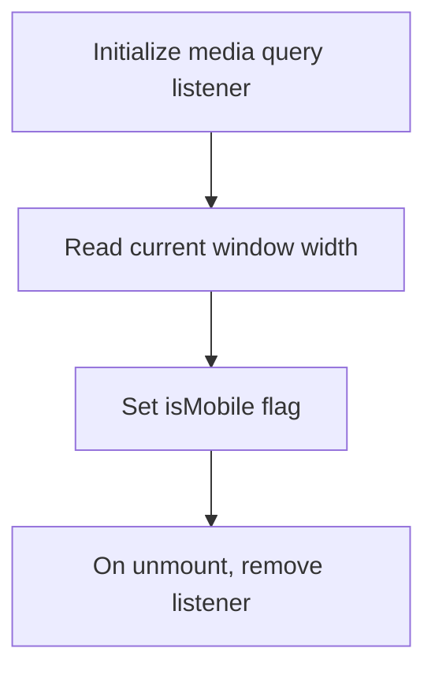
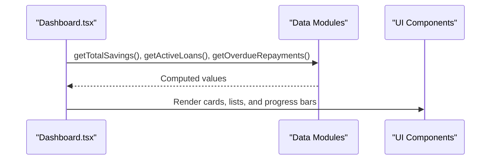
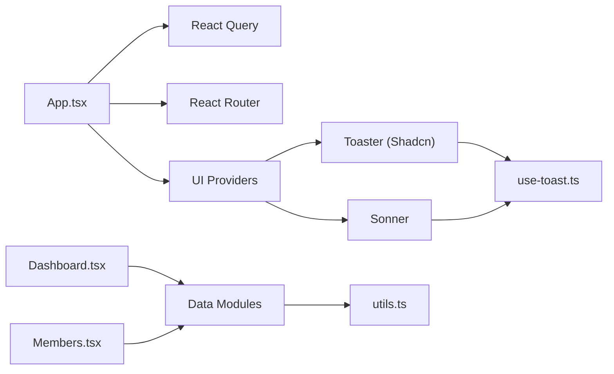

# State Management

<cite>
**Referenced Files in This Document**
- [App.tsx](file://src/App.tsx)
- [use-toast.ts](file://src/hooks/use-toast.ts)
- [use-mobile.tsx](file://src/hooks/use-mobile.tsx)
- [toaster.tsx](file://src/components/ui/toaster.tsx)
- [sonner.tsx](file://src/components/ui/sonner.tsx)
- [members.ts](file://src/data/members.ts)
- [loans.ts](file://src/data/loans.ts)
- [savings.ts](file://src/data/savings.ts)
- [repayments.ts](file://src/data/repayments.ts)
- [Dashboard.tsx](file://src/pages/Dashboard.tsx)
- [Members.tsx](file://src/pages/Members.tsx)
- [utils.ts](file://src/lib/utils.ts)
</cite>

## Table of Contents
1. [Introduction](#introduction)
2. [Project Structure](#project-structure)
3. [Core Components](#core-components)
4. [Architecture Overview](#architecture-overview)
5. [Detailed Component Analysis](#detailed-component-analysis)
6. [Dependency Analysis](#dependency-analysis)
7. [Performance Considerations](#performance-considerations)
8. [Troubleshooting Guide](#troubleshooting-guide)
9. [Conclusion](#conclusion)
10. [Appendices](#appendices)

## Introduction
This document explains the SHG Management System’s state management architecture with a focus on:
- React Query integration for data fetching, caching, and synchronization
- Local state management via custom hooks (use-toast and use-mobile)
- Unidirectional data flow, component communication, and notification UX
- Caching strategies, optimistic updates, error handling, and loading state management
- Integration between local state and data persistence
- Performance optimization and memory management
- Guidelines for extending state management patterns consistently

## Project Structure
The application initializes global providers at the root and organizes state-related concerns across hooks, UI components, and data modules. The React Query client is provided at the top-level, while local state concerns (toasts and responsive behavior) are encapsulated in dedicated hooks and UI wrappers.

**Diagram sources**
- [App.tsx](file://src/App.tsx#L1-L48)
- [toaster.tsx](file://src/components/ui/toaster.tsx#L1-L25)
- [sonner.tsx](file://src/components/ui/sonner.tsx#L1-L28)
- [use-toast.ts](file://src/hooks/use-toast.ts#L1-L186)
- [use-mobile.tsx](file://src/hooks/use-mobile.tsx#L1-L20)
- [members.ts](file://src/data/members.ts#L1-L122)
- [loans.ts](file://src/data/loans.ts#L1-L140)
- [savings.ts](file://src/data/savings.ts#L1-L73)
- [repayments.ts](file://src/data/repayments.ts#L1-L71)
- [Dashboard.tsx](file://src/pages/Dashboard.tsx#L1-L190)
- [Members.tsx](file://src/pages/Members.tsx#L1-L217)

**Section sources**
- [App.tsx](file://src/App.tsx#L1-L48)
- [use-toast.ts](file://src/hooks/use-toast.ts#L1-L186)
- [use-mobile.tsx](file://src/hooks/use-mobile.tsx#L1-L20)
- [toaster.tsx](file://src/components/ui/toaster.tsx#L1-L25)
- [sonner.tsx](file://src/components/ui/sonner.tsx#L1-L28)
- [Dashboard.tsx](file://src/pages/Dashboard.tsx#L1-L190)
- [Members.tsx](file://src/pages/Members.tsx#L1-L217)
- [members.ts](file://src/data/members.ts#L1-L122)
- [loans.ts](file://src/data/loans.ts#L1-L140)
- [savings.ts](file://src/data/savings.ts#L1-L73)
- [repayments.ts](file://src/data/repayments.ts#L1-L71)

## Core Components
- React Query Provider: Initializes a single QueryClient at the root and wraps the app to enable caching, invalidation, and background refetching across pages.
- Toaster (Shadcn): Provides a toast container and renderer for persistent notifications.
- Sonner Toaster: Alternative toast provider with theming and styling customization.
- use-toast Hook: A custom reducer-based local state manager for toast lifecycle (add, update, dismiss, remove) with auto-expiry and concurrency limits.
- use-mobile Hook: Detects mobile viewport and exposes a boolean flag for responsive UI decisions.
- Data Modules: Plain TypeScript modules exporting typed data and helper functions for filtering, aggregation, and computations.

Key responsibilities:
- App.tsx: Mounts providers and routes.
- use-toast.ts: Manages a global toast queue with immutable updates and side-effect timers.
- use-mobile.tsx: Tracks media queries and returns a normalized boolean.
- Data modules: Provide deterministic helpers for derived stats and filters used by pages.

**Section sources**
- [App.tsx](file://src/App.tsx#L1-L48)
- [use-toast.ts](file://src/hooks/use-toast.ts#L1-L186)
- [use-mobile.tsx](file://src/hooks/use-mobile.tsx#L1-L20)
- [toaster.tsx](file://src/components/ui/toaster.tsx#L1-L25)
- [sonner.tsx](file://src/components/ui/sonner.tsx#L1-L28)
- [members.ts](file://src/data/members.ts#L1-L122)
- [loans.ts](file://src/data/loans.ts#L1-L140)
- [savings.ts](file://src/data/savings.ts#L1-L73)
- [repayments.ts](file://src/data/repayments.ts#L1-L71)

## Architecture Overview
The system follows a unidirectional data flow:
- Pages read from data modules and pass computed props to UI components.
- Local state (toasts, mobile detection) is handled by dedicated hooks.
- React Query manages server-side data caching and synchronization globally.

**Diagram sources**
- [Dashboard.tsx](file://src/pages/Dashboard.tsx#L1-L190)
- [members.ts](file://src/data/members.ts#L1-L122)
- [loans.ts](file://src/data/loans.ts#L1-L140)
- [savings.ts](file://src/data/savings.ts#L1-L73)
- [repayments.ts](file://src/data/repayments.ts#L1-L71)
- [use-toast.ts](file://src/hooks/use-toast.ts#L1-L186)
- [toaster.tsx](file://src/components/ui/toaster.tsx#L1-L25)
- [sonner.tsx](file://src/components/ui/sonner.tsx#L1-L28)

## Detailed Component Analysis

### React Query Provider and Global Caching
- Initialization: A single QueryClient is created at the root and provided to the entire app.
- Scope: All pages benefit from shared cache, background refetch, and automatic invalidation.
- Synchronization: Components can subscribe to queries; cache updates propagate automatically.

**Diagram sources**
- [App.tsx](file://src/App.tsx#L19-L22)
- [Dashboard.tsx](file://src/pages/Dashboard.tsx#L1-L190)
- [Members.tsx](file://src/pages/Members.tsx#L1-L217)
- [members.ts](file://src/data/members.ts#L1-L122)
- [loans.ts](file://src/data/loans.ts#L1-L140)
- [savings.ts](file://src/data/savings.ts#L1-L73)
- [repayments.ts](file://src/data/repayments.ts#L1-L71)

**Section sources**
- [App.tsx](file://src/App.tsx#L1-L48)

### use-toast: Local Notification State
- State model: Immutable queue with a fixed upper bound and per-toast timers.
- Actions: Add, update, dismiss, remove; dismiss triggers delayed removal.
- Consumers: Pages call toast() to enqueue notifications; Toaster renders them.

**Diagram sources**
- [use-toast.ts](file://src/hooks/use-toast.ts#L1-L186)
- [toaster.tsx](file://src/components/ui/toaster.tsx#L1-L25)

**Section sources**
- [use-toast.ts](file://src/hooks/use-toast.ts#L1-L186)
- [toaster.tsx](file://src/components/ui/toaster.tsx#L1-L25)
- [sonner.tsx](file://src/components/ui/sonner.tsx#L1-L28)

### use-mobile: Responsive Behavior Hook
- Uses a media query listener to track viewport width against a breakpoint.
- Returns a boolean suitable for conditional rendering and layout adjustments.

**Diagram sources**
- [use-mobile.tsx](file://src/hooks/use-mobile.tsx#L1-L20)

**Section sources**
- [use-mobile.tsx](file://src/hooks/use-mobile.tsx#L1-L20)

### Data Modules: Helpers and Derived State
- members.ts: Typed records and helpers for filtering/searching.
- loans.ts: EMI calculation, membership filters, totals, and repayment percentages.
- savings.ts: Monthly aggregates and member-specific totals.
- repayments.ts: Overdue/pending filters and collected totals.

These modules centralize domain logic and are consumed by pages to compute statistics and render lists.

**Section sources**
- [members.ts](file://src/data/members.ts#L1-L122)
- [loans.ts](file://src/data/loans.ts#L1-L140)
- [savings.ts](file://src/data/savings.ts#L1-L73)
- [repayments.ts](file://src/data/repayments.ts#L1-L71)

### Pages: Unidirectional Data Flow and Component Communication
- Dashboard.tsx: Reads aggregated data from data modules and passes props to StatCard, ProgressBar, and tables.
- Members.tsx: Maintains local search and dialog state; uses data module helpers for filtering and rendering.

**Diagram sources**
- [Dashboard.tsx](file://src/pages/Dashboard.tsx#L1-L190)
- [members.ts](file://src/data/members.ts#L1-L122)
- [loans.ts](file://src/data/loans.ts#L1-L140)
- [savings.ts](file://src/data/savings.ts#L1-L73)
- [repayments.ts](file://src/data/repayments.ts#L1-L71)

**Section sources**
- [Dashboard.tsx](file://src/pages/Dashboard.tsx#L1-L190)
- [Members.tsx](file://src/pages/Members.tsx#L1-L217)

## Dependency Analysis
- App.tsx depends on React Query, React Router, and UI providers.
- use-toast.ts is self-contained and only depends on React.
- Toaster and Sonner consume use-toast state to render notifications.
- Pages depend on data modules for derived state and on UI components for rendering.

**Diagram sources**
- [App.tsx](file://src/App.tsx#L1-L48)
- [use-toast.ts](file://src/hooks/use-toast.ts#L1-L186)
- [toaster.tsx](file://src/components/ui/toaster.tsx#L1-L25)
- [sonner.tsx](file://src/components/ui/sonner.tsx#L1-L28)
- [Dashboard.tsx](file://src/pages/Dashboard.tsx#L1-L190)
- [Members.tsx](file://src/pages/Members.tsx#L1-L217)
- [utils.ts](file://src/lib/utils.ts#L1-L7)

**Section sources**
- [App.tsx](file://src/App.tsx#L1-L48)
- [use-toast.ts](file://src/hooks/use-toast.ts#L1-L186)
- [toaster.tsx](file://src/components/ui/toaster.tsx#L1-L25)
- [sonner.tsx](file://src/components/ui/sonner.tsx#L1-L28)
- [Dashboard.tsx](file://src/pages/Dashboard.tsx#L1-L190)
- [Members.tsx](file://src/pages/Members.tsx#L1-L217)
- [utils.ts](file://src/lib/utils.ts#L1-L7)

## Performance Considerations
- React Query caching: Enable selective invalidation and background refetch to avoid redundant network calls. Prefer query keys that reflect the current route and filters.
- Local toast state: Fixed-size queue prevents memory growth; timeouts are tracked per toast id to avoid leaks.
- Data module helpers: Keep computations pure and memoized at the component level if needed to prevent unnecessary re-renders.
- Responsive hook: Media query listeners are cleaned up on unmount to prevent dangling listeners.
- UI utilities: Use className merging helpers to minimize DOM thrashing during theme changes.

[No sources needed since this section provides general guidance]

## Troubleshooting Guide
- Toasts not appearing:
  - Ensure Toaster is rendered and use-toast is initialized.
  - Verify that toast() is called and the queue is not capped by the limit.
- Toasts not dismissing:
  - Confirm that onOpenChange triggers dismiss and timers are scheduled.
- Mobile layout not updating:
  - Check that the media query listener is attached and unmounted properly.
- Unexpected data staleness:
  - Review React Query cache configuration and invalidate queries after mutations.
- Excessive re-renders:
  - Wrap heavy computations with memoization and consider splitting state into smaller hooks.

**Section sources**
- [use-toast.ts](file://src/hooks/use-toast.ts#L1-L186)
- [use-mobile.tsx](file://src/hooks/use-mobile.tsx#L1-L20)
- [toaster.tsx](file://src/components/ui/toaster.tsx#L1-L25)
- [sonner.tsx](file://src/components/ui/sonner.tsx#L1-L28)

## Conclusion
The SHG Management System employs a clean separation of concerns:
- React Query handles server-side caching and synchronization
- Local hooks manage UI-focused state (notifications, responsive behavior)
- Data modules encapsulate domain logic and derivations
- Pages remain thin, focused on rendering and orchestrating component communication

This architecture supports scalability, maintainability, and predictable behavior across components.

[No sources needed since this section summarizes without analyzing specific files]

## Appendices

### Adding New State Management Patterns
Guidelines for consistency:
- Prefer React Query for server data; use local hooks for UI state (toasts, modals, mobile).
- Keep reducers and listeners scoped to their hooks; avoid global mutable stores.
- Use deterministic query keys and explicit invalidations for cache correctness.
- Encapsulate side effects (timeouts, event listeners) with cleanup in useEffect.
- Export typed helpers from data modules to enforce type safety and reuse.

[No sources needed since this section provides general guidance]