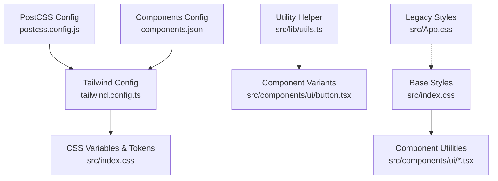
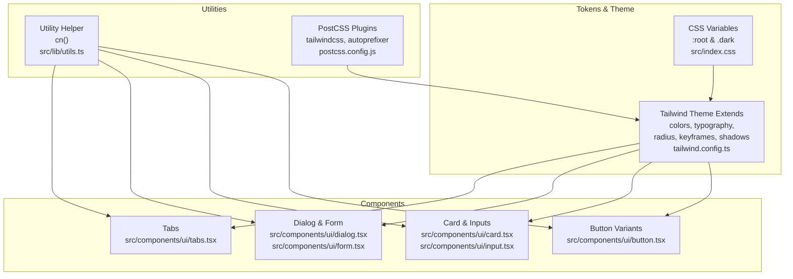
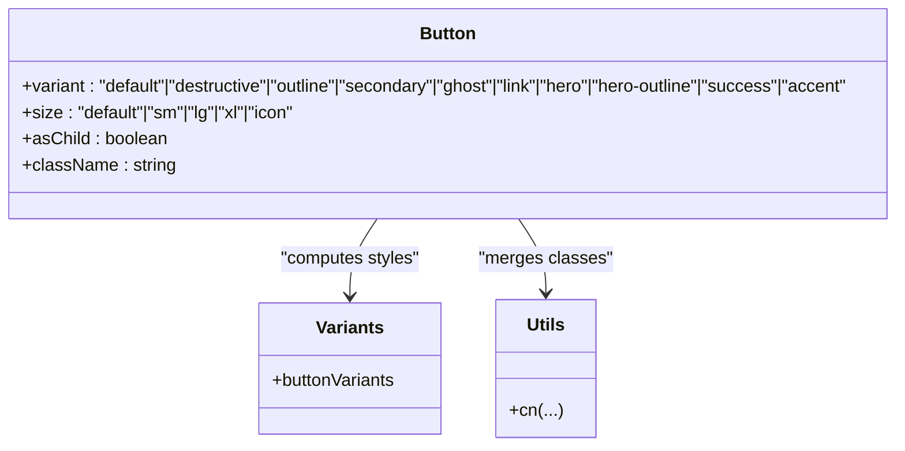
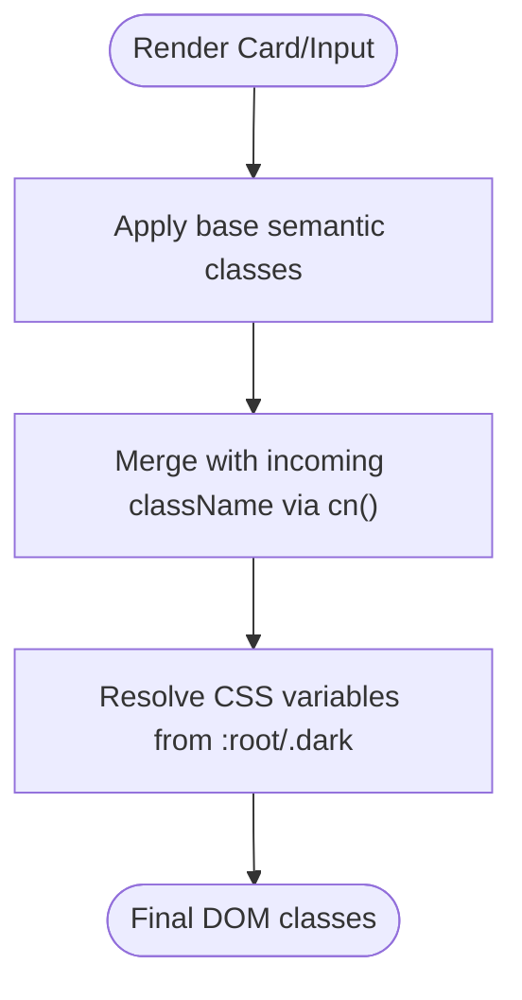
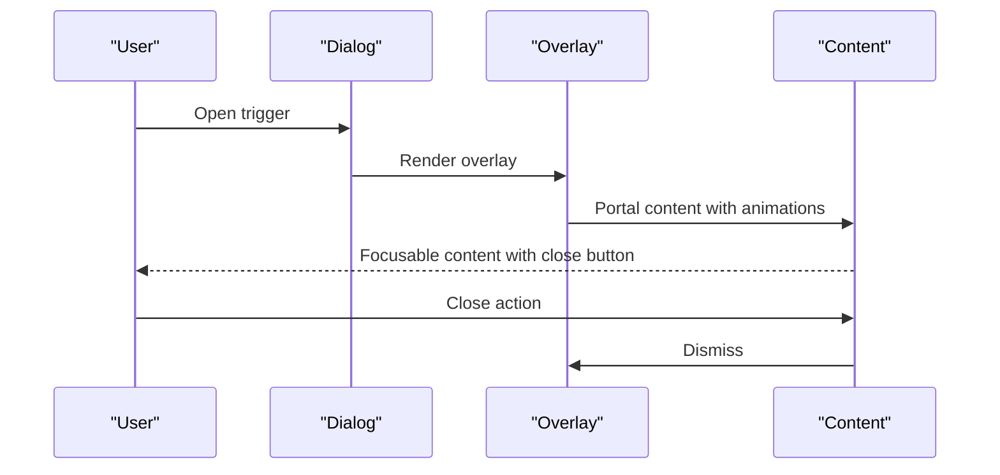
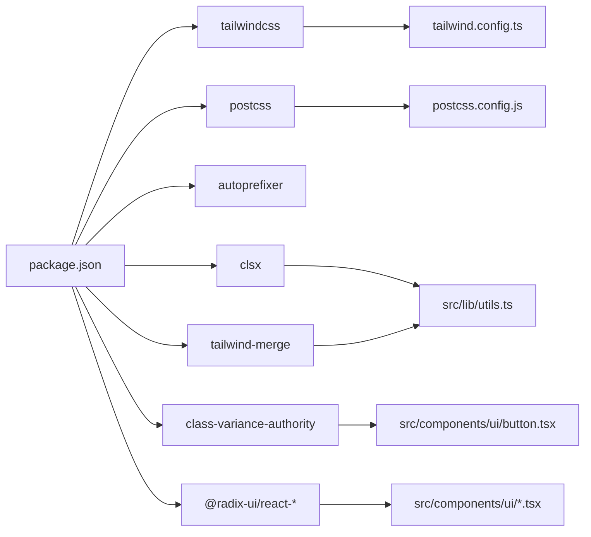

# Styling and Theming

<cite>
**Referenced Files in This Document**
- [tailwind.config.ts](file://tailwind.config.ts)
- [postcss.config.js](file://postcss.config.js)
- [components.json](file://components.json)
- [src/index.css](file://src/index.css)
- [src/App.css](file://src/App.css)
- [src/lib/utils.ts](file://src/lib/utils.ts)
- [src/components/ui/button.tsx](file://src/components/ui/button.tsx)
- [src/components/ui/card.tsx](file://src/components/ui/card.tsx)
- [src/components/ui/input.tsx](file://src/components/ui/input.tsx)
- [src/components/ui/dialog.tsx](file://src/components/ui/dialog.tsx)
- [src/components/ui/form.tsx](file://src/components/ui/form.tsx)
- [src/components/ui/tabs.tsx](file://src/components/ui/tabs.tsx)
- [src/hooks/use-mobile.tsx](file://src/hooks/use-mobile.tsx)
- [package.json](file://package.json)
</cite>

## Table of Contents
1. [Introduction](#introduction)
2. [Project Structure](#project-structure)
3. [Core Components](#core-components)
4. [Architecture Overview](#architecture-overview)
5. [Detailed Component Analysis](#detailed-component-analysis)
6. [Dependency Analysis](#dependency-analysis)
7. [Performance Considerations](#performance-considerations)
8. [Troubleshooting Guide](#troubleshooting-guide)
9. [Conclusion](#conclusion)
10. [Appendices](#appendices)

## Introduction
This document describes the SHG Management System’s styling and theming architecture. It explains how Tailwind CSS is configured, how design tokens and CSS variables are organized, and how component styling patterns are implemented. It also covers the variant system for buttons, responsive design conventions, dark mode behavior, accessibility considerations, and guidelines for maintaining design consistency across the application.

## Project Structure
The styling system is built around a layered CSS architecture:
- Tailwind layers: base, components, utilities
- Design tokens defined via CSS variables in the base layer
- Component-specific styles using Tailwind utilities and shadcn/ui primitives
- Utility helpers for merging class names

**Diagram sources**
- [tailwind.config.ts](file://tailwind.config.ts#L1-L129)
- [postcss.config.js](file://postcss.config.js#L1-L7)
- [components.json](file://components.json#L1-L21)
- [src/index.css](file://src/index.css#L1-L209)
- [src/lib/utils.ts](file://src/lib/utils.ts#L1-L7)
- [src/components/ui/button.tsx](file://src/components/ui/button.tsx#L1-L56)

**Section sources**
- [tailwind.config.ts](file://tailwind.config.ts#L1-L129)
- [postcss.config.js](file://postcss.config.js#L1-L7)
- [components.json](file://components.json#L1-L21)
- [src/index.css](file://src/index.css#L1-L209)
- [src/App.css](file://src/App.css#L1-L44)

## Core Components
- Design tokens and CSS variables define semantic color roles and layout scales. They are authored in the base layer and consumed by Tailwind theme values and component utilities.
- Tailwind theme extends color palettes, typography scale, border radius, keyframes, animations, and shadows.
- Component libraries (shadcn/ui) provide consistent primitives with variant-driven styling.

Key styling foundations:
- Semantic color roles: background, foreground, primary, secondary, muted, accent, destructive, success, warning, info, popover, card, border, input, ring, and sidebar variants.
- Typography scale: display, heading, subheading, body-lg, with specific line heights and letter spacing.
- Border radius scale: lg, md, sm mapped to a CSS variable for consistent corner radii.
- Motion: custom keyframes and animations for transitions like accordion, fade-in, slide-in-left, scale-in, and pulse-soft.
- Shadows: card and card-hover shadows defined as CSS variables and applied via utilities.

**Section sources**
- [tailwind.config.ts](file://tailwind.config.ts#L15-L125)
- [src/index.css](file://src/index.css#L10-L147)

## Architecture Overview
The styling architecture combines Tailwind utilities with component-specific styles and design tokens:

**Diagram sources**
- [src/index.css](file://src/index.css#L10-L147)
- [tailwind.config.ts](file://tailwind.config.ts#L7-L125)
- [src/lib/utils.ts](file://src/lib/utils.ts#L4-L6)
- [postcss.config.js](file://postcss.config.js#L1-L7)
- [src/components/ui/button.tsx](file://src/components/ui/button.tsx#L7-L39)
- [src/components/ui/card.tsx](file://src/components/ui/card.tsx#L5-L8)
- [src/components/ui/input.tsx](file://src/components/ui/input.tsx#L10-L12)
- [src/components/ui/dialog.tsx](file://src/components/ui/dialog.tsx#L15-L41)
- [src/components/ui/form.tsx](file://src/components/ui/form.tsx#L75-L82)
- [src/components/ui/tabs.tsx](file://src/components/ui/tabs.tsx#L23-L35)

## Detailed Component Analysis

### Button Variant System
The Button component uses a variant-authority pattern to encapsulate style variations and sizes. It merges incoming classes with computed variants using a utility that merges class names and resolves conflicts.

**Diagram sources**
- [src/components/ui/button.tsx](file://src/components/ui/button.tsx#L7-L39)
- [src/lib/utils.ts](file://src/lib/utils.ts#L4-L6)

**Section sources**
- [src/components/ui/button.tsx](file://src/components/ui/button.tsx#L1-L56)
- [src/lib/utils.ts](file://src/lib/utils.ts#L1-L7)

### Card and Input Patterns
- Card composes border, background, and shadow tokens to create elevated surfaces.
- Input applies focus states, ring emphasis, and responsive sizing while inheriting semantic colors.

**Diagram sources**
- [src/components/ui/card.tsx](file://src/components/ui/card.tsx#L5-L7)
- [src/components/ui/input.tsx](file://src/components/ui/input.tsx#L10-L12)
- [src/lib/utils.ts](file://src/lib/utils.ts#L4-L6)
- [src/index.css](file://src/index.css#L10-L147)

**Section sources**
- [src/components/ui/card.tsx](file://src/components/ui/card.tsx#L1-L44)
- [src/components/ui/input.tsx](file://src/components/ui/input.tsx#L1-L23)

### Dialog and Form Accessibility
- Dialog overlays and content animate in/out with motion tokens and portal rendering.
- Form components integrate with labels, error states, and ARIA attributes for assistive technologies.

**Diagram sources**
- [src/components/ui/dialog.tsx](file://src/components/ui/dialog.tsx#L15-L51)
- [src/components/ui/form.tsx](file://src/components/ui/form.tsx#L75-L82)

**Section sources**
- [src/components/ui/dialog.tsx](file://src/components/ui/dialog.tsx#L1-L96)
- [src/components/ui/form.tsx](file://src/components/ui/form.tsx#L1-L130)

### Tabs and Interactive States
- Tabs apply active-state styling and focus-visible rings to maintain keyboard accessibility and clear affordances.

**Section sources**
- [src/components/ui/tabs.tsx](file://src/components/ui/tabs.tsx#L1-L54)

## Dependency Analysis
The styling pipeline depends on Tailwind, PostCSS, and component libraries:

**Diagram sources**
- [package.json](file://package.json#L15-L64)
- [tailwind.config.ts](file://tailwind.config.ts#L1-L129)
- [postcss.config.js](file://postcss.config.js#L1-L7)
- [src/lib/utils.ts](file://src/lib/utils.ts#L1-L7)
- [src/components/ui/button.tsx](file://src/components/ui/button.tsx#L3-L5)

**Section sources**
- [package.json](file://package.json#L15-L64)

## Performance Considerations
- Prefer semantic color and spacing utilities to reduce custom CSS bloat.
- Use the utility helper to merge classes efficiently and avoid redundant styles.
- Keep animations minimal and scoped to interactive elements.
- Avoid excessive nesting in custom utilities; favor composition via Tailwind utilities.

## Troubleshooting Guide
- Dark mode not applying:
  - Ensure the dark mode class strategy is set and that the dark selector is present in the base layer.
  - Verify that the dark variant CSS variables are defined and referenced consistently.

- Variants not merging correctly:
  - Confirm the utility helper is used to merge incoming classes with computed variants.

- Animations not playing:
  - Check that the animation plugin is enabled and that keyframes are defined in the theme.

- Responsive breakpoints:
  - Mobile-first approach is used; verify media queries and mobile hook behavior.

**Section sources**
- [tailwind.config.ts](file://tailwind.config.ts#L4-L5)
- [src/index.css](file://src/index.css#L85-L125)
- [src/lib/utils.ts](file://src/lib/utils.ts#L4-L6)
- [src/hooks/use-mobile.tsx](file://src/hooks/use-mobile.tsx#L3-L18)

## Conclusion
The SHG Management System employs a robust, token-driven styling architecture that blends Tailwind utilities with component-specific variants. Design tokens unify color, typography, and spacing across light and dark modes, while component libraries ensure consistent behavior and accessibility. Following the outlined patterns and guidelines will help maintain design consistency and improve maintainability.

## Appendices

### Design Tokens and Color Palette
- Semantic roles: background, foreground, primary, secondary, muted, accent, destructive, success, warning, info, popover, card, border, input, ring, sidebar.
- Sidebar-specific roles: background, foreground, primary, primary-foreground, accent, accent-foreground, border, ring.
- Gradients: hero, card, accent.
- Shadows: card, card-hover.

**Section sources**
- [src/index.css](file://src/index.css#L11-L82)
- [tailwind.config.ts](file://tailwind.config.ts#L16-L71)

### Typography System
- Font family: Inter fallback chain.
- Scale: display, heading, subheading, body-lg with tailored line heights and letter spacing.

**Section sources**
- [tailwind.config.ts](file://tailwind.config.ts#L78-L86)
- [src/index.css](file://src/index.css#L138-L146)

### Spacing Conventions
- Container padding and max-width for page layout.
- Consistent spacing units derived from component utilities and semantic tokens.

**Section sources**
- [tailwind.config.ts](file://tailwind.config.ts#L8-L14)
- [src/index.css](file://src/index.css#L2-L7)

### Variant and Component Styling Patterns
- Buttons: variant and size variants with consistent focus, hover, and disabled states.
- Cards: surface-level elevation with border and shadow tokens.
- Inputs: focus ring, placeholder, and responsive sizing.
- Dialogs: overlay, portal rendering, and motion-driven open/close.
- Forms: label, control, description, and error messaging with ARIA integration.
- Tabs: active-state styling and focus-visible rings.

**Section sources**
- [src/components/ui/button.tsx](file://src/components/ui/button.tsx#L10-L37)
- [src/components/ui/card.tsx](file://src/components/ui/card.tsx#L5-L7)
- [src/components/ui/input.tsx](file://src/components/ui/input.tsx#L10-L12)
- [src/components/ui/dialog.tsx](file://src/components/ui/dialog.tsx#L15-L51)
- [src/components/ui/form.tsx](file://src/components/ui/form.tsx#L75-L82)
- [src/components/ui/tabs.tsx](file://src/components/ui/tabs.tsx#L23-L35)

### Responsive Design Implementation
- Mobile-first approach with a breakpoint hook for runtime detection.
- Component utilities adapt to small/large screens with responsive sizing.

**Section sources**
- [src/hooks/use-mobile.tsx](file://src/hooks/use-mobile.tsx#L3-L18)
- [src/components/ui/input.tsx](file://src/components/ui/input.tsx#L10-L12)

### Dark Mode Support
- CSS variables switch between light and dark palettes.
- Tailwind dark mode strategy set to class-based.

**Section sources**
- [src/index.css](file://src/index.css#L85-L125)
- [tailwind.config.ts](file://tailwind.config.ts#L4-L4)

### Accessibility Considerations
- Focus-visible rings and outlines for interactive elements.
- ARIA attributes for form controls and dialogs.
- Sufficient color contrast maintained by semantic tokens.
- Reduced motion preferences respected in legacy spin animation.

**Section sources**
- [src/components/ui/button.tsx](file://src/components/ui/button.tsx#L8-L8)
- [src/components/ui/form.tsx](file://src/components/ui/form.tsx#L86-L96)
- [src/components/ui/dialog.tsx](file://src/components/ui/dialog.tsx#L45-L48)
- [src/App.css](file://src/App.css#L31-L35)

### Cross-Browser Compatibility
- Autoprefixer included in PostCSS pipeline.
- CSS variables and modern utilities supported with fallbacks via semantic tokens.

**Section sources**
- [postcss.config.js](file://postcss.config.js#L1-L7)
- [package.json](file://package.json#L75-L82)