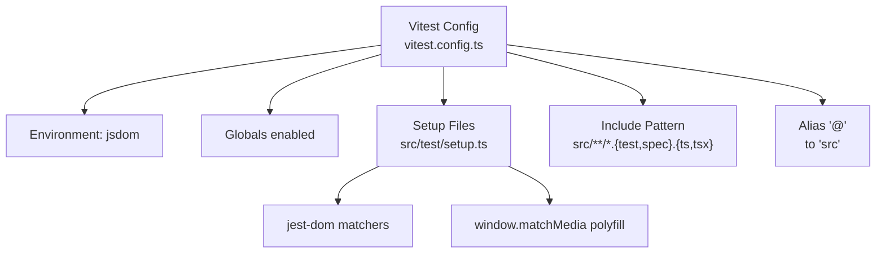
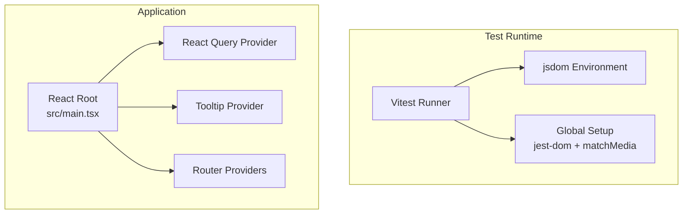
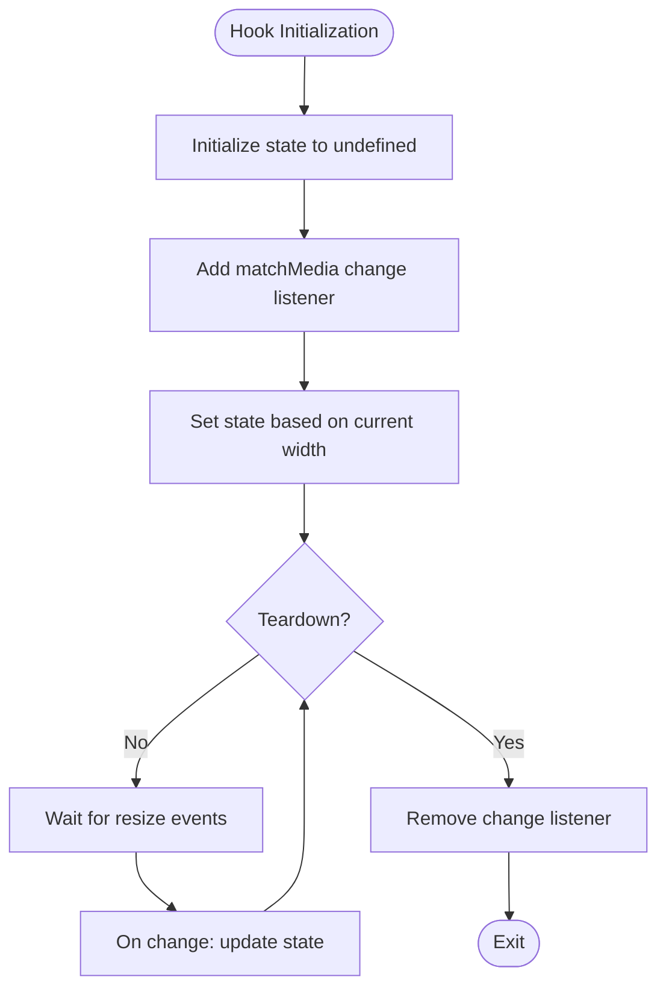
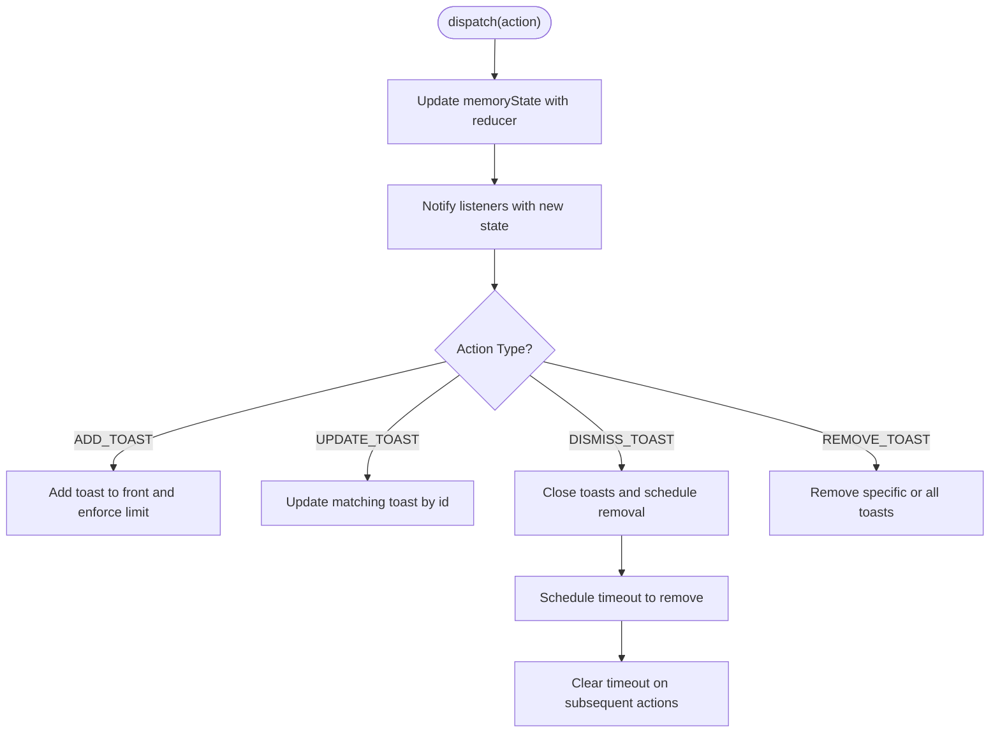
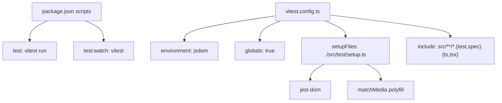

# Testing Strategy

<cite>
**Referenced Files in This Document**
- [vitest.config.ts](file://vitest.config.ts)
- [src/test/setup.ts](file://src/test/setup.ts)
- [src/test/example.test.ts](file://src/test/example.test.ts)
- [package.json](file://package.json)
- [src/hooks/use-mobile.tsx](file://src/hooks/use-mobile.tsx)
- [src/hooks/use-toast.ts](file://src/hooks/use-toast.ts)
- [src/lib/utils.ts](file://src/lib/utils.ts)
- [src/App.tsx](file://src/App.tsx)
- [src/main.tsx](file://src/main.tsx)
</cite>

## Table of Contents
1. [Introduction](#introduction)
2. [Project Structure](#project-structure)
3. [Core Components](#core-components)
4. [Architecture Overview](#architecture-overview)
5. [Detailed Component Analysis](#detailed-component-analysis)
6. [Dependency Analysis](#dependency-analysis)
7. [Performance Considerations](#performance-considerations)
8. [Troubleshooting Guide](#troubleshooting-guide)
9. [Conclusion](#conclusion)
10. [Appendices](#appendices)

## Introduction
This document defines the testing strategy for the SHG Management System. It covers Vitest configuration, testing setup, and testing patterns used across components, hooks, and utility functions. It also outlines unit and integration testing approaches, mock strategies, environment configuration, best practices for React components, async operations, and form validation. Guidance is included for test runner configuration, coverage reporting, and continuous integration considerations, along with practical examples and troubleshooting tips.

## Project Structure
The testing setup centers around Vitest configured to run in a jsdom environment with global helpers and a project alias. Test files are discovered under src using the pattern src/**/*.{test,spec}.{ts,tsx}. A global setup script configures DOM APIs commonly missing in jsdom and adds jest-dom matchers.

**Diagram sources**
- [vitest.config.ts](file://vitest.config.ts#L5-L16)
- [src/test/setup.ts](file://src/test/setup.ts#L1-L16)

**Section sources**
- [vitest.config.ts](file://vitest.config.ts#L1-L17)
- [src/test/setup.ts](file://src/test/setup.ts#L1-L16)
- [package.json](file://package.json#L6-L14)

## Core Components
This section documents the testing configuration and foundational setup used throughout the application.

- Vitest configuration
  - Environment: jsdom
  - Globals: enabled
  - Setup files: src/test/setup.ts
  - Include pattern: src/**/*.{test,spec}.{ts,tsx}
  - Alias: @ -> src

- Global setup
  - Adds jest-dom matchers for assertions
  - Provides a minimal polyfill for window.matchMedia to avoid runtime errors in tests

- Example test
  - Demonstrates a passing assertion in a describe block

- Scripts
  - test: runs Vitest in headless mode
  - test:watch: runs Vitest in watch mode

**Section sources**
- [vitest.config.ts](file://vitest.config.ts#L5-L16)
- [src/test/setup.ts](file://src/test/setup.ts#L1-L16)
- [src/test/example.test.ts](file://src/test/example.test.ts#L1-L8)
- [package.json](file://package.json#L6-L14)

## Architecture Overview
The testing architecture integrates Vitest with React components and hooks. The app initializes React Query and routing providers at the root level, which impacts how integration tests should mount components and manage asynchronous state.

**Diagram sources**
- [vitest.config.ts](file://vitest.config.ts#L7-L12)
- [src/test/setup.ts](file://src/test/setup.ts#L1-L16)
- [src/main.tsx](file://src/main.tsx#L1-L5)
- [src/App.tsx](file://src/App.tsx#L19-L45)

**Section sources**
- [src/main.tsx](file://src/main.tsx#L1-L5)
- [src/App.tsx](file://src/App.tsx#L19-L45)
- [vitest.config.ts](file://vitest.config.ts#L7-L12)

## Detailed Component Analysis
This section focuses on testing strategies for hooks and utility functions that are central to the application’s behavior.

### Hook: useIsMobile
Responsibilities:
- Detects mobile viewport using window.matchMedia and window.innerWidth
- Returns a boolean derived from the computed state

Testing approach:
- Mock window.matchMedia and window.innerWidth in setup.ts to control breakpoints deterministically
- Verify initial state and change handler behavior after a resize event
- Ensure cleanup removes event listeners

**Diagram sources**
- [src/hooks/use-mobile.tsx](file://src/hooks/use-mobile.tsx#L5-L19)

**Section sources**
- [src/hooks/use-mobile.tsx](file://src/hooks/use-mobile.tsx#L1-L20)
- [src/test/setup.ts](file://src/test/setup.ts#L3-L15)

### Hook: useToast
Responsibilities:
- Manages toast notifications with a reducer-based state machine
- Supports adding, updating, dismissing, and removing toasts
- Enforces limits and schedules removals via timeouts

Testing approach:
- Mock timers to control timeout behavior deterministically
- Assert state transitions for add/update/dismiss/remove actions
- Verify side effects like adding/removing timeouts and dispatching updates

**Diagram sources**
- [src/hooks/use-toast.ts](file://src/hooks/use-toast.ts#L128-L133)
- [src/hooks/use-toast.ts](file://src/hooks/use-toast.ts#L71-L122)

**Section sources**
- [src/hooks/use-toast.ts](file://src/hooks/use-toast.ts#L1-L186)

### Utility: cn (class merging)
Responsibilities:
- Merges Tailwind classes using clsx and twMerge

Testing approach:
- Provide various combinations of inputs (strings, objects, arrays)
- Assert deterministic merged class strings
- Validate order-insensitive deduplication behavior

**Section sources**
- [src/lib/utils.ts](file://src/lib/utils.ts#L1-L7)

## Dependency Analysis
This section maps testing dependencies and their roles in the test environment.

**Diagram sources**
- [package.json](file://package.json#L6-L14)
- [vitest.config.ts](file://vitest.config.ts#L7-L12)
- [src/test/setup.ts](file://src/test/setup.ts#L1-L16)

**Section sources**
- [package.json](file://package.json#L6-L14)
- [vitest.config.ts](file://vitest.config.ts#L1-L17)
- [src/test/setup.ts](file://src/test/setup.ts#L1-L16)

## Performance Considerations
- Prefer lightweight assertions and avoid heavy DOM queries in unit tests
- Use isolated tests for hooks and utilities to minimize setup overhead
- Keep test suites focused; group related tests to reduce re-renders and provider initialization costs
- Use fake timers for toast and similar async behaviors to avoid real delays

## Troubleshooting Guide
Common issues and resolutions:
- window.matchMedia is not a function
  - Cause: jsdom does not implement matchMedia by default
  - Resolution: Use the provided setup file that polyfills matchMedia
  - Reference: [src/test/setup.ts](file://src/test/setup.ts#L3-L15)

- Assertion library not recognized
  - Cause: Missing jest-dom setup
  - Resolution: Ensure setup file is loaded and jest-dom is installed
  - Reference: [src/test/setup.ts](file://src/test/setup.ts#L1-L1), [package.json](file://package.json#L68-L68)

- Tests failing due to async timeouts
  - Cause: Real timers in toast or other async logic
  - Resolution: Use fake timers in tests to control timeouts deterministically
  - Reference: [src/hooks/use-toast.ts](file://src/hooks/use-toast.ts#L53-L69)

- Aliasing not working in tests
  - Cause: Missing alias configuration
  - Resolution: Confirm alias '@' resolves to 'src' in Vitest config
  - Reference: [vitest.config.ts](file://vitest.config.ts#L13-L15)

- Provider-related test failures
  - Cause: Missing React Query or router providers in test environment
  - Resolution: Wrap mounted components with providers as needed for integration tests
  - Reference: [src/App.tsx](file://src/App.tsx#L19-L45)

**Section sources**
- [src/test/setup.ts](file://src/test/setup.ts#L1-L16)
- [src/hooks/use-toast.ts](file://src/hooks/use-toast.ts#L53-L69)
- [vitest.config.ts](file://vitest.config.ts#L13-L15)
- [src/App.tsx](file://src/App.tsx#L19-L45)

## Conclusion
The SHG Management System employs a straightforward yet robust testing setup with Vitest in jsdom, global setup for jest-dom and matchMedia, and a clear alias configuration. Unit tests for hooks and utilities should focus on deterministic behavior using fake timers and controlled inputs. Integration tests should wrap components with providers to simulate realistic environments. Following the guidelines in this document will improve test reliability, maintainability, and developer productivity.

## Appendices
- Test runner configuration
  - Environment: jsdom
  - Globals: enabled
  - Setup files: src/test/setup.ts
  - Include pattern: src/**/*.{test,spec}.{ts,tsx}
  - Alias: @ -> src

- Coverage reporting
  - Not configured in the current setup; enable via Vitest coverage options if needed

- Continuous integration considerations
  - Use the test script to run tests in CI
  - Consider adding coverage thresholds and watch mode for local development

**Section sources**
- [vitest.config.ts](file://vitest.config.ts#L7-L12)
- [package.json](file://package.json#L6-L14)