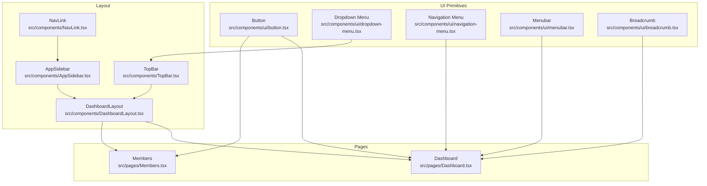
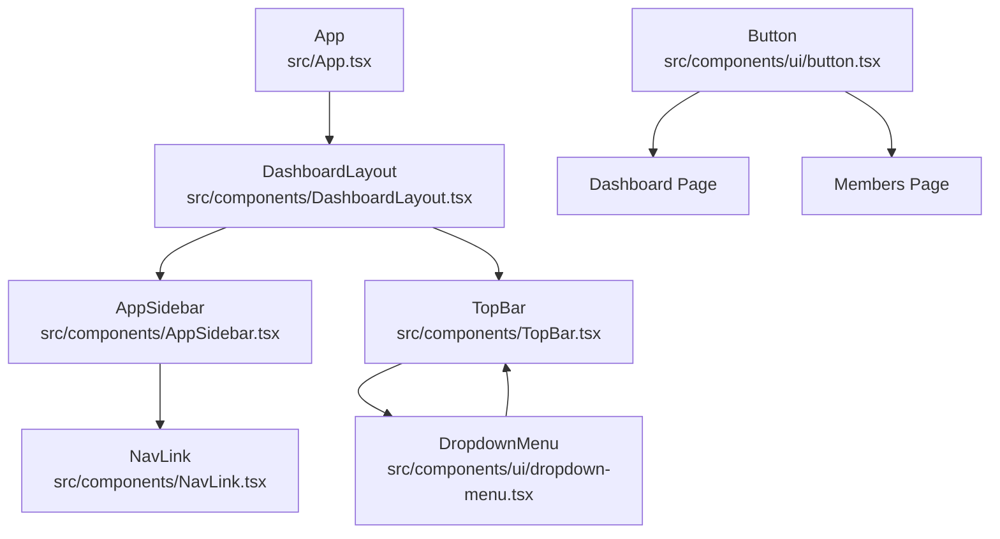
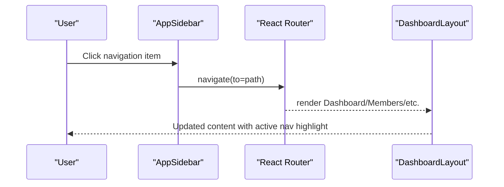
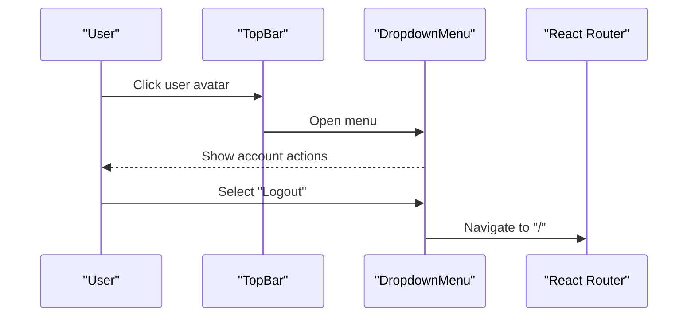
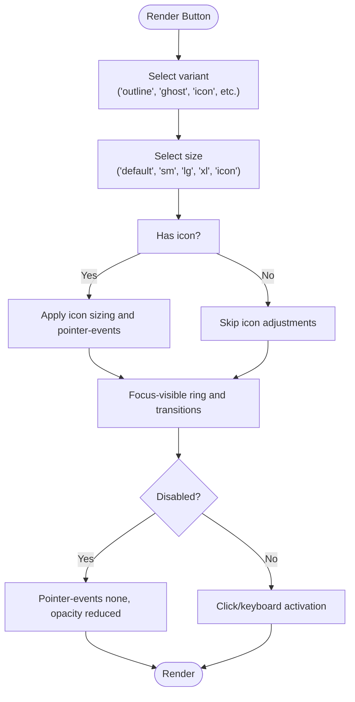
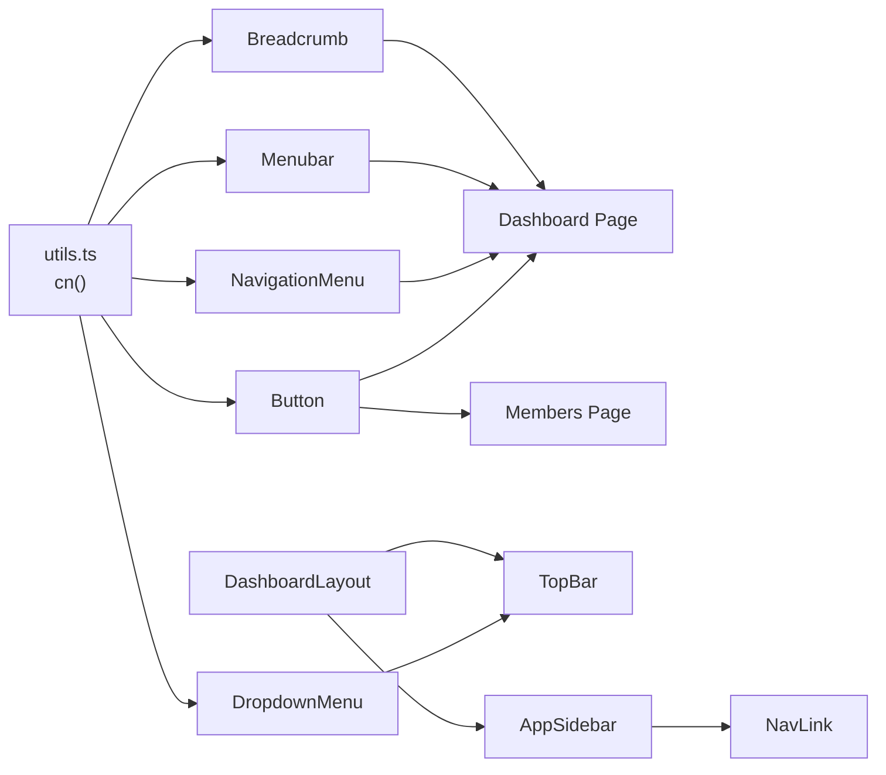

# Button & Navigation Components

<cite>
**Referenced Files in This Document**
- [button.tsx](file://src/components/ui/button.tsx)
- [dropdown-menu.tsx](file://src/components/ui/dropdown-menu.tsx)
- [menubar.tsx](file://src/components/ui/menubar.tsx)
- [breadcrumb.tsx](file://src/components/ui/breadcrumb.tsx)
- [navigation-menu.tsx](file://src/components/ui/navigation-menu.tsx)
- [DashboardLayout.tsx](file://src/components/DashboardLayout.tsx)
- [AppSidebar.tsx](file://src/components/AppSidebar.tsx)
- [TopBar.tsx](file://src/components/TopBar.tsx)
- [NavLink.tsx](file://src/components/NavLink.tsx)
- [utils.ts](file://src/lib/utils.ts)
- [Dashboard.tsx](file://src/pages/Dashboard.tsx)
- [Members.tsx](file://src/pages/Members.tsx)
- [App.tsx](file://src/App.tsx)
- [use-mobile.tsx](file://src/hooks/use-mobile.tsx)
</cite>

## Table of Contents
1. [Introduction](#introduction)
2. [Project Structure](#project-structure)
3. [Core Components](#core-components)
4. [Architecture Overview](#architecture-overview)
5. [Detailed Component Analysis](#detailed-component-analysis)
6. [Dependency Analysis](#dependency-analysis)
7. [Performance Considerations](#performance-considerations)
8. [Troubleshooting Guide](#troubleshooting-guide)
9. [Conclusion](#conclusion)
10. [Appendices](#appendices)

## Introduction
This document provides comprehensive documentation for button and navigation components in the SHG Management System. It covers the complete navigation ecosystem including buttons, dropdown menus, navigation menus, menubars, breadcrumbs, and sidebar navigation. For each component, we describe variants, sizes, colors, icons, and interaction patterns. Practical examples illustrate navigation setup, menu configuration, button styling, and user workflow patterns. Accessibility features, keyboard navigation, responsive behavior, and integration with the routing system are addressed, along with navigation patterns for dashboard layouts and mobile responsiveness.

## Project Structure
The navigation and button components are implemented as reusable UI primitives located under src/components/ui. They are composed into higher-level layout components such as DashboardLayout, AppSidebar, and TopBar. Pages like Dashboard and Members demonstrate real-world usage patterns.

**Diagram sources**
- [button.tsx](file://src/components/ui/button.tsx#L1-L56)
- [dropdown-menu.tsx](file://src/components/ui/dropdown-menu.tsx#L1-L180)
- [navigation-menu.tsx](file://src/components/ui/navigation-menu.tsx#L1-L121)
- [menubar.tsx](file://src/components/ui/menubar.tsx#L1-L208)
- [breadcrumb.tsx](file://src/components/ui/breadcrumb.tsx#L1-L91)
- [DashboardLayout.tsx](file://src/components/DashboardLayout.tsx#L1-L20)
- [AppSidebar.tsx](file://src/components/AppSidebar.tsx#L1-L101)
- [TopBar.tsx](file://src/components/TopBar.tsx#L1-L65)
- [NavLink.tsx](file://src/components/NavLink.tsx#L1-L29)
- [Dashboard.tsx](file://src/pages/Dashboard.tsx#L1-L190)
- [Members.tsx](file://src/pages/Members.tsx#L1-L217)

**Section sources**
- [button.tsx](file://src/components/ui/button.tsx#L1-L56)
- [dropdown-menu.tsx](file://src/components/ui/dropdown-menu.tsx#L1-L180)
- [navigation-menu.tsx](file://src/components/ui/navigation-menu.tsx#L1-L121)
- [menubar.tsx](file://src/components/ui/menubar.tsx#L1-L208)
- [breadcrumb.tsx](file://src/components/ui/breadcrumb.tsx#L1-L91)
- [DashboardLayout.tsx](file://src/components/DashboardLayout.tsx#L1-L20)
- [AppSidebar.tsx](file://src/components/AppSidebar.tsx#L1-L101)
- [TopBar.tsx](file://src/components/TopBar.tsx#L1-L65)
- [NavLink.tsx](file://src/components/NavLink.tsx#L1-L29)
- [Dashboard.tsx](file://src/pages/Dashboard.tsx#L1-L190)
- [Members.tsx](file://src/pages/Members.tsx#L1-L217)

## Core Components
This section documents the primary button and navigation components, including their variants, sizes, colors, icons, and interaction patterns.

- Button
  - Variants: default, destructive, outline, secondary, ghost, link, hero, hero-outline, success, accent
  - Sizes: default, sm, lg, xl, icon
  - Behavior: supports asChild via Radix Slot, integrates SVG icons, focus-visible ring, disabled state, pointer-events handling
  - Accessibility: focus-visible outline, aria attributes handled externally
  - Usage patterns: action buttons, icon buttons, links styled as buttons, quick actions, navigation triggers

- Dropdown Menu
  - Triggers and content containers
  - Submenus, groups, separators
  - Checkbox and radio items with indicators
  - Keyboard navigation and portal rendering
  - Alignment and animations

- Navigation Menu
  - Root, list, item, trigger, content, viewport, indicator
  - Animated transitions and responsive viewport sizing
  - Trigger rotation indicator for open state

- Menubar
  - Root bar, menu items, triggers, content, submenus
  - Keyboard navigation and alignment controls
  - Shortcuts display

- Breadcrumb
  - Nav container, list, item, link/page, separator, ellipsis
  - Accessible roles and aria-current for current page
  - Responsive text wrapping and spacing

**Section sources**
- [button.tsx](file://src/components/ui/button.tsx#L7-L39)
- [dropdown-menu.tsx](file://src/components/ui/dropdown-menu.tsx#L7-L179)
- [navigation-menu.tsx](file://src/components/ui/navigation-menu.tsx#L8-L120)
- [menubar.tsx](file://src/components/ui/menubar.tsx#L17-L207)
- [breadcrumb.tsx](file://src/components/ui/breadcrumb.tsx#L7-L90)

## Architecture Overview
The navigation architecture centers around a dashboard layout with a persistent sidebar and a top bar. Buttons and dropdowns are used extensively for actions and user menus. The routing system integrates with NavLink to highlight active routes. Utility functions handle class merging for consistent styling.

**Diagram sources**
- [App.tsx](file://src/App.tsx#L21-L47)
- [DashboardLayout.tsx](file://src/components/DashboardLayout.tsx#L9-L19)
- [AppSidebar.tsx](file://src/components/AppSidebar.tsx#L28-L100)
- [TopBar.tsx](file://src/components/TopBar.tsx#L15-L64)
- [NavLink.tsx](file://src/components/NavLink.tsx#L11-L28)
- [button.tsx](file://src/components/ui/button.tsx#L47-L53)
- [dropdown-menu.tsx](file://src/components/ui/dropdown-menu.tsx#L7-L179)

## Detailed Component Analysis

### Button Component
The Button primitive provides a flexible foundation for interactive elements across the app. It leverages class-variance-authority for variants and sizes, integrates with Radix Slot for semantic composition, and ensures accessibility through focus-visible outlines.

Key characteristics:
- Variants: default, destructive, outline, secondary, ghost, link, hero, hero-outline, success, accent
- Sizes: default, sm, lg, xl, icon
- Icon support: nested SVG sizing and pointer-events handling
- States: disabled, hover, focus-visible ring, transition effects
- Composition: asChild enables rendering as anchor or other elements

Practical usage examples:
- Quick actions in Dashboard page using outline and icon variants
- Navigation triggers in AppSidebar using ghost and icon variants
- Dialog triggers and form actions in Members page

Accessibility and interaction patterns:
- Focus management via focus-visible ring
- Disabled state prevents interactions
- asChild allows semantic anchors while preserving button styling

**Section sources**
- [button.tsx](file://src/components/ui/button.tsx#L7-L39)
- [button.tsx](file://src/components/ui/button.tsx#L47-L53)
- [Dashboard.tsx](file://src/pages/Dashboard.tsx#L84-L108)
- [AppSidebar.tsx](file://src/components/AppSidebar.tsx#L75-L82)
- [Members.tsx](file://src/pages/Members.tsx#L54-L67)

### Dropdown Menu Component
The Dropdown Menu system provides contextual actions and settings. It supports nested submenus, checkboxes, radios, labels, and shortcuts. It integrates with the TopBar user menu and can be used for filtering and settings.

Key characteristics:
- Root, Trigger, Content, Item, Group, Portal, Sub, RadioGroup
- SubTrigger with ChevronRight indicator
- CheckboxItem and RadioItem with indicators
- Label and Separator for grouping
- Shortcut display for keybindings
- Animations and portal rendering for proper stacking

Integration examples:
- TopBar user menu with account actions and logout
- Contextual actions in data tables and cards

Keyboard and accessibility:
- Focus trapping and restoration
- Portal rendering for outside viewport boundaries
- Semantic roles and indicators for selection states

**Section sources**
- [dropdown-menu.tsx](file://src/components/ui/dropdown-menu.tsx#L7-L179)
- [TopBar.tsx](file://src/components/TopBar.tsx#L38-L60)

### Navigation Menu Component
The Navigation Menu offers a modern, animated dropdown navigation suitable for complex applications. It manages viewport sizing and smooth transitions for expanded content.

Key characteristics:
- Root, List, Item, Trigger, Content, Viewport, Indicator
- Trigger rotation indicator for open state
- Animated transitions and responsive viewport sizing
- Style computed via class variance authority

Usage patterns:
- Primary navigation in header or sidebar
- Multi-level categories with sub-content

Responsive behavior:
- Viewport sizing adapts to content height/width
- Animations activate on state changes

**Section sources**
- [navigation-menu.tsx](file://src/components/ui/navigation-menu.tsx#L8-L120)

### Menubar Component
The Menubar provides a desktop-style menu bar with triggers, content, and submenus. It supports keyboard navigation and alignment options.

Key characteristics:
- Root, Menu, Trigger, Content, Item, Group, Portal, Sub, RadioGroup
- SubTrigger with ChevronRight indicator
- CheckboxItem and RadioItem with indicators
- Label and Separator for grouping
- Shortcut display for keybindings
- Alignment and side offset controls

Accessibility:
- Focus management across menu items
- Keyboard navigation support

**Section sources**
- [menubar.tsx](file://src/components/ui/menubar.tsx#L17-L207)

### Breadcrumb Component
The Breadcrumb provides hierarchical navigation context with accessible roles and separators.

Key characteristics:
- Nav container with aria-label
- List, Item, Link, Page, Separator, Ellipsis
- Current page marked with aria-current and disabled link role
- Responsive text wrapping and spacing

Integration:
- Used within PageHeader to show context within the dashboard

**Section sources**
- [breadcrumb.tsx](file://src/components/ui/breadcrumb.tsx#L7-L90)

### Dashboard Layout and Navigation Integration
The DashboardLayout composes AppSidebar and TopBar to form the main navigation shell. AppSidebar provides persistent navigation with collapsible behavior and active state highlighting. TopBar hosts search, notifications, and user dropdown.

Key integration points:
- AppSidebar uses NavLink for route-aware active states
- TopBar uses DropdownMenu for user actions
- DashboardLayout wraps page content with consistent spacing and scrolling

Responsive behavior:
- Sidebar collapse toggles width and text visibility
- TopBar adapts icon-only mode on smaller screens

**Section sources**
- [DashboardLayout.tsx](file://src/components/DashboardLayout.tsx#L9-L19)
- [AppSidebar.tsx](file://src/components/AppSidebar.tsx#L28-L100)
- [TopBar.tsx](file://src/components/TopBar.tsx#L15-L64)
- [NavLink.tsx](file://src/components/NavLink.tsx#L11-L28)

### Routing Integration and Active States
The application uses React Router DOM with a dedicated NavLink wrapper that supports active and pending class names. This enables precise highlighting of active navigation items in the sidebar.

Key aspects:
- NavLink wrapper preserves className and adds active/pending states
- useLocation determines active state in AppSidebar
- Route definitions in App provide navigation targets

**Section sources**
- [NavLink.tsx](file://src/components/NavLink.tsx#L11-L28)
- [AppSidebar.tsx](file://src/components/AppSidebar.tsx#L29-L70)
- [App.tsx](file://src/App.tsx#L27-L41)

### Practical Examples and Workflows

#### Navigation Setup in Dashboard Layout
- Compose DashboardLayout with AppSidebar and TopBar
- Configure AppSidebar navItems with icons, labels, and paths
- Use useLocation to compute active state and apply styles
- Toggle sidebar collapse with Button and Chevron icons

**Diagram sources**
- [AppSidebar.tsx](file://src/components/AppSidebar.tsx#L54-L70)
- [DashboardLayout.tsx](file://src/components/DashboardLayout.tsx#L9-L19)
- [App.tsx](file://src/App.tsx#L31-L38)

#### Menu Configuration in TopBar
- DropdownMenuTrigger renders user avatar and name
- DropdownMenuContent lists account actions and logout
- Notification button shows badge count

**Diagram sources**
- [TopBar.tsx](file://src/components/TopBar.tsx#L38-L60)
- [App.tsx](file://src/App.tsx#L28-L29)

#### Button Styling and Interaction Patterns
- Quick actions in Dashboard use outline variant with icons and asChild Link
- Icon-only buttons in tables use ghost and icon sizes
- Dialog triggers use primary variant with icons

**Diagram sources**
- [button.tsx](file://src/components/ui/button.tsx#L7-L39)
- [Dashboard.tsx](file://src/pages/Dashboard.tsx#L84-L108)
- [Members.tsx](file://src/pages/Members.tsx#L105-L115)

## Dependency Analysis
The navigation components depend on shared utilities for class merging and Radix UI primitives for accessible interactions. The layout components orchestrate these primitives into cohesive navigation experiences.

**Diagram sources**
- [utils.ts](file://src/lib/utils.ts#L4-L6)
- [button.tsx](file://src/components/ui/button.tsx#L5-L5)
- [dropdown-menu.tsx](file://src/components/ui/dropdown-menu.tsx#L5-L5)
- [navigation-menu.tsx](file://src/components/ui/navigation-menu.tsx#L6-L6)
- [menubar.tsx](file://src/components/ui/menubar.tsx#L5-L5)
- [breadcrumb.tsx](file://src/components/ui/breadcrumb.tsx#L5-L5)
- [Dashboard.tsx](file://src/pages/Dashboard.tsx#L20-L28)
- [Members.tsx](file://src/pages/Members.tsx#L4-L26)
- [TopBar.tsx](file://src/components/TopBar.tsx#L1-L13)
- [AppSidebar.tsx](file://src/components/AppSidebar.tsx#L1-L16)
- [NavLink.tsx](file://src/components/NavLink.tsx#L1-L3)
- [DashboardLayout.tsx](file://src/components/DashboardLayout.tsx#L1-L7)

**Section sources**
- [utils.ts](file://src/lib/utils.ts#L4-L6)
- [button.tsx](file://src/components/ui/button.tsx#L5-L5)
- [dropdown-menu.tsx](file://src/components/ui/dropdown-menu.tsx#L5-L5)
- [navigation-menu.tsx](file://src/components/ui/navigation-menu.tsx#L6-L6)
- [menubar.tsx](file://src/components/ui/menubar.tsx#L5-L5)
- [breadcrumb.tsx](file://src/components/ui/breadcrumb.tsx#L5-L5)
- [Dashboard.tsx](file://src/pages/Dashboard.tsx#L20-L28)
- [Members.tsx](file://src/pages/Members.tsx#L4-L26)
- [TopBar.tsx](file://src/components/TopBar.tsx#L1-L13)
- [AppSidebar.tsx](file://src/components/AppSidebar.tsx#L1-L16)
- [NavLink.tsx](file://src/components/NavLink.tsx#L1-L3)
- [DashboardLayout.tsx](file://src/components/DashboardLayout.tsx#L1-L7)

## Performance Considerations
- Prefer icon-only buttons for dense toolbars to reduce layout thrashing
- Use the asChild pattern judiciously to avoid unnecessary DOM nodes
- Minimize re-renders by computing active states from location and avoiding deep prop drilling
- Keep dropdown and menubar content concise; defer heavy computations to lazy-loaded modules
- Use responsive breakpoints consistently to prevent layout shifts on mobile

## Troubleshooting Guide
Common issues and resolutions:
- Dropdown menu not opening/closing: verify Trigger and Portal usage; ensure content sideOffset and align props are appropriate
- Active nav highlighting incorrect: confirm useLocation pathname matches navItem path; ensure NavLink className precedence
- Button icon sizing inconsistent: ensure nested SVG receives size classes and pointer-events-none applied
- Sidebar collapse animation jank: verify transition-all classes and duration; avoid animating heavy child elements
- Mobile responsiveness: use useIsMobile hook to adjust layout and hide text in AppSidebar; test breakpoint thresholds

**Section sources**
- [dropdown-menu.tsx](file://src/components/ui/dropdown-menu.tsx#L59-L69)
- [AppSidebar.tsx](file://src/components/AppSidebar.tsx#L29-L70)
- [button.tsx](file://src/components/ui/button.tsx#L8-L8)
- [use-mobile.tsx](file://src/hooks/use-mobile.tsx#L5-L18)

## Conclusion
The SHG Management System’s navigation and button components form a cohesive, accessible, and responsive UI framework. Buttons provide consistent interaction affordances across variants and sizes, while dropdowns, navigation menus, menubars, and breadcrumbs deliver structured navigation experiences. The integration with React Router and the dashboard layout ensures intuitive workflows, particularly suited for dashboard and administrative contexts. Following the documented patterns and best practices will help maintain consistency and enhance user experience across devices and interactions.

## Appendices

### Accessibility Features Checklist
- Buttons: focus-visible ring, disabled state, aria attributes as needed
- Dropdowns: portal rendering, focus trapping, keyboard navigation
- Menus: keyboard navigation, role semantics, indicator states
- Breadcrumbs: aria-current on current page, separator roles

### Responsive Behavior Notes
- Sidebar collapses to icons-only on smaller screens
- TopBar adjusts text visibility and spacing
- Use useIsMobile hook to tailor navigation patterns per device

**Section sources**
- [AppSidebar.tsx](file://src/components/AppSidebar.tsx#L34-L50)
- [TopBar.tsx](file://src/components/TopBar.tsx#L17-L25)
- [use-mobile.tsx](file://src/hooks/use-mobile.tsx#L5-L18)