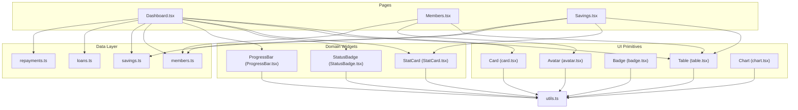
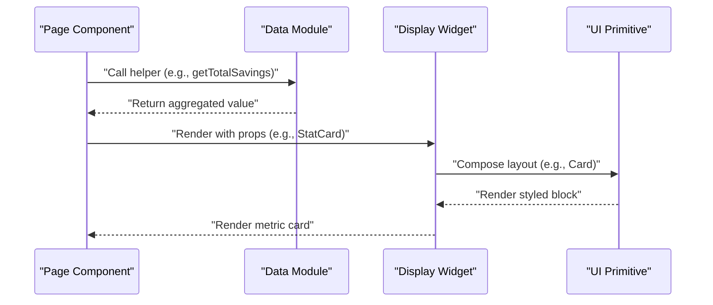
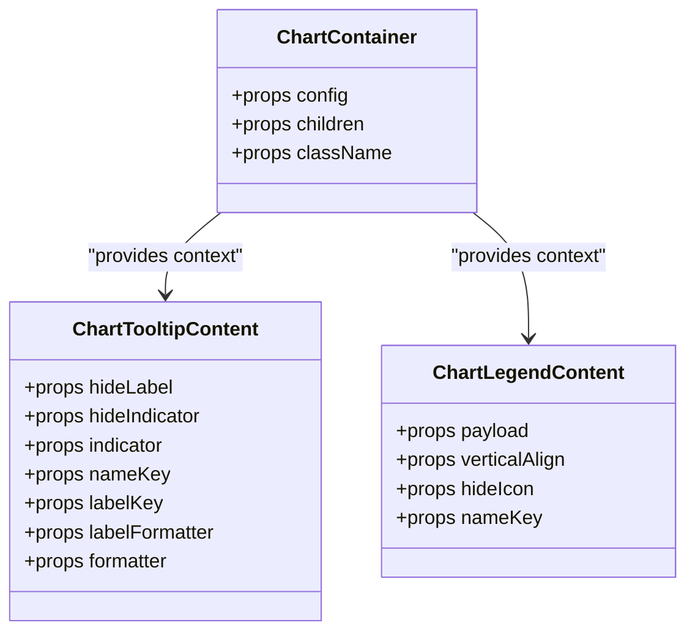
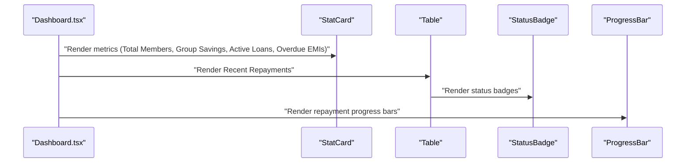
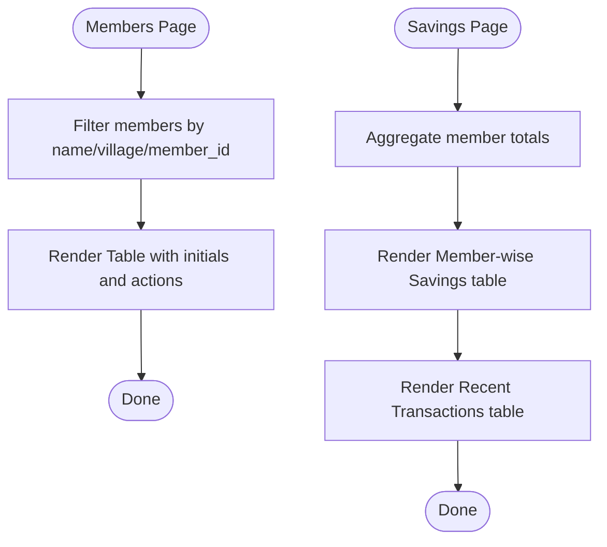
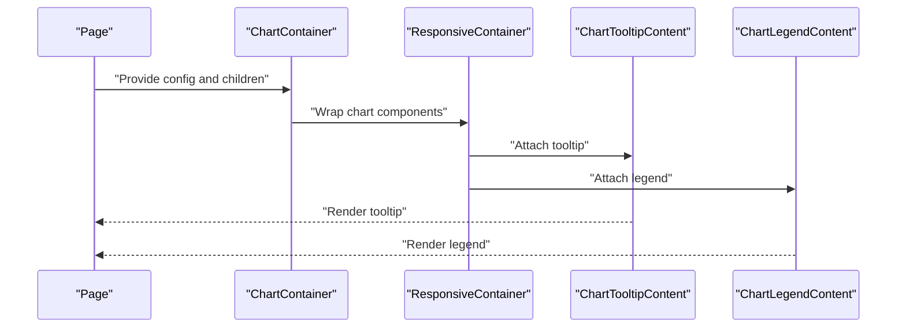
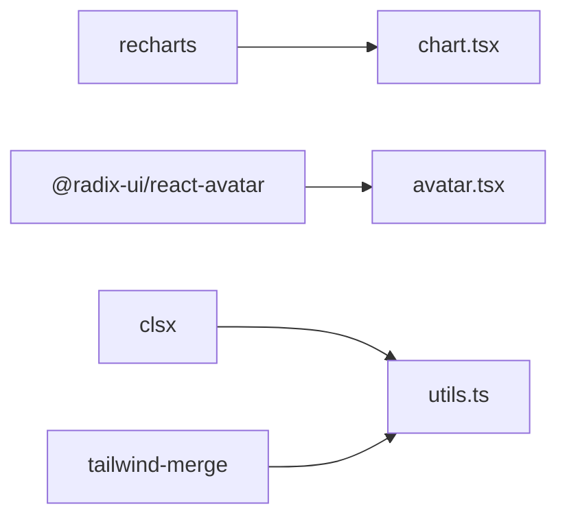

# Data Display Components

<cite>
**Referenced Files in This Document**
- [card.tsx](file://src/components/ui/card.tsx)
- [table.tsx](file://src/components/ui/table.tsx)
- [badge.tsx](file://src/components/ui/badge.tsx)
- [avatar.tsx](file://src/components/ui/avatar.tsx)
- [chart.tsx](file://src/components/ui/chart.tsx)
- [StatCard.tsx](file://src/components/StatCard.tsx)
- [StatusBadge.tsx](file://src/components/StatusBadge.tsx)
- [ProgressBar.tsx](file://src/components/ProgressBar.tsx)
- [utils.ts](file://src/lib/utils.ts)
- [Dashboard.tsx](file://src/pages/Dashboard.tsx)
- [Members.tsx](file://src/pages/Members.tsx)
- [Savings.tsx](file://src/pages/Savings.tsx)
- [members.ts](file://src/data/members.ts)
- [savings.ts](file://src/data/savings.ts)
- [loans.ts](file://src/data/loans.ts)
- [repayments.ts](file://src/data/repayments.ts)
- [package.json](file://package.json)
</cite>

## Table of Contents
1. [Introduction](#introduction)
2. [Project Structure](#project-structure)
3. [Core Components](#core-components)
4. [Architecture Overview](#architecture-overview)
5. [Detailed Component Analysis](#detailed-component-analysis)
6. [Dependency Analysis](#dependency-analysis)
7. [Performance Considerations](#performance-considerations)
8. [Troubleshooting Guide](#troubleshooting-guide)
9. [Conclusion](#conclusion)
10. [Appendices](#appendices)

## Introduction
This document describes the data display components used in the SHG Management System. It covers cards, tables, badges, avatars, and charts, along with supporting components such as StatCard, StatusBadge, and ProgressBar. For each component, we explain props/attributes, data formatting, styling variants, and integration patterns. Practical examples demonstrate rendering data in dashboards and lists, configuring tables, implementing charts, and building responsive displays. Accessibility, sorting/filtering, and performance for large datasets are addressed, alongside visualization patterns for statistical reporting and dashboard widgets.

## Project Structure
The data display system is composed of:
- Primitive UI components under src/components/ui (cards, tables, badges, avatars, charts)
- Domain-specific widgets under src/components (StatCard, StatusBadge, ProgressBar)
- Data models and helpers under src/data
- Pages under src/pages that integrate these components to render real-world SHG data

**Diagram sources**
- [card.tsx](file://src/components/ui/card.tsx#L1-L44)
- [table.tsx](file://src/components/ui/table.tsx#L1-L73)
- [badge.tsx](file://src/components/ui/badge.tsx#L1-L30)
- [avatar.tsx](file://src/components/ui/avatar.tsx#L1-L39)
- [chart.tsx](file://src/components/ui/chart.tsx#L1-L304)
- [StatCard.tsx](file://src/components/StatCard.tsx#L1-L73)
- [StatusBadge.tsx](file://src/components/StatusBadge.tsx#L1-L37)
- [ProgressBar.tsx](file://src/components/ProgressBar.tsx#L1-L50)
- [utils.ts](file://src/lib/utils.ts#L1-L7)
- [Dashboard.tsx](file://src/pages/Dashboard.tsx#L1-L190)
- [Members.tsx](file://src/pages/Members.tsx#L1-L217)
- [Savings.tsx](file://src/pages/Savings.tsx#L1-L246)
- [members.ts](file://src/data/members.ts#L1-L122)
- [savings.ts](file://src/data/savings.ts#L1-L73)
- [loans.ts](file://src/data/loans.ts#L1-L140)
- [repayments.ts](file://src/data/repayments.ts#L1-L71)

**Section sources**
- [Dashboard.tsx](file://src/pages/Dashboard.tsx#L1-L190)
- [Members.tsx](file://src/pages/Members.tsx#L1-L217)
- [Savings.tsx](file://src/pages/Savings.tsx#L1-L246)

## Core Components
This section documents the primitive UI components and domain widgets used for data presentation.

- Card family: Card, CardHeader, CardTitle, CardDescription, CardContent, CardFooter
  - Purpose: Containerized content blocks with consistent spacing and typography
  - Props: Standard HTML attributes; forwardRef enabled
  - Variants: Compose via Tailwind classes; no variant prop
  - Integration: Used in StatCard container and page sections

- Table family: Table, TableHeader, TableBody, TableFooter, TableHead, TableRow, TableCell, TableCaption
  - Purpose: Structured tabular data with responsive wrapper
  - Props: Standard HTML attributes; forwardRef enabled
  - Styling: Hover, selection, and caption styles; responsive container
  - Integration: Central to Members and Savings listings

- Badge: CVA-based variant system
  - Props: className, variant (default, secondary, destructive, outline)
  - Styling: Rounded pill with border and color tokens
  - Integration: Status indicators (e.g., StatusBadge)

- Avatar: Radix UI primitives with consistent sizing and fallback
  - Props: Root, Image, Fallback; forwardRef enabled
  - Styling: Circular container with fallback visuals
  - Integration: Initials placeholders in tables

- Chart: Recharts-based container with theme-aware color mapping
  - Props: config (ChartConfig), children (ResponsiveContainer), className
  - Features: Tooltip, Legend, Theme-aware CSS variables, label/icon mapping
  - Integration: Statistical reporting and dashboard widgets

- StatCard: Domain metric card with icon, trend, and variant
  - Props: title, value, subtitle, icon, trend, variant
  - Styling: Variant and icon palettes; hover shadow transitions
  - Integration: Dashboard metrics

- StatusBadge: Semantic status indicator
  - Props: status (Paid, Pending, Overdue, Active, Completed, Defaulted)
  - Styling: Variant-based border/background/foreground
  - Integration: Repayment status in tables

- ProgressBar: Progress visualization with variants and sizes
  - Props: value, max, variant, size, showLabel
  - Styling: Size and color variants; optional percentage label
  - Integration: Loan repayment progress in dashboard

**Section sources**
- [card.tsx](file://src/components/ui/card.tsx#L1-L44)
- [table.tsx](file://src/components/ui/table.tsx#L1-L73)
- [badge.tsx](file://src/components/ui/badge.tsx#L1-L30)
- [avatar.tsx](file://src/components/ui/avatar.tsx#L1-L39)
- [chart.tsx](file://src/components/ui/chart.tsx#L1-L304)
- [StatCard.tsx](file://src/components/StatCard.tsx#L1-L73)
- [StatusBadge.tsx](file://src/components/StatusBadge.tsx#L1-L37)
- [ProgressBar.tsx](file://src/components/ProgressBar.tsx#L1-L50)

## Architecture Overview
The data display architecture follows a layered pattern:
- Data layer: Typed models and helper functions provide structured data and aggregations
- Presentation layer: Primitive UI components and domain widgets compose reusable views
- Page layer: Pages orchestrate data fetching/aggregation and render composite views

**Diagram sources**
- [Dashboard.tsx](file://src/pages/Dashboard.tsx#L30-L190)
- [StatCard.tsx](file://src/components/StatCard.tsx#L32-L73)
- [card.tsx](file://src/components/ui/card.tsx#L5-L7)

**Section sources**
- [Dashboard.tsx](file://src/pages/Dashboard.tsx#L30-L190)
- [StatCard.tsx](file://src/components/StatCard.tsx#L32-L73)
- [card.tsx](file://src/components/ui/card.tsx#L5-L7)

## Detailed Component Analysis

### Cards
Cards provide a consistent container for grouped content. They support headers, titles, descriptions, content areas, and footers. Styling relies on Tailwind utilities and a shared cn utility for class merging.

- Props and slots:
  - Card: container div with background and border
  - CardHeader: columnar layout with vertical spacing
  - CardTitle: heading with size and weight
  - CardDescription: muted text for subtitles
  - CardContent: padding with top margin reset
  - CardFooter: horizontal alignment with top padding reset

- Styling variants:
  - Border radius and shadow applied via Tailwind
  - Typography scales and muted foreground for descriptions

- Integration patterns:
  - Wrap StatCard content
  - Enclose page sections and quick action panels

**Section sources**
- [card.tsx](file://src/components/ui/card.tsx#L5-L43)
- [utils.ts](file://src/lib/utils.ts#L4-L6)

### Tables
Tables offer a responsive, accessible foundation for tabular data. A wrapper ensures horizontal scrolling on small screens, while rows and cells include hover and selection states.

- Props and slots:
  - Table: wraps a responsive container around the table element
  - TableHeader/TableBody/TableFooter: semantic sections
  - TableRow: hover and selection states
  - TableHead/TableCell: alignment and padding
  - TableCaption: muted footer text

- Styling and responsiveness:
  - Horizontal overflow wrapper for small screens
  - Hover effects and selected state styling
  - Consistent padding and typography

- Integration patterns:
  - Members listing with initials avatars and actions
  - Savings summaries and recent transactions

**Section sources**
- [table.tsx](file://src/components/ui/table.tsx#L5-L72)
- [utils.ts](file://src/lib/utils.ts#L4-L6)

### Badges
Badges present discrete status or metadata with a compact pill shape. A CVA-based variant system controls colors and borders.

- Props:
  - className: additional classes
  - variant: default, secondary, destructive, outline

- Styling:
  - Rounded pill with border and color tokens
  - Focus ring and transition styles

- Integration patterns:
  - StatusBadge composes a semantic badge
  - Payment mode badges in transaction tables

**Section sources**
- [badge.tsx](file://src/components/ui/badge.tsx#L6-L27)
- [StatusBadge.tsx](file://src/components/StatusBadge.tsx#L25-L36)

### Avatars
Avatars render circular placeholders with fallback visuals, commonly used for member initials.

- Props:
  - Root: avatar container
  - Image: image content with aspect ratio
  - Fallback: centered placeholder with background

- Styling:
  - Fixed size and overflow hidden
  - Centered fallback content

- Integration patterns:
  - Initials in table rows for members

**Section sources**
- [avatar.tsx](file://src/components/ui/avatar.tsx#L6-L38)

### Charts
Charts wrap Recharts components with a theme-aware container and configurable tooltips and legends.

- Props:
  - ChartContainer: config (ChartConfig), children, className
  - ChartTooltipContent: hideLabel, hideIndicator, indicator, nameKey, labelKey, labelFormatter, formatter
  - ChartLegendContent: payload, verticalAlign, hideIcon, nameKey

- Styling and theming:
  - CSS variables mapped per theme (light/dark)
  - Axis and grid color overrides
  - Tooltip and legend customization

- Integration patterns:
  - Use ChartContainer with ResponsiveContainer children
  - Configure ChartConfig with labels/icons and color/theme mappings

**Diagram sources**
- [chart.tsx](file://src/components/ui/chart.tsx#L32-L59)
- [chart.tsx](file://src/components/ui/chart.tsx#L92-L226)
- [chart.tsx](file://src/components/ui/chart.tsx#L230-L275)

**Section sources**
- [chart.tsx](file://src/components/ui/chart.tsx#L32-L304)

### StatCard
StatCard presents KPI-style metrics with icons, optional trends, and variant styling.

- Props:
  - title, value, subtitle, icon, trend (value, positive), variant

- Styling:
  - Variant palettes for backgrounds and borders
  - Icon containers with variant colors
  - Hover shadows and transitions

- Integration patterns:
  - Dashboard metrics grid
  - Savings summary cards

**Section sources**
- [StatCard.tsx](file://src/components/StatCard.tsx#L4-L73)

### StatusBadge
StatusBadge renders semantic statuses with variant-based styling.

- Props:
  - status: one of Paid, Pending, Overdue, Active, Completed, Defaulted

- Styling:
  - Variant-based border/background/foreground tokens
  - Rounded pill shape

- Integration patterns:
  - Repayment status in recent repayments table

**Section sources**
- [StatusBadge.tsx](file://src/components/StatusBadge.tsx#L3-L36)

### ProgressBar
ProgressBar visualizes progress with size and color variants.

- Props:
  - value, max, variant, size, showLabel

- Styling:
  - Size variants (sm/md/lg)
  - Color variants (default/success/warning/destructive)
  - Optional percentage label

- Integration patterns:
  - Loan repayment progress in dashboard

**Section sources**
- [ProgressBar.tsx](file://src/components/ProgressBar.tsx#L3-L50)

### Practical Examples

#### Rendering Data in Dashboards
- Dashboard integrates StatCard for totals, StatusBadge for repayment statuses, and ProgressBar for loan progress. Tables display recent repayments with formatted dates and currency.

**Diagram sources**
- [Dashboard.tsx](file://src/pages/Dashboard.tsx#L44-L186)
- [StatCard.tsx](file://src/components/StatCard.tsx#L32-L73)
- [StatusBadge.tsx](file://src/components/StatusBadge.tsx#L25-L36)
- [ProgressBar.tsx](file://src/components/ProgressBar.tsx#L24-L50)

**Section sources**
- [Dashboard.tsx](file://src/pages/Dashboard.tsx#L44-L186)

#### Configuring Tables
- Members page filters data client-side and renders a responsive table with initials avatars and action buttons. Savings page aggregates member totals and renders two tables: member-wise savings and recent transactions.

**Diagram sources**
- [Members.tsx](file://src/pages/Members.tsx#L28-L126)
- [Savings.tsx](file://src/pages/Savings.tsx#L34-L164)

**Section sources**
- [Members.tsx](file://src/pages/Members.tsx#L28-L126)
- [Savings.tsx](file://src/pages/Savings.tsx#L34-L164)

#### Chart Implementations
- Use ChartContainer with a ResponsiveContainer child. Define ChartConfig with labels, icons, and color/theme mappings. Use ChartTooltipContent and ChartLegendContent for interactivity.

**Diagram sources**
- [chart.tsx](file://src/components/ui/chart.tsx#L32-L59)
- [chart.tsx](file://src/components/ui/chart.tsx#L92-L226)
- [chart.tsx](file://src/components/ui/chart.tsx#L230-L275)

**Section sources**
- [chart.tsx](file://src/components/ui/chart.tsx#L32-L304)

#### Responsive Data Displays
- Tables use a responsive wrapper to enable horizontal scrolling on small screens.
- Grid layouts adapt columns based on screen size (e.g., sm: 2, lg: 4 for stats).

**Section sources**
- [table.tsx](file://src/components/ui/table.tsx#L7-L9)
- [Dashboard.tsx](file://src/pages/Dashboard.tsx#L44-L74)

### Accessibility Features
- Tables: semantic markup with proper headers and roles; hover and focus states for keyboard navigation.
- Badges: neutral semantics; ensure sufficient color contrast for status meanings.
- Charts: tooltips and legends provide accessible labels; ensure color-blind friendly palettes.
- Avatars: fallback visuals when images fail; maintain consistent sizing.

**Section sources**
- [table.tsx](file://src/components/ui/table.tsx#L14-L42)
- [badge.tsx](file://src/components/ui/badge.tsx#L6-L27)
- [chart.tsx](file://src/components/ui/chart.tsx#L92-L226)
- [avatar.tsx](file://src/components/ui/avatar.tsx#L6-L38)

### Sorting and Filtering Capabilities
- Client-side filtering is demonstrated in the Members page using a controlled input to filter by name, village, or member ID.
- Sorting is not implemented in the current code; consider adding sort handlers to table headers and state management for column ordering.

**Section sources**
- [Members.tsx](file://src/pages/Members.tsx#L28-L38)

## Dependency Analysis
External libraries used for data display:
- Recharts for charting
- Radix UI for avatar primitives
- Tailwind utilities and class composition helpers

**Diagram sources**
- [package.json](file://package.json#L15-L64)
- [chart.tsx](file://src/components/ui/chart.tsx#L1-L4)
- [avatar.tsx](file://src/components/ui/avatar.tsx#L1-L4)
- [utils.ts](file://src/lib/utils.ts#L1-L7)

**Section sources**
- [package.json](file://package.json#L15-L64)

## Performance Considerations
- Large datasets: Prefer virtualization for long tables; paginate or lazy-load data.
- Rendering costs: Memoize derived data (e.g., member totals) and avoid unnecessary re-renders.
- Images: Lazy-load avatar images; keep fallbacks minimal.
- Charts: Limit data points; debounce tooltip updates; use theme-aware color caching.
- Styling: Keep class composition minimal; reuse variant styles.

[No sources needed since this section provides general guidance]

## Troubleshooting Guide
- Table responsiveness: Ensure the responsive wrapper is present for small screens.
- Tooltip/legend: Verify ChartContainer provides config context; confirm payload keys match config.
- Status rendering: Confirm status values match supported enums in StatusBadge.
- Styling conflicts: Use the cn utility to merge classes safely; avoid overriding base styles.

**Section sources**
- [table.tsx](file://src/components/ui/table.tsx#L7-L9)
- [chart.tsx](file://src/components/ui/chart.tsx#L22-L30)
- [StatusBadge.tsx](file://src/components/StatusBadge.tsx#L3-L5)
- [utils.ts](file://src/lib/utils.ts#L4-L6)

## Conclusion
The SHG Management System’s data display components combine reusable primitives with domain-specific widgets to create consistent, accessible, and responsive interfaces. By leveraging typed data models, helper functions, and well-structured components, the system supports dashboard metrics, tabular listings, and statistical visualizations. Extending with sorting, virtualization, and advanced chart interactivity will further enhance usability and performance for large datasets.

[No sources needed since this section summarizes without analyzing specific files]

## Appendices

### Data Formatting Patterns
- Currency: Use locale-aware formatting for rupee amounts.
- Dates: Convert ISO strings to localized date strings.
- Percentages: Round computed percentages for readability.

**Section sources**
- [Dashboard.tsx](file://src/pages/Dashboard.tsx#L169-L182)
- [Savings.tsx](file://src/pages/Savings.tsx#L140-L158)

### Statistical Reporting and Dashboard Widgets
- Metrics: Use StatCard for KPIs; aggregate totals via data helpers.
- Trends: Include trend indicators in StatCard for comparative insights.
- Widgets: Combine charts with tables for drill-down analytics.

**Section sources**
- [StatCard.tsx](file://src/components/StatCard.tsx#L32-L73)
- [chart.tsx](file://src/components/ui/chart.tsx#L32-L304)
- [Dashboard.tsx](file://src/pages/Dashboard.tsx#L44-L186)