# Feedback & Modal Components

<cite>
**Referenced Files in This Document**
- [dialog.tsx](file://src/components/ui/dialog.tsx)
- [alert-dialog.tsx](file://src/components/ui/alert-dialog.tsx)
- [alert.tsx](file://src/components/ui/alert.tsx)
- [toast.tsx](file://src/components/ui/toast.tsx)
- [toaster.tsx](file://src/components/ui/toaster.tsx)
- [use-toast.ts](file://src/hooks/use-toast.ts)
- [sonner.tsx](file://src/components/ui/sonner.tsx)
- [drawer.tsx](file://src/components/ui/drawer.tsx)
- [progress.tsx](file://src/components/ui/progress.tsx)
</cite>

## Table of Contents
1. [Introduction](#introduction)
2. [Project Structure](#project-structure)
3. [Core Components](#core-components)
4. [Architecture Overview](#architecture-overview)
5. [Detailed Component Analysis](#detailed-component-analysis)
6. [Dependency Analysis](#dependency-analysis)
7. [Performance Considerations](#performance-considerations)
8. [Troubleshooting Guide](#troubleshooting-guide)
9. [Conclusion](#conclusion)
10. [Appendices](#appendices)

## Introduction
This document describes the feedback and modal components in the SHG Management System. It covers dialogs, alert dialogs, alerts, toasts, and notification systems, including variants, timing, positioning, interaction patterns, accessibility, auto-dismiss behavior, stacking, and integration with state management. Practical examples illustrate modal creation, confirmation dialogs, error notifications, success messages, and progress indicators, with a focus on user experience patterns for financial transactions, data operations, and system notifications.

## Project Structure
The feedback and modal system is composed of:
- Dialog primitives for general-purpose overlays
- Alert dialog primitives for destructive confirmations
- Alert primitive for inline contextual notices
- Toast primitives and provider for transient notifications
- Toaster renderer for rendering queued toasts
- Hook-based state management for toast lifecycle
- Alternative Sonner-based toasts for theme-aware notifications
- Drawer for bottom sheets on mobile
- Progress indicator for long-running tasks

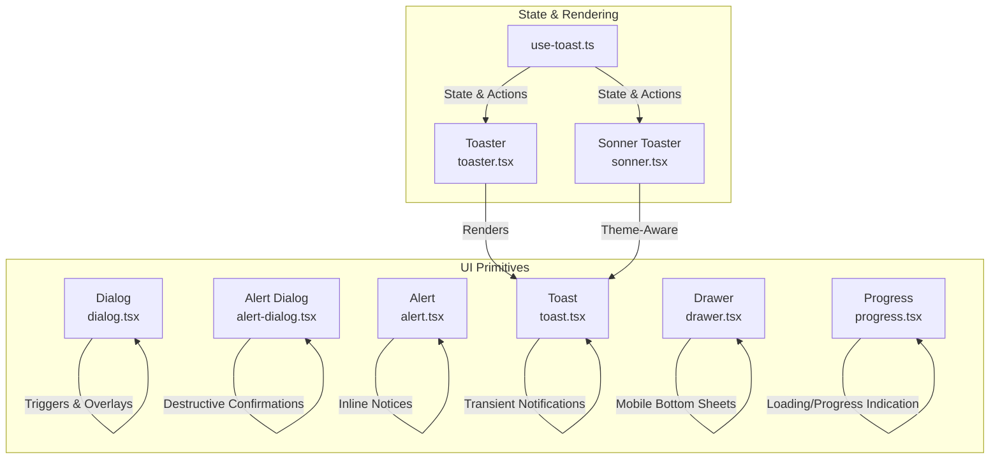

**Diagram sources**
- [dialog.tsx](file://src/components/ui/dialog.tsx#L1-L96)
- [alert-dialog.tsx](file://src/components/ui/alert-dialog.tsx#L1-L105)
- [alert.tsx](file://src/components/ui/alert.tsx#L1-L44)
- [toast.tsx](file://src/components/ui/toast.tsx#L1-L112)
- [toaster.tsx](file://src/components/ui/toaster.tsx#L1-L25)
- [use-toast.ts](file://src/hooks/use-toast.ts#L1-L186)
- [sonner.tsx](file://src/components/ui/sonner.tsx#L1-L28)
- [drawer.tsx](file://src/components/ui/drawer.tsx#L1-L88)
- [progress.tsx](file://src/components/ui/progress.tsx#L1-L24)

**Section sources**
- [dialog.tsx](file://src/components/ui/dialog.tsx#L1-L96)
- [alert-dialog.tsx](file://src/components/ui/alert-dialog.tsx#L1-L105)
- [alert.tsx](file://src/components/ui/alert.tsx#L1-L44)
- [toast.tsx](file://src/components/ui/toast.tsx#L1-L112)
- [toaster.tsx](file://src/components/ui/toaster.tsx#L1-L25)
- [use-toast.ts](file://src/hooks/use-toast.ts#L1-L186)
- [sonner.tsx](file://src/components/ui/sonner.tsx#L1-L28)
- [drawer.tsx](file://src/components/ui/drawer.tsx#L1-L88)
- [progress.tsx](file://src/components/ui/progress.tsx#L1-L24)

## Core Components
- Dialog: A flexible overlay container with header, footer, and close controls. Supports keyboard navigation and focus trapping via Radix UI primitives.
- Alert Dialog: A specialized dialog for destructive actions (e.g., delete, cancel) with explicit action and cancel buttons.
- Alert: Inline contextual notice with default and destructive variants for warnings and errors.
- Toast: Transient notification with swipe-to-dismiss, auto-dismiss, and optional action button.
- Toaster: Renderer that maps state to visible toasts and positions them in the viewport.
- use-toast: Hook-based state machine managing toast lifecycle, limits, and removal timers.
- Sonner Toaster: Theme-aware toast provider leveraging the Sonner library.
- Drawer: Mobile-friendly bottom sheet with backdrop and handle.
- Progress: Linear progress indicator for long-running operations.

**Section sources**
- [dialog.tsx](file://src/components/ui/dialog.tsx#L1-L96)
- [alert-dialog.tsx](file://src/components/ui/alert-dialog.tsx#L1-L105)
- [alert.tsx](file://src/components/ui/alert.tsx#L1-L44)
- [toast.tsx](file://src/components/ui/toast.tsx#L1-L112)
- [toaster.tsx](file://src/components/ui/toaster.tsx#L1-L25)
- [use-toast.ts](file://src/hooks/use-toast.ts#L1-L186)
- [sonner.tsx](file://src/components/ui/sonner.tsx#L1-L28)
- [drawer.tsx](file://src/components/ui/drawer.tsx#L1-L88)
- [progress.tsx](file://src/components/ui/progress.tsx#L1-L24)

## Architecture Overview
The feedback system centers on a stateful hook that manages a queue of toasts and exposes imperative APIs. Dialogs and alert dialogs are presentational overlays built on Radix UI. Alerts and progress indicators provide inline feedback. The Sonner-based Toaster offers theme-aware styling and animations.

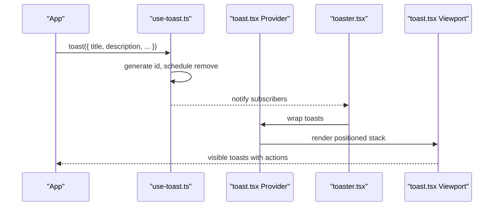

**Diagram sources**
- [use-toast.ts](file://src/hooks/use-toast.ts#L137-L164)
- [toast.tsx](file://src/components/ui/toast.tsx#L8-L23)
- [toaster.tsx](file://src/components/ui/toaster.tsx#L4-L24)

## Detailed Component Analysis

### Dialog
- Purpose: Non-modal overlay for forms, previews, and auxiliary content.
- Variants: Header/Footer/Title/Description segments; content centered with animations.
- Positioning: Centered overlay with portal rendering; backdrop supports escape and click-away.
- Interaction: Close button with accessible label; focus trapping via Radix UI.
- Accessibility: Uses ARIA roles and ensures focus management; supports keyboard navigation.
- UX Patterns: Use for secondary actions, previews, and non-blocking interactions.

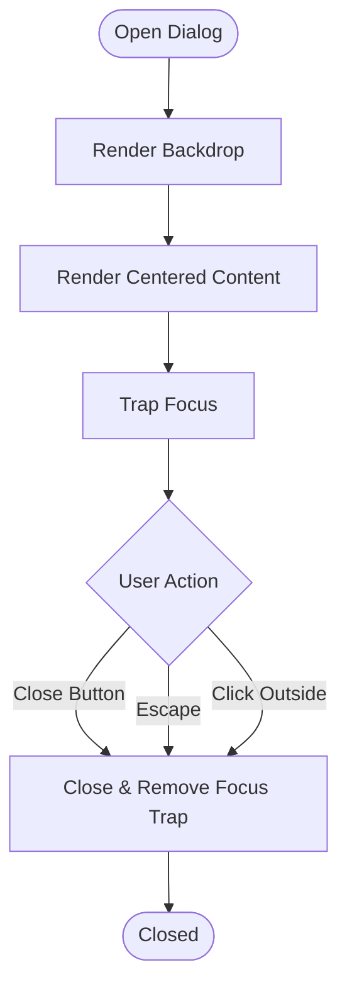

**Diagram sources**
- [dialog.tsx](file://src/components/ui/dialog.tsx#L15-L52)

**Section sources**
- [dialog.tsx](file://src/components/ui/dialog.tsx#L1-L96)

### Alert Dialog
- Purpose: Destructive confirmation flows (delete, cancel subscription).
- Variants: Action and Cancel buttons styled via button variants.
- Positioning: Same centered overlay as Dialog.
- Interaction: Explicit action triggers callback; cancel closes without action.
- Accessibility: Clear labeling of destructive action; maintains focus on actionable elements.
- UX Patterns: Reserve for irreversible or high-risk operations.

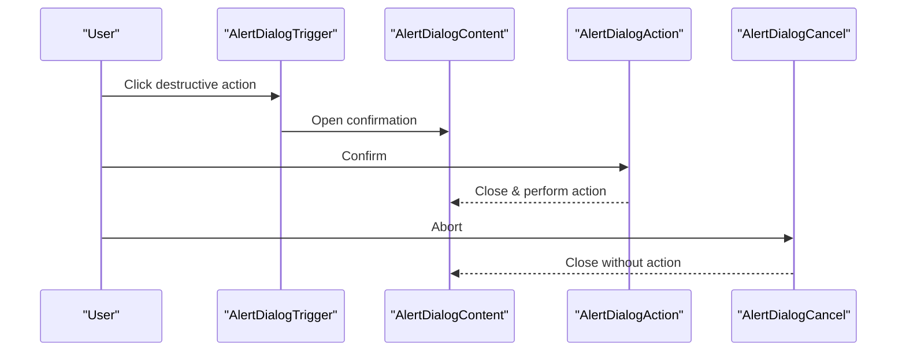

**Diagram sources**
- [alert-dialog.tsx](file://src/components/ui/alert-dialog.tsx#L72-L90)

**Section sources**
- [alert-dialog.tsx](file://src/components/ui/alert-dialog.tsx#L1-L105)

### Alert
- Purpose: Inline contextual notice for information, warning, or error.
- Variants: default and destructive.
- Positioning: Block-level element with optional icon placement.
- Interaction: No interactive controls; acts as a static notice.
- Accessibility: Role set to alert; suitable for screen readers.
- UX Patterns: Use for form validation messages, policy notices, and error summaries.

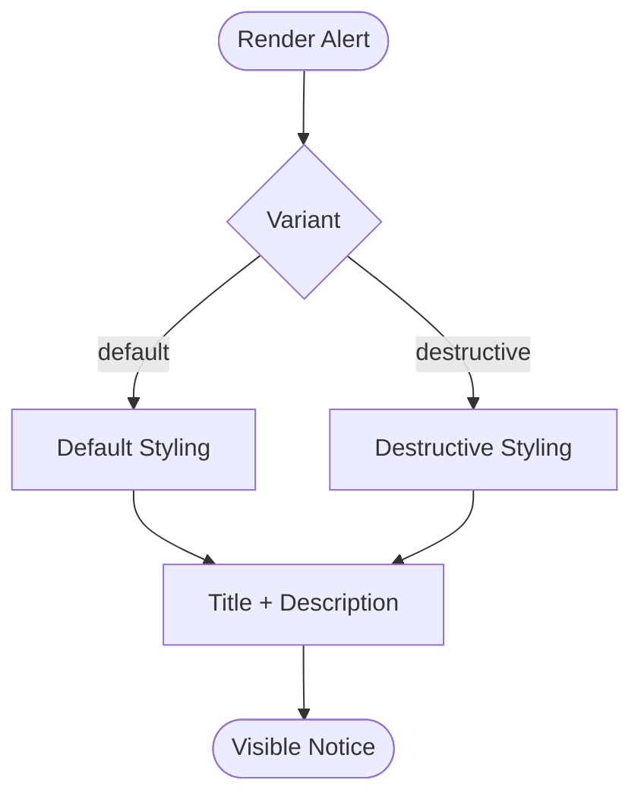

**Diagram sources**
- [alert.tsx](file://src/components/ui/alert.tsx#L6-L19)

**Section sources**
- [alert.tsx](file://src/components/ui/alert.tsx#L1-L44)

### Toast
- Purpose: Non-blocking, transient notification for system events.
- Variants: default and destructive.
- Positioning: Fixed viewport in top-right with reverse stacking; supports swipe-to-dismiss.
- Timing: Auto-dismiss after a delay; manual dismiss supported; action button optional.
- Interaction: Close button, action button, and swipe gestures; onOpenChange triggers dismissal.
- Accessibility: Announces to assistive technologies; hover reveals controls.
- UX Patterns: Success confirmations, error messages, progress updates, and undo actions.

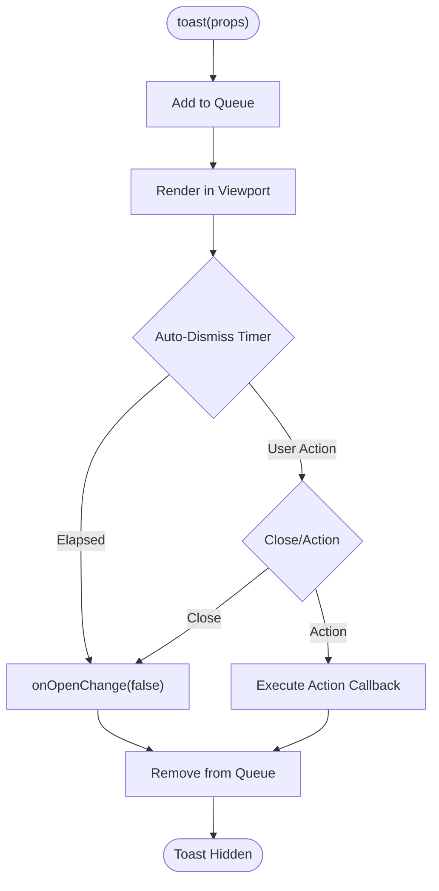

**Diagram sources**
- [toast.tsx](file://src/components/ui/toast.tsx#L25-L46)
- [use-toast.ts](file://src/hooks/use-toast.ts#L55-L69)
- [use-toast.ts](file://src/hooks/use-toast.ts#L137-L164)

**Section sources**
- [toast.tsx](file://src/components/ui/toast.tsx#L1-L112)
- [toaster.tsx](file://src/components/ui/toaster.tsx#L1-L25)
- [use-toast.ts](file://src/hooks/use-toast.ts#L1-L186)

### Toaster
- Purpose: Renders the current toast queue into the DOM.
- Behavior: Iterates over toasts, renders title/description/action, and appends the viewport.
- Integration: Consumes state from use-toast; re-renders on state changes.
- UX Patterns: Centralized toast rendering; supports stacking and theme-aware styling.

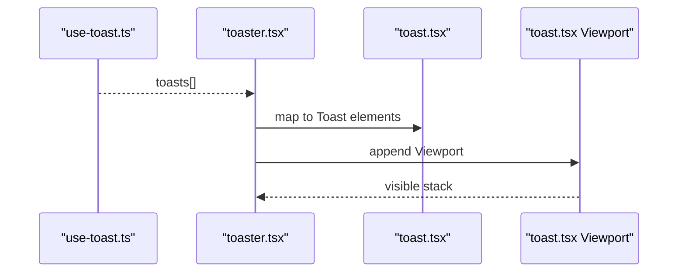

**Diagram sources**
- [toaster.tsx](file://src/components/ui/toaster.tsx#L4-L24)
- [toast.tsx](file://src/components/ui/toast.tsx#L8-L23)

**Section sources**
- [toaster.tsx](file://src/components/ui/toaster.tsx#L1-L25)

### use-toast Hook
- State Machine: Manages toasts with actions (add, update, dismiss, remove).
- Limits: Enforces a maximum number of concurrent toasts.
- Auto-dismiss: Schedules removal after a fixed delay; supports per-toast timers.
- Imperative API: Returns toast, dismiss, and update functions for programmatic control.
- Integration: Dispatches state changes; subscribes components to updates.

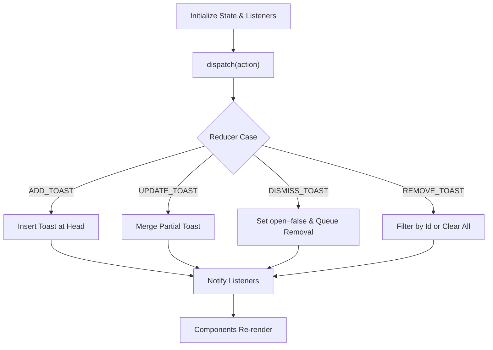

**Diagram sources**
- [use-toast.ts](file://src/hooks/use-toast.ts#L71-L122)
- [use-toast.ts](file://src/hooks/use-toast.ts#L128-L133)
- [use-toast.ts](file://src/hooks/use-toast.ts#L166-L184)

**Section sources**
- [use-toast.ts](file://src/hooks/use-toast.ts#L1-L186)

### Sonner Toaster
- Purpose: Theme-aware toast provider using the Sonner library.
- Behavior: Applies theme-based styles and class names for toast, description, action, and cancel button.
- Integration: Wraps toast options and theme resolution from next-themes.
- UX Patterns: Consistent theming across light/dark/system modes; smooth animations.

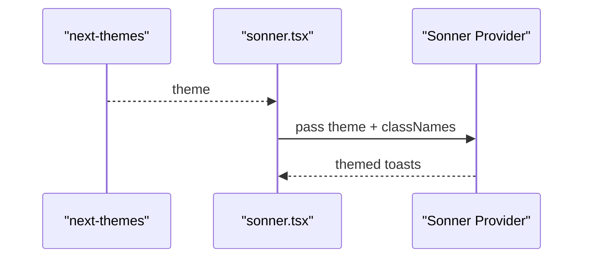

**Diagram sources**
- [sonner.tsx](file://src/components/ui/sonner.tsx#L6-L25)

**Section sources**
- [sonner.tsx](file://src/components/ui/sonner.tsx#L1-L28)

### Drawer
- Purpose: Mobile-first bottom sheet for forms and actions.
- Positioning: Anchored to the bottom; backdrop supports close on outside click.
- Interaction: Handle for dragging; portal rendering; scales background by default.
- Accessibility: Focus management and keyboard support via underlying drawer library.
- UX Patterns: Ideal for mobile workflows, compact forms, and quick actions.

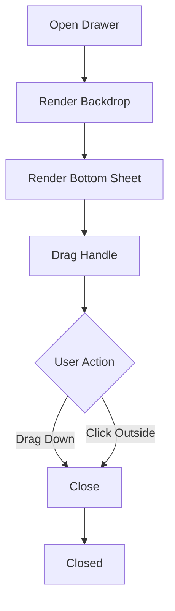

**Diagram sources**
- [drawer.tsx](file://src/components/ui/drawer.tsx#L17-L44)

**Section sources**
- [drawer.tsx](file://src/components/ui/drawer.tsx#L1-L88)

### Progress
- Purpose: Visual indicator for long-running operations.
- Behavior: Renders a horizontal bar with animated fill based on value.
- UX Patterns: Use during data sync, uploads, or multi-step processes to reduce perceived wait time.

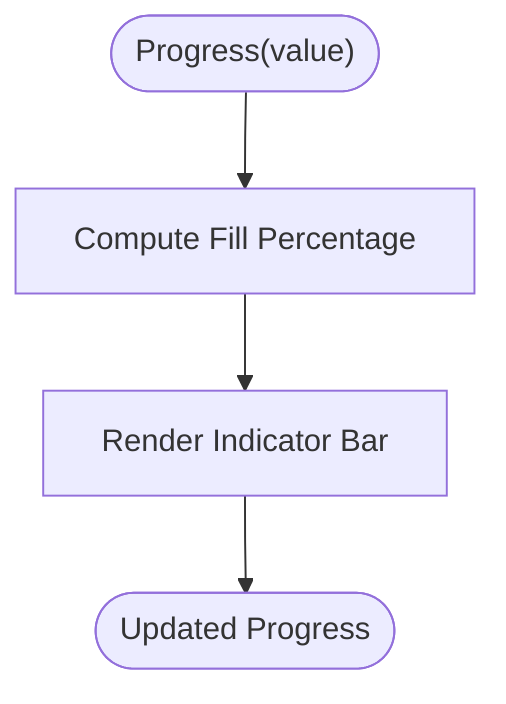

**Diagram sources**
- [progress.tsx](file://src/components/ui/progress.tsx#L6-L21)

**Section sources**
- [progress.tsx](file://src/components/ui/progress.tsx#L1-L24)

## Dependency Analysis
- Dialog and Alert Dialog depend on Radix UI primitives for overlay, portal, and focus management.
- Toast relies on Radix UI toast primitives and a custom provider/viewport for rendering.
- use-toast encapsulates state transitions and timers; Toaster subscribes to state changes.
- Sonner Toaster integrates with next-themes for dynamic theming.
- Drawer uses Vaul for mobile drawer behavior.
- Progress is a standalone indicator component.

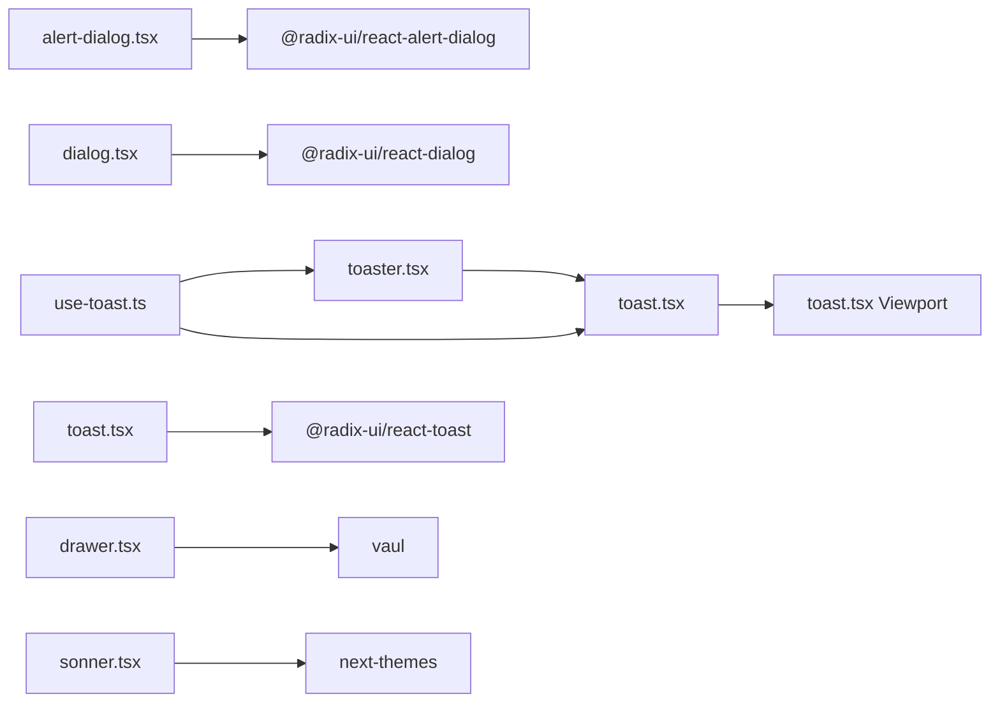

**Diagram sources**
- [use-toast.ts](file://src/hooks/use-toast.ts#L1-L186)
- [toaster.tsx](file://src/components/ui/toaster.tsx#L1-L25)
- [toast.tsx](file://src/components/ui/toast.tsx#L1-L112)
- [alert-dialog.tsx](file://src/components/ui/alert-dialog.tsx#L1-L105)
- [dialog.tsx](file://src/components/ui/dialog.tsx#L1-L96)
- [drawer.tsx](file://src/components/ui/drawer.tsx#L1-L88)
- [sonner.tsx](file://src/components/ui/sonner.tsx#L1-L28)

**Section sources**
- [use-toast.ts](file://src/hooks/use-toast.ts#L1-L186)
- [toaster.tsx](file://src/components/ui/toaster.tsx#L1-L25)
- [toast.tsx](file://src/components/ui/toast.tsx#L1-L112)
- [alert-dialog.tsx](file://src/components/ui/alert-dialog.tsx#L1-L105)
- [dialog.tsx](file://src/components/ui/dialog.tsx#L1-L96)
- [drawer.tsx](file://src/components/ui/drawer.tsx#L1-L88)
- [sonner.tsx](file://src/components/ui/sonner.tsx#L1-L28)

## Performance Considerations
- Toast Limit: The state machine enforces a strict limit on concurrent toasts to prevent UI thrashing.
- Auto-dismiss Timers: Per-toast timers are scheduled and cleaned up to avoid memory leaks.
- Portal Rendering: Dialogs and drawers render into portals to minimize layout shifts.
- Swipe Gestures: Toast swipe animations are optimized via CSS transforms and controlled via Radix UI.
- Theming: Sonner Toaster applies theme-aware classes to reduce reflows.

[No sources needed since this section provides general guidance]

## Troubleshooting Guide
- Toasts not appearing:
  - Ensure the provider is mounted at the root and Toaster is included in the component tree.
  - Verify that the toast function is called from a component that re-renders on state change.
- Multiple toasts stacking:
  - Confirm the limit is configured appropriately; the default implementation restricts concurrent toasts.
- Auto-dismiss not working:
  - Check that onOpenChange is wired to dismiss the toast when closed.
  - Verify timers are not being prematurely cleared.
- Accessibility issues:
  - Ensure Dialogs/Alert Dialogs trap focus and provide close button labels.
  - For Alerts, confirm role="alert" is applied.
- Drawer not closing:
  - Confirm the trigger and close components are properly connected and the portal is rendering.

**Section sources**
- [toaster.tsx](file://src/components/ui/toaster.tsx#L4-L24)
- [toast.tsx](file://src/components/ui/toast.tsx#L40-L46)
- [use-toast.ts](file://src/hooks/use-toast.ts#L55-L69)
- [dialog.tsx](file://src/components/ui/dialog.tsx#L30-L52)
- [alert-dialog.tsx](file://src/components/ui/alert-dialog.tsx#L28-L44)
- [alert.tsx](file://src/components/ui/alert.tsx#L21-L27)
- [drawer.tsx](file://src/components/ui/drawer.tsx#L17-L44)

## Conclusion
The SHG Management System’s feedback and modal toolkit combines presentational primitives with a robust, hook-driven state layer. Dialogs and alert dialogs provide structured overlays; alerts deliver contextual messaging; toasts offer non-intrusive notifications with auto-dismiss and action support; drawers optimize mobile experiences; and progress indicators communicate ongoing work. Together, these components enable consistent, accessible, and user-friendly feedback across financial and operational workflows.

[No sources needed since this section summarizes without analyzing specific files]

## Appendices

### Practical Examples and UX Patterns
- Modal Creation:
  - Use Dialog for non-critical overlays (e.g., record savings, member details).
  - Use Alert Dialog for destructive actions (e.g., delete repayment, cancel loan).
- Confirmation Dialogs:
  - Trigger Alert Dialog from a Button; wire Action to perform the operation and Cancel to abort.
- Error Notifications:
  - Call the toast function with a destructive variant and a concise message; optionally include an action (e.g., retry).
- Success Messages:
  - Use default variant with a short title and description; rely on auto-dismiss.
- Progress Indicators:
  - Show a Progress component during multi-step operations (e.g., bulk repayments); update value as steps complete.
- Integration with State Management:
  - Use the hook’s imperative API to programmatically dismiss or update toasts; subscribe via the Toaster component to render state changes.

[No sources needed since this section provides general guidance]