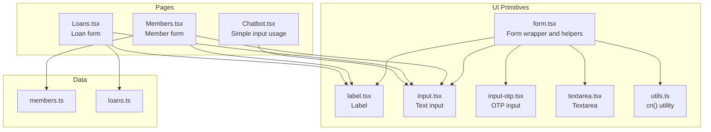
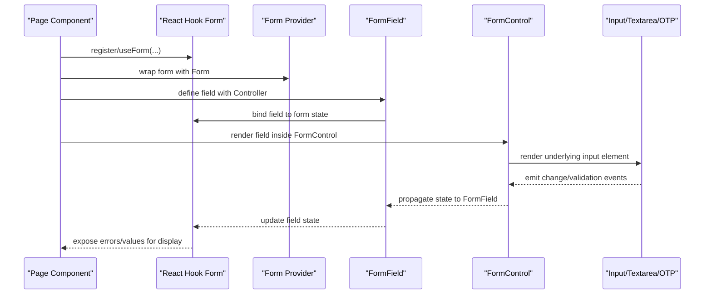
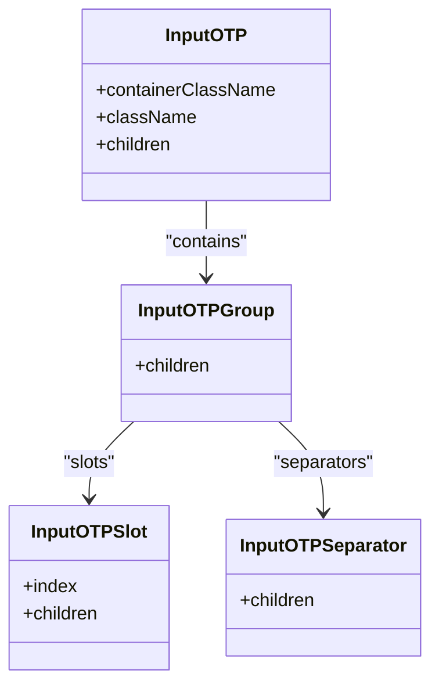
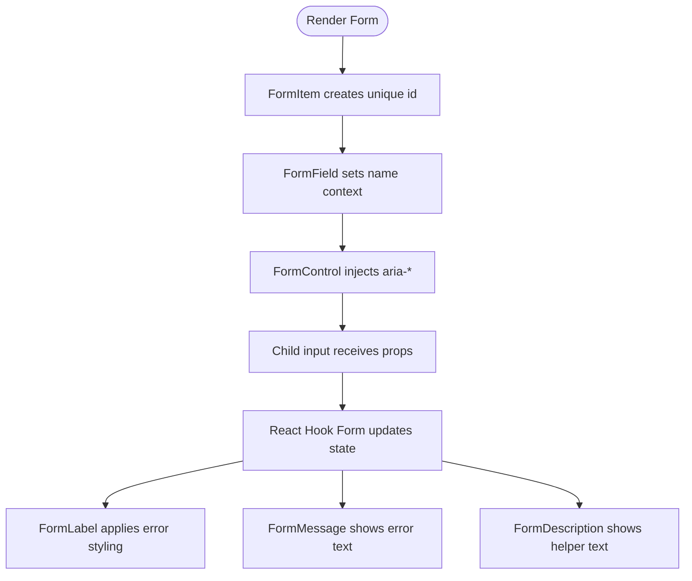
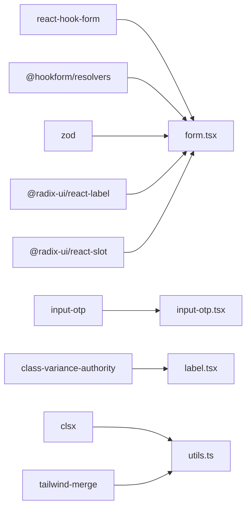
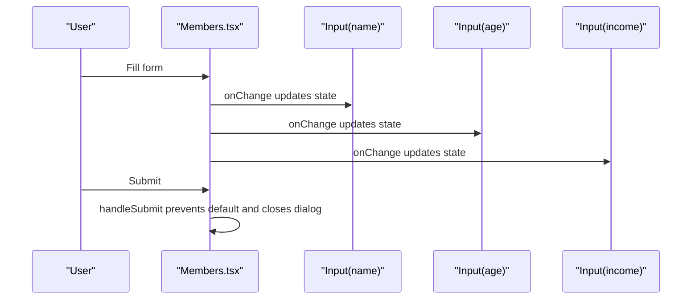
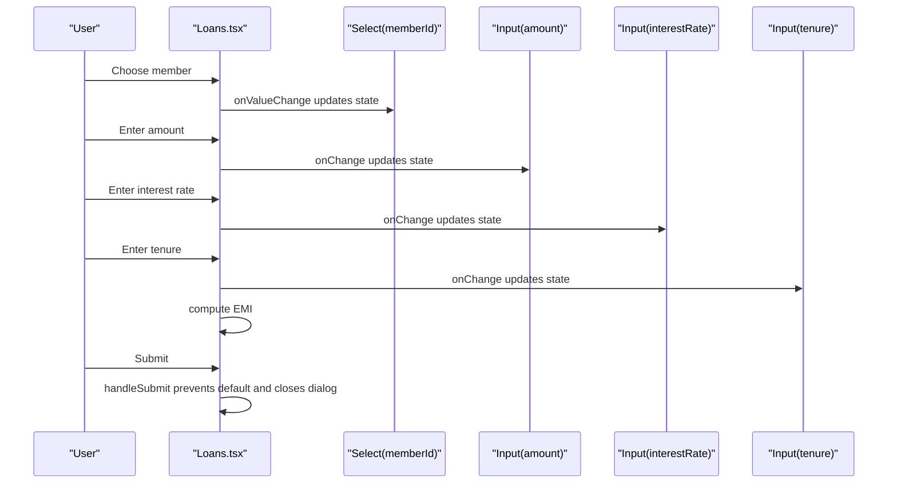
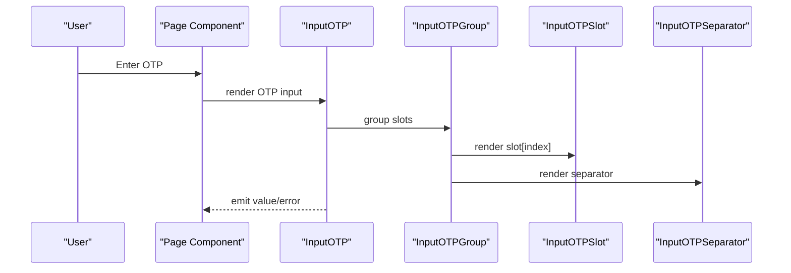

# Input & Form Components

<cite>
**Referenced Files in This Document**
- [input.tsx](file://src/components/ui/input.tsx)
- [input-otp.tsx](file://src/components/ui/input-otp.tsx)
- [textarea.tsx](file://src/components/ui/textarea.tsx)
- [label.tsx](file://src/components/ui/label.tsx)
- [form.tsx](file://src/components/ui/form.tsx)
- [utils.ts](file://src/lib/utils.ts)
- [Members.tsx](file://src/pages/Members.tsx)
- [Loans.tsx](file://src/pages/Loans.tsx)
- [Chatbot.tsx](file://src/pages/Chatbot.tsx)
- [members.ts](file://src/data/members.ts)
- [loans.ts](file://src/data/loans.ts)
- [package.json](file://package.json)
</cite>

## Table of Contents
1. [Introduction](#introduction)
2. [Project Structure](#project-structure)
3. [Core Components](#core-components)
4. [Architecture Overview](#architecture-overview)
5. [Detailed Component Analysis](#detailed-component-analysis)
6. [Dependency Analysis](#dependency-analysis)
7. [Performance Considerations](#performance-considerations)
8. [Troubleshooting Guide](#troubleshooting-guide)
9. [Conclusion](#conclusion)

## Introduction
This document describes the input and form components used in the SHG Management System. It covers input fields, OTP inputs, textareas, labels, and form wrappers, with emphasis on how they integrate with React Hook Form for robust form handling. It also documents styling variants, accessibility features, responsive behavior, and practical examples for building financial data entry forms.

## Project Structure
The form ecosystem centers around reusable UI primitives located under src/components/ui and supporting utilities under src/lib. Pages demonstrate real-world usage for member and loan data entry.

**Diagram sources**
- [form.tsx](file://src/components/ui/form.tsx#L1-L130)
- [label.tsx](file://src/components/ui/label.tsx#L1-L18)
- [input.tsx](file://src/components/ui/input.tsx#L1-L23)
- [input-otp.tsx](file://src/components/ui/input-otp.tsx#L1-L62)
- [textarea.tsx](file://src/components/ui/textarea.tsx#L1-L22)
- [utils.ts](file://src/lib/utils.ts#L1-L7)
- [Members.tsx](file://src/pages/Members.tsx#L1-L217)
- [Loans.tsx](file://src/pages/Loans.tsx#L1-L254)
- [Chatbot.tsx](file://src/pages/Chatbot.tsx#L1-L181)
- [members.ts](file://src/data/members.ts#L1-L122)
- [loans.ts](file://src/data/loans.ts#L1-L140)

**Section sources**
- [form.tsx](file://src/components/ui/form.tsx#L1-L130)
- [input.tsx](file://src/components/ui/input.tsx#L1-L23)
- [input-otp.tsx](file://src/components/ui/input-otp.tsx#L1-L62)
- [textarea.tsx](file://src/components/ui/textarea.tsx#L1-L22)
- [label.tsx](file://src/components/ui/label.tsx#L1-L18)
- [utils.ts](file://src/lib/utils.ts#L1-L7)
- [Members.tsx](file://src/pages/Members.tsx#L1-L217)
- [Loans.tsx](file://src/pages/Loans.tsx#L1-L254)
- [Chatbot.tsx](file://src/pages/Chatbot.tsx#L1-L181)
- [members.ts](file://src/data/members.ts#L1-L122)
- [loans.ts](file://src/data/loans.ts#L1-L140)

## Core Components
- Input: A styled text input with focus styles, disabled states, and responsive sizing.
- InputOTP: An OTP input built on input-otp with grouped slots and separators.
- Textarea: A flexible textarea with focus and disabled states.
- Label: A stylized label with variants and disabled state support.
- Form wrapper and helpers: A Form provider and helper components for integrating with React Hook Form, including FormItem, FormLabel, FormControl, FormDescription, FormMessage, and useFormField.

Key integration points:
- All inputs accept standard HTML attributes and forward refs.
- Form components connect to React Hook Form via Controller and useFormContext.
- Accessibility attributes (aria-invalid, aria-describedby) are automatically wired.

**Section sources**
- [input.tsx](file://src/components/ui/input.tsx#L1-L23)
- [input-otp.tsx](file://src/components/ui/input-otp.tsx#L1-L62)
- [textarea.tsx](file://src/components/ui/textarea.tsx#L1-L22)
- [label.tsx](file://src/components/ui/label.tsx#L1-L18)
- [form.tsx](file://src/components/ui/form.tsx#L1-L130)

## Architecture Overview
The form architecture combines low-level UI primitives with higher-level form orchestration:

**Diagram sources**
- [form.tsx](file://src/components/ui/form.tsx#L1-L130)
- [input.tsx](file://src/components/ui/input.tsx#L1-L23)
- [textarea.tsx](file://src/components/ui/textarea.tsx#L1-L22)
- [input-otp.tsx](file://src/components/ui/input-otp.tsx#L1-L62)

## Detailed Component Analysis

### Input
- Purpose: Standard text input with consistent styling and focus states.
- Props/attributes: Inherits all HTML input attributes (type, placeholder, value, onChange, etc.). Accepts className for customization.
- Validation patterns: Works seamlessly with React Hook Form’s resolver-driven validation.
- Error handling: Controlled by parent Form components; errors are surfaced via FormMessage.
- Accessibility: Supports aria-invalid and aria-describedby when used within FormControl.
- Responsive behavior: Uses md:text-sm for smaller screens and text-base by default.

Practical usage examples:
- Member form numeric fields (age, income).
- Loan form numeric fields (amount, interest rate).
- Chatbot message input.

**Section sources**
- [input.tsx](file://src/components/ui/input.tsx#L1-L23)
- [Members.tsx](file://src/pages/Members.tsx#L150-L216)
- [Loans.tsx](file://src/pages/Loans.tsx#L168-L207)
- [Chatbot.tsx](file://src/pages/Chatbot.tsx#L160-L177)

### InputOTP
- Purpose: OTP entry with individual character slots, separators, and active slot highlighting.
- Props/attributes:
  - InputOTP: containerClassName, className, and all OTPInput props.
  - InputOTPGroup: container layout.
  - InputOTPSlot: index prop to map to OTP slot.
  - InputOTPSeparator: visual separator.
- Validation patterns: Integrates with React Hook Form by wrapping OTPInput in FormControl.
- Error handling: Error state reflected via active slot ring and parent FormMessage.
- Accessibility: Uses Radix UI contexts to manage focus and caret behavior.

**Diagram sources**
- [input-otp.tsx](file://src/components/ui/input-otp.tsx#L1-L62)

**Section sources**
- [input-otp.tsx](file://src/components/ui/input-otp.tsx#L1-L62)

### Textarea
- Purpose: Multi-line text input with consistent focus and disabled states.
- Props/attributes: Inherits all HTML textarea attributes (rows, placeholder, value, onChange, etc.). Accepts className for customization.
- Validation patterns: Works with React Hook Form; errors shown via FormMessage.
- Accessibility: Supports aria-invalid and aria-describedby when used within FormControl.

**Section sources**
- [textarea.tsx](file://src/components/ui/textarea.tsx#L1-L22)

### Label
- Purpose: Styled label with variant support and disabled state styling.
- Props/attributes: Accepts className and variant props via class-variance-authority.
- Accessibility: Automatically associates with form controls via htmlFor when used within FormLabel/Form components.

**Section sources**
- [label.tsx](file://src/components/ui/label.tsx#L1-L18)

### Form Wrapper and Helpers
- Form: React Hook Form FormProvider wrapper.
- FormField: Wraps Controller with field name context.
- FormItem: Provides unique IDs for accessibility and spacing.
- FormLabel: Renders labels with error-aware styling and proper association.
- FormControl: Injects aria attributes and forwards child ref.
- FormDescription: Provides helper text with muted styling.
- FormMessage: Displays field-level error messages with destructive styling.
- useFormField: Hook to access field state and generated IDs.

**Diagram sources**
- [form.tsx](file://src/components/ui/form.tsx#L1-L130)

**Section sources**
- [form.tsx](file://src/components/ui/form.tsx#L1-L130)

## Dependency Analysis
External libraries and their roles:
- react-hook-form: Core form state management and validation.
- @hookform/resolvers: Optional resolvers for validation libraries (e.g., Zod).
- zod: Schema validation library commonly paired with resolvers.
- input-otp: OTP input implementation.
- @radix-ui/react-label, @radix-ui/react-slot: Accessibility and composition primitives.
- class-variance-authority, clsx, tailwind-merge: Utility and styling composition.

**Diagram sources**
- [package.json](file://package.json#L15-L64)
- [form.tsx](file://src/components/ui/form.tsx#L1-L130)
- [input-otp.tsx](file://src/components/ui/input-otp.tsx#L1-L62)
- [label.tsx](file://src/components/ui/label.tsx#L1-L18)
- [utils.ts](file://src/lib/utils.ts#L1-L7)

**Section sources**
- [package.json](file://package.json#L15-L64)
- [form.tsx](file://src/components/ui/form.tsx#L1-L130)
- [input-otp.tsx](file://src/components/ui/input-otp.tsx#L1-L62)
- [label.tsx](file://src/components/ui/label.tsx#L1-L18)
- [utils.ts](file://src/lib/utils.ts#L1-L7)

## Performance Considerations
- Prefer controlled components with minimal re-renders; React Hook Form manages state efficiently.
- Use lazy initialization for heavy validation schemas to avoid blocking render.
- Keep form layouts responsive with grid and flex utilities; avoid excessive nesting.
- Memoize derived values (e.g., EMI calculations) when recalculating frequently.

## Troubleshooting Guide
Common issues and resolutions:
- useFormField used outside FormField: Ensure FormField wraps all field components.
- Missing aria attributes: Confirm FormControl is used to inject aria-invalid and aria-describedby.
- OTP slot focus issues: Verify InputOTPGroup and InputOTPSlot are used together and index prop is correct.
- Styling conflicts: Use cn() utility to merge classes safely; avoid overriding core styles unintentionally.

**Section sources**
- [form.tsx](file://src/components/ui/form.tsx#L33-L54)
- [input-otp.tsx](file://src/components/ui/input-otp.tsx#L19-L50)

## Practical Examples

### Example 1: Member Registration Form
- Fields: Full name, age, village, phone, monthly income.
- Pattern: Controlled inputs with onChange handlers; submit via form handler.
- Financial considerations: Numeric inputs for age and income; currency hints in placeholders.

**Diagram sources**
- [Members.tsx](file://src/pages/Members.tsx#L128-L216)
- [input.tsx](file://src/components/ui/input.tsx#L1-L23)

**Section sources**
- [Members.tsx](file://src/pages/Members.tsx#L128-L216)
- [input.tsx](file://src/components/ui/input.tsx#L1-L23)

### Example 2: Loan Application Form
- Fields: Member selection, loan amount, interest rate, tenure, purpose.
- Pattern: Controlled inputs; EMI computed live; submit via form handler.
- Financial considerations: Numeric inputs; currency formatting suggestions; interest rate and tenure validation.

**Diagram sources**
- [Loans.tsx](file://src/pages/Loans.tsx#L150-L207)
- [input.tsx](file://src/components/ui/input.tsx#L1-L23)

**Section sources**
- [Loans.tsx](file://src/pages/Loans.tsx#L150-L207)
- [input.tsx](file://src/components/ui/input.tsx#L1-L23)
- [loans.ts](file://src/data/loans.ts#L113-L118)

### Example 3: OTP Input in Authentication Flow
- Pattern: Use InputOTP with InputOTPGroup/InputOTPSlot/InputOTPSeparator.
- Integration: Wrap OTP input in FormControl; errors shown via FormMessage.

**Diagram sources**
- [input-otp.tsx](file://src/components/ui/input-otp.tsx#L7-L59)

**Section sources**
- [input-otp.tsx](file://src/components/ui/input-otp.tsx#L1-L62)

## Accessibility Features
- Labels: Proper htmlFor association via FormLabel; labels reflect error state.
- Inputs: aria-invalid and aria-describedby injected by FormControl; focus rings for keyboard navigation.
- OTP: Fake caret animation and active slot highlighting improve focus awareness.
- Descriptions: FormDescription provides contextual help text.

**Section sources**
- [form.tsx](file://src/components/ui/form.tsx#L75-L127)
- [input-otp.tsx](file://src/components/ui/input-otp.tsx#L24-L49)

## Styling Variants and Responsive Behavior
- Consistent spacing: FormItem uses space-y-2 for vertical rhythm.
- Typography: Base text-base with md:text-sm for smaller screens.
- Focus states: Ring-based focus indicators with ring color and offset.
- Disabled states: Cursor and opacity adjustments for disabled inputs.
- Label variants: cva-based label styling with disabled state support.

**Section sources**
- [input.tsx](file://src/components/ui/input.tsx#L10-L13)
- [textarea.tsx](file://src/components/ui/textarea.tsx#L10-L13)
- [label.tsx](file://src/components/ui/label.tsx#L7-L14)
- [form.tsx](file://src/components/ui/form.tsx#L62-L72)

## Best Practices for Financial Data Entry
- Use numeric inputs for amounts and rates; enforce min/max where appropriate.
- Provide currency formatting suggestions in placeholders or helper text.
- Compute derived values (e.g., EMI) on the fly to guide users.
- Validate early and often; surface errors close to affected fields.
- Ensure mobile-friendly layouts with appropriate touch targets and spacing.

[No sources needed since this section provides general guidance]

## Conclusion
The SHG Management System’s input and form components provide a cohesive, accessible, and extensible foundation for building financial data entry forms. By combining styled primitives with React Hook Form and Radix UI utilities, developers can create robust, user-friendly forms that scale across member registration, loan applications, and other financial workflows.