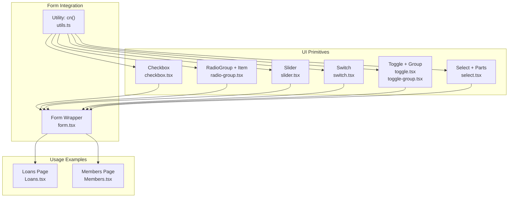
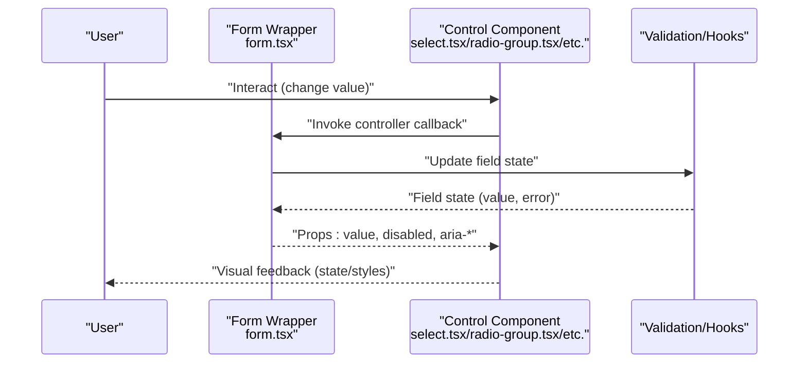
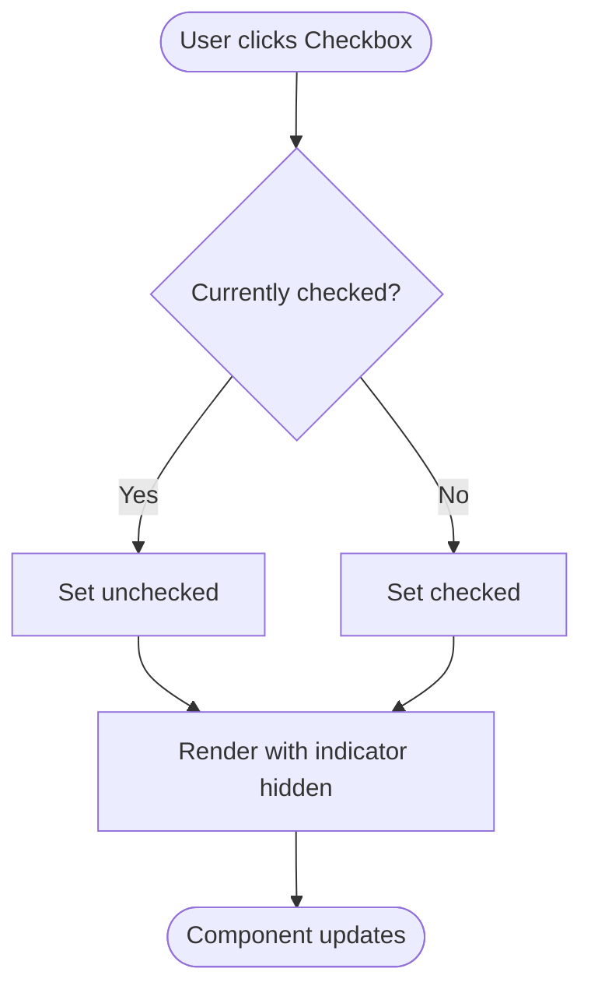
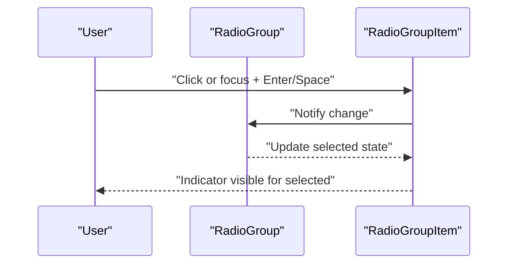
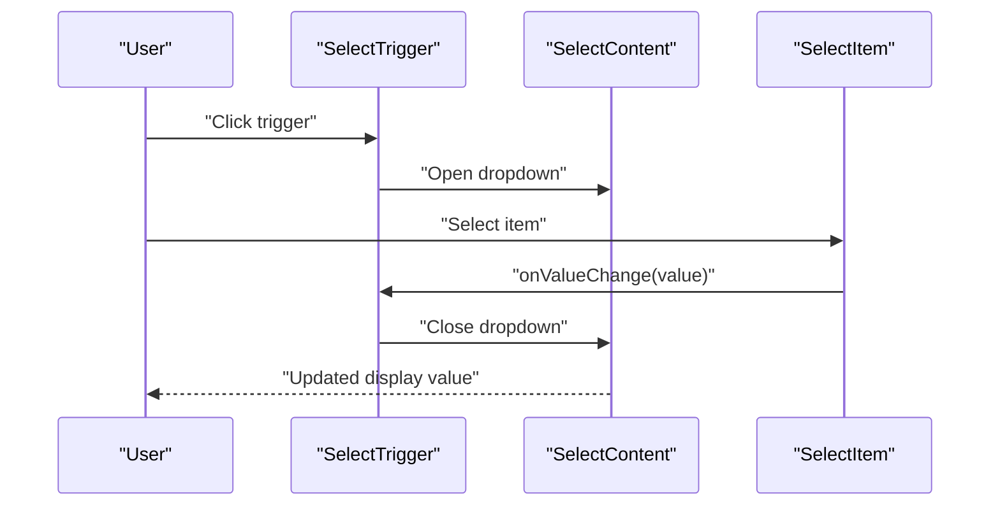
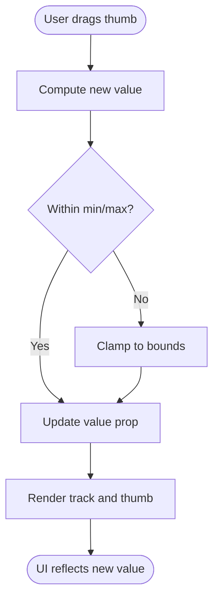
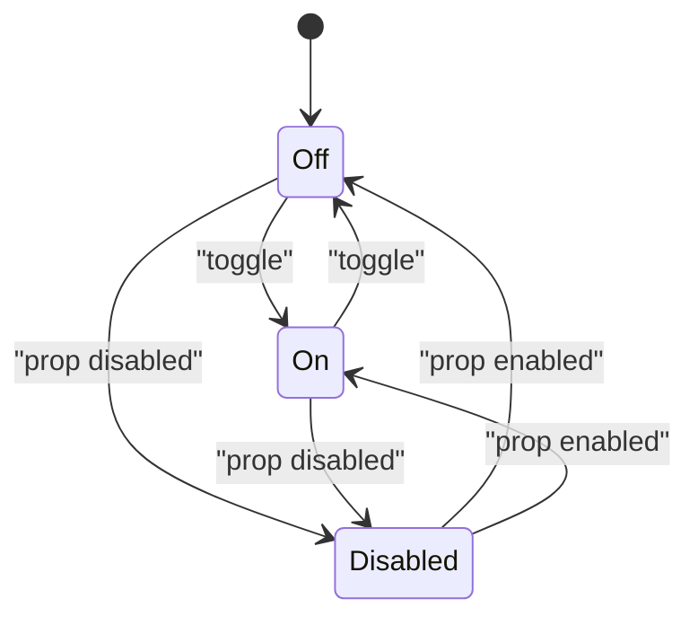
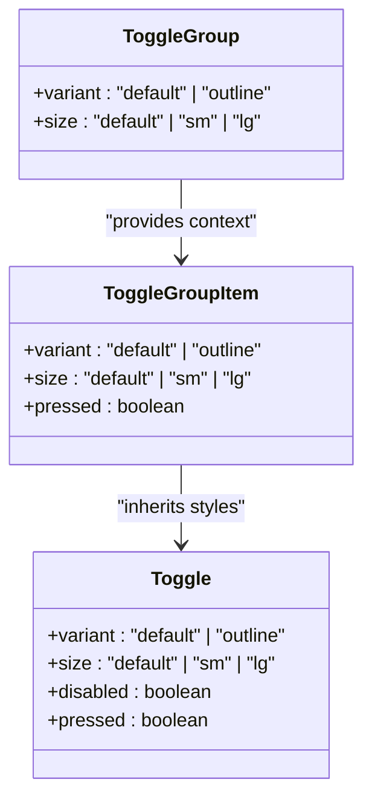
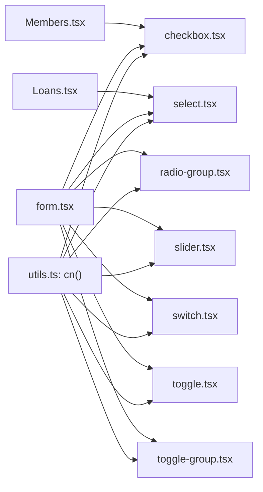

# Interactive Components

<cite>
**Referenced Files in This Document**
- [checkbox.tsx](file://src/components/ui/checkbox.tsx)
- [radio-group.tsx](file://src/components/ui/radio-group.tsx)
- [select.tsx](file://src/components/ui/select.tsx)
- [slider.tsx](file://src/components/ui/slider.tsx)
- [switch.tsx](file://src/components/ui/switch.tsx)
- [toggle.tsx](file://src/components/ui/toggle.tsx)
- [toggle-group.tsx](file://src/components/ui/toggle-group.tsx)
- [form.tsx](file://src/components/ui/form.tsx)
- [utils.ts](file://src/lib/utils.ts)
- [Loans.tsx](file://src/pages/Loans.tsx)
- [Members.tsx](file://src/pages/Members.tsx)
</cite>

## Table of Contents
1. [Introduction](#introduction)
2. [Project Structure](#project-structure)
3. [Core Components](#core-components)
4. [Architecture Overview](#architecture-overview)
5. [Detailed Component Analysis](#detailed-component-analysis)
6. [Dependency Analysis](#dependency-analysis)
7. [Performance Considerations](#performance-considerations)
8. [Troubleshooting Guide](#troubleshooting-guide)
9. [Conclusion](#conclusion)
10. [Appendices](#appendices)

## Introduction
This document describes the interactive element system used across the SHG Management System. It focuses on form controls that enable decision-making and data capture: checkboxes, radio groups, selects, sliders, switches, and toggles. For each component, we explain variants, states, validation integration, and practical usage patterns. We also cover accessibility, keyboard navigation, form integration, responsive behavior, and UX optimization for decision interfaces.

## Project Structure
The interactive components are implemented as reusable UI primitives under src/components/ui. They are thin wrappers around Radix UI primitives, styled with Tailwind classes and utility helpers. Forms integrate with these components using a dedicated form wrapper and validation hooks.

**Diagram sources**
- [checkbox.tsx](file://src/components/ui/checkbox.tsx#L1-L27)
- [radio-group.tsx](file://src/components/ui/radio-group.tsx#L1-L37)
- [select.tsx](file://src/components/ui/select.tsx#L1-L144)
- [slider.tsx](file://src/components/ui/slider.tsx#L1-L24)
- [switch.tsx](file://src/components/ui/switch.tsx#L1-L28)
- [toggle.tsx](file://src/components/ui/toggle.tsx#L1-L38)
- [toggle-group.tsx](file://src/components/ui/toggle-group.tsx#L1-L50)
- [form.tsx](file://src/components/ui/form.tsx#L1-L130)
- [utils.ts](file://src/lib/utils.ts#L1-L7)
- [Loans.tsx](file://src/pages/Loans.tsx#L1-L200)
- [Members.tsx](file://src/pages/Members.tsx#L1-L200)

**Section sources**
- [checkbox.tsx](file://src/components/ui/checkbox.tsx#L1-L27)
- [radio-group.tsx](file://src/components/ui/radio-group.tsx#L1-L37)
- [select.tsx](file://src/components/ui/select.tsx#L1-L144)
- [slider.tsx](file://src/components/ui/slider.tsx#L1-L24)
- [switch.tsx](file://src/components/ui/switch.tsx#L1-L28)
- [toggle.tsx](file://src/components/ui/toggle.tsx#L1-L38)
- [toggle-group.tsx](file://src/components/ui/toggle-group.tsx#L1-L50)
- [form.tsx](file://src/components/ui/form.tsx#L1-L130)
- [utils.ts](file://src/lib/utils.ts#L1-L7)
- [Loans.tsx](file://src/pages/Loans.tsx#L1-L200)
- [Members.tsx](file://src/pages/Members.tsx#L1-L200)

## Core Components
This section summarizes each interactive component’s purpose, variants, states, and integration patterns.

- Checkbox
  - Purpose: Single binary selection with visual indicator.
  - States: checked, unchecked, disabled.
  - Integration: Works inside FormField/Form components for validation and labeling.
  - Accessibility: Inherits keyboard support from Radix UI; focus styles included.
  - Example usage: See selection handling patterns in Loans page.

- RadioGroup and RadioGroupItem
  - Purpose: One-of-many selection with visual indicator.
  - States: selected, unselected, disabled.
  - Integration: Use with FormField/Form for controlled selection and validation.
  - Accessibility: Keyboard navigation supported; focus ring visible.

- Select and SelectParts
  - Purpose: Dropdown selection with trigger, content, items, and optional scrolling.
  - States: open/closed, item selected, disabled.
  - Integration: Controlled via onValueChange; supports grouped options and separators.
  - Accessibility: Uses portal and proper ARIA attributes; keyboard navigation supported.

- Slider
  - Purpose: Continuous numeric selection with track and thumb.
  - States: dragging, disabled.
  - Integration: Controlled via value and onValueChange; supports multiple handles.
  - Accessibility: Focusable; keyboard increments supported by Radix UI.

- Switch
  - Purpose: Binary toggle (on/off) with animated thumb.
  - States: checked, unchecked, disabled.
  - Integration: Controlled via checked and onCheckedChange.
  - Accessibility: Focusable; supports Enter/Space activation.

- Toggle and ToggleGroup
  - Purpose: Multi-state selection with visual emphasis; ToggleGroup aligns variants across items.
  - Variants: default, outline; sizes: default, sm, lg.
  - States: on/off; disabled.
  - Integration: Controlled via pressed state; group shares variant/sizes via context.
  - Accessibility: Focusable; keyboard navigation supported.

**Section sources**
- [checkbox.tsx](file://src/components/ui/checkbox.tsx#L1-L27)
- [radio-group.tsx](file://src/components/ui/radio-group.tsx#L1-L37)
- [select.tsx](file://src/components/ui/select.tsx#L1-L144)
- [slider.tsx](file://src/components/ui/slider.tsx#L1-L24)
- [switch.tsx](file://src/components/ui/switch.tsx#L1-L28)
- [toggle.tsx](file://src/components/ui/toggle.tsx#L1-L38)
- [toggle-group.tsx](file://src/components/ui/toggle-group.tsx#L1-L50)

## Architecture Overview
The interactive components are thin wrappers around Radix UI primitives, styled with Tailwind classes and merged with cn(). Validation and labeling are handled by the Form wrapper, which connects form state, labels, descriptions, and error messages to each control.

**Diagram sources**
- [form.tsx](file://src/components/ui/form.tsx#L1-L130)
- [select.tsx](file://src/components/ui/select.tsx#L1-L144)
- [radio-group.tsx](file://src/components/ui/radio-group.tsx#L1-L37)
- [toggle-group.tsx](file://src/components/ui/toggle-group.tsx#L1-L50)

## Detailed Component Analysis

### Checkbox
- Implementation pattern: Wraps Radix Checkbox with a check indicator and focus-visible ring.
- States: checked, unchecked, disabled; mapped via data attributes.
- Accessibility: Focus ring, disabled pointer events, and controlled via props.
- Integration: Use within FormField/Form for validation and labeling.

**Diagram sources**
- [checkbox.tsx](file://src/components/ui/checkbox.tsx#L1-L27)

**Section sources**
- [checkbox.tsx](file://src/components/ui/checkbox.tsx#L1-L27)
- [form.tsx](file://src/components/ui/form.tsx#L1-L130)

### RadioGroup and RadioGroupItem
- Implementation pattern: Grid layout for items; each item renders an indicator.
- States: selected, unselected, disabled.
- Accessibility: Keyboard navigation among items; focus ring visible.

**Diagram sources**
- [radio-group.tsx](file://src/components/ui/radio-group.tsx#L1-L37)

**Section sources**
- [radio-group.tsx](file://src/components/ui/radio-group.tsx#L1-L37)
- [form.tsx](file://src/components/ui/form.tsx#L1-L130)

### Select and Select Parts
- Implementation pattern: Root + Trigger + Content + Items + optional scrolling buttons.
- States: open/closed, item selected, disabled.
- Accessibility: Portal-based content; ARIA roles and keyboard navigation; scroll buttons for long lists.

**Diagram sources**
- [select.tsx](file://src/components/ui/select.tsx#L1-L144)

**Section sources**
- [select.tsx](file://src/components/ui/select.tsx#L1-L144)
- [Loans.tsx](file://src/pages/Loans.tsx#L170-L184)

### Slider
- Implementation pattern: Track with range and draggable thumb.
- States: dragging, disabled.
- Accessibility: Focusable; keyboard increments supported by Radix UI.

**Diagram sources**
- [slider.tsx](file://src/components/ui/slider.tsx#L1-L24)

**Section sources**
- [slider.tsx](file://src/components/ui/slider.tsx#L1-L24)

### Switch
- Implementation pattern: Animated thumb translates between positions.
- States: checked, unchecked, disabled.
- Accessibility: Focusable; Enter/Space toggles.

**Diagram sources**
- [switch.tsx](file://src/components/ui/switch.tsx#L1-L28)

**Section sources**
- [switch.tsx](file://src/components/ui/switch.tsx#L1-L28)

### Toggle and ToggleGroup
- Implementation pattern: Variants and sizes via class variance authority; ToggleGroup shares variants across items.
- States: on/off; disabled.
- Accessibility: Focusable; keyboard navigation supported.

**Diagram sources**
- [toggle.tsx](file://src/components/ui/toggle.tsx#L1-L38)
- [toggle-group.tsx](file://src/components/ui/toggle-group.tsx#L1-L50)

**Section sources**
- [toggle.tsx](file://src/components/ui/toggle.tsx#L1-L38)
- [toggle-group.tsx](file://src/components/ui/toggle-group.tsx#L1-L50)

## Dependency Analysis
Interactive components depend on:
- Radix UI primitives for behavior and accessibility.
- Tailwind classes for styling and responsive behavior.
- Utility function cn() for merging classes safely.
- Form wrapper for validation, labeling, and ARIA attributes.

**Diagram sources**
- [utils.ts](file://src/lib/utils.ts#L1-L7)
- [checkbox.tsx](file://src/components/ui/checkbox.tsx#L1-L27)
- [radio-group.tsx](file://src/components/ui/radio-group.tsx#L1-L37)
- [select.tsx](file://src/components/ui/select.tsx#L1-L144)
- [slider.tsx](file://src/components/ui/slider.tsx#L1-L24)
- [switch.tsx](file://src/components/ui/switch.tsx#L1-L28)
- [toggle.tsx](file://src/components/ui/toggle.tsx#L1-L38)
- [toggle-group.tsx](file://src/components/ui/toggle-group.tsx#L1-L50)
- [form.tsx](file://src/components/ui/form.tsx#L1-L130)
- [Loans.tsx](file://src/pages/Loans.tsx#L1-L200)
- [Members.tsx](file://src/pages/Members.tsx#L1-L200)

**Section sources**
- [utils.ts](file://src/lib/utils.ts#L1-L7)
- [form.tsx](file://src/components/ui/form.tsx#L1-L130)

## Performance Considerations
- Prefer controlled components with minimal re-renders; pass stable callbacks and values.
- Use ToggleGroup to avoid duplicating variant logic across items.
- Keep Select lists short or virtualized if very long; leverage SelectScrollUpButton/Down for large option sets.
- For Slider, debounce derived computations (e.g., EMI calculations) when updating frequently.

## Troubleshooting Guide
- Checkbox/Radio disabled state not applying:
  - Ensure disabled prop is passed and not overridden by custom styles.
  - Verify data attributes for checked state are present.
- Select dropdown not opening:
  - Confirm Portal rendering and focus behavior; ensure no parent overflow clipping.
  - Check that onValueChange is provided and value is controlled.
- Slider thumb not visible:
  - Ensure focus-visible ring classes are not overridden by global styles.
- Toggle/ToggleGroup variant mismatch:
  - Verify ToggleGroup provides variant/sizes and items consume context.
- Form validation not reflected:
  - Confirm useFormField is used within FormField/Form and labels/controls share IDs.

**Section sources**
- [checkbox.tsx](file://src/components/ui/checkbox.tsx#L1-L27)
- [radio-group.tsx](file://src/components/ui/radio-group.tsx#L1-L37)
- [select.tsx](file://src/components/ui/select.tsx#L1-L144)
- [slider.tsx](file://src/components/ui/slider.tsx#L1-L24)
- [toggle-group.tsx](file://src/components/ui/toggle-group.tsx#L1-L50)
- [form.tsx](file://src/components/ui/form.tsx#L1-L130)

## Conclusion
The SHG Management System’s interactive components provide a consistent, accessible, and extensible foundation for decision-making interfaces. By combining Radix UI primitives with Tailwind styling and a robust Form wrapper, the system ensures predictable behavior, strong accessibility, and easy integration with validation and state management.

## Appendices

### Practical Usage Patterns
- Selection handling with Select:
  - Controlled value and onValueChange update state; render items from data.
  - Reference: [Loans.tsx](file://src/pages/Loans.tsx#L170-L184)
- Option rendering with groups and separators:
  - Use SelectGroup and SelectSeparator for structured lists.
  - Reference: [select.tsx](file://src/components/ui/select.tsx#L93-L130)
- State management with ToggleGroup:
  - Provide variant and size at group level; items inherit.
  - Reference: [toggle-group.tsx](file://src/components/ui/toggle-group.tsx#L13-L20)
- Form integration and validation:
  - Wrap fields with FormField; pair labels with FormControl; show FormMessage on errors.
  - Reference: [form.tsx](file://src/components/ui/form.tsx#L20-L54)

### Accessibility and Keyboard Navigation
- All interactive controls are focusable and use focus-visible rings.
- Keyboard navigation:
  - Select: Arrow keys, Enter/Space to confirm, Escape to cancel.
  - RadioGroup: Arrow keys move selection; Enter/Space to select.
  - Toggle/ToggleGroup: Space/Enter toggles; arrow keys navigate items.
  - Slider: Arrow keys increment/decrement; Home/End jump to ends.
  - Switch: Enter/Space toggles.
- ARIA:
  - Form wrapper sets aria-invalid and aria-describedby dynamically.
  - Reference: [form.tsx](file://src/components/ui/form.tsx#L85-L99)

### Responsive Behavior
- Components use responsive padding, sizing, and spacing utilities.
- Toggle variants and sizes adapt to screen contexts; Select content adapts to viewport via portal.