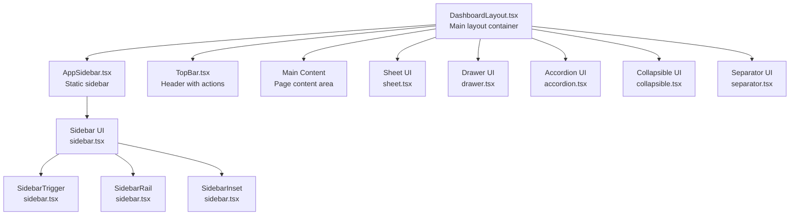
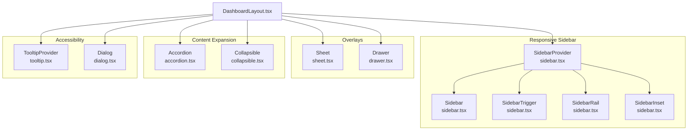
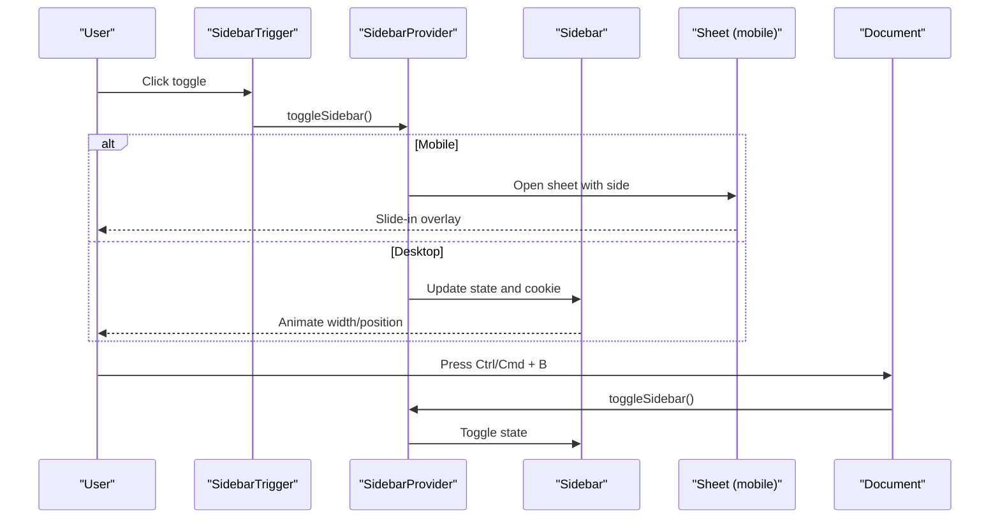
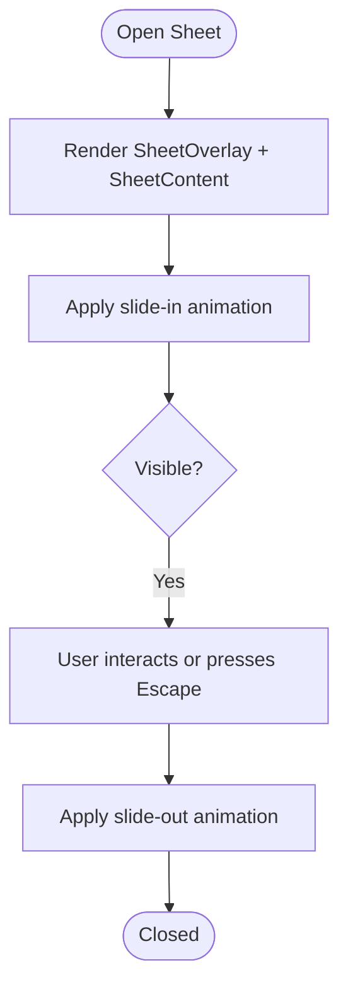
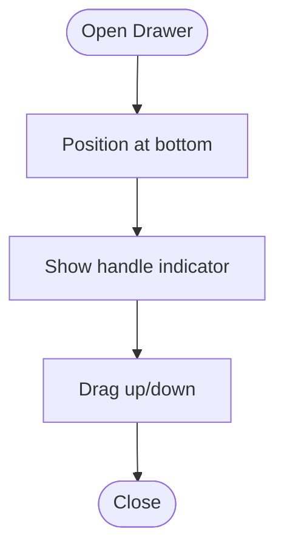
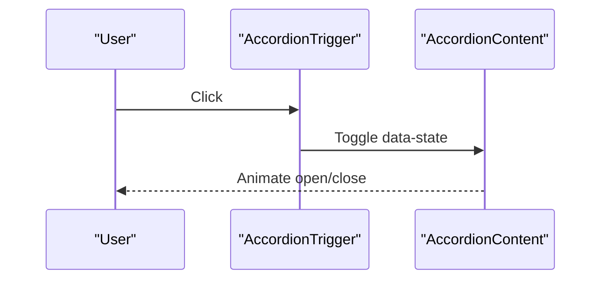
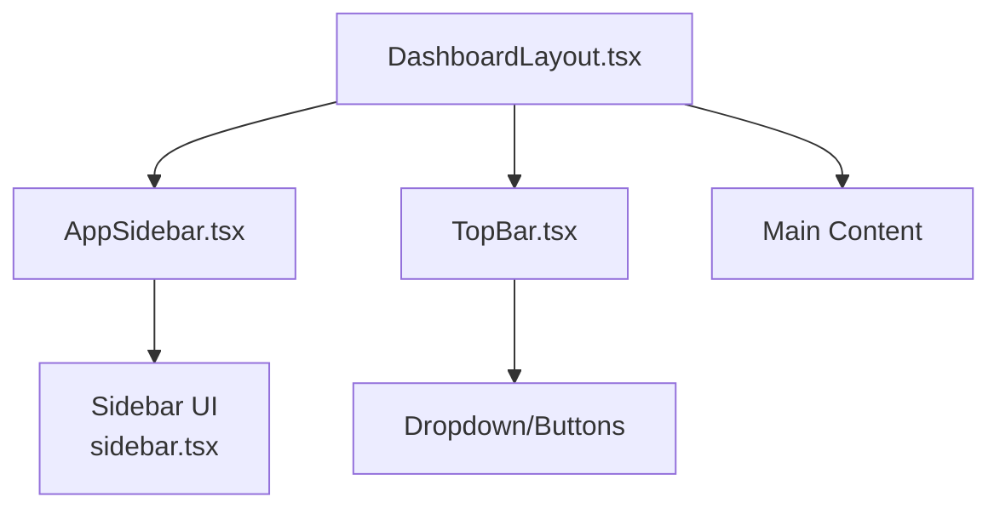
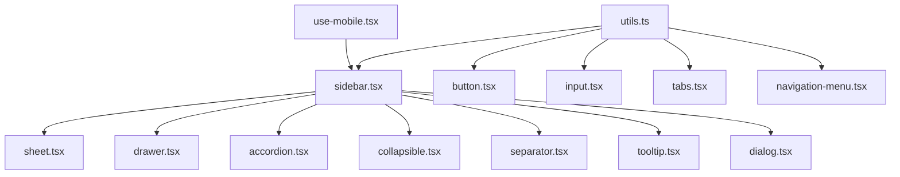

# Layout & Accessibility Components

<cite>
**Referenced Files in This Document**
- [sidebar.tsx](file://src/components/ui/sidebar.tsx)
- [sheet.tsx](file://src/components/ui/sheet.tsx)
- [drawer.tsx](file://src/components/ui/drawer.tsx)
- [separator.tsx](file://src/components/ui/separator.tsx)
- [accordion.tsx](file://src/components/ui/accordion.tsx)
- [collapsible.tsx](file://src/components/ui/collapsible.tsx)
- [DashboardLayout.tsx](file://src/components/DashboardLayout.tsx)
- [AppSidebar.tsx](file://src/components/AppSidebar.tsx)
- [TopBar.tsx](file://src/components/TopBar.tsx)
- [PageHeader.tsx](file://src/components/PageHeader.tsx)
- [use-mobile.tsx](file://src/hooks/use-mobile.tsx)
- [utils.ts](file://src/lib/utils.ts)
- [tooltip.tsx](file://src/components/ui/tooltip.tsx)
- [dialog.tsx](file://src/components/ui/dialog.tsx)
- [button.tsx](file://src/components/ui/button.tsx)
- [input.tsx](file://src/components/ui/input.tsx)
- [tabs.tsx](file://src/components/ui/tabs.tsx)
- [navigation-menu.tsx](file://src/components/ui/navigation-menu.tsx)
</cite>

## Table of Contents
1. [Introduction](#introduction)
2. [Project Structure](#project-structure)
3. [Core Components](#core-components)
4. [Architecture Overview](#architecture-overview)
5. [Detailed Component Analysis](#detailed-component-analysis)
6. [Dependency Analysis](#dependency-analysis)
7. [Performance Considerations](#performance-considerations)
8. [Troubleshooting Guide](#troubleshooting-guide)
9. [Conclusion](#conclusion)
10. [Appendices](#appendices)

## Introduction
This document describes the layout and accessibility components used in the SHG Management System. It focuses on the comprehensive layout system including sidebars, sheets, drawers, separators, accordions, and collapsible panels. For each component, it documents variants, positioning, animation, and responsive behavior. Practical examples illustrate layout configuration, panel management, content organization, and user interaction patterns. Accessibility features, keyboard navigation, screen reader support, and mobile responsiveness are addressed throughout.

## Project Structure
The layout system centers around a dashboard layout composed of a top bar, a sidebar, and a main content area. The sidebar is built with a reusable UI component that supports multiple variants and responsive modes. Additional layout helpers include sheets and drawers for modal and bottom-sheet experiences, separators for visual grouping, and collapsible/accordion components for content expansion.

**Diagram sources**
- [DashboardLayout.tsx](file://src/components/DashboardLayout.tsx#L9-L19)
- [AppSidebar.tsx](file://src/components/AppSidebar.tsx#L35-L155)
- [TopBar.tsx](file://src/components/TopBar.tsx#L15-L79)
- [sidebar.tsx](file://src/components/ui/sidebar.tsx#L131-L216)
- [sheet.tsx](file://src/components/ui/sheet.tsx#L8-L108)
- [drawer.tsx](file://src/components/ui/drawer.tsx#L6-L88)
- [accordion.tsx](file://src/components/ui/accordion.tsx#L7-L53)
- [collapsible.tsx](file://src/components/ui/collapsible.tsx#L3-L9)
- [separator.tsx](file://src/components/ui/separator.tsx#L6-L21)

**Section sources**
- [DashboardLayout.tsx](file://src/components/DashboardLayout.tsx#L1-L20)
- [AppSidebar.tsx](file://src/components/AppSidebar.tsx#L1-L155)
- [TopBar.tsx](file://src/components/TopBar.tsx#L1-L79)

## Core Components
- Sidebar system with provider, trigger, rail, inset, and menu components supporting desktop and mobile modes.
- Sheet and Drawer for overlay and bottom-sheet experiences.
- Accordion and Collapsible primitives for expandable content.
- Separator for visual grouping.
- Utility hooks and helpers for responsive behavior and styling.

**Section sources**
- [sidebar.tsx](file://src/components/ui/sidebar.tsx#L131-L216)
- [sheet.tsx](file://src/components/ui/sheet.tsx#L31-L48)
- [drawer.tsx](file://src/components/ui/drawer.tsx#L17-L44)
- [accordion.tsx](file://src/components/ui/accordion.tsx#L7-L53)
- [collapsible.tsx](file://src/components/ui/collapsible.tsx#L3-L9)
- [separator.tsx](file://src/components/ui/separator.tsx#L6-L21)
- [use-mobile.tsx](file://src/hooks/use-mobile.tsx#L3-L19)
- [utils.ts](file://src/lib/utils.ts#L4-L6)

## Architecture Overview
The layout architecture integrates a responsive sidebar with a top bar and main content area. The sidebar adapts to mobile via a sheet overlay and to desktop via fixed positioning and collapsible modes. Overlay components (sheet, drawer) provide modal and bottom-sheet interactions. Accessibility is ensured through semantic markup, keyboard navigation, and screen reader support.

**Diagram sources**
- [sidebar.tsx](file://src/components/ui/sidebar.tsx#L43-L129)
- [sheet.tsx](file://src/components/ui/sheet.tsx#L8-L108)
- [drawer.tsx](file://src/components/ui/drawer.tsx#L6-L88)
- [accordion.tsx](file://src/components/ui/accordion.tsx#L7-L53)
- [collapsible.tsx](file://src/components/ui/collapsible.tsx#L3-L9)
- [tooltip.tsx](file://src/components/ui/tooltip.tsx#L6-L28)
- [dialog.tsx](file://src/components/ui/dialog.tsx#L7-L96)
- [DashboardLayout.tsx](file://src/components/DashboardLayout.tsx#L9-L19)

## Detailed Component Analysis

### Sidebar System
The sidebar system provides a robust layout foundation with multiple variants and responsive behavior.

- Variants and positioning:
  - side: left or right
  - variant: sidebar, floating, inset
  - collapsible: offcanvas, icon, none
- Desktop vs mobile:
  - Desktop uses fixed positioning with collapsible modes and a rail for resizing.
  - Mobile uses a sheet overlay with side-specific slide-in animations.
- Animation and transitions:
  - CSS custom properties define widths; transitions animate width and position.
  - Slide and fade animations for overlays; smooth transitions for collapsible states.
- Responsive behavior:
  - Uses a hook to detect mobile breakpoints and adjust rendering accordingly.
- Accessibility:
  - Keyboard shortcut toggling (Ctrl/Cmd + B).
  - Screen reader labels for toggle buttons.
  - Focus management and tooltips for interactive elements.

**Diagram sources**
- [sidebar.tsx](file://src/components/ui/sidebar.tsx#L74-L89)
- [sidebar.tsx](file://src/components/ui/sidebar.tsx#L153-L171)
- [sidebar.tsx](file://src/components/ui/sidebar.tsx#L173-L215)
- [sheet.tsx](file://src/components/ui/sheet.tsx#L54-L67)

Practical examples:
- Configure sidebar with variant and collapsible mode for desktop.
- Use offcanvas on mobile with side selection.
- Integrate with page header and main content areas.

**Section sources**
- [sidebar.tsx](file://src/components/ui/sidebar.tsx#L131-L216)
- [sidebar.tsx](file://src/components/ui/sidebar.tsx#L219-L242)
- [sidebar.tsx](file://src/components/ui/sidebar.tsx#L244-L270)
- [sidebar.tsx](file://src/components/ui/sidebar.tsx#L272-L285)
- [sidebar.tsx](file://src/components/ui/sidebar.tsx#L304-L313)
- [sidebar.tsx](file://src/components/ui/sidebar.tsx#L314-L326)
- [sidebar.tsx](file://src/components/ui/sidebar.tsx#L328-L341)
- [sidebar.tsx](file://src/components/ui/sidebar.tsx#L343-L402)
- [sidebar.tsx](file://src/components/ui/sidebar.tsx#L404-L413)
- [sidebar.tsx](file://src/components/ui/sidebar.tsx#L414-L434)
- [sidebar.tsx](file://src/components/ui/sidebar.tsx#L436-L475)
- [sidebar.tsx](file://src/components/ui/sidebar.tsx#L477-L506)
- [sidebar.tsx](file://src/components/ui/sidebar.tsx#L508-L526)
- [sidebar.tsx](file://src/components/ui/sidebar.tsx#L528-L559)
- [sidebar.tsx](file://src/components/ui/sidebar.tsx#L561-L581)
- [sidebar.tsx](file://src/components/ui/sidebar.tsx#L582-L611)
- [sidebar.tsx](file://src/components/ui/sidebar.tsx#L612-L638)
- [use-mobile.tsx](file://src/hooks/use-mobile.tsx#L3-L19)

### Sheets
Sheets provide overlay content with directional slide-in/out animations and optional close controls.

- Variants:
  - side: top, bottom, left, right
- Animation:
  - Slide-in/slide-out per side; fade overlay transitions.
- Accessibility:
  - Close button with screen reader label.
  - Portal rendering ensures proper focus trapping.

**Diagram sources**
- [sheet.tsx](file://src/components/ui/sheet.tsx#L54-L67)

**Section sources**
- [sheet.tsx](file://src/components/ui/sheet.tsx#L31-L48)
- [sheet.tsx](file://src/components/ui/sheet.tsx#L54-L67)
- [sheet.tsx](file://src/components/ui/sheet.tsx#L70-L94)

### Drawers
Drawers offer bottom-sheet behavior suitable for mobile interactions, with a handle indicator and portal rendering.

- Behavior:
  - Fixed bottom position with rounded corners.
  - Handle indicator for drag affordance.
- Accessibility:
  - Portal rendering for overlay stacking.
  - Close controls available.

**Diagram sources**
- [drawer.tsx](file://src/components/ui/drawer.tsx#L25-L44)

**Section sources**
- [drawer.tsx](file://src/components/ui/drawer.tsx#L17-L44)
- [drawer.tsx](file://src/components/ui/drawer.tsx#L46-L74)

### Separators
Separators visually divide content areas with horizontal or vertical orientations.

- Orientation:
  - horizontal or vertical
- Styling:
  - thin borders with appropriate sizing.

**Section sources**
- [separator.tsx](file://src/components/ui/separator.tsx#L6-L21)

### Accordions
Accordions enable expandable content sections with chevron indicators and smooth animations.

- Interaction:
  - Trigger toggles open/close state.
  - Animated content transitions.
- Accessibility:
  - Semantic header/section structure.
  - Icon rotation indicates state.

**Diagram sources**
- [accordion.tsx](file://src/components/ui/accordion.tsx#L17-L35)
- [accordion.tsx](file://src/components/ui/accordion.tsx#L37-L50)

**Section sources**
- [accordion.tsx](file://src/components/ui/accordion.tsx#L7-L53)

### Collapsible Panels
Collapsible panels provide lightweight expandable regions without additional semantics.

- Interaction:
  - Root manages open/close state.
  - Content visibility controlled by primitive.

**Section sources**
- [collapsible.tsx](file://src/components/ui/collapsible.tsx#L3-L9)

### Dashboard Layout Patterns
The dashboard layout composes the sidebar, top bar, and main content area. It demonstrates:
- Fixed sidebar with collapsible behavior.
- Sticky top bar with search and user actions.
- Responsive main content area with overflow handling.

**Diagram sources**
- [DashboardLayout.tsx](file://src/components/DashboardLayout.tsx#L9-L19)
- [AppSidebar.tsx](file://src/components/AppSidebar.tsx#L35-L155)
- [TopBar.tsx](file://src/components/TopBar.tsx#L15-L79)
- [sidebar.tsx](file://src/components/ui/sidebar.tsx#L131-L216)

**Section sources**
- [DashboardLayout.tsx](file://src/components/DashboardLayout.tsx#L1-L20)
- [AppSidebar.tsx](file://src/components/AppSidebar.tsx#L1-L155)
- [TopBar.tsx](file://src/components/TopBar.tsx#L1-L79)

### Accessibility Features and Keyboard Navigation
- Keyboard shortcuts:
  - Sidebar toggle via Ctrl/Cmd + B.
- Screen reader support:
  - Hidden “sr-only” labels for icons and close buttons.
  - Decorative separators marked appropriately.
- Focus management:
  - Dialog and tooltip providers ensure focus trapping and smooth transitions.
- Interactive components:
  - Buttons and inputs follow accessible variants and sizes.

**Section sources**
- [sidebar.tsx](file://src/components/ui/sidebar.tsx#L79-L89)
- [sheet.tsx](file://src/components/ui/sheet.tsx#L60-L63)
- [separator.tsx](file://src/components/ui/separator.tsx#L10-L16)
- [tooltip.tsx](file://src/components/ui/tooltip.tsx#L15-L25)
- [dialog.tsx](file://src/components/ui/dialog.tsx#L36-L50)
- [button.tsx](file://src/components/ui/button.tsx#L47-L52)
- [input.tsx](file://src/components/ui/input.tsx#L5-L18)

### Mobile Responsiveness
- Breakpoint detection:
  - Hook checks viewport width against a mobile breakpoint.
- Rendering differences:
  - Sidebar becomes a sheet on mobile.
  - Overlay components adapt to bottom or side placement.
- Touch-friendly interactions:
  - Larger hit targets for actionable elements.
  - Drawer handle for bottom sheets.

**Section sources**
- [use-mobile.tsx](file://src/hooks/use-mobile.tsx#L3-L19)
- [sidebar.tsx](file://src/components/ui/sidebar.tsx#L153-L171)
- [drawer.tsx](file://src/components/ui/drawer.tsx#L25-L44)

### Practical Examples and Usage Patterns
- Layout configuration:
  - Wrap the app with the sidebar provider and compose the sidebar, top bar, and main content.
- Panel management:
  - Use collapsible and accordion components to organize dense content.
- Content organization:
  - Group related actions with separators and menus.
- User interaction:
  - Provide keyboard shortcuts and tooltips for discoverability.
- Page headers:
  - Use page header components to present titles and contextual actions.

**Section sources**
- [DashboardLayout.tsx](file://src/components/DashboardLayout.tsx#L9-L19)
- [PageHeader.tsx](file://src/components/PageHeader.tsx#L11-L23)
- [separator.tsx](file://src/components/ui/separator.tsx#L6-L21)
- [accordion.tsx](file://src/components/ui/accordion.tsx#L7-L53)
- [collapsible.tsx](file://src/components/ui/collapsible.tsx#L3-L9)

## Dependency Analysis
The layout system relies on shared utilities and UI primitives. The sidebar depends on the responsive hook and styling utilities. Overlay components depend on Radix UI primitives and portal rendering. Accessibility is supported through dedicated providers and semantic components.

**Diagram sources**
- [use-mobile.tsx](file://src/hooks/use-mobile.tsx#L3-L19)
- [utils.ts](file://src/lib/utils.ts#L4-L6)
- [sidebar.tsx](file://src/components/ui/sidebar.tsx#L1-L14)
- [button.tsx](file://src/components/ui/button.tsx#L47-L52)
- [input.tsx](file://src/components/ui/input.tsx#L5-L18)
- [tabs.tsx](file://src/components/ui/tabs.tsx#L23-L35)
- [navigation-menu.tsx](file://src/components/ui/navigation-menu.tsx#L41-L56)
- [sheet.tsx](file://src/components/ui/sheet.tsx#L1-L10)
- [drawer.tsx](file://src/components/ui/drawer.tsx#L1-L8)
- [accordion.tsx](file://src/components/ui/accordion.tsx#L1-L7)
- [collapsible.tsx](file://src/components/ui/collapsible.tsx#L1-L3)
- [separator.tsx](file://src/components/ui/separator.tsx#L1-L5)
- [tooltip.tsx](file://src/components/ui/tooltip.tsx#L1-L6)
- [dialog.tsx](file://src/components/ui/dialog.tsx#L1-L7)

**Section sources**
- [sidebar.tsx](file://src/components/ui/sidebar.tsx#L1-L14)
- [use-mobile.tsx](file://src/hooks/use-mobile.tsx#L3-L19)
- [utils.ts](file://src/lib/utils.ts#L4-L6)

## Performance Considerations
- Minimize re-renders by isolating state in the sidebar provider and using memoization where appropriate.
- Prefer CSS transitions for layout animations to leverage GPU acceleration.
- Use overlay components judiciously to avoid excessive DOM depth.
- Keep mobile overlays lightweight and avoid heavy computations during slide animations.

## Troubleshooting Guide
- Sidebar does not toggle:
  - Verify the keyboard shortcut is not intercepted by the browser or OS.
  - Ensure the sidebar provider is rendered above the trigger.
- Sheet or drawer not closing:
  - Confirm the close button is present and accessible.
  - Check portal rendering and z-index stacking.
- Collapsible content not animating:
  - Ensure the collapsible primitives are used correctly and styles apply.
- Accessibility issues:
  - Add missing sr-only labels for icons.
  - Verify focus order and trap focus within overlays.

**Section sources**
- [sidebar.tsx](file://src/components/ui/sidebar.tsx#L79-L89)
- [sheet.tsx](file://src/components/ui/sheet.tsx#L60-L63)
- [collapsible.tsx](file://src/components/ui/collapsible.tsx#L3-L9)
- [tooltip.tsx](file://src/components/ui/tooltip.tsx#L15-L25)

## Conclusion
The SHG Management System’s layout and accessibility components provide a flexible, responsive, and inclusive foundation for dashboard applications. The sidebar system, combined with sheets, drawers, and collapsible/accordion components, enables efficient content organization across devices. Accessibility is integrated through keyboard shortcuts, screen reader labels, and focus management, ensuring a high-quality user experience on all screen sizes.

## Appendices
- Additional UI patterns:
  - Tabs and navigation menus for secondary navigation.
  - Input and button variants for consistent interaction design.

**Section sources**
- [tabs.tsx](file://src/components/ui/tabs.tsx#L23-L35)
- [navigation-menu.tsx](file://src/components/ui/navigation-menu.tsx#L41-L56)
- [button.tsx](file://src/components/ui/button.tsx#L47-L52)
- [input.tsx](file://src/components/ui/input.tsx#L5-L18)