# UI Component Library

<cite>
**Referenced Files in This Document**
- [button.tsx](file://src/components/ui/button.tsx)
- [input.tsx](file://src/components/ui/input.tsx)
- [form.tsx](file://src/components/ui/form.tsx)
- [table.tsx](file://src/components/ui/table.tsx)
- [dialog.tsx](file://src/components/ui/dialog.tsx)
- [select.tsx](file://src/components/ui/select.tsx)
- [tooltip.tsx](file://src/components/ui/tooltip.tsx)
- [card.tsx](file://src/components/ui/card.tsx)
- [checkbox.tsx](file://src/components/ui/checkbox.tsx)
- [radio-group.tsx](file://src/components/ui/radio-group.tsx)
- [switch.tsx](file://src/components/ui/switch.tsx)
- [badge.tsx](file://src/components/ui/badge.tsx)
- [avatar.tsx](file://src/components/ui/avatar.tsx)
- [skeleton.tsx](file://src/components/ui/skeleton.tsx)
- [toggle.tsx](file://src/components/ui/toggle.tsx)
- [slider.tsx](file://src/components/ui/slider.tsx)
- [utils.ts](file://src/lib/utils.ts)
- [tailwind.config.ts](file://tailwind.config.ts)
- [components.json](file://components.json)
</cite>

## Table of Contents
1. [Introduction](#introduction)
2. [Project Structure](#project-structure)
3. [Core Components](#core-components)
4. [Architecture Overview](#architecture-overview)
5. [Detailed Component Analysis](#detailed-component-analysis)
6. [Dependency Analysis](#dependency-analysis)
7. [Performance Considerations](#performance-considerations)
8. [Troubleshooting Guide](#troubleshooting-guide)
9. [Conclusion](#conclusion)
10. [Appendices](#appendices)

## Introduction
This document describes the SHG Management System’s UI component library built on shadcn/ui principles. It covers the design system, component APIs, styling variants, accessibility, responsiveness, and extension guidelines. The library emphasizes consistent spacing, color tokens, typography scales, and composability via Radix UI primitives and Tailwind CSS utilities.

## Project Structure
The UI components live under src/components/ui and are composed with shared utilities and design tokens:
- Shared utilities: src/lib/utils.ts
- Design system configuration: tailwind.config.ts, components.json
- Individual components: src/components/ui/*.tsx

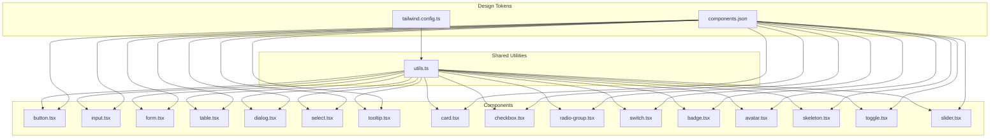

**Diagram sources**
- [utils.ts](file://src/lib/utils.ts#L1-L200)
- [tailwind.config.ts](file://tailwind.config.ts#L1-L200)
- [components.json](file://components.json#L1-L200)
- [button.tsx](file://src/components/ui/button.tsx#L1-L56)
- [input.tsx](file://src/components/ui/input.tsx#L1-L23)
- [form.tsx](file://src/components/ui/form.tsx#L1-L130)
- [table.tsx](file://src/components/ui/table.tsx#L1-L73)
- [dialog.tsx](file://src/components/ui/dialog.tsx#L1-L96)
- [select.tsx](file://src/components/ui/select.tsx#L1-L144)
- [tooltip.tsx](file://src/components/ui/tooltip.tsx#L1-L29)
- [card.tsx](file://src/components/ui/card.tsx#L1-L44)
- [checkbox.tsx](file://src/components/ui/checkbox.tsx#L1-L27)
- [radio-group.tsx](file://src/components/ui/radio-group.tsx#L1-L37)
- [switch.tsx](file://src/components/ui/switch.tsx#L1-L28)
- [badge.tsx](file://src/components/ui/badge.tsx#L1-L30)
- [avatar.tsx](file://src/components/ui/avatar.tsx#L1-L39)
- [skeleton.tsx](file://src/components/ui/skeleton.tsx#L1-L8)
- [toggle.tsx](file://src/components/ui/toggle.tsx#L1-L38)
- [slider.tsx](file://src/components/ui/slider.tsx#L1-L24)

**Section sources**
- [utils.ts](file://src/lib/utils.ts#L1-L200)
- [tailwind.config.ts](file://tailwind.config.ts#L1-L200)
- [components.json](file://components.json#L1-L200)

## Core Components
This section documents the primary UI components and their capabilities.

- Button
  - Variants: default, destructive, outline, secondary, ghost, link, hero, hero-outline, success, accent
  - Sizes: default, sm, lg, xl, icon
  - Props: inherits button attributes; supports asChild for composition; variant and size from variants
  - Accessibility: focus-visible ring, disabled state, pointer-events disabled
  - Composition: integrates with icons via SVG children; supports Slot for nesting
  - Example usage patterns: primary actions, destructive confirmations, icon-only toggles, hero CTA

- Input
  - Props: inherits input attributes; accepts type
  - Styling: consistent padding, border, focus ring, placeholder color, disabled state
  - Responsive: base text size with medium size override at larger breakpoints
  - Example usage patterns: text fields, file inputs, number inputs

- Form (Form Provider, Field, Label, Control, Description, Message)
  - Integrates with react-hook-form via FormProvider and Controller
  - useFormField provides ids and error state for accessibility
  - Accessibility: aria-describedby, aria-invalid, labeled-by ids
  - Example usage patterns: controlled form fields, validation messaging, grouped controls

- Table
  - Elements: Table, TableHeader, TableBody, TableFooter, TableRow, TableHead, TableCell, TableCaption
  - Responsiveness: wraps in overflow container; hover and selection states
  - Accessibility: semantic markup, selected state data attribute
  - Example usage patterns: paginated lists, sortable columns, selection rows

- Dialog
  - Elements: Root, Portal, Overlay, Content, Header, Footer, Title, Description, Trigger, Close
  - Animations: fade and slide transitions; portal rendering
  - Accessibility: focus trapping, close button with screen reader label
  - Example usage patterns: modals, confirmations, side panels

- Select
  - Elements: Root, Group, Value, Trigger, Content, Label, Item, Separator, ScrollUp/DownButton
  - Behavior: portal rendering, viewport sizing, scroll buttons, item indicators
  - Accessibility: keyboard navigation, focus management, disabled states
  - Example usage patterns: dropdown menus, filters, multi-segment choices

- Tooltip
  - Elements: Provider, Root, Trigger, Content
  - Behavior: delay, side offset, animations
  - Accessibility: accessible triggers, proper labeling
  - Example usage patterns: contextual help, icon labels

- Card
  - Elements: Card, CardHeader, CardTitle, CardDescription, CardContent, CardFooter
  - Styling: border, background, shadows
  - Example usage patterns: summary boxes, stats, user info

- Checkbox
  - Props: inherits checkbox attributes; indicator renders checkmark
  - Accessibility: focus-visible ring, disabled state
  - Example usage patterns: agreements, multi-select

- RadioGroup
  - Elements: RadioGroup, RadioGroupItem
  - Behavior: mutually exclusive selection
  - Accessibility: focus-visible ring, indicator dot
  - Example usage patterns: preferences, options

- Switch
  - Props: inherits switch attributes; thumb translates on state change
  - Accessibility: focus-visible ring, disabled state
  - Example usage patterns: on/off toggles

- Badge
  - Variants: default, secondary, destructive, outline
  - Example usage patterns: status labels, counts

- Avatar
  - Elements: Avatar, AvatarImage, AvatarFallback
  - Example usage patterns: profile images, initials fallback

- Skeleton
  - Props: HTML div attributes
  - Example usage patterns: loading placeholders

- Toggle
  - Variants: default, outline
  - Sizes: default, sm, lg
  - Example usage patterns: toolbar buttons, formatting toggles

- Slider
  - Props: inherits slider attributes; track and range visuals
  - Accessibility: focus-visible ring, disabled state
  - Example usage patterns: volume, ratings

**Section sources**
- [button.tsx](file://src/components/ui/button.tsx#L1-L56)
- [input.tsx](file://src/components/ui/input.tsx#L1-L23)
- [form.tsx](file://src/components/ui/form.tsx#L1-L130)
- [table.tsx](file://src/components/ui/table.tsx#L1-L73)
- [dialog.tsx](file://src/components/ui/dialog.tsx#L1-L96)
- [select.tsx](file://src/components/ui/select.tsx#L1-L144)
- [tooltip.tsx](file://src/components/ui/tooltip.tsx#L1-L29)
- [card.tsx](file://src/components/ui/card.tsx#L1-L44)
- [checkbox.tsx](file://src/components/ui/checkbox.tsx#L1-L27)
- [radio-group.tsx](file://src/components/ui/radio-group.tsx#L1-L37)
- [switch.tsx](file://src/components/ui/switch.tsx#L1-L28)
- [badge.tsx](file://src/components/ui/badge.tsx#L1-L30)
- [avatar.tsx](file://src/components/ui/avatar.tsx#L1-L39)
- [skeleton.tsx](file://src/components/ui/skeleton.tsx#L1-L8)
- [toggle.tsx](file://src/components/ui/toggle.tsx#L1-L38)
- [slider.tsx](file://src/components/ui/slider.tsx#L1-L24)

## Architecture Overview
The component library follows a consistent pattern:
- Each component composes Radix UI primitives for behavior and accessibility
- Uses class-variance-authority (CVA) for variant-driven styling
- Applies shared utility functions for merging classNames and composing styles
- Leverages Tailwind tokens for spacing, colors, typography, and shadows

```mermaid
graph TB
PRIM["Radix UI Primitives"]
CVA["class-variance-authority"]
UTIL["utils.ts"]
TW["Tailwind Tokens"]
BTN["Button"] --> PRIM
BTN --> CVA
BTN --> UTIL
BTN --> TW
INP["Input"] --> PRIM
INP --> UTIL
INP --> TW
FRM["Form*"] --> PRIM
FRM --> UTIL
FRM --> TW
TBL["Table*"] --> PRIM
TBL --> UTIL
TBL --> TW
DLG["Dialog*"] --> PRIM
DLG --> UTIL
DLG --> TW
SEL["Select*"] --> PRIM
SEL --> UTIL
SEL --> TW
TIP["Tooltip*"] --> PRIM
TIP --> UTIL
TIP --> TW
CARD["Card*"] --> PRIM
CARD --> UTIL
CARD --> TW
CHK["Checkbox"] --> PRIM
CHK --> UTIL
CHK --> TW
RG["RadioGroup*"] --> PRIM
RG --> UTIL
RG --> TW
SW["Switch"] --> PRIM
SW --> UTIL
SW --> TW
BADGE["Badge"] --> CVA
BADGE --> UTIL
BADGE --> TW
AV["Avatar*"] --> PRIM
AV --> UTIL
AV --> TW
SKEL["Skeleton"] --> UTIL
SKEL --> TW
TG["Toggle"] --> CVA
TG --> PRIM
TG --> UTIL
TG --> TW
SL["Slider"] --> PRIM
SL --> UTIL
SL --> TW
```

**Diagram sources**
- [button.tsx](file://src/components/ui/button.tsx#L1-L56)
- [input.tsx](file://src/components/ui/input.tsx#L1-L23)
- [form.tsx](file://src/components/ui/form.tsx#L1-L130)
- [table.tsx](file://src/components/ui/table.tsx#L1-L73)
- [dialog.tsx](file://src/components/ui/dialog.tsx#L1-L96)
- [select.tsx](file://src/components/ui/select.tsx#L1-L144)
- [tooltip.tsx](file://src/components/ui/tooltip.tsx#L1-L29)
- [card.tsx](file://src/components/ui/card.tsx#L1-L44)
- [checkbox.tsx](file://src/components/ui/checkbox.tsx#L1-L27)
- [radio-group.tsx](file://src/components/ui/radio-group.tsx#L1-L37)
- [switch.tsx](file://src/components/ui/switch.tsx#L1-L28)
- [badge.tsx](file://src/components/ui/badge.tsx#L1-L30)
- [avatar.tsx](file://src/components/ui/avatar.tsx#L1-L39)
- [skeleton.tsx](file://src/components/ui/skeleton.tsx#L1-L8)
- [toggle.tsx](file://src/components/ui/toggle.tsx#L1-L38)
- [slider.tsx](file://src/components/ui/slider.tsx#L1-L24)
- [utils.ts](file://src/lib/utils.ts#L1-L200)

## Detailed Component Analysis

### Button
- Purpose: Action surfaces with variant and size variants
- Props:
  - Inherits button HTML attributes
  - variant: default | destructive | outline | secondary | ghost | link | hero | hero-outline | success | accent
  - size: default | sm | lg | xl | icon
  - asChild: wrap children in a Slot
- Accessibility: focus-visible ring, disabled state, pointer-events disabled on disabled
- Composition: supports nested icons; renders a Slot when asChild is true
- Usage patterns:
  - Primary action: variant=default, size=default
  - Destructive action: variant=destructive, e.g., delete
  - Icon-only: variant=ghost, size=icon
  - Hero CTA: variant=hero, size=xl

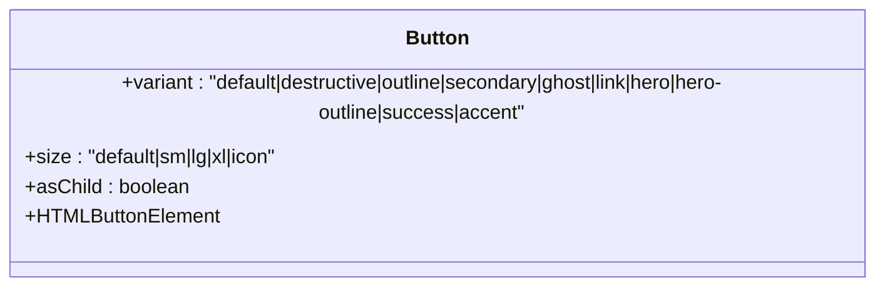

**Diagram sources**
- [button.tsx](file://src/components/ui/button.tsx#L41-L55)

**Section sources**
- [button.tsx](file://src/components/ui/button.tsx#L1-L56)

### Input
- Purpose: Text input with consistent styling and focus behavior
- Props:
  - Inherits input HTML attributes
  - type: input type
- Accessibility: focus-visible ring, disabled state
- Usage patterns:
  - Text fields: type=text
  - Password: type=password
  - Number: type=number

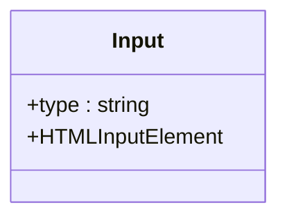

**Diagram sources**
- [input.tsx](file://src/components/ui/input.tsx#L5-L19)

**Section sources**
- [input.tsx](file://src/components/ui/input.tsx#L1-L23)

### Form
- Purpose: Form provider and field composition with react-hook-form
- Elements:
  - Form: FormProvider
  - FormField: wraps Controller with context
  - FormItem: manages ids
  - FormLabel: label bound to field
  - FormControl: passes aria attributes to child
  - FormDescription: neutral helper text
  - FormMessage: validation message with error state
  - useFormField: returns ids and field state
- Accessibility:
  - aria-describedby includes description and message ids
  - aria-invalid reflects error presence
  - Ids generated per-field for labeling
- Usage patterns:
  - Wrap form with Form
  - Use FormField for each field
  - Render input inside FormControl
  - Display FormMessage conditionally

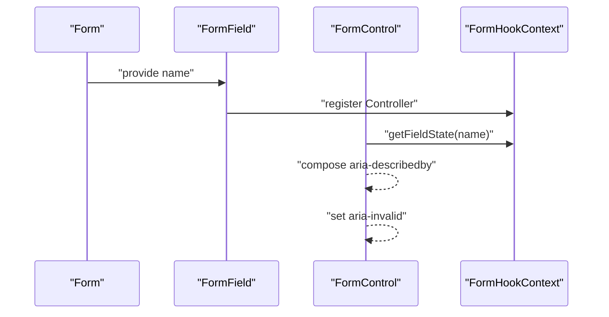

**Diagram sources**
- [form.tsx](file://src/components/ui/form.tsx#L1-L130)

**Section sources**
- [form.tsx](file://src/components/ui/form.tsx#L1-L130)

### Table
- Purpose: Semantic, responsive tabular data display
- Elements:
  - Table, TableHeader, TableBody, TableFooter
  - TableRow, TableHead, TableCell, TableCaption
- Accessibility:
  - Selected state via data attribute
  - Hover effects for interactivity
- Usage patterns:
  - Paginated lists with selection
  - Sortable headers with click handlers

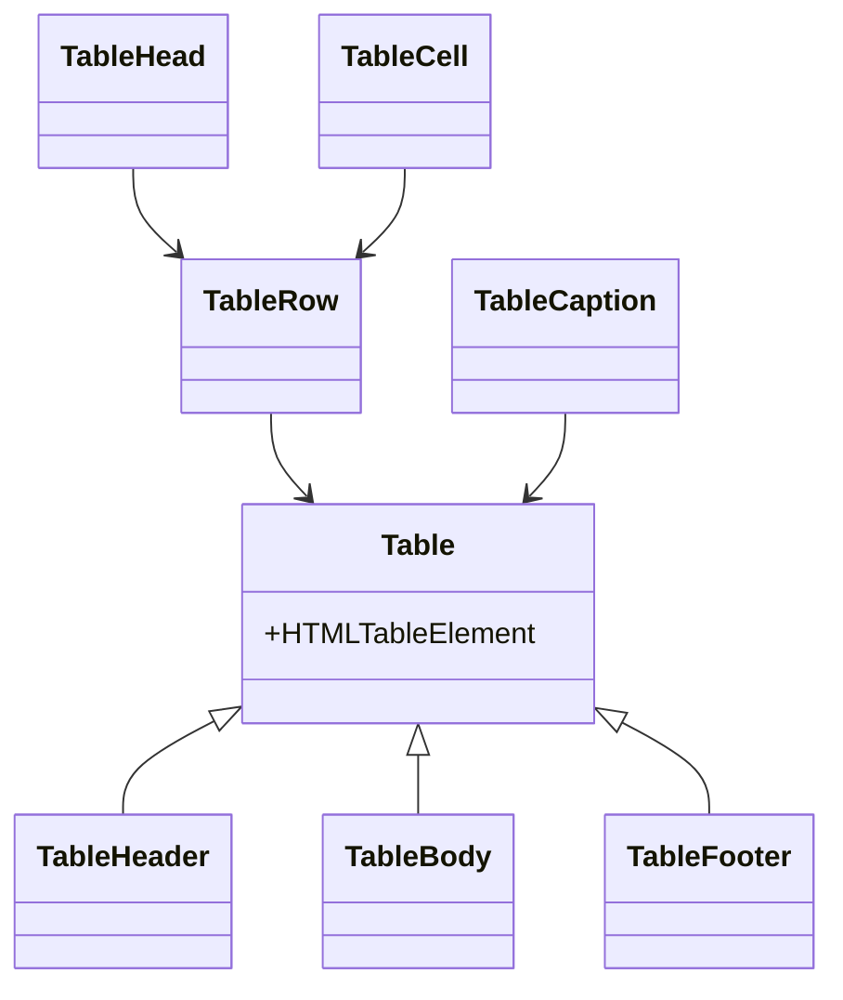

**Diagram sources**
- [table.tsx](file://src/components/ui/table.tsx#L1-L73)

**Section sources**
- [table.tsx](file://src/components/ui/table.tsx#L1-L73)

### Dialog
- Purpose: Modal overlay with content area and optional footer/header
- Elements:
  - Root, Portal, Overlay, Content, Header, Footer, Title, Description, Trigger, Close
- Accessibility:
  - Focus trap via portal
  - Close button with screen reader label
- Usage patterns:
  - Confirmations
  - Forms in overlays
  - Side panels

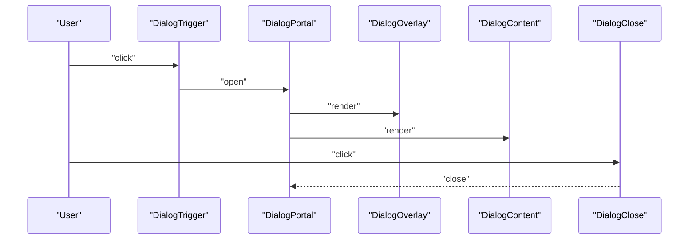

**Diagram sources**
- [dialog.tsx](file://src/components/ui/dialog.tsx#L1-L96)

**Section sources**
- [dialog.tsx](file://src/components/ui/dialog.tsx#L1-L96)

### Select
- Purpose: Accessible dropdown with groups, items, and scrolling
- Elements:
  - Root, Group, Value, Trigger, Content, Label, Item, Separator, ScrollUp/DownButton
- Accessibility:
  - Keyboard navigation, focus management, disabled states
- Usage patterns:
  - Filters
  - Multi-segment choices

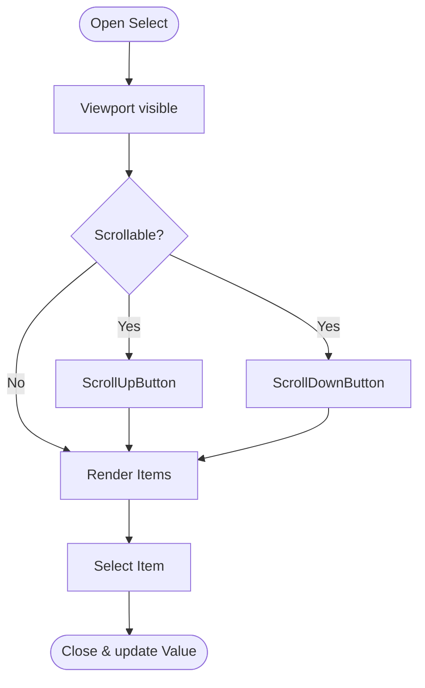

**Diagram sources**
- [select.tsx](file://src/components/ui/select.tsx#L1-L144)

**Section sources**
- [select.tsx](file://src/components/ui/select.tsx#L1-L144)

### Tooltip
- Purpose: Lightweight contextual help
- Elements:
  - Provider, Root, Trigger, Content
- Behavior:
  - Animations and side offset
- Usage patterns:
  - Help icons
  - Short labels

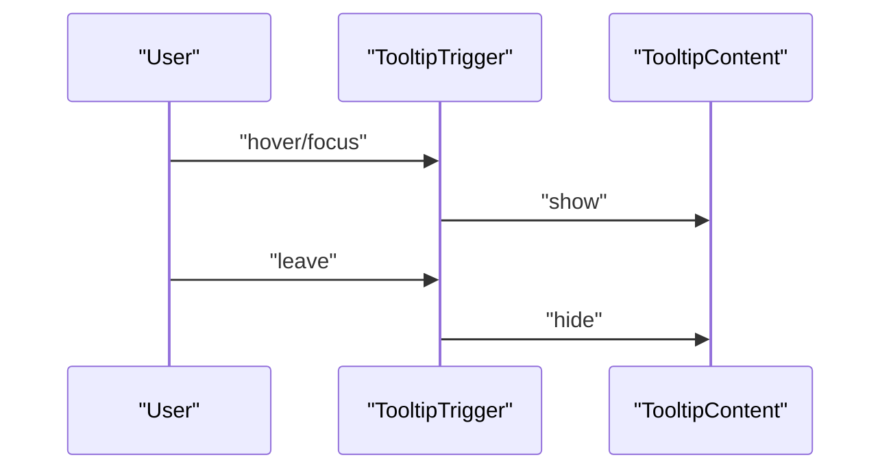

**Diagram sources**
- [tooltip.tsx](file://src/components/ui/tooltip.tsx#L1-L29)

**Section sources**
- [tooltip.tsx](file://src/components/ui/tooltip.tsx#L1-L29)

### Card
- Purpose: Container for grouped content
- Elements:
  - Card, CardHeader, CardTitle, CardDescription, CardContent, CardFooter
- Usage patterns:
  - Stats summaries
  - User profiles
  - Feature highlights

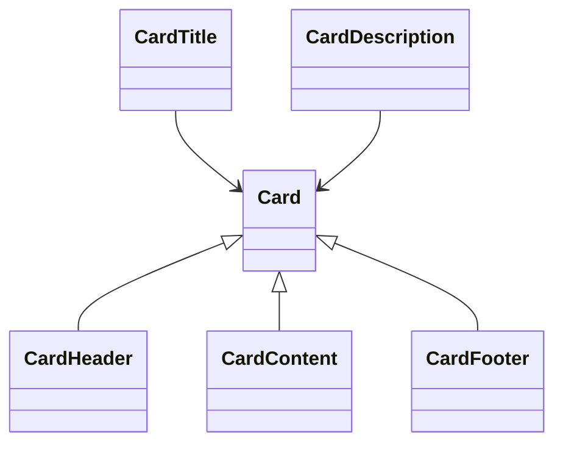

**Diagram sources**
- [card.tsx](file://src/components/ui/card.tsx#L1-L44)

**Section sources**
- [card.tsx](file://src/components/ui/card.tsx#L1-L44)

### Checkbox, RadioGroup, Switch
- Purpose: Selection and toggling controls
- Props:
  - Inherits respective primitive attributes
  - Focus-visible ring, disabled state
- Usage patterns:
  - Terms acceptance
  - Preferences
  - On/off toggles

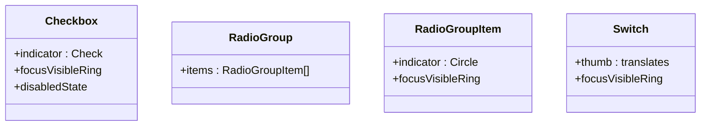

**Diagram sources**
- [checkbox.tsx](file://src/components/ui/checkbox.tsx#L1-L27)
- [radio-group.tsx](file://src/components/ui/radio-group.tsx#L1-L37)
- [switch.tsx](file://src/components/ui/switch.tsx#L1-L28)

**Section sources**
- [checkbox.tsx](file://src/components/ui/checkbox.tsx#L1-L27)
- [radio-group.tsx](file://src/components/ui/radio-group.tsx#L1-L37)
- [switch.tsx](file://src/components/ui/switch.tsx#L1-L28)

### Badge, Avatar, Skeleton, Toggle, Slider
- Badge: variant-driven labels
- Avatar: image with fallback
- Skeleton: pulse animation
- Toggle: pressed-state styling
- Slider: track and range visuals

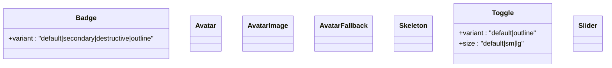

**Diagram sources**
- [badge.tsx](file://src/components/ui/badge.tsx#L1-L30)
- [avatar.tsx](file://src/components/ui/avatar.tsx#L1-L39)
- [skeleton.tsx](file://src/components/ui/skeleton.tsx#L1-L8)
- [toggle.tsx](file://src/components/ui/toggle.tsx#L1-L38)
- [slider.tsx](file://src/components/ui/slider.tsx#L1-L24)

**Section sources**
- [badge.tsx](file://src/components/ui/badge.tsx#L1-L30)
- [avatar.tsx](file://src/components/ui/avatar.tsx#L1-L39)
- [skeleton.tsx](file://src/components/ui/skeleton.tsx#L1-L8)
- [toggle.tsx](file://src/components/ui/toggle.tsx#L1-L38)
- [slider.tsx](file://src/components/ui/slider.tsx#L1-L24)

## Dependency Analysis
- Internal dependencies:
  - All components depend on utils.ts for className composition
  - Buttons, Badges, and Toggles use CVA for variants
  - Dialog, Select, Tooltip, Checkbox, RadioGroup, Switch rely on Radix UI primitives
- External dependencies:
  - class-variance-authority for variants
  - @radix-ui/react-* for primitives
  - lucide-react for icons
  - react-hook-form for forms
- Design system:
  - Tailwind tokens define spacing, colors, typography, and shadows
  - components.json configures shadcn/ui component registry

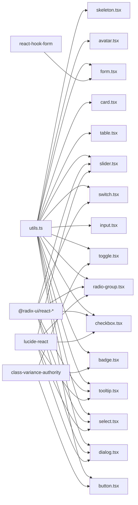

**Diagram sources**
- [utils.ts](file://src/lib/utils.ts#L1-L200)
- [button.tsx](file://src/components/ui/button.tsx#L1-L56)
- [input.tsx](file://src/components/ui/input.tsx#L1-L23)
- [form.tsx](file://src/components/ui/form.tsx#L1-L130)
- [table.tsx](file://src/components/ui/table.tsx#L1-L73)
- [dialog.tsx](file://src/components/ui/dialog.tsx#L1-L96)
- [select.tsx](file://src/components/ui/select.tsx#L1-L144)
- [tooltip.tsx](file://src/components/ui/tooltip.tsx#L1-L29)
- [card.tsx](file://src/components/ui/card.tsx#L1-L44)
- [checkbox.tsx](file://src/components/ui/checkbox.tsx#L1-L27)
- [radio-group.tsx](file://src/components/ui/radio-group.tsx#L1-L37)
- [switch.tsx](file://src/components/ui/switch.tsx#L1-L28)
- [badge.tsx](file://src/components/ui/badge.tsx#L1-L30)
- [avatar.tsx](file://src/components/ui/avatar.tsx#L1-L39)
- [skeleton.tsx](file://src/components/ui/skeleton.tsx#L1-L8)
- [toggle.tsx](file://src/components/ui/toggle.tsx#L1-L38)
- [slider.tsx](file://src/components/ui/slider.tsx#L1-L24)

**Section sources**
- [utils.ts](file://src/lib/utils.ts#L1-L200)
- [button.tsx](file://src/components/ui/button.tsx#L1-L56)
- [input.tsx](file://src/components/ui/input.tsx#L1-L23)
- [form.tsx](file://src/components/ui/form.tsx#L1-L130)
- [table.tsx](file://src/components/ui/table.tsx#L1-L73)
- [dialog.tsx](file://src/components/ui/dialog.tsx#L1-L96)
- [select.tsx](file://src/components/ui/select.tsx#L1-L144)
- [tooltip.tsx](file://src/components/ui/tooltip.tsx#L1-L29)
- [card.tsx](file://src/components/ui/card.tsx#L1-L44)
- [checkbox.tsx](file://src/components/ui/checkbox.tsx#L1-L27)
- [radio-group.tsx](file://src/components/ui/radio-group.tsx#L1-L37)
- [switch.tsx](file://src/components/ui/switch.tsx#L1-L28)
- [badge.tsx](file://src/components/ui/badge.tsx#L1-L30)
- [avatar.tsx](file://src/components/ui/avatar.tsx#L1-L39)
- [skeleton.tsx](file://src/components/ui/skeleton.tsx#L1-L8)
- [toggle.tsx](file://src/components/ui/toggle.tsx#L1-L38)
- [slider.tsx](file://src/components/ui/slider.tsx#L1-L24)

## Performance Considerations
- Prefer composition with asChild and Slot to avoid unnecessary DOM nodes
- Use variants judiciously; keep variant sets minimal to reduce CSS bloat
- Defer heavy computations in render-heavy components (tables, selects)
- Use Skeleton for perceived performance during async loads
- Keep icons small and lazy-load non-critical assets

## Troubleshooting Guide
- Button disabled state not working:
  - Ensure disabled prop is passed; verify pointer-events disabled and opacity reduced
- Form validation not reflected:
  - Confirm useFormField is used within FormItem/Form
  - Verify aria-describedby and aria-invalid are set on the control
- Dialog not closing:
  - Ensure DialogClose is rendered and accessible; check portal rendering
- Select not scrolling:
  - Confirm viewport sizing and scroll buttons present
- Tooltip not appearing:
  - Wrap trigger with TooltipTrigger and ensure TooltipContent is rendered
- Table overflow:
  - Ensure parent container applies overflow auto

**Section sources**
- [button.tsx](file://src/components/ui/button.tsx#L1-L56)
- [form.tsx](file://src/components/ui/form.tsx#L1-L130)
- [dialog.tsx](file://src/components/ui/dialog.tsx#L1-L96)
- [select.tsx](file://src/components/ui/select.tsx#L1-L144)
- [tooltip.tsx](file://src/components/ui/tooltip.tsx#L1-L29)
- [table.tsx](file://src/components/ui/table.tsx#L1-L73)

## Conclusion
The UI component library provides a cohesive, accessible, and extensible foundation for the SHG Management System. By leveraging Radix UI primitives, CVA variants, and Tailwind tokens, components remain consistent, customizable, and maintainable. Following the guidelines below ensures uniform behavior and appearance across the application.

## Appendices

### Design System Principles
- Spacing: Use Tailwind spacing scale consistently (e.g., 2–14 units)
- Color scheme: Primary, secondary, destructive, muted, accents; respect semantic roles
- Typography: Headings, body, captions; ensure contrast ratios meet accessibility guidelines
- Shadows: Subtle elevation for cards and overlays
- Motion: Smooth transitions and subtle animations for state changes

**Section sources**
- [tailwind.config.ts](file://tailwind.config.ts#L1-L200)
- [components.json](file://components.json#L1-L200)

### Extending Components
- Add variants via CVA in component files that support variants
- Compose with Slot for asChild patterns
- Integrate with Radix UI for behavior and accessibility
- Keep className composition centralized in utils.ts
- Document new variants and usage in component READMEs

**Section sources**
- [button.tsx](file://src/components/ui/button.tsx#L1-L56)
- [badge.tsx](file://src/components/ui/badge.tsx#L1-L30)
- [toggle.tsx](file://src/components/ui/toggle.tsx#L1-L38)
- [utils.ts](file://src/lib/utils.ts#L1-L200)

### Accessibility Checklist
- All interactive elements: focus-visible rings, keyboard operability
- Forms: labels, descriptions, messages, aria-invalid
- Dialogs: focus traps, close affordances, screen reader labels
- Selects: keyboard navigation, disabled states
- Tooltips: accessible triggers, concise content

**Section sources**
- [form.tsx](file://src/components/ui/form.tsx#L1-L130)
- [dialog.tsx](file://src/components/ui/dialog.tsx#L1-L96)
- [select.tsx](file://src/components/ui/select.tsx#L1-L144)
- [tooltip.tsx](file://src/components/ui/tooltip.tsx#L1-L29)